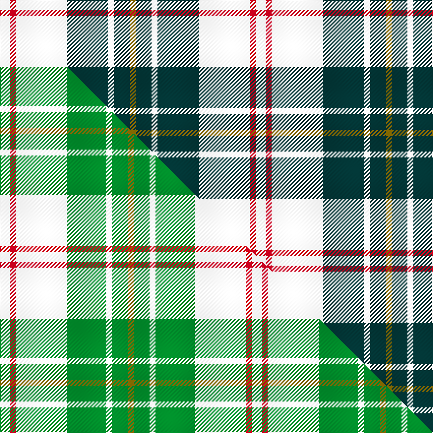

This is one **variant** — a specific cloth: this exact thread count and colourway, with its own
provenance below. It is one weaving of the [sett](/tartans/m/ma/macpherson-dress-4/) (the scale-free proportion — the
same cloth at any scale or shade), whose colour order is pattern [GBWBWRW](/stripes/gbwbwrw/).

Part of the [MacPherson Dress](/tartans/m/ma/macpherson-dress-4/) tartan — the named design grouping this sett with its other cloths.

Sourced from tartans-authority.  It is a [7 stripe tartan](/stripes/stripes7/).

Original link <code>http://www.tartansauthority.com/tartan-ferret/display/6539/</code> — retired · [Internet Archive copy](https://web.archive.org/web/*/http://www.tartansauthority.com/tartan-ferret/display/6539/*)

Dataset <small>— provenance for this record, inherited from the source manifest</small>

<dl class="dataset-prov">
<dt>source</dt><dd><a href="/sources/tartans-authority/">Scottish Tartans Authority</a></dd>
<dt>data captured from</dt><dd><a href="https://github.com/thetartan/tartan-database/blob/master/data/tartans-authority/data.csv">https://github.com/thetartan/tartan-database/blob/master/data/tartans-authority/data.csv</a></dd>
<dt>data date</dt><dd>1980 <small>(this record)</small></dd>
<dt>licence</dt><dd><a href="https://creativecommons.org/licenses/by-nc-nd/4.0/">CC BY-NC-ND 4.0</a></dd>
</dl>

Capture chain <small>— the hands this data passed through, oldest first; each capture carries its own licence</small>

<ol class="capture-chain">
<li><a href="https://www.tartansauthority.com/">Scottish Tartans Authority</a> <small>the heritage body’s archive — its tartan-ferret record browser is retired; dead record links are shown unlinked, with an Internet Archive copy (ITI numbers are not SRT references)</small></li>
<li><a href="https://github.com/thetartan/tartan-database">thetartan/tartan-database</a> <small>2016-2017</small> · <a href="https://creativecommons.org/licenses/by-nc-nd/4.0/">CC BY-NC-ND 4.0</a> <small>Levko Kravets's frozen compilation — the capture we vendored, and where its CC licence text came from</small></li>
<li>this dictionary <small>captured 2026-06-10 · commit 5bf86c7566</small> <small>each re-capture is a git commit to data/sources</small></li>
</ol>

## Register references

External register numbers recorded for this tartan.

- Scottish Tartans Authority (ITI): 6539

## Thread count
W/10 R6 W52 DT42 W6 DT16 Y/6

One full sett is **260 threads**.

## Palette
<table><thead><tr><th>Colour</th><th>Shade</th><th>OKLCh</th></tr></thead><tbody><tr><td>R</td><td><code style="background-color:#D60020;">#D60020</code> <small style="color:#888">#D60020</small></td><td><small style="color:#888">oklch(55.2% 0.224 25.5)</small></td></tr><tr><td>DT</td><td><code style="background-color:#023535;">#023535</code> <small style="color:#888">#023535</small></td><td><small style="color:#888">oklch(29.8% 0.050 194.8)</small></td></tr><tr><td>W</td><td><code style="background-color:#F7F7F7;">#F7F7F7</code> <small style="color:#888">#F7F7F7</small></td><td><small style="color:#888">oklch(97.6% 0.000 89.9)</small></td></tr><tr><td>Y</td><td><code style="background-color:#8B6E00;">#8B6E00</code> <small style="color:#888">#8B6E00</small></td><td><small style="color:#888">oklch(55.1% 0.113 90.4)</small></td></tr></tbody></table>

# Sample pattern

## Compared to the master

This cloth is one sett of its design; the master sett (the exemplar the design is anchored on) is below for comparison.

Its **ΔTartan distance** from the master is **0.21** — the same measure the nearest-tartans table ranks by (0 is identical; a re-scale of the same cloth is near 0, a recolour or a different proportion further).

<figure class="master-compare" style="margin:0">

this sett
master sett ★

<figcaption style="color:#888;font-size:smaller">One weave of this sett against the <a href="/setts/w5r3w26g20w3g8y3/">master sett ★</a>, split on the diagonal: a shared proportion runs seamlessly across it with only the shades shifting; a different proportion breaks on it.</figcaption>
</figure>

## Nearest tartan variants

The nearest existing variants by ΔTartan distance, with this cloth at the top so the swatches line up against it.

ΔTartan

Threads

Variant

Sett

—

260

<a href="/variants/s7/w5r3w26dt21w3dt8y3~x2/">MacPherson Dress, Blue (Dance)</a>

<a href="/ttd/edit/#slug=w5r3w26g21w3g8y3~x2&amp;base=w5r3w26dt21w3dt8y3~x2" title="compare in the TTD">0.18</a>

260

<a href="/variants/s7/w5r3w26g21w3g8y3~x2/">MacPherson Dress Blue (Dance) #2</a>

<a href="/ttd/edit/#slug=w5r3w26g20w3g8y3~x2&amp;base=w5r3w26dt21w3dt8y3~x2" title="compare in the TTD">0.21</a>

256

<a href="/variants/s7/w5r3w26g20w3g8y3~x2/">MacPherson Dress Green (Dance)</a>

<a href="/ttd/edit/#slug=w5dr3w26g20w3g8y3~x2&amp;base=w5r3w26dt21w3dt8y3~x2" title="compare in the TTD">0.22</a>

256

<a href="/variants/s7/w5dr3w26g20w3g8y3~x2/">MacPherson Dress, Green (Dance)</a>

<a href="/ttd/edit/#slug=w5r3w26db21w3db8y3~x2&amp;base=w5r3w26dt21w3dt8y3~x2" title="compare in the TTD">2.42</a>

260

<a href="/variants/s7/w5r3w26db21w3db8y3~x2/">MacPherson Blue/White Clan Tartan</a>

<a href="/ttd/edit/#slug=r6db2dp21w3dg19w26dg3w5~x2&amp;base=w5r3w26dt21w3dt8y3~x2" title="compare in the TTD">2.43</a>

318

<a href="/variants/s8/r6db2dp21w3dg19w26dg3w5~x2/">Culloden Dress Old Tartan</a>

<a href="/ttd/edit/#slug=lb30r3lb3r3lb12dt30n3dt5~x2&amp;base=w5r3w26dt21w3dt8y3~x2" title="compare in the TTD">2.54</a>

286

<a href="/variants/s8/lb30r3lb3r3lb12dt30n3dt5~x2/">Dama Classic</a>

<a href="/ttd/edit/#slug=w8dt2w1dt2w1dt2r3dt3w1~x4&amp;base=w5r3w26dt21w3dt8y3~x2" title="compare in the TTD">2.63</a>

148

<a href="/variants/s9/w8dt2w1dt2w1dt2r3dt3w1~x4/">Canadian Winter Games 1987</a>

<a href="/ttd/edit/#slug=r1dg1lp1lb7dg7lp1dg1lp1~x6&amp;base=w5r3w26dt21w3dt8y3~x2" title="compare in the TTD">3.04</a>

228

<a href="/variants/s8/r1dg1lp1lb7dg7lp1dg1lp1~x6/">Beck-McSorley</a>

<a href="/ttd/edit/#slug=lb8ly2lb22dg6r2w10dg12lb3~x2&amp;base=w5r3w26dt21w3dt8y3~x2" title="compare in the TTD">3.14</a>

238

<a href="/variants/s8/lb8ly2lb22dg6r2w10dg12lb3~x2/">Bahamas</a>

<a href="/ttd/edit/#slug=w8ly3w22n22dr3r2w4~x2&amp;base=w5r3w26dt21w3dt8y3~x2" title="compare in the TTD">3.25</a>

232

<a href="/variants/s7/w8ly3w22n22dr3r2w4~x2/">Banff, White (Fashion)</a>

## Neighbour map

Every grey dot is one of 13662 variants placed by the first two principal components of the ΔTartan feature space (42% of its variance). Red is this tartan; blue dots are its nearest — click one to open its page. The map is a flat projection of a many-dimensional space — [how to read it](/posts/neighbourhood-maps/).

<svg viewBox="0 0 640 380" role="img" style="max-width:100%;height:auto;border:1px solid #e0e0e0;border-radius:4px;display:block" xmlns="http://www.w3.org/2000/svg"><image href="/nn/cloud.v1.png" width="640" height="380"/><a href="/variants/s7/w5r3w26g21w3g8y3~x2/"><circle cx="276.9" cy="216.8" r="4" fill="#3465a4"><title>MacPherson Dress Blue (Dance) #2</title></circle></a><a href="/variants/s7/w5r3w26g20w3g8y3~x2/"><circle cx="278.9" cy="216.9" r="4" fill="#3465a4"><title>MacPherson Dress Green (Dance)</title></circle></a><a href="/variants/s7/w5dr3w26g20w3g8y3~x2/"><circle cx="285.2" cy="223.5" r="4" fill="#3465a4"><title>MacPherson Dress, Green (Dance)</title></circle></a><a href="/variants/s7/w5r3w26db21w3db8y3~x2/"><circle cx="251.4" cy="201.9" r="4" fill="#3465a4"><title>MacPherson Blue/White Clan Tartan</title></circle></a><a href="/variants/s8/r6db2dp21w3dg19w26dg3w5~x2/"><circle cx="164.9" cy="168.0" r="4" fill="#3465a4"><title>Culloden Dress Old Tartan</title></circle></a><a href="/variants/s8/lb30r3lb3r3lb12dt30n3dt5~x2/"><circle cx="284.9" cy="189.9" r="4" fill="#3465a4"><title>Dama Classic</title></circle></a><a href="/variants/s9/w8dt2w1dt2w1dt2r3dt3w1~x4/"><circle cx="236.7" cy="212.9" r="4" fill="#3465a4"><title>Canadian Winter Games 1987</title></circle></a><a href="/variants/s8/r1dg1lp1lb7dg7lp1dg1lp1~x6/"><circle cx="225.3" cy="196.4" r="4" fill="#3465a4"><title>Beck-McSorley</title></circle></a><a href="/variants/s8/lb8ly2lb22dg6r2w10dg12lb3~x2/"><circle cx="225.7" cy="187.9" r="4" fill="#3465a4"><title>Bahamas</title></circle></a><a href="/variants/s7/w8ly3w22n22dr3r2w4~x2/"><circle cx="266.4" cy="181.6" r="4" fill="#3465a4"><title>Banff, White (Fashion)</title></circle></a><circle cx="251.0" cy="203.1" r="5" fill="#c00000"/><text x="320" y="376" text-anchor="middle" font-size="11" fill="#999">ground</text><text x="11" y="190" text-anchor="middle" font-size="11" fill="#999" transform="rotate(-90 11 190)">complexity</text></svg>

ID: /variants/s7/w5r3w26dt21w3dt8y3~x2/
