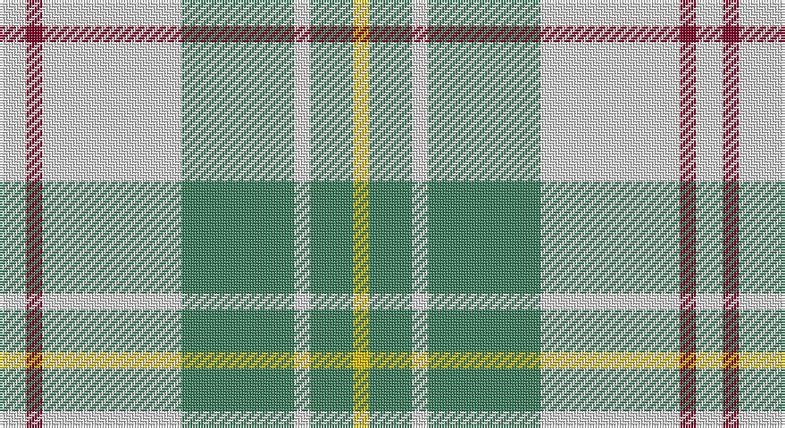

This page is one **sett** — a single exact thread-count. It belongs to the [tartan](/setts/w5r3w26g21w3g8ly3/)
(the same proportion at any scale), whose colour order is pattern [WRWGWGY](/stripes/wrwgwgy/).

Part of the [MacPherson Dress](/tartans/macpherson-dress/) tartan — the named design grouping this sett with its other cloths.

Sourced from register-of-tartans.  It is a [7 stripe tartan](/stripes/stripes7/).

Original link https://www.tartanregister.gov.uk/tartanDetails.aspx?ref=2716

## Also known as

This cloth is also recorded under:

- MacPherson Dress Blue
- MacPherson Dress Blue #2
- MacPherson Dress Green
- MacPherson Dress Purple
- MacPherson Dress Red
- MacPherson Dress, Blue
- MacPherson Dress, Green
- MacPherson Dress, Purple
- MacPherson Dress, Red
- MacPherson Dress, Royal Blue
- MacPherson Red Dress
- MacPherson, Red
- MacPherson, dress
- MacPherson, dress green
- MacPherson, dress red

## Register references

External register numbers recorded for this tartan.

- Scottish Register of Tartans: [2716](https://www.tartanregister.gov.uk/tartanDetails.aspx?ref=2716)
- Scottish Tartans Authority (ITI): 6539

## Thread count
LN/10 DR6 LN52 G42 LN6 G16 Y/6

One full sett is **260 threads**.

## Palette

Palette: <strong>Tartan Register</strong>
<table><thead><tr><th>Colour</th><th>Threads</th><th>Shade</th><th>Base</th><th>OKLCh</th></tr></thead><tbody><tr><td>LN/</td><td style="text-align:right;font-variant-numeric:tabular-nums">10</td><td><code style="background-color:#E0E0E0;">#E0E0E0</code> <small style="color:#888">#E0E0E0</small></td><td>W <code style="background-color:#F7F7F7;">#F7F7F7</code></td><td><small style="color:#888">oklch(90.7% 0.000 89.9)</small></td></tr><tr><td>DR</td><td style="text-align:right;font-variant-numeric:tabular-nums">6</td><td><code style="background-color:#800028;">#800028</code> <small style="color:#888">#800028</small></td><td>R <code style="background-color:#CC0000;">#CC0000</code></td><td><small style="color:#888">oklch(38.2% 0.152 14.5)</small></td></tr><tr><td>LN</td><td style="text-align:right;font-variant-numeric:tabular-nums">52</td><td><code style="background-color:#E0E0E0;">#E0E0E0</code> <small style="color:#888">#E0E0E0</small></td><td>W <code style="background-color:#F7F7F7;">#F7F7F7</code></td><td><small style="color:#888">oklch(90.7% 0.000 89.9)</small></td></tr><tr><td>G</td><td style="text-align:right;font-variant-numeric:tabular-nums">42</td><td><code style="background-color:#408060;">#408060</code> <small style="color:#888">#408060</small></td><td>G <code style="background-color:#006100;">#006100</code></td><td><small style="color:#888">oklch(54.8% 0.084 160.1)</small></td></tr><tr><td>LN</td><td style="text-align:right;font-variant-numeric:tabular-nums">6</td><td><code style="background-color:#E0E0E0;">#E0E0E0</code> <small style="color:#888">#E0E0E0</small></td><td>W <code style="background-color:#F7F7F7;">#F7F7F7</code></td><td><small style="color:#888">oklch(90.7% 0.000 89.9)</small></td></tr><tr><td>G</td><td style="text-align:right;font-variant-numeric:tabular-nums">16</td><td><code style="background-color:#408060;">#408060</code> <small style="color:#888">#408060</small></td><td>G <code style="background-color:#006100;">#006100</code></td><td><small style="color:#888">oklch(54.8% 0.084 160.1)</small></td></tr><tr><td>Y/</td><td style="text-align:right;font-variant-numeric:tabular-nums">6</td><td><code style="background-color:#E8C000;">#E8C000</code> <small style="color:#888">#E8C000</small></td><td>Y <code style="background-color:#F2BF00;">#F2BF00</code></td><td><small style="color:#888">oklch(81.9% 0.168 93.7)</small></td></tr></tbody></table>

# Sample pattern

## Compared to the master

This cloth is one sett of its design; the master sett (the exemplar the design is anchored on) is below for comparison.

<figure style="margin:0"><figcaption style="color:#888;font-size:smaller">this sett</figcaption></figure>
<figure style="margin:0"><figcaption style="color:#888;font-size:smaller"><a href="/setts/w5dp3w26r20w3r8ly3/">master sett →</a></figcaption></figure>

## Nearest tartans

The nearest existing variants by ΔTartan distance, with this tartan at the top so the swatches line up against it.

ΔTartan

Tartan

Sett

—

<a href="/ttd/edit/#slug=w5r3w26g21w3g8ly3~x2">MacPherson Dress Blue (Dance) #2</a> <a class="nn-out" href="/variants/s7/w5r3w26g21w3g8ly3~x2/" title="open its dictionary page">↗</a>

0.92

<a href="/ttd/edit/#slug=w5r3w26g20w3g8ly3~x2&amp;base=w5r3w26g21w3g8ly3~x2">MacPherson Dress Green (Dance)</a> <a class="nn-out" href="/variants/s7/w5r3w26g20w3g8ly3~x2/" title="open its dictionary page">↗</a>

1.22

<a href="/ttd/edit/#slug=w2o1w2g6w10o6w2g1w2~x2&amp;base=w5r3w26g21w3g8ly3~x2">O'Neill</a> <a class="nn-out" href="/variants/s9/w2o1w2g6w10o6w2g1w2~x2/" title="open its dictionary page">↗</a>

1.24

<a href="/ttd/edit/#slug=b6k3b37ly41w3ly6w3~x2&amp;base=w5r3w26g21w3g8ly3~x2">Tilburg Hunting (District)</a> <a class="nn-out" href="/variants/s7/b6k3b37ly41w3ly6w3~x2/" title="open its dictionary page">↗</a>

1.38

<a href="/ttd/edit/#slug=lg8do2lg13r4lg12t22lg5lo3~x2&amp;base=w5r3w26g21w3g8ly3~x2">Kildare Irish County Tartan</a> <a class="nn-out" href="/variants/s8/lg8do2lg13r4lg12t22lg5lo3~x2/" title="open its dictionary page">↗</a>

1.39

<a href="/ttd/edit/#slug=r1dg1lp1lb7dg7lp1dg1lp1~x6&amp;base=w5r3w26g21w3g8ly3~x2">Beck-McSorley</a> <a class="nn-out" href="/variants/s8/r1dg1lp1lb7dg7lp1dg1lp1~x6/" title="open its dictionary page">↗</a>

1.41

<a href="/ttd/edit/#slug=w38r12w37g32k3w4k3g32r4~x2&amp;base=w5r3w26g21w3g8ly3~x2">MacDiarmid Dress</a> <a class="nn-out" href="/variants/s9/w38r12w37g32k3w4k3g32r4~x2/" title="open its dictionary page">↗</a>

1.43

<a href="/ttd/edit/#slug=t8db2t24db5w26k2w8~x2&amp;base=w5r3w26g21w3g8ly3~x2">Lennox Turquoise Dress District Tartan</a> <a class="nn-out" href="/variants/s7/t8db2t24db5w26k2w8~x2/" title="open its dictionary page">↗</a>

1.44

<a href="/ttd/edit/#slug=w38r12w37g32k3w4k3g32r4&amp;base=w5r3w26g21w3g8ly3~x2">MacDiarmid, dress</a> <a class="nn-out" href="/variants/s9/w38r12w37g32k3w4k3g32r4/" title="open its dictionary page">↗</a>

1.47

<a href="/ttd/edit/#slug=w24g2w8db5ly4db5ly4~x2&amp;base=w5r3w26g21w3g8ly3~x2">Clackson Arisaid (Name?)</a> <a class="nn-out" href="/variants/s7/w24g2w8db5ly4db5ly4~x2/" title="open its dictionary page">↗</a>

1.48

<a href="/ttd/edit/#slug=t60g9r7ly12g33ly33t26&amp;base=w5r3w26g21w3g8ly3~x2">Supporter.com</a> <a class="nn-out" href="/variants/s7/t60g9r7ly12g33ly33t26/" title="open its dictionary page">↗</a>

## Neighbour map

Every grey dot is one of 14360 variants placed by the first two principal components of the ΔTartan feature space (44% of its variance). Red is this tartan; blue dots are its nearest — click one to open its page.

<svg viewBox="0 0 640 380" role="img" style="max-width:100%;height:auto;border:1px solid #e0e0e0;border-radius:4px;display:block" xmlns="http://www.w3.org/2000/svg"><image href="/nn/cloud.v1.png" width="640" height="380"/><a href="/variants/s7/w5r3w26g20w3g8ly3~x2/"><circle cx="244.8" cy="183.7" r="4" fill="#3465a4"><title>MacPherson Dress Green (Dance)</title></circle></a><a href="/variants/s9/w2o1w2g6w10o6w2g1w2~x2/"><circle cx="285.4" cy="192.4" r="4" fill="#3465a4"><title>O'Neill</title></circle></a><a href="/variants/s7/b6k3b37ly41w3ly6w3~x2/"><circle cx="287.2" cy="161.8" r="4" fill="#3465a4"><title>Tilburg Hunting (District)</title></circle></a><a href="/variants/s8/lg8do2lg13r4lg12t22lg5lo3~x2/"><circle cx="260.1" cy="183.7" r="4" fill="#3465a4"><title>Kildare Irish County Tartan</title></circle></a><a href="/variants/s8/r1dg1lp1lb7dg7lp1dg1lp1~x6/"><circle cx="223.5" cy="185.5" r="4" fill="#3465a4"><title>Beck-McSorley</title></circle></a><a href="/variants/s9/w38r12w37g32k3w4k3g32r4~x2/"><circle cx="225.3" cy="162.9" r="4" fill="#3465a4"><title>MacDiarmid Dress</title></circle></a><a href="/variants/s7/t8db2t24db5w26k2w8~x2/"><circle cx="248.9" cy="177.7" r="4" fill="#3465a4"><title>Lennox Turquoise Dress District Tartan</title></circle></a><a href="/variants/s9/w38r12w37g32k3w4k3g32r4/"><circle cx="223.6" cy="162.6" r="4" fill="#3465a4"><title>MacDiarmid, dress</title></circle></a><a href="/variants/s7/w24g2w8db5ly4db5ly4~x2/"><circle cx="303.2" cy="162.2" r="4" fill="#3465a4"><title>Clackson Arisaid (Name?)</title></circle></a><a href="/variants/s7/t60g9r7ly12g33ly33t26/"><circle cx="208.1" cy="217.5" r="4" fill="#3465a4"><title>Supporter.com</title></circle></a><circle cx="262.0" cy="190.3" r="5" fill="#c00000"/></svg>

ID: /variants/s7/w5r3w26g21w3g8ly3~x2/
