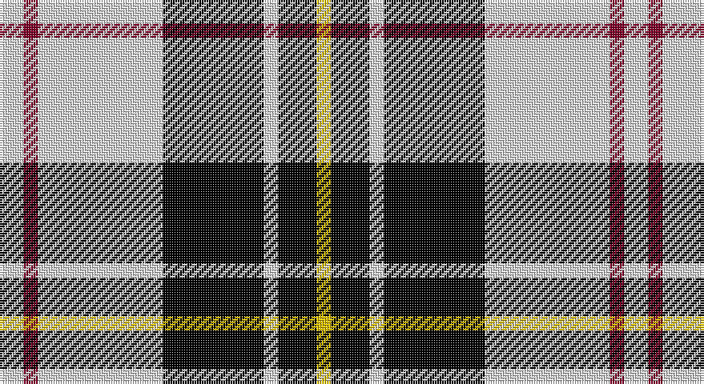

This page is one **sett** — a single exact thread-count. It belongs to the [tartan](/setts/w5r3w26k21w3k8ly3/)
(the same proportion at any scale), whose colour order is pattern [WRWKWKY](/stripes/wrwkwky/).

Part of the [MacPherson Dress](/tartans/macpherson-dress/) tartan — the named design grouping this sett with its other cloths.

Sourced from tartans-authority.  It is a [7 stripe tartan](/stripes/stripes7/).

Original link http://www.tartansauthority.com/tartan-ferret/display/6539/

## Also known as

This cloth is also recorded under:

- MacPherson Dress Blue
- MacPherson Dress Blue #2
- MacPherson Dress Green
- MacPherson Dress Purple
- MacPherson Dress Red
- MacPherson Dress, Blue
- MacPherson Dress, Green
- MacPherson Dress, Purple
- MacPherson Dress, Red
- MacPherson Dress, Royal Blue
- MacPherson Red Dress
- MacPherson, Red
- MacPherson, dress
- MacPherson, dress green
- MacPherson, dress red

## Register references

External register numbers recorded for this tartan.

- Scottish Tartans Authority (ITI): 6539

## Thread count
LN/10 DR6 LN52 K42 LN6 K16 Y/6

One full sett is **260 threads**.

## Palette

Palette: <strong>Tartan Register</strong>
<table><thead><tr><th>Colour</th><th>Threads</th><th>Shade</th><th>Base</th><th>OKLCh</th></tr></thead><tbody><tr><td>LN/</td><td style="text-align:right;font-variant-numeric:tabular-nums">10</td><td><code style="background-color:#E0E0E0;">#E0E0E0</code> <small style="color:#888">#E0E0E0</small></td><td>W <code style="background-color:#F7F7F7;">#F7F7F7</code></td><td><small style="color:#888">oklch(90.7% 0.000 89.9)</small></td></tr><tr><td>DR</td><td style="text-align:right;font-variant-numeric:tabular-nums">6</td><td><code style="background-color:#800028;">#800028</code> <small style="color:#888">#800028</small></td><td>R <code style="background-color:#CC0000;">#CC0000</code></td><td><small style="color:#888">oklch(38.2% 0.152 14.5)</small></td></tr><tr><td>LN</td><td style="text-align:right;font-variant-numeric:tabular-nums">52</td><td><code style="background-color:#E0E0E0;">#E0E0E0</code> <small style="color:#888">#E0E0E0</small></td><td>W <code style="background-color:#F7F7F7;">#F7F7F7</code></td><td><small style="color:#888">oklch(90.7% 0.000 89.9)</small></td></tr><tr><td>K</td><td style="text-align:right;font-variant-numeric:tabular-nums">42</td><td><code style="background-color:#000000;">#000000</code> <small style="color:#888">#000000</small></td><td>K <code style="background-color:#000000;">#000000</code></td><td><small style="color:#888">oklch(0.0% 0.000 0.0)</small></td></tr><tr><td>LN</td><td style="text-align:right;font-variant-numeric:tabular-nums">6</td><td><code style="background-color:#E0E0E0;">#E0E0E0</code> <small style="color:#888">#E0E0E0</small></td><td>W <code style="background-color:#F7F7F7;">#F7F7F7</code></td><td><small style="color:#888">oklch(90.7% 0.000 89.9)</small></td></tr><tr><td>K</td><td style="text-align:right;font-variant-numeric:tabular-nums">16</td><td><code style="background-color:#000000;">#000000</code> <small style="color:#888">#000000</small></td><td>K <code style="background-color:#000000;">#000000</code></td><td><small style="color:#888">oklch(0.0% 0.000 0.0)</small></td></tr><tr><td>Y/</td><td style="text-align:right;font-variant-numeric:tabular-nums">6</td><td><code style="background-color:#E8C000;">#E8C000</code> <small style="color:#888">#E8C000</small></td><td>Y <code style="background-color:#F2BF00;">#F2BF00</code></td><td><small style="color:#888">oklch(81.9% 0.168 93.7)</small></td></tr></tbody></table>

# Sample pattern

## Compared to the master

This cloth is one sett of its design; the master sett (the exemplar the design is anchored on) is below for comparison.

<figure style="margin:0"><figcaption style="color:#888;font-size:smaller">this sett</figcaption></figure>
<figure style="margin:0"><figcaption style="color:#888;font-size:smaller"><a href="/setts/w5dp3w26r20w3r8ly3/">master sett →</a></figcaption></figure>

## Nearest tartans

The nearest existing variants by ΔTartan distance, with this tartan at the top so the swatches line up against it.

ΔTartan

Tartan

Sett

—

<a href="/ttd/edit/#slug=w5r3w26k21w3k8ly3~x2">MacPherson Dress, Blue (Dance)</a> <a class="nn-out" href="/variants/s7/w5r3w26k21w3k8ly3~x2/" title="open its dictionary page">↗</a>

0.84

<a href="/ttd/edit/#slug=w3p3w30k20w3k9ly3~x2&amp;base=w5r3w26k21w3k8ly3~x2">MacPherson Dress (1951)</a> <a class="nn-out" href="/variants/s7/w3p3w30k20w3k9ly3~x2/" title="open its dictionary page">↗</a>

0.94

<a href="/ttd/edit/#slug=k6m2k12y3k6lb16y3lb16k2~x2&amp;base=w5r3w26k21w3k8ly3~x2">MacMillan</a> <a class="nn-out" href="/variants/s9/k6m2k12y3k6lb16y3lb16k2~x2/" title="open its dictionary page">↗</a>

0.98

<a href="/ttd/edit/#slug=k3dg3k3lb16k3r3k3&amp;base=w5r3w26k21w3k8ly3~x2">Eglinton</a> <a class="nn-out" href="/variants/s7/k3dg3k3lb16k3r3k3/" title="open its dictionary page">↗</a>

1.02

<a href="/ttd/edit/#slug=k22w16ly2w14ly2w16k22db3~x2&amp;base=w5r3w26k21w3k8ly3~x2">Kennison</a> <a class="nn-out" href="/variants/s8/k22w16ly2w14ly2w16k22db3~x2/" title="open its dictionary page">↗</a>

1.12

<a href="/ttd/edit/#slug=k23ly3k23w36r4~x2&amp;base=w5r3w26k21w3k8ly3~x2">Macleod, Winnifred Mary, Dress</a> <a class="nn-out" href="/variants/s5/k23ly3k23w36r4~x2/" title="open its dictionary page">↗</a>

1.12

<a href="/ttd/edit/#slug=r2w30k15lo2k15r2~x2&amp;base=w5r3w26k21w3k8ly3~x2">Brodie (WCWM)</a> <a class="nn-out" href="/variants/s6/r2w30k15lo2k15r2~x2/" title="open its dictionary page">↗</a>

1.19

<a href="/ttd/edit/#slug=k22w16g2w14g2w16k22r3~x2&amp;base=w5r3w26k21w3k8ly3~x2">Kierson</a> <a class="nn-out" href="/variants/s8/k22w16g2w14g2w16k22r3~x2/" title="open its dictionary page">↗</a>

1.20

<a href="/ttd/edit/#slug=w2k11w2k2w16k2w2k11lo2~x4&amp;base=w5r3w26k21w3k8ly3~x2">MacFie of Colonsay Dress (Fashion?)</a> <a class="nn-out" href="/variants/s9/w2k11w2k2w16k2w2k11lo2~x4/" title="open its dictionary page">↗</a>

1.22

<a href="/ttd/edit/#slug=lo9k32g6lb20lo3lb9k5~x2&amp;base=w5r3w26k21w3k8ly3~x2">Black &amp; White Golf (Corporate)</a> <a class="nn-out" href="/variants/s7/lo9k32g6lb20lo3lb9k5~x2/" title="open its dictionary page">↗</a>

1.23

<a href="/ttd/edit/#slug=k30w2lr4lo10w9k3lr5~x2&amp;base=w5r3w26k21w3k8ly3~x2">Virginia Commonwealth University</a> <a class="nn-out" href="/variants/s7/k30w2lr4lo10w9k3lr5~x2/" title="open its dictionary page">↗</a>

## Neighbour map

Every grey dot is one of 14360 variants placed by the first two principal components of the ΔTartan feature space (44% of its variance). Red is this tartan; blue dots are its nearest — click one to open its page.

<svg viewBox="0 0 640 380" role="img" style="max-width:100%;height:auto;border:1px solid #e0e0e0;border-radius:4px;display:block" xmlns="http://www.w3.org/2000/svg"><image href="/nn/cloud.v1.png" width="640" height="380"/><a href="/variants/s7/w3p3w30k20w3k9ly3~x2/"><circle cx="246.6" cy="164.5" r="4" fill="#3465a4"><title>MacPherson Dress (1951)</title></circle></a><a href="/variants/s9/k6m2k12y3k6lb16y3lb16k2~x2/"><circle cx="207.8" cy="187.8" r="4" fill="#3465a4"><title>MacMillan</title></circle></a><a href="/variants/s7/k3dg3k3lb16k3r3k3/"><circle cx="185.6" cy="192.3" r="4" fill="#3465a4"><title>Eglinton</title></circle></a><a href="/variants/s8/k22w16ly2w14ly2w16k22db3~x2/"><circle cx="208.5" cy="187.0" r="4" fill="#3465a4"><title>Kennison</title></circle></a><a href="/variants/s5/k23ly3k23w36r4~x2/"><circle cx="247.0" cy="200.0" r="4" fill="#3465a4"><title>Macleod, Winnifred Mary, Dress</title></circle></a><a href="/variants/s6/r2w30k15lo2k15r2~x2/"><circle cx="241.9" cy="160.0" r="4" fill="#3465a4"><title>Brodie (WCWM)</title></circle></a><a href="/variants/s8/k22w16g2w14g2w16k22r3~x2/"><circle cx="209.3" cy="183.7" r="4" fill="#3465a4"><title>Kierson</title></circle></a><a href="/variants/s9/w2k11w2k2w16k2w2k11lo2~x4/"><circle cx="262.7" cy="183.0" r="4" fill="#3465a4"><title>MacFie of Colonsay Dress (Fashion?)</title></circle></a><a href="/variants/s7/lo9k32g6lb20lo3lb9k5~x2/"><circle cx="189.5" cy="180.7" r="4" fill="#3465a4"><title>Black &amp; White Golf (Corporate)</title></circle></a><a href="/variants/s7/k30w2lr4lo10w9k3lr5~x2/"><circle cx="247.3" cy="153.2" r="4" fill="#3465a4"><title>Virginia Commonwealth University</title></circle></a><circle cx="227.7" cy="178.7" r="5" fill="#c00000"/></svg>

ID: /variants/s7/w5r3w26k21w3k8ly3~x2/
