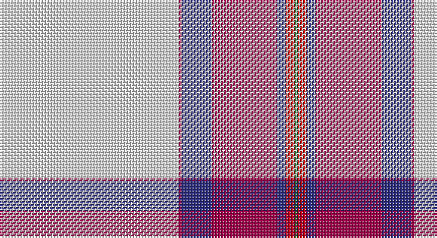

This page is one **sett** — a single exact thread-count. It belongs to the [tartan](/setts/w60m1db10m22db3r3g1/)
(the same proportion at any scale), whose colour order is pattern [GRBRBRW](/stripes/grbrbrw/).

Sourced from house-of-tartan.  It is a [7 stripe tartan](/stripes/stripes7/).

Original link http://www.house-of-tartan.scotland.net/house/TartanViewjs.asp?colr=Def&tnam=8177

## Provenance

Earliest known date: Threadcount and colours aren't 100% original. Generated manually.

## Thread count
LN/120 R2 DB20 R44 DB6 Ra6 G/2

One full sett is **278 threads**.

## Palette

Palette: <strong>Tartan Register</strong>
<table><thead><tr><th>Colour</th><th>Threads</th><th>Shade</th><th>Base</th><th>OKLCh</th></tr></thead><tbody><tr><td>LN/</td><td style="text-align:right;font-variant-numeric:tabular-nums">120</td><td><code style="background-color:#E0E0E0;">#E0E0E0</code> <small style="color:#888">#E0E0E0</small></td><td>W <code style="background-color:#F7F7F7;">#F7F7F7</code></td><td><small style="color:#888">oklch(90.7% 0.000 89.9)</small></td></tr><tr><td>R</td><td style="text-align:right;font-variant-numeric:tabular-nums">2</td><td><code style="background-color:#A00048;">#A00048</code> <small style="color:#888">#A00048</small></td><td>R <code style="background-color:#CC0000;">#CC0000</code></td><td><small style="color:#888">oklch(45.4% 0.182 5.3)</small></td></tr><tr><td>DB</td><td style="text-align:right;font-variant-numeric:tabular-nums">20</td><td><code style="background-color:#2C2C80;">#2C2C80</code> <small style="color:#888">#2C2C80</small></td><td>B <code style="background-color:#2A418A;">#2A418A</code></td><td><small style="color:#888">oklch(35.0% 0.138 276.6)</small></td></tr><tr><td>R</td><td style="text-align:right;font-variant-numeric:tabular-nums">44</td><td><code style="background-color:#A00048;">#A00048</code> <small style="color:#888">#A00048</small></td><td>R <code style="background-color:#CC0000;">#CC0000</code></td><td><small style="color:#888">oklch(45.4% 0.182 5.3)</small></td></tr><tr><td>DB</td><td style="text-align:right;font-variant-numeric:tabular-nums">6</td><td><code style="background-color:#2C2C80;">#2C2C80</code> <small style="color:#888">#2C2C80</small></td><td>B <code style="background-color:#2A418A;">#2A418A</code></td><td><small style="color:#888">oklch(35.0% 0.138 276.6)</small></td></tr><tr><td>Ra</td><td style="text-align:right;font-variant-numeric:tabular-nums">6</td><td><code style="background-color:#C80000;">#C80000</code> <small style="color:#888">#C80000</small></td><td>R <code style="background-color:#CC0000;">#CC0000</code></td><td><small style="color:#888">oklch(52.3% 0.215 29.2)</small></td></tr><tr><td>G/</td><td style="text-align:right;font-variant-numeric:tabular-nums">2</td><td><code style="background-color:#006818;">#006818</code> <small style="color:#888">#006818</small></td><td>G <code style="background-color:#006100;">#006100</code></td><td><small style="color:#888">oklch(45.0% 0.142 145.0)</small></td></tr></tbody></table>

# Sample pattern

## Nearest tartans

The nearest existing variants by ΔTartan distance, with this tartan at the top so the swatches line up against it.

ΔTartan

Tartan

Sett

—

<a href="/ttd/edit/#slug=w60m1db10m22db3r3g1~x2">Aviemore Dress Tartan</a> <a class="nn-out" href="/variants/s7/w60m1db10m22db3r3g1~x2/" title="open its dictionary page">↗</a>

1.37

<a href="/ttd/edit/#slug=w216k8dg24g24w4k4r45w8r12&amp;base=w60m1db10m22db3r3g1~x2">Unidentified Arisaid</a> <a class="nn-out" href="/variants/s9/w216k8dg24g24w4k4r45w8r12/" title="open its dictionary page">↗</a>

1.40

<a href="/ttd/edit/#slug=w55dp12lo2dp3w2g10dpi9dp2dpi6w2~x2&amp;base=w60m1db10m22db3r3g1~x2">Stewart Dress, Purple (Dance)</a> <a class="nn-out" href="/variants/s10/w55dp12lo2dp3w2g10dpi9dp2dpi6w2~x2/" title="open its dictionary page">↗</a>

1.40

<a href="/ttd/edit/#slug=w50k1r12w1dg12r13w1r2~x2&amp;base=w60m1db10m22db3r3g1~x2">Unidentified Blanket</a> <a class="nn-out" href="/variants/s8/w50k1r12w1dg12r13w1r2~x2/" title="open its dictionary page">↗</a>

1.47

<a href="/ttd/edit/#slug=w54k7r7lo6ly4r1~x2&amp;base=w60m1db10m22db3r3g1~x2">Young, Christina</a> <a class="nn-out" href="/variants/s6/w54k7r7lo6ly4r1~x2/" title="open its dictionary page">↗</a>

1.47

<a href="/ttd/edit/#slug=w52ri22w6ri8k1r3~x2&amp;base=w60m1db10m22db3r3g1~x2">MacGregor Dress Burgundy (Dance)</a> <a class="nn-out" href="/variants/s6/w52ri22w6ri8k1r3~x2/" title="open its dictionary page">↗</a>

1.49

<a href="/ttd/edit/#slug=w50k1r14w1dg14r14w1r2~x4&amp;base=w60m1db10m22db3r3g1~x2">Wilson's Blanket Pattern</a> <a class="nn-out" href="/variants/s8/w50k1r14w1dg14r14w1r2~x4/" title="open its dictionary page">↗</a>

1.50

<a href="/ttd/edit/#slug=w50k1r12w1g12r13w1r2~x2&amp;base=w60m1db10m22db3r3g1~x2">Unidentified, Blanket</a> <a class="nn-out" href="/variants/s8/w50k1r12w1g12r13w1r2~x2/" title="open its dictionary page">↗</a>

1.51

<a href="/ttd/edit/#slug=w102db20w4db4w4db4dg20r18db3r10w4&amp;base=w60m1db10m22db3r3g1~x2">Grotto Dove (Dance)</a> <a class="nn-out" href="/variants/s11/w102db20w4db4w4db4dg20r18db3r10w4/" title="open its dictionary page">↗</a>

1.52

<a href="/ttd/edit/#slug=w45r9k2w8k2ly1k10db8dp12w2~x2&amp;base=w60m1db10m22db3r3g1~x2">Bruce of Kinnaird Dress (Dance)</a> <a class="nn-out" href="/variants/s10/w45r9k2w8k2ly1k10db8dp12w2~x2/" title="open its dictionary page">↗</a>

1.52

<a href="/ttd/edit/#slug=w50k3gi10g11w1k1r20w3r5~x2&amp;base=w60m1db10m22db3r3g1~x2">Drummond of Perth Dress (Dance)</a> <a class="nn-out" href="/variants/s9/w50k3gi10g11w1k1r20w3r5~x2/" title="open its dictionary page">↗</a>

## Neighbour map

Every grey dot is one of 14360 variants placed by the first two principal components of the ΔTartan feature space (44% of its variance). Red is this tartan; blue dots are its nearest — click one to open its page.

<svg viewBox="0 0 640 380" role="img" style="max-width:100%;height:auto;border:1px solid #e0e0e0;border-radius:4px;display:block" xmlns="http://www.w3.org/2000/svg"><image href="/nn/cloud.v1.png" width="640" height="380"/><a href="/variants/s9/w216k8dg24g24w4k4r45w8r12/"><circle cx="395.3" cy="42.7" r="4" fill="#3465a4"><title>Unidentified Arisaid</title></circle></a><a href="/variants/s10/w55dp12lo2dp3w2g10dpi9dp2dpi6w2~x2/"><circle cx="294.0" cy="59.3" r="4" fill="#3465a4"><title>Stewart Dress, Purple (Dance)</title></circle></a><a href="/variants/s8/w50k1r12w1dg12r13w1r2~x2/"><circle cx="362.9" cy="74.9" r="4" fill="#3465a4"><title>Unidentified Blanket</title></circle></a><a href="/variants/s6/w54k7r7lo6ly4r1~x2/"><circle cx="414.3" cy="72.0" r="4" fill="#3465a4"><title>Young, Christina</title></circle></a><a href="/variants/s6/w52ri22w6ri8k1r3~x2/"><circle cx="394.5" cy="91.5" r="4" fill="#3465a4"><title>MacGregor Dress Burgundy (Dance)</title></circle></a><a href="/variants/s8/w50k1r14w1dg14r14w1r2~x4/"><circle cx="328.1" cy="70.1" r="4" fill="#3465a4"><title>Wilson's Blanket Pattern</title></circle></a><a href="/variants/s8/w50k1r12w1g12r13w1r2~x2/"><circle cx="362.4" cy="76.7" r="4" fill="#3465a4"><title>Unidentified, Blanket</title></circle></a><a href="/variants/s11/w102db20w4db4w4db4dg20r18db3r10w4/"><circle cx="338.9" cy="63.0" r="4" fill="#3465a4"><title>Grotto Dove (Dance)</title></circle></a><a href="/variants/s10/w45r9k2w8k2ly1k10db8dp12w2~x2/"><circle cx="266.3" cy="37.4" r="4" fill="#3465a4"><title>Bruce of Kinnaird Dress (Dance)</title></circle></a><a href="/variants/s9/w50k3gi10g11w1k1r20w3r5~x2/"><circle cx="288.8" cy="60.6" r="4" fill="#3465a4"><title>Drummond of Perth Dress (Dance)</title></circle></a><circle cx="360.2" cy="63.4" r="5" fill="#c00000"/></svg>

ID: /variants/s7/w60m1db10m22db3r3g1~x2/
