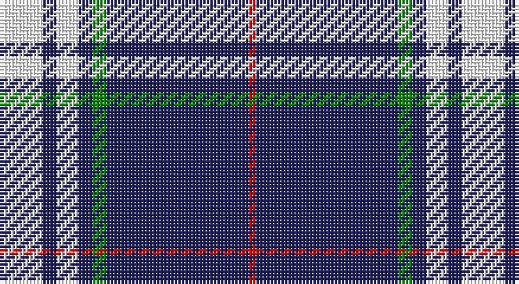

This page is one **sett** — a single exact thread-count. It belongs to the [tartan](/setts/w6db2w3db2g2db20r1/)
(the same proportion at any scale), whose colour order is pattern [RBGBWBW](/stripes/rbgbwbw/).

Sourced from register-of-tartans.  It is a [7 stripe tartan](/stripes/stripes7/).

Original link https://www.tartanregister.gov.uk/tartanDetails.aspx?ref=11068

## Also known as

This cloth is also recorded under:

- Gonzaga University’s True Blue and White

2 attestations — the source records this cloth was collapsed from (oldest owns this page)

<ul>
<li>01/03/2014 — Gonzaga University’s True Blue and White (register-of-tartans, <a href="https://www.tartanregister.gov.uk/tartanDetails.aspx?ref=11068">record</a>)</li>
<li>2014 — Gonzaga University's True Blue and W (tartans-authority, <a href="http://www.tartansauthority.com/tartan-ferret/display/11068/">record</a>)</li>
</ul>

## Register references

External register numbers recorded for this tartan.

- Scottish Register of Tartans: [11068](https://www.tartanregister.gov.uk/tartanDetails?ref=11068)
- Scottish Tartans Authority (ITI): 11068

## Thread count
W/12 DB4 W6 DB4 G4 DB40 R/2

One full sett is **130 threads**.

## Palette

Palette: <strong>Tartan Register</strong>
<table><thead><tr><th>Colour</th><th>Threads</th><th>Shade</th><th>Base</th><th>OKLCh</th></tr></thead><tbody><tr><td>W/</td><td style="text-align:right;font-variant-numeric:tabular-nums">12</td><td><code style="background-color:#FFFFFF;">#FFFFFF</code> <small style="color:#888">#FFFFFF</small></td><td>W <code style="background-color:#F7F7F7;">#F7F7F7</code></td><td><small style="color:#888">oklch(100.0% 0.000 89.9)</small></td></tr><tr><td>DB</td><td style="text-align:right;font-variant-numeric:tabular-nums">4</td><td><code style="background-color:#202060;">#202060</code> <small style="color:#888">#202060</small></td><td>B <code style="background-color:#2A418A;">#2A418A</code></td><td><small style="color:#888">oklch(28.9% 0.111 276.9)</small></td></tr><tr><td>W</td><td style="text-align:right;font-variant-numeric:tabular-nums">6</td><td><code style="background-color:#FFFFFF;">#FFFFFF</code> <small style="color:#888">#FFFFFF</small></td><td>W <code style="background-color:#F7F7F7;">#F7F7F7</code></td><td><small style="color:#888">oklch(100.0% 0.000 89.9)</small></td></tr><tr><td>DB</td><td style="text-align:right;font-variant-numeric:tabular-nums">4</td><td><code style="background-color:#202060;">#202060</code> <small style="color:#888">#202060</small></td><td>B <code style="background-color:#2A418A;">#2A418A</code></td><td><small style="color:#888">oklch(28.9% 0.111 276.9)</small></td></tr><tr><td>G</td><td style="text-align:right;font-variant-numeric:tabular-nums">4</td><td><code style="background-color:#008B00;">#008B00</code> <small style="color:#888">#008B00</small></td><td>G <code style="background-color:#006100;">#006100</code></td><td><small style="color:#888">oklch(55.2% 0.188 142.5)</small></td></tr><tr><td>DB</td><td style="text-align:right;font-variant-numeric:tabular-nums">40</td><td><code style="background-color:#202060;">#202060</code> <small style="color:#888">#202060</small></td><td>B <code style="background-color:#2A418A;">#2A418A</code></td><td><small style="color:#888">oklch(28.9% 0.111 276.9)</small></td></tr><tr><td>R/</td><td style="text-align:right;font-variant-numeric:tabular-nums">2</td><td><code style="background-color:#DC0000;">#DC0000</code> <small style="color:#888">#DC0000</small></td><td>R <code style="background-color:#CC0000;">#CC0000</code></td><td><small style="color:#888">oklch(56.2% 0.230 29.2)</small></td></tr></tbody></table>

# Sample pattern

## Nearest tartans

The nearest existing variants by ΔTartan distance, with this tartan at the top so the swatches line up against it.

ΔTartan

Tartan

Sett

—

<a href="/ttd/edit/#slug=w6db2w3db2g2db20r1~x2">Gonzaga University’s True Blue and White</a> <a class="nn-out" href="/variants/s7/w6db2w3db2g2db20r1~x2/" title="open its dictionary page">↗</a>

0.89

<a href="/ttd/edit/#slug=db28ly3w1ly3db4w2r1w5~x4&amp;base=w6db2w3db2g2db20r1~x2">Baker Dress Family Tartan</a> <a class="nn-out" href="/variants/s8/db28ly3w1ly3db4w2r1w5~x4/" title="open its dictionary page">↗</a>

0.89

<a href="/ttd/edit/#slug=db28lo3w1lo3db4w2dp1w5~x4&amp;base=w6db2w3db2g2db20r1~x2">Baker (Name)</a> <a class="nn-out" href="/variants/s8/db28lo3w1lo3db4w2dp1w5~x4/" title="open its dictionary page">↗</a>

0.92

<a href="/ttd/edit/#slug=db28o3w1o3db4w2dp1w5~x4&amp;base=w6db2w3db2g2db20r1~x2">Baker</a> <a class="nn-out" href="/variants/s8/db28o3w1o3db4w2dp1w5~x4/" title="open its dictionary page">↗</a>

1.20

<a href="/ttd/edit/#slug=db96ly11db8ly11db16ly6w4ly16w8&amp;base=w6db2w3db2g2db20r1~x2">University of North Carolina at Greensboro, The</a> <a class="nn-out" href="/variants/s9/db96ly11db8ly11db16ly6w4ly16w8/" title="open its dictionary page">↗</a>

1.23

<a href="/ttd/edit/#slug=db42k6db3k3db3w5db17w7lo10k3~x2&amp;base=w6db2w3db2g2db20r1~x2">California Riverside, University of (Corporate)</a> <a class="nn-out" href="/variants/s10/db42k6db3k3db3w5db17w7lo10k3~x2/" title="open its dictionary page">↗</a>

1.33

<a href="/ttd/edit/#slug=db28dr3w1dr3db4w2dp1w5~x4&amp;base=w6db2w3db2g2db20r1~x2">Baker Family Tartan</a> <a class="nn-out" href="/variants/s8/db28dr3w1dr3db4w2dp1w5~x4/" title="open its dictionary page">↗</a>

1.36

<a href="/ttd/edit/#slug=db28o3w1o3db4w2p1w5~x4&amp;base=w6db2w3db2g2db20r1~x2">Baker</a> <a class="nn-out" href="/variants/s8/db28o3w1o3db4w2p1w5~x4/" title="open its dictionary page">↗</a>

1.37

<a href="/ttd/edit/#slug=t4db1t4db24w6db4w1db2~x4&amp;base=w6db2w3db2g2db20r1~x2">Antigonish</a> <a class="nn-out" href="/variants/s8/t4db1t4db24w6db4w1db2~x4/" title="open its dictionary page">↗</a>

1.40

<a href="/ttd/edit/#slug=lo3db4w10dg2w2dg5db34ly3~x2&amp;base=w6db2w3db2g2db20r1~x2">Royal Troon Golf Club, The</a> <a class="nn-out" href="/variants/s8/lo3db4w10dg2w2dg5db34ly3~x2/" title="open its dictionary page">↗</a>

1.46

<a href="/ttd/edit/#slug=w8k16w2db2w1k1~x4&amp;base=w6db2w3db2g2db20r1~x2">Ikelman No 1</a> <a class="nn-out" href="/variants/s6/w8k16w2db2w1k1~x4/" title="open its dictionary page">↗</a>

## Neighbour map

Every grey dot is one of 14360 variants placed by the first two principal components of the ΔTartan feature space (44% of its variance). Red is this tartan; blue dots are its nearest — click one to open its page.

<svg viewBox="0 0 640 380" role="img" style="max-width:100%;height:auto;border:1px solid #e0e0e0;border-radius:4px;display:block" xmlns="http://www.w3.org/2000/svg"><image href="/nn/cloud.v1.png" width="640" height="380"/><a href="/variants/s8/db28ly3w1ly3db4w2r1w5~x4/"><circle cx="411.7" cy="112.9" r="4" fill="#3465a4"><title>Baker Dress Family Tartan</title></circle></a><a href="/variants/s8/db28lo3w1lo3db4w2dp1w5~x4/"><circle cx="412.6" cy="115.8" r="4" fill="#3465a4"><title>Baker (Name)</title></circle></a><a href="/variants/s8/db28o3w1o3db4w2dp1w5~x4/"><circle cx="413.7" cy="116.1" r="4" fill="#3465a4"><title>Baker</title></circle></a><a href="/variants/s9/db96ly11db8ly11db16ly6w4ly16w8/"><circle cx="424.4" cy="130.2" r="4" fill="#3465a4"><title>University of North Carolina at Greensboro, The</title></circle></a><a href="/variants/s10/db42k6db3k3db3w5db17w7lo10k3~x2/"><circle cx="352.0" cy="149.0" r="4" fill="#3465a4"><title>California Riverside, University of (Corporate)</title></circle></a><a href="/variants/s8/db28dr3w1dr3db4w2dp1w5~x4/"><circle cx="427.3" cy="122.7" r="4" fill="#3465a4"><title>Baker Family Tartan</title></circle></a><a href="/variants/s8/db28o3w1o3db4w2p1w5~x4/"><circle cx="434.7" cy="125.4" r="4" fill="#3465a4"><title>Baker</title></circle></a><a href="/variants/s8/t4db1t4db24w6db4w1db2~x4/"><circle cx="415.8" cy="151.4" r="4" fill="#3465a4"><title>Antigonish</title></circle></a><a href="/variants/s8/lo3db4w10dg2w2dg5db34ly3~x2/"><circle cx="303.1" cy="118.0" r="4" fill="#3465a4"><title>Royal Troon Golf Club, The</title></circle></a><a href="/variants/s6/w8k16w2db2w1k1~x4/"><circle cx="325.0" cy="176.5" r="4" fill="#3465a4"><title>Ikelman No 1</title></circle></a><circle cx="376.0" cy="139.3" r="5" fill="#c00000"/></svg>

ID: /variants/s7/w6db2w3db2g2db20r1~x2/
