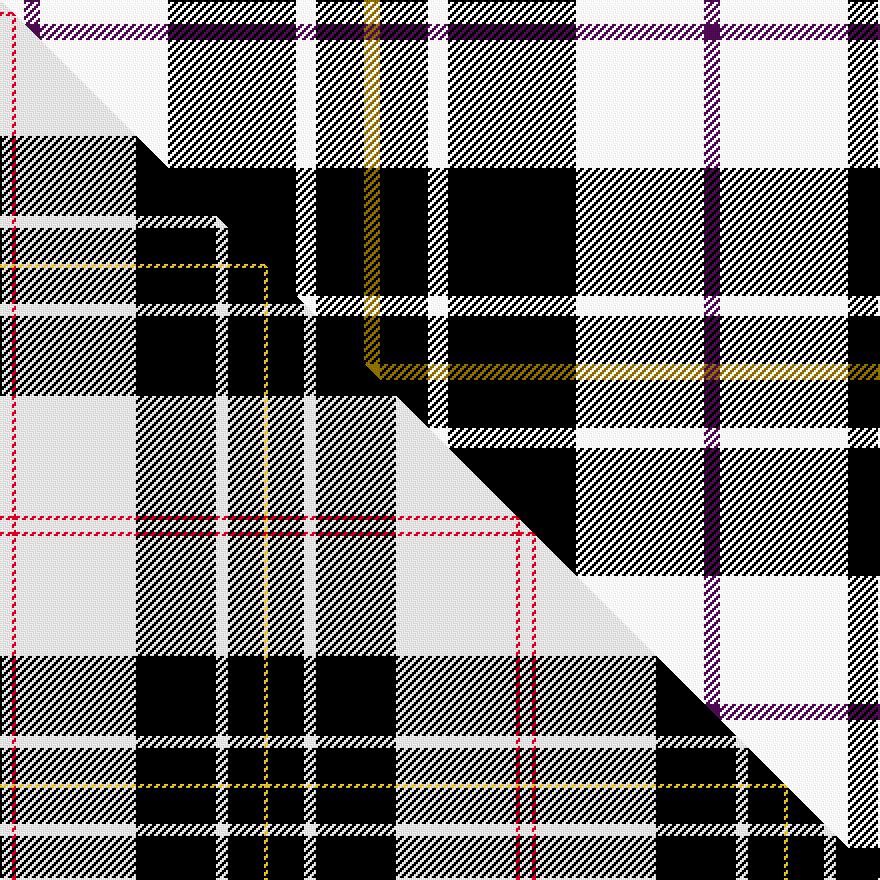

This is one **variant** — a specific cloth: this exact thread count and colourway, with its own
provenance below. It is one weaving of the [sett](/tartans/m/ma/macpherson-dress-6/) (the scale-free proportion — the
same cloth at any scale or shade), whose colour order is pattern [GKWKWBW](/stripes/gkwkwbw/).

Part of the [MacPherson Dress](/tartans/m/ma/macpherson-dress-6/) tartan — the named design grouping this sett with its other cloths.

Sourced from house-of-tartan.  It is a [7 stripe tartan](/stripes/stripes7/).

Original link [http://www.house-of-tartan.scotland.net/house/TartanViewjs.asp?colr=Def&tnam=3246](http://www.house-of-tartan.scotland.net/house/TartanViewjs.asp?colr=Def&tnam=3246)

## Provenance

Earliest known date: 1842 This version was recorded in the STS Sindex without the suffix, 'Dress', and with red in place of purple. Manufacturers have constistantly produced a MacPherson Dress with double purple stripes.

Dataset <small>— provenance for this record, inherited from the source manifest</small>

<dl class="dataset-prov">
<dt>source</dt><dd><a href="/sources/house-of-tartan/">House of Tartan</a></dd>
<dt>data captured from</dt><dd><a href="https://github.com/thetartan/tartan-database/blob/master/data/house-of-tartan/data.csv">https://github.com/thetartan/tartan-database/blob/master/data/house-of-tartan/data.csv</a></dd>
<dt>data date</dt><dd>1842 <small>(this record)</small></dd>
<dt>licence</dt><dd><a href="https://creativecommons.org/licenses/by-nc-nd/4.0/">CC BY-NC-ND 4.0</a></dd>
</dl>

Capture chain <small>— the hands this data passed through, oldest first; each capture carries its own licence</small>

<ol class="capture-chain">
<li><a href="http://www.house-of-tartan.scotland.net/">House of Tartan</a> <small>the weaver/retailer's database — the site is now offline; the URL is kept as the ultimate source's identity</small></li>
<li><a href="https://github.com/thetartan/tartan-database">thetartan/tartan-database</a> <small>2016-2017</small> · <a href="https://creativecommons.org/licenses/by-nc-nd/4.0/">CC BY-NC-ND 4.0</a> <small>Levko Kravets's frozen compilation — the capture we vendored, and where its CC licence text came from</small></li>
<li>this dictionary <small>captured 2026-06-10 · commit 5bf86c7566</small> <small>each re-capture is a git commit to data/sources</small></li>
</ol>

## Thread count
W/12 DP8 W64 K64 W10 K24 Y/8

One full sett is **360 threads**.

The source recorded this cloth as W/12 DP8 W64 K64 W10 K24 Y8 K24 W10 K64 W64 DP/8 — 700 threads; it folds to the canonical 360-thread sett above.

## Palette
<table><thead><tr><th>Colour</th><th>Shade</th><th>OKLCh</th></tr></thead><tbody><tr><td>K</td><td><code style="background-color:#000000;">#000000</code> <small style="color:#888">#000000</small></td><td><small style="color:#888">oklch(0.0% 0.000 0.0)</small></td></tr><tr><td>DP</td><td><code style="background-color:#4B0B4F;">#4B0B4F</code> <small style="color:#888">#4B0B4F</small></td><td><small style="color:#888">oklch(30.1% 0.125 325.4)</small></td></tr><tr><td>R</td><td><code style="background-color:#D60020;">#D60020</code> <small style="color:#888">#D60020</small></td><td><small style="color:#888">oklch(55.2% 0.224 25.5)</small></td></tr><tr><td>W</td><td><code style="background-color:#F7F7F7;">#F7F7F7</code> <small style="color:#888">#F7F7F7</small></td><td><small style="color:#888">oklch(97.6% 0.000 89.9)</small></td></tr><tr><td>Y</td><td><code style="background-color:#8B6E00;">#8B6E00</code> <small style="color:#888">#8B6E00</small></td><td><small style="color:#888">oklch(55.1% 0.113 90.4)</small></td></tr></tbody></table>

# Sample pattern

## Compared to the master

This cloth is one sett of its design; the master sett (the exemplar the design is anchored on) is below for comparison.

Its **ΔTartan distance** from the master is **0.98** — the same measure the nearest-tartans table ranks by (0 is identical; a re-scale of the same cloth is near 0, a recolour or a different proportion further).

<figure class="master-compare" style="margin:0">

this sett
master sett ★

<figcaption style="color:#888;font-size:smaller">One weave of this sett against the <a href="/setts/w3r1w30k20w3k9ly1/">master sett ★</a>, split on the diagonal: a shared proportion runs seamlessly across it with only the shades shifting; a different proportion breaks on it.</figcaption>
</figure>

## Nearest tartan variants

The nearest existing variants by ΔTartan distance, with this cloth at the top so the swatches line up against it.

ΔTartan

Threads

Variant

Sett

—

700

<a href="/variants/s7/w6dp4w32k32w5k12y4~x2/">MacPherson Dress Clan Tartan</a>

<a href="/ttd/edit/#slug=y3k9w3k20w30dp3w3~x2&amp;base=w6dp4w32k32w5k12y4~x2" title="compare in the TTD">0.33</a>

272

<a href="/variants/s7/y3k9w3k20w30dp3w3~x2/">MacPherson Dress (1951)</a>

<a href="/ttd/edit/#slug=w4k4w21k12w4k12ly4&amp;base=w6dp4w32k32w5k12y4~x2" title="compare in the TTD">1.44</a>

114

<a href="/variants/s7/w4k4w21k12w4k12ly4/">Mazda</a>

<a href="/ttd/edit/#slug=k6r2k12y3k6lb16y3lb16k2~x2&amp;base=w6dp4w32k32w5k12y4~x2" title="compare in the TTD">1.89</a>

248

<a href="/variants/s9/k6r2k12y3k6lb16y3lb16k2~x2/">MacMillan</a>

<a href="/ttd/edit/#slug=y9k32g6w20y3w9k5~x2&amp;base=w6dp4w32k32w5k12y4~x2" title="compare in the TTD">2.36</a>

308

<a href="/variants/s7/y9k32g6w20y3w9k5~x2/">Black and White Golf</a>

<a href="/ttd/edit/#slug=ly9k32g6w20ly3w9k5~x2&amp;base=w6dp4w32k32w5k12y4~x2" title="compare in the TTD">2.36</a>

308

<a href="/variants/s7/ly9k32g6w20ly3w9k5~x2/">Black &amp; White Golf (Corporate)</a>

<a href="/ttd/edit/#slug=k11w4n12k2g3y1n12w4k11~x2&amp;base=w6dp4w32k32w5k12y4~x2" title="compare in the TTD">2.58</a>

196

<a href="/variants/s9/k11w4n12k2g3y1n12w4k11~x2/">Hancock Personal Tartan</a>

<a href="/ttd/edit/#slug=w36k41w4lb6k8o24w12lb4o4k6lb4w4k48o4w8k22w18&amp;base=w6dp4w32k32w5k12y4~x2" title="compare in the TTD">2.67</a>

452

<a href="/variants/s17/w36k41w4lb6k8o24w12lb4o4k6lb4w4k48o4w8k22w18/">Abergaveny (Fashion)</a>

<a href="/ttd/edit/#slug=w2g4k7w2k1w11db2w2~x4&amp;base=w6dp4w32k32w5k12y4~x2" title="compare in the TTD">2.69</a>

232

<a href="/variants/s8/w2g4k7w2k1w11db2w2~x4/">Forbes - 1880 (Clans Originaux)</a>

<a href="/ttd/edit/#slug=g10k10lb4k2dy2k2lb3k12lb12k2lb3~x2&amp;base=w6dp4w32k32w5k12y4~x2" title="compare in the TTD">2.69</a>

222

<a href="/variants/s11/g10k10lb4k2dy2k2lb3k12lb12k2lb3~x2/">Dalgliesh Dress</a>

<a href="/ttd/edit/#slug=w2k11w2k2w16k2w2k11lo2~x4&amp;base=w6dp4w32k32w5k12y4~x2" title="compare in the TTD">2.73</a>

384

<a href="/variants/s9/w2k11w2k2w16k2w2k11lo2~x4/">MacFie of Colonsay Dress (Fashion?)</a>

## Neighbour map

Every grey dot is one of 13657 variants placed by the first two principal components of the ΔTartan feature space (42% of its variance). Red is this tartan; blue dots are its nearest — click one to open its page. The map is a flat projection of a many-dimensional space — [how to read it](/posts/neighbourhood-maps/).

<svg viewBox="0 0 640 380" role="img" style="max-width:100%;height:auto;border:1px solid #e0e0e0;border-radius:4px;display:block" xmlns="http://www.w3.org/2000/svg"><image href="/nn/cloud.v1.png" width="640" height="380"/><a href="/variants/s7/y3k9w3k20w30dp3w3~x2/"><circle cx="226.6" cy="165.8" r="4" fill="#3465a4"><title>MacPherson Dress (1951)</title></circle></a><a href="/variants/s7/w4k4w21k12w4k12ly4/"><circle cx="205.1" cy="232.3" r="4" fill="#3465a4"><title>Mazda</title></circle></a><a href="/variants/s9/k6r2k12y3k6lb16y3lb16k2~x2/"><circle cx="178.9" cy="179.0" r="4" fill="#3465a4"><title>MacMillan</title></circle></a><a href="/variants/s7/y9k32g6w20y3w9k5~x2/"><circle cx="163.2" cy="178.3" r="4" fill="#3465a4"><title>Black and White Golf</title></circle></a><a href="/variants/s7/ly9k32g6w20ly3w9k5~x2/"><circle cx="165.0" cy="180.5" r="4" fill="#3465a4"><title>Black &amp; White Golf (Corporate)</title></circle></a><a href="/variants/s9/k11w4n12k2g3y1n12w4k11~x2/"><circle cx="155.1" cy="140.5" r="4" fill="#3465a4"><title>Hancock Personal Tartan</title></circle></a><a href="/variants/s17/w36k41w4lb6k8o24w12lb4o4k6lb4w4k48o4w8k22w18/"><circle cx="181.7" cy="124.5" r="4" fill="#3465a4"><title>Abergaveny (Fashion)</title></circle></a><a href="/variants/s8/w2g4k7w2k1w11db2w2~x4/"><circle cx="214.7" cy="171.9" r="4" fill="#3465a4"><title>Forbes - 1880 (Clans Originaux)</title></circle></a><a href="/variants/s11/g10k10lb4k2dy2k2lb3k12lb12k2lb3~x2/"><circle cx="144.5" cy="190.2" r="4" fill="#3465a4"><title>Dalgliesh Dress</title></circle></a><a href="/variants/s9/w2k11w2k2w16k2w2k11lo2~x4/"><circle cx="250.8" cy="184.6" r="4" fill="#3465a4"><title>MacFie of Colonsay Dress (Fashion?)</title></circle></a><circle cx="192.7" cy="164.3" r="5" fill="#c00000"/><text x="320" y="376" text-anchor="middle" font-size="11" fill="#999">ground</text><text x="11" y="190" text-anchor="middle" font-size="11" fill="#999" transform="rotate(-90 11 190)">complexity</text></svg>

ID: /variants/s7/w6dp4w32k32w5k12y4~x2/
