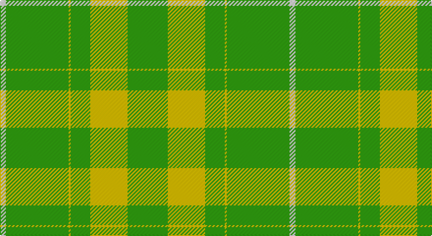

This page is one **sett** — a single exact thread-count. It belongs to the [tartan](/setts/w6g64ly2g20ly38g20g1/)
(the same proportion at any scale), whose colour order is pattern [GGYGYGW](/stripes/ggygygw/).

Part of the [European Union](/tartans/european-union/) tartan — the named design grouping this sett with its other cloths.

Sourced from weddslist.  It is a [7 stripe tartan](/stripes/stripes7/).

Original link http://www.weddslist.com/cgi-bin/tartans/pg.pl?source=sts

## Thread count
LN/6 G64 Y2 G20 Y38 G20 G/1

One full sett is **295 threads**.

## Palette

Palette: <strong>Tartan Dictionary</strong> <small style="color:#888">(1 of 3 colours)</small>
<table><thead><tr><th>Colour</th><th>Threads</th><th>Shade</th><th>Base</th><th>OKLCh</th></tr></thead><tbody><tr><td>LN/</td><td style="text-align:right;font-variant-numeric:tabular-nums">6</td><td><code style="background-color:#E0E0E0;">#E0E0E0</code> <small style="color:#888">#E0E0E0</small></td><td>W <code style="background-color:#F7F7F7;">#F7F7F7</code></td><td><small style="color:#888">oklch(90.7% 0.000 89.9)</small></td></tr><tr><td>G</td><td style="text-align:right;font-variant-numeric:tabular-nums">64</td><td><code style="background-color:#30A010;">#30A010</code> <small style="color:#888">#30A010</small></td><td>G <code style="background-color:#006100;">#006100</code></td><td><small style="color:#888">oklch(61.9% 0.195 140.5)</small></td></tr><tr><td>Y</td><td style="text-align:right;font-variant-numeric:tabular-nums">2</td><td><code style="background-color:#F0C000;">#F0C000</code> <small style="color:#888">#F0C000</small></td><td>Y <code style="background-color:#F2BF00;">#F2BF00</code></td><td><small style="color:#888">oklch(82.7% 0.169 90.5)</small></td></tr><tr><td>G</td><td style="text-align:right;font-variant-numeric:tabular-nums">20</td><td><code style="background-color:#30A010;">#30A010</code> <small style="color:#888">#30A010</small></td><td>G <code style="background-color:#006100;">#006100</code></td><td><small style="color:#888">oklch(61.9% 0.195 140.5)</small></td></tr><tr><td>Y</td><td style="text-align:right;font-variant-numeric:tabular-nums">38</td><td><code style="background-color:#F0C000;">#F0C000</code> <small style="color:#888">#F0C000</small></td><td>Y <code style="background-color:#F2BF00;">#F2BF00</code></td><td><small style="color:#888">oklch(82.7% 0.169 90.5)</small></td></tr><tr><td>G</td><td style="text-align:right;font-variant-numeric:tabular-nums">20</td><td><code style="background-color:#30A010;">#30A010</code> <small style="color:#888">#30A010</small></td><td>G <code style="background-color:#006100;">#006100</code></td><td><small style="color:#888">oklch(61.9% 0.195 140.5)</small></td></tr><tr><td>G/</td><td style="text-align:right;font-variant-numeric:tabular-nums">1</td><td><code style="background-color:#30A010;">#30A010</code> <small style="color:#888">#30A010</small></td><td>G <code style="background-color:#006100;">#006100</code></td><td><small style="color:#888">oklch(61.9% 0.195 140.5)</small></td></tr></tbody></table>

# Sample pattern

## Compared to the master

This cloth is one sett of its design; the master sett (the exemplar the design is anchored on) is below for comparison.

<figure style="margin:0"><figcaption style="color:#888;font-size:smaller">this sett</figcaption></figure>
<figure style="margin:0"><figcaption style="color:#888;font-size:smaller"><a href="/setts/w4db32k1ly2k1db10ly18db10k1r2/">master sett →</a></figcaption></figure>

## Nearest tartans

The nearest existing variants by ΔTartan distance, with this tartan at the top so the swatches line up against it.

ΔTartan

Tartan

Sett

—

<a href="/ttd/edit/#slug=w6g64ly2g20ly38g20g1">European Union</a> <a class="nn-out" href="/variants/s7/w6g64ly2g20ly38g20g1/" title="open its dictionary page">↗</a>

2.15

<a href="/ttd/edit/#slug=g32o2g2o2g2o12g22w1g1w3~x2&amp;base=w6g64ly2g20ly38g20g1">Unidentified Plaid 11</a> <a class="nn-out" href="/variants/s10/g32o2g2o2g2o12g22w1g1w3~x2/" title="open its dictionary page">↗</a>

2.66

<a href="/ttd/edit/#slug=g5y9g4w5g30r2g4r2~x2&amp;base=w6g64ly2g20ly38g20g1">Welsh Assembly</a> <a class="nn-out" href="/variants/s8/g5y9g4w5g30r2g4r2~x2/" title="open its dictionary page">↗</a>

2.72

<a href="/ttd/edit/#slug=g8w2g11w13g30w13g11g2~x2&amp;base=w6g64ly2g20ly38g20g1">Jubilation Tartan</a> <a class="nn-out" href="/variants/s8/g8w2g11w13g30w13g11g2~x2/" title="open its dictionary page">↗</a>

2.73

<a href="/ttd/edit/#slug=r4g2r1g20k1g1~x4&amp;base=w6g64ly2g20ly38g20g1">Loch Laggan (District)</a> <a class="nn-out" href="/variants/s6/r4g2r1g20k1g1~x4/" title="open its dictionary page">↗</a>

2.73

<a href="/ttd/edit/#slug=g55dg6g7dg17ly1dg2ly2~x2&amp;base=w6g64ly2g20ly38g20g1">MacBeorn</a> <a class="nn-out" href="/variants/s7/g55dg6g7dg17ly1dg2ly2~x2/" title="open its dictionary page">↗</a>

2.84

<a href="/ttd/edit/#slug=g10r4g1r4g15ri4g1~x4&amp;base=w6g64ly2g20ly38g20g1">Logan</a> <a class="nn-out" href="/variants/s7/g10r4g1r4g15ri4g1~x4/" title="open its dictionary page">↗</a>

2.89

<a href="/ttd/edit/#slug=dg5r3dg3lo2dg1ly8dg24lo2~x2&amp;base=w6g64ly2g20ly38g20g1">St. Christopher (Corporate)</a> <a class="nn-out" href="/variants/s8/dg5r3dg3lo2dg1ly8dg24lo2~x2/" title="open its dictionary page">↗</a>

2.94

<a href="/ttd/edit/#slug=lo5k1lo6g20w1g3w1g3w1g30k1lo2~x2&amp;base=w6g64ly2g20ly38g20g1">Delta Lambda Phi (Corporate)</a> <a class="nn-out" href="/variants/s12/lo5k1lo6g20w1g3w1g3w1g30k1lo2~x2/" title="open its dictionary page">↗</a>

3.02

<a href="/ttd/edit/#slug=r3g22db16g14r2g6ly1~x2&amp;base=w6g64ly2g20ly38g20g1">Scottish Scouts</a> <a class="nn-out" href="/variants/s7/r3g22db16g14r2g6ly1~x2/" title="open its dictionary page">↗</a>

3.08

<a href="/ttd/edit/#slug=lo78g10r2g1r2g6lo2g3lo2g43~x2&amp;base=w6g64ly2g20ly38g20g1">Montreal</a> <a class="nn-out" href="/variants/s10/lo78g10r2g1r2g6lo2g3lo2g43~x2/" title="open its dictionary page">↗</a>

## Neighbour map

Every grey dot is one of 14360 variants placed by the first two principal components of the ΔTartan feature space (44% of its variance). Red is this tartan; blue dots are its nearest — click one to open its page.

<svg viewBox="0 0 640 380" role="img" style="max-width:100%;height:auto;border:1px solid #e0e0e0;border-radius:4px;display:block" xmlns="http://www.w3.org/2000/svg"><image href="/nn/cloud.v1.png" width="640" height="380"/><a href="/variants/s10/g32o2g2o2g2o12g22w1g1w3~x2/"><circle cx="566.9" cy="181.2" r="4" fill="#3465a4"><title>Unidentified Plaid 11</title></circle></a><a href="/variants/s8/g5y9g4w5g30r2g4r2~x2/"><circle cx="441.2" cy="186.9" r="4" fill="#3465a4"><title>Welsh Assembly</title></circle></a><a href="/variants/s8/g8w2g11w13g30w13g11g2~x2/"><circle cx="430.3" cy="233.6" r="4" fill="#3465a4"><title>Jubilation Tartan</title></circle></a><a href="/variants/s6/r4g2r1g20k1g1~x4/"><circle cx="554.0" cy="183.1" r="4" fill="#3465a4"><title>Loch Laggan (District)</title></circle></a><a href="/variants/s7/g55dg6g7dg17ly1dg2ly2~x2/"><circle cx="513.3" cy="156.8" r="4" fill="#3465a4"><title>MacBeorn</title></circle></a><a href="/variants/s7/g10r4g1r4g15ri4g1~x4/"><circle cx="444.0" cy="223.5" r="4" fill="#3465a4"><title>Logan</title></circle></a><a href="/variants/s8/dg5r3dg3lo2dg1ly8dg24lo2~x2/"><circle cx="441.4" cy="158.5" r="4" fill="#3465a4"><title>St. Christopher (Corporate)</title></circle></a><a href="/variants/s12/lo5k1lo6g20w1g3w1g3w1g30k1lo2~x2/"><circle cx="513.6" cy="131.3" r="4" fill="#3465a4"><title>Delta Lambda Phi (Corporate)</title></circle></a><a href="/variants/s7/r3g22db16g14r2g6ly1~x2/"><circle cx="407.9" cy="202.5" r="4" fill="#3465a4"><title>Scottish Scouts</title></circle></a><a href="/variants/s10/lo78g10r2g1r2g6lo2g3lo2g43~x2/"><circle cx="502.3" cy="141.4" r="4" fill="#3465a4"><title>Montreal</title></circle></a><circle cx="515.6" cy="179.9" r="5" fill="#c00000"/></svg>

ID: /variants/s7/w6g64ly2g20ly38g20g1/
