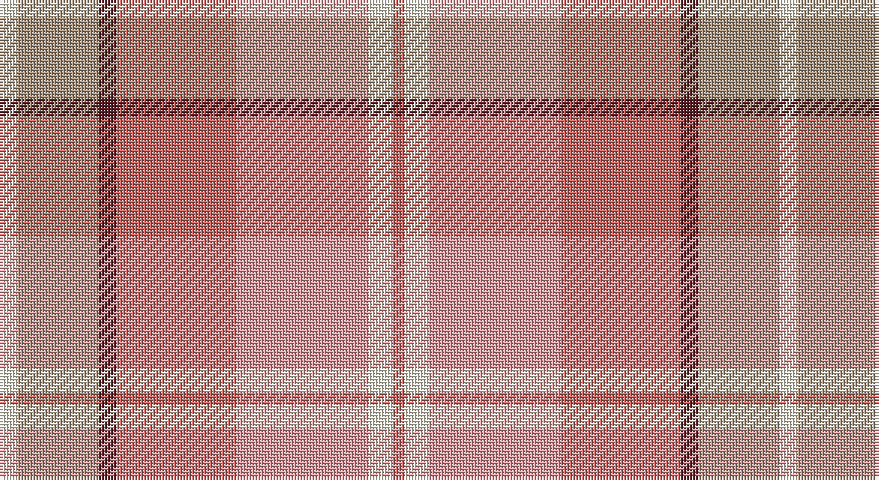

This page is one **sett** — a single exact thread-count. It belongs to the [tartan](/setts/w6lri27dr6o40lr44w8o4/)
(the same proportion at any scale), whose colour order is pattern [RWYRBYW](/stripes/rwyrbyw/).

Sourced from register-of-tartans.  It is a [7 stripe tartan](/stripes/stripes7/).

Original link https://www.tartanregister.gov.uk/tartanDetails.aspx?ref=4039

## Also known as

This cloth is also recorded under:

- Susan G Komen 06

2 attestations — the source records this cloth was collapsed from (oldest owns this page)

<ul>
<li>01/01/2006 — Susan G Komen 06 (register-of-tartans, <a href="https://www.tartanregister.gov.uk/tartanDetails.aspx?ref=4039">record</a>)</li>
<li>2006 — Susan G Komen (Fashion) (tartans-authority, <a href="http://www.tartansauthority.com/tartan-ferret/display/7332/">record</a>)</li>
</ul>

## Register references

External register numbers recorded for this tartan.

- Scottish Register of Tartans: [4039](https://www.tartanregister.gov.uk/tartanDetails.aspx?ref=4039)
- Scottish Tartans Authority (ITI): 7332

## Thread count
LY/6 N27 DR6 LT40 LR44 LY8 LT/4

One full sett is **260 threads**.

## Palette

Palette: <strong>Tartan Register</strong> <small style="color:#888">(1 of 6 colours)</small>
<table><thead><tr><th>Colour</th><th>Threads</th><th>Shade</th><th>Base</th><th>OKLCh</th></tr></thead><tbody><tr><td>LY/</td><td style="text-align:right;font-variant-numeric:tabular-nums">6</td><td><code style="background-color:#FCF8E0;">#FCF8E0</code> <small style="color:#888">#FCF8E0</small></td><td>W <code style="background-color:#F7F7F7;">#F7F7F7</code></td><td><small style="color:#888">oklch(97.6% 0.032 99.2)</small></td></tr><tr><td>N</td><td style="text-align:right;font-variant-numeric:tabular-nums">27</td><td><code style="background-color:#A89480;">#A89480</code> <small style="color:#888">#A89480</small></td><td>Y <code style="background-color:#F2BF00;">#F2BF00</code></td><td><small style="color:#888">oklch(67.9% 0.037 67.1)</small></td></tr><tr><td>DR</td><td style="text-align:right;font-variant-numeric:tabular-nums">6</td><td><code style="background-color:#581C24;">#581C24</code> <small style="color:#888">#581C24</small></td><td>B <code style="background-color:#2A418A;">#2A418A</code></td><td><small style="color:#888">oklch(32.3% 0.088 15.7)</small></td></tr><tr><td>LT</td><td style="text-align:right;font-variant-numeric:tabular-nums">40</td><td><code style="background-color:#C46864;">#C46864</code> <small style="color:#888">#C46864</small></td><td>R <code style="background-color:#CC0000;">#CC0000</code></td><td><small style="color:#888">oklch(62.3% 0.118 23.6)</small></td></tr><tr><td>LR</td><td style="text-align:right;font-variant-numeric:tabular-nums">44</td><td><code style="background-color:#E09CA0;">#E09CA0</code> <small style="color:#888">#E09CA0</small></td><td>Y <code style="background-color:#F2BF00;">#F2BF00</code></td><td><small style="color:#888">oklch(76.0% 0.082 15.3)</small></td></tr><tr><td>LY</td><td style="text-align:right;font-variant-numeric:tabular-nums">8</td><td><code style="background-color:#FCF8E0;">#FCF8E0</code> <small style="color:#888">#FCF8E0</small></td><td>W <code style="background-color:#F7F7F7;">#F7F7F7</code></td><td><small style="color:#888">oklch(97.6% 0.032 99.2)</small></td></tr><tr><td>LT/</td><td style="text-align:right;font-variant-numeric:tabular-nums">4</td><td><code style="background-color:#C46864;">#C46864</code> <small style="color:#888">#C46864</small></td><td>R <code style="background-color:#CC0000;">#CC0000</code></td><td><small style="color:#888">oklch(62.3% 0.118 23.6)</small></td></tr></tbody></table>

# Sample pattern

## Nearest tartans

The nearest existing variants by ΔTartan distance, with this tartan at the top so the swatches line up against it.

ΔTartan

Tartan

Sett

—

<a href="/ttd/edit/#slug=w6lri27dr6o40lr44w8o4">Susan G Komen 06</a> <a class="nn-out" href="/variants/s7/w6lri27dr6o40lr44w8o4/" title="open its dictionary page">↗</a>

1.50

<a href="/ttd/edit/#slug=oi24lo8dr2lo8dr2lo8o15g2~x2&amp;base=w6lri27dr6o40lr44w8o4">Unidentified from Winnipeg</a> <a class="nn-out" href="/variants/s8/oi24lo8dr2lo8dr2lo8o15g2~x2/" title="open its dictionary page">↗</a>

1.51

<a href="/ttd/edit/#slug=r12w4r3lo18r3ly4g2~x2&amp;base=w6lri27dr6o40lr44w8o4">Golden Pheasant</a> <a class="nn-out" href="/variants/s7/r12w4r3lo18r3ly4g2~x2/" title="open its dictionary page">↗</a>

1.56

<a href="/ttd/edit/#slug=loi23r22m52r8w6lo18&amp;base=w6lri27dr6o40lr44w8o4">Lady Boys of Bangkok (Corporate)</a> <a class="nn-out" href="/variants/s6/loi23r22m52r8w6lo18/" title="open its dictionary page">↗</a>

1.74

<a href="/ttd/edit/#slug=o2oi2o15w10oi2y15oi2y2~x2&amp;base=w6lri27dr6o40lr44w8o4">Bannockbane, Grey</a> <a class="nn-out" href="/variants/s8/o2oi2o15w10oi2y15oi2y2~x2/" title="open its dictionary page">↗</a>

1.84

<a href="/ttd/edit/#slug=lr2oi1r10o12oi10lr6r10oi1lr2~x2&amp;base=w6lri27dr6o40lr44w8o4">Unidentified, Sett</a> <a class="nn-out" href="/variants/s9/lr2oi1r10o12oi10lr6r10oi1lr2~x2/" title="open its dictionary page">↗</a>

1.85

<a href="/ttd/edit/#slug=m4lb2w11ly9y16o16ly2lb4~x2&amp;base=w6lri27dr6o40lr44w8o4">Takashimaya Dm Rose</a> <a class="nn-out" href="/variants/s8/m4lb2w11ly9y16o16ly2lb4~x2/" title="open its dictionary page">↗</a>

1.90

<a href="/ttd/edit/#slug=y25w2t4lo7t4w2loi25w2t4lo7~x2&amp;base=w6lri27dr6o40lr44w8o4">O'Monaghan (Personal)</a> <a class="nn-out" href="/variants/s10/y25w2t4lo7t4w2loi25w2t4lo7~x2/" title="open its dictionary page">↗</a>

1.91

<a href="/ttd/edit/#slug=o2dy2o15dy2w10lo15dy2lo2~x2&amp;base=w6lri27dr6o40lr44w8o4">Bannockbane Grey #2</a> <a class="nn-out" href="/variants/s8/o2dy2o15dy2w10lo15dy2lo2~x2/" title="open its dictionary page">↗</a>

2.01

<a href="/ttd/edit/#slug=t24r27g20lo6g20r2w3~x2&amp;base=w6lri27dr6o40lr44w8o4">Buchanhaven Heritage</a> <a class="nn-out" href="/variants/s7/t24r27g20lo6g20r2w3~x2/" title="open its dictionary page">↗</a>

2.07

<a href="/ttd/edit/#slug=r5lp2y24lr2y2lr2y6lr8r6lr8ly4~x2&amp;base=w6lri27dr6o40lr44w8o4">Tasmanian</a> <a class="nn-out" href="/variants/s11/r5lp2y24lr2y2lr2y6lr8r6lr8ly4~x2/" title="open its dictionary page">↗</a>

## Neighbour map

Every grey dot is one of 14360 variants placed by the first two principal components of the ΔTartan feature space (44% of its variance). Red is this tartan; blue dots are its nearest — click one to open its page.

<svg viewBox="0 0 640 380" role="img" style="max-width:100%;height:auto;border:1px solid #e0e0e0;border-radius:4px;display:block" xmlns="http://www.w3.org/2000/svg"><image href="/nn/cloud.v1.png" width="640" height="380"/><a href="/variants/s8/oi24lo8dr2lo8dr2lo8o15g2~x2/"><circle cx="229.9" cy="188.1" r="4" fill="#3465a4"><title>Unidentified from Winnipeg</title></circle></a><a href="/variants/s7/r12w4r3lo18r3ly4g2~x2/"><circle cx="282.9" cy="219.5" r="4" fill="#3465a4"><title>Golden Pheasant</title></circle></a><a href="/variants/s6/loi23r22m52r8w6lo18/"><circle cx="228.1" cy="220.1" r="4" fill="#3465a4"><title>Lady Boys of Bangkok (Corporate)</title></circle></a><a href="/variants/s8/o2oi2o15w10oi2y15oi2y2~x2/"><circle cx="220.4" cy="217.8" r="4" fill="#3465a4"><title>Bannockbane, Grey</title></circle></a><a href="/variants/s9/lr2oi1r10o12oi10lr6r10oi1lr2~x2/"><circle cx="260.4" cy="220.5" r="4" fill="#3465a4"><title>Unidentified, Sett</title></circle></a><a href="/variants/s8/m4lb2w11ly9y16o16ly2lb4~x2/"><circle cx="110.0" cy="199.2" r="4" fill="#3465a4"><title>Takashimaya Dm Rose</title></circle></a><a href="/variants/s10/y25w2t4lo7t4w2loi25w2t4lo7~x2/"><circle cx="212.2" cy="171.4" r="4" fill="#3465a4"><title>O'Monaghan (Personal)</title></circle></a><a href="/variants/s8/o2dy2o15dy2w10lo15dy2lo2~x2/"><circle cx="214.0" cy="214.8" r="4" fill="#3465a4"><title>Bannockbane Grey #2</title></circle></a><a href="/variants/s7/t24r27g20lo6g20r2w3~x2/"><circle cx="225.2" cy="209.0" r="4" fill="#3465a4"><title>Buchanhaven Heritage</title></circle></a><a href="/variants/s11/r5lp2y24lr2y2lr2y6lr8r6lr8ly4~x2/"><circle cx="292.5" cy="176.4" r="4" fill="#3465a4"><title>Tasmanian</title></circle></a><circle cx="218.6" cy="196.1" r="5" fill="#c00000"/></svg>

ID: /variants/s7/w6lri27dr6o40lr44w8o4/
