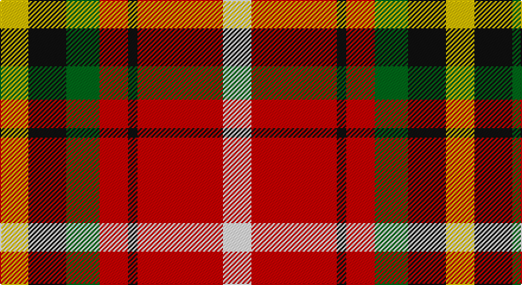

This page is one **sett** — a single exact thread-count. It belongs to the [tartan](/setts/w6r18k2r6g7k8ly6/)
(the same proportion at any scale), whose colour order is pattern [WRKRGKY](/stripes/wrkrgky/).

Part of the [Thirkill](/tartans/thirkill/) tartan — the named design grouping this sett with its other cloths.

Sourced from register-of-tartans.  It is a [7 stripe tartan](/stripes/stripes7/).

Original link https://www.tartanregister.gov.uk/tartanDetails.aspx?ref=4102

## Register references

External register numbers recorded for this tartan.

- Scottish Register of Tartans: [4102](https://www.tartanregister.gov.uk/tartanDetails.aspx?ref=4102)
- Scottish Tartans Authority (ITI): 6275

## Thread count
Y/24 K32 G28 R24 K8 R72 W/24

One full sett is **376 threads**.

## Palette

Palette: <strong>Tartan Register</strong>
<table><thead><tr><th>Colour</th><th>Threads</th><th>Shade</th><th>Base</th><th>OKLCh</th></tr></thead><tbody><tr><td>Y/</td><td style="text-align:right;font-variant-numeric:tabular-nums">24</td><td><code style="background-color:#E8C000;">#E8C000</code> <small style="color:#888">#E8C000</small></td><td>Y <code style="background-color:#F2BF00;">#F2BF00</code></td><td><small style="color:#888">oklch(81.9% 0.168 93.7)</small></td></tr><tr><td>K</td><td style="text-align:right;font-variant-numeric:tabular-nums">32</td><td><code style="background-color:#101010;">#101010</code> <small style="color:#888">#101010</small></td><td>K <code style="background-color:#000000;">#000000</code></td><td><small style="color:#888">oklch(17.3% 0.000 89.9)</small></td></tr><tr><td>G</td><td style="text-align:right;font-variant-numeric:tabular-nums">28</td><td><code style="background-color:#006818;">#006818</code> <small style="color:#888">#006818</small></td><td>G <code style="background-color:#006100;">#006100</code></td><td><small style="color:#888">oklch(45.0% 0.142 145.0)</small></td></tr><tr><td>R</td><td style="text-align:right;font-variant-numeric:tabular-nums">24</td><td><code style="background-color:#C80000;">#C80000</code> <small style="color:#888">#C80000</small></td><td>R <code style="background-color:#CC0000;">#CC0000</code></td><td><small style="color:#888">oklch(52.3% 0.215 29.2)</small></td></tr><tr><td>K</td><td style="text-align:right;font-variant-numeric:tabular-nums">8</td><td><code style="background-color:#101010;">#101010</code> <small style="color:#888">#101010</small></td><td>K <code style="background-color:#000000;">#000000</code></td><td><small style="color:#888">oklch(17.3% 0.000 89.9)</small></td></tr><tr><td>R</td><td style="text-align:right;font-variant-numeric:tabular-nums">72</td><td><code style="background-color:#C80000;">#C80000</code> <small style="color:#888">#C80000</small></td><td>R <code style="background-color:#CC0000;">#CC0000</code></td><td><small style="color:#888">oklch(52.3% 0.215 29.2)</small></td></tr><tr><td>W/</td><td style="text-align:right;font-variant-numeric:tabular-nums">24</td><td><code style="background-color:#FCFCFC;">#FCFCFC</code> <small style="color:#888">#FCFCFC</small></td><td>W <code style="background-color:#F7F7F7;">#F7F7F7</code></td><td><small style="color:#888">oklch(99.1% 0.000 89.9)</small></td></tr></tbody></table>

# Sample pattern

## Compared to the master

This cloth is one sett of its design; the master sett (the exemplar the design is anchored on) is below for comparison.

<figure style="margin:0"><figcaption style="color:#888;font-size:smaller">this sett</figcaption></figure>
<figure style="margin:0"><figcaption style="color:#888;font-size:smaller"><a href="/setts/w4k2r15k2r5y7dg7k2ly4/">master sett →</a></figcaption></figure>

## Nearest tartans

The nearest existing variants by ΔTartan distance, with this tartan at the top so the swatches line up against it.

ΔTartan

Tartan

Sett

—

<a href="/ttd/edit/#slug=w6r18k2r6g7k8ly6~x4">Thirkill (Dalgliesh)</a> <a class="nn-out" href="/variants/s7/w6r18k2r6g7k8ly6~x4/" title="open its dictionary page">↗</a>

1.22

<a href="/ttd/edit/#slug=r39t22k11ly22g5~x2&amp;base=w6r18k2r6g7k8ly6~x4">Abbink, Ingmar (Personal)</a> <a class="nn-out" href="/variants/s5/r39t22k11ly22g5~x2/" title="open its dictionary page">↗</a>

1.25

<a href="/ttd/edit/#slug=ly4w2ly2w8r16g3r3g8r6k2~x2&amp;base=w6r18k2r6g7k8ly6~x4">Melieres, Carolyn (Personal)</a> <a class="nn-out" href="/variants/s10/ly4w2ly2w8r16g3r3g8r6k2~x2/" title="open its dictionary page">↗</a>

1.27

<a href="/ttd/edit/#slug=r32db6k6g6w18k3&amp;base=w6r18k2r6g7k8ly6~x4">Rose, White dress</a> <a class="nn-out" href="/variants/s6/r32db6k6g6w18k3/" title="open its dictionary page">↗</a>

1.29

<a href="/ttd/edit/#slug=ly32k21r16lr6dt4~x2&amp;base=w6r18k2r6g7k8ly6~x4">Scottish American Athletic Assoc</a> <a class="nn-out" href="/variants/s5/ly32k21r16lr6dt4~x2/" title="open its dictionary page">↗</a>

1.35

<a href="/ttd/edit/#slug=ly17g7ly6r43k5o6k13~x2&amp;base=w6r18k2r6g7k8ly6~x4">Keeling</a> <a class="nn-out" href="/variants/s7/ly17g7ly6r43k5o6k13~x2/" title="open its dictionary page">↗</a>

1.36

<a href="/ttd/edit/#slug=w4k2r15k2r5y7dg7k2ly4~x2&amp;base=w6r18k2r6g7k8ly6~x4">Thirkill</a> <a class="nn-out" href="/variants/s9/w4k2r15k2r5y7dg7k2ly4~x2/" title="open its dictionary page">↗</a>

1.37

<a href="/ttd/edit/#slug=r2ly1r5k4g5w1~x4&amp;base=w6r18k2r6g7k8ly6~x4">Aboyne II (Fashion)</a> <a class="nn-out" href="/variants/s6/r2ly1r5k4g5w1~x4/" title="open its dictionary page">↗</a>

1.44

<a href="/ttd/edit/#slug=dp2o9g8o4ly1o4db10w2~x4&amp;base=w6r18k2r6g7k8ly6~x4">De Maynard (Personal)</a> <a class="nn-out" href="/variants/s8/dp2o9g8o4ly1o4db10w2~x4/" title="open its dictionary page">↗</a>

1.45

<a href="/ttd/edit/#slug=dp2r11t9dp11ly2g13r21w2~x2&amp;base=w6r18k2r6g7k8ly6~x4">Wilson's, No 2</a> <a class="nn-out" href="/variants/s8/dp2r11t9dp11ly2g13r21w2~x2/" title="open its dictionary page">↗</a>

1.45

<a href="/ttd/edit/#slug=lb2k2r14dg15k8lb7r14k2lb2&amp;base=w6r18k2r6g7k8ly6~x4">Montrose</a> <a class="nn-out" href="/variants/s9/lb2k2r14dg15k8lb7r14k2lb2/" title="open its dictionary page">↗</a>

## Neighbour map

Every grey dot is one of 14360 variants placed by the first two principal components of the ΔTartan feature space (44% of its variance). Red is this tartan; blue dots are its nearest — click one to open its page.

<svg viewBox="0 0 640 380" role="img" style="max-width:100%;height:auto;border:1px solid #e0e0e0;border-radius:4px;display:block" xmlns="http://www.w3.org/2000/svg"><image href="/nn/cloud.v1.png" width="640" height="380"/><a href="/variants/s5/r39t22k11ly22g5~x2/"><circle cx="129.9" cy="204.6" r="4" fill="#3465a4"><title>Abbink, Ingmar (Personal)</title></circle></a><a href="/variants/s10/ly4w2ly2w8r16g3r3g8r6k2~x2/"><circle cx="173.1" cy="157.1" r="4" fill="#3465a4"><title>Melieres, Carolyn (Personal)</title></circle></a><a href="/variants/s6/r32db6k6g6w18k3/"><circle cx="179.3" cy="155.8" r="4" fill="#3465a4"><title>Rose, White dress</title></circle></a><a href="/variants/s5/ly32k21r16lr6dt4~x2/"><circle cx="129.9" cy="197.9" r="4" fill="#3465a4"><title>Scottish American Athletic Assoc</title></circle></a><a href="/variants/s7/ly17g7ly6r43k5o6k13~x2/"><circle cx="161.4" cy="148.9" r="4" fill="#3465a4"><title>Keeling</title></circle></a><a href="/variants/s9/w4k2r15k2r5y7dg7k2ly4~x2/"><circle cx="120.2" cy="158.3" r="4" fill="#3465a4"><title>Thirkill</title></circle></a><a href="/variants/s6/r2ly1r5k4g5w1~x4/"><circle cx="112.9" cy="222.9" r="4" fill="#3465a4"><title>Aboyne II (Fashion)</title></circle></a><a href="/variants/s8/dp2o9g8o4ly1o4db10w2~x4/"><circle cx="140.5" cy="163.1" r="4" fill="#3465a4"><title>De Maynard (Personal)</title></circle></a><a href="/variants/s8/dp2r11t9dp11ly2g13r21w2~x2/"><circle cx="170.0" cy="160.4" r="4" fill="#3465a4"><title>Wilson's, No 2</title></circle></a><a href="/variants/s9/lb2k2r14dg15k8lb7r14k2lb2/"><circle cx="158.4" cy="185.1" r="4" fill="#3465a4"><title>Montrose</title></circle></a><circle cx="148.6" cy="181.2" r="5" fill="#c00000"/></svg>

ID: /variants/s7/w6r18k2r6g7k8ly6~x4/
