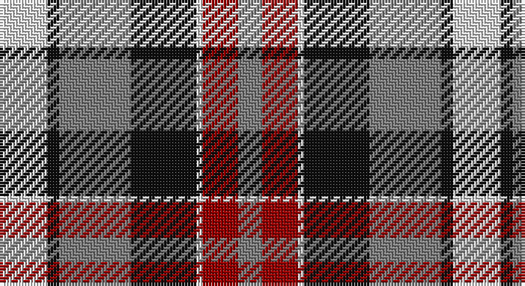

This page is one **sett** — a single exact thread-count. It belongs to the [tartan](/setts/w8k2y12k11w1r6y4/)
(the same proportion at any scale), whose colour order is pattern [GRWKGKW](/stripes/grwkgkw/).

Part of the [Unidentified](/tartans/unidentified/) tartan — the named design grouping this sett with its other cloths.

Sourced from register-of-tartans.  It is a [7 stripe tartan](/stripes/stripes7/).

Original link https://www.tartanregister.gov.uk/tartanDetails.aspx?ref=5946

## Also known as

This cloth is also recorded under:

- Unidentified #10
- Unidentified #12
- Unidentified #14
- Unidentified #15
- Unidentified #16
- Unidentified #18
- Unidentified #2
- Unidentified #21
- Unidentified #22
- Unidentified #24
- Unidentified #25
- Unidentified #28
- Unidentified #29
- Unidentified #30
- Unidentified #31
- Unidentified #32
- Unidentified #36
- Unidentified #37
- Unidentified #38
- Unidentified #40
- Unidentified #43
- Unidentified #44
- Unidentified #45
- Unidentified #46
- Unidentified #47
- Unidentified #48
- Unidentified #49
- Unidentified #5
- Unidentified #50
- Unidentified #51
- Unidentified #52
- Unidentified #53
- Unidentified #54
- Unidentified #55
- Unidentified #56
- Unidentified #57
- Unidentified #58
- Unidentified #59
- Unidentified #60
- Unidentified #61
- Unidentified #62
- Unidentified #63
- Unidentified #64
- Unidentified #65
- Unidentified #66
- Unidentified #7
- Unidentified #8
- Unidentified #9
- Unidentified 16
- Unidentified Artifact
- Unidentified Plaid
- Unidentified Plaid #11
- Unidentified Plaid #13
- Unidentified Plaid #2
- Unidentified Plaid #3
- Unidentified Plaid #7
- Unidentified Plaid #8
- Unidentified Plaid #9
- Unidentified Portrait

## Register references

External register numbers recorded for this tartan.

- Scottish Register of Tartans: [5946](https://www.tartanregister.gov.uk/tartanDetails.aspx?ref=5946)
- Scottish Tartans World Register: 3009

## Thread count
LN/16 K4 N24 K22 LN2 DR12 N/8

One full sett is **152 threads**.

## Palette

Palette: <strong>Tartan Register</strong>
<table><thead><tr><th>Colour</th><th>Threads</th><th>Shade</th><th>Base</th><th>OKLCh</th></tr></thead><tbody><tr><td>LN/</td><td style="text-align:right;font-variant-numeric:tabular-nums">16</td><td><code style="background-color:#E0E0E0;">#E0E0E0</code> <small style="color:#888">#E0E0E0</small></td><td>W <code style="background-color:#F7F7F7;">#F7F7F7</code></td><td><small style="color:#888">oklch(90.7% 0.000 89.9)</small></td></tr><tr><td>K</td><td style="text-align:right;font-variant-numeric:tabular-nums">4</td><td><code style="background-color:#101010;">#101010</code> <small style="color:#888">#101010</small></td><td>K <code style="background-color:#000000;">#000000</code></td><td><small style="color:#888">oklch(17.3% 0.000 89.9)</small></td></tr><tr><td>N</td><td style="text-align:right;font-variant-numeric:tabular-nums">24</td><td><code style="background-color:#808080;">#808080</code> <small style="color:#888">#808080</small></td><td>G <code style="background-color:#006100;">#006100</code></td><td><small style="color:#888">oklch(60.0% 0.000 89.9)</small></td></tr><tr><td>K</td><td style="text-align:right;font-variant-numeric:tabular-nums">22</td><td><code style="background-color:#101010;">#101010</code> <small style="color:#888">#101010</small></td><td>K <code style="background-color:#000000;">#000000</code></td><td><small style="color:#888">oklch(17.3% 0.000 89.9)</small></td></tr><tr><td>LN</td><td style="text-align:right;font-variant-numeric:tabular-nums">2</td><td><code style="background-color:#E0E0E0;">#E0E0E0</code> <small style="color:#888">#E0E0E0</small></td><td>W <code style="background-color:#F7F7F7;">#F7F7F7</code></td><td><small style="color:#888">oklch(90.7% 0.000 89.9)</small></td></tr><tr><td>DR</td><td style="text-align:right;font-variant-numeric:tabular-nums">12</td><td><code style="background-color:#960000;">#960000</code> <small style="color:#888">#960000</small></td><td>R <code style="background-color:#CC0000;">#CC0000</code></td><td><small style="color:#888">oklch(42.3% 0.173 29.2)</small></td></tr><tr><td>N/</td><td style="text-align:right;font-variant-numeric:tabular-nums">8</td><td><code style="background-color:#808080;">#808080</code> <small style="color:#888">#808080</small></td><td>G <code style="background-color:#006100;">#006100</code></td><td><small style="color:#888">oklch(60.0% 0.000 89.9)</small></td></tr></tbody></table>

# Sample pattern

## Compared to the master

This cloth is one sett of its design; the master sett (the exemplar the design is anchored on) is below for comparison.

<figure style="margin:0"><figcaption style="color:#888;font-size:smaller">this sett</figcaption></figure>
<figure style="margin:0"><figcaption style="color:#888;font-size:smaller"><a href="/setts/dp4r3dp26r26dg26r4/">master sett →</a></figcaption></figure>

## Nearest tartans

The nearest existing variants by ΔTartan distance, with this tartan at the top so the swatches line up against it.

ΔTartan

Tartan

Sett

—

<a href="/ttd/edit/#slug=w8k2y12k11w1r6y4~x2">Unidentified</a> <a class="nn-out" href="/variants/s7/w8k2y12k11w1r6y4~x2/" title="open its dictionary page">↗</a>

0.78

<a href="/ttd/edit/#slug=dr4ly2dr13ly1w8t13ly2t4~x2&amp;base=w8k2y12k11w1r6y4~x2">Bannockbane, Dark Tan</a> <a class="nn-out" href="/variants/s8/dr4ly2dr13ly1w8t13ly2t4~x2/" title="open its dictionary page">↗</a>

0.84

<a href="/ttd/edit/#slug=g7k1m7k1w7k10w7k2w4~x2&amp;base=w8k2y12k11w1r6y4~x2">Borthwick Dress Artifact Tartan</a> <a class="nn-out" href="/variants/s9/g7k1m7k1w7k10w7k2w4~x2/" title="open its dictionary page">↗</a>

0.84

<a href="/ttd/edit/#slug=r2o20k5w10k10r2~x2&amp;base=w8k2y12k11w1r6y4~x2">Thompson Grey Family Tartan</a> <a class="nn-out" href="/variants/s6/r2o20k5w10k10r2~x2/" title="open its dictionary page">↗</a>

0.90

<a href="/ttd/edit/#slug=dg16dp4dg8dp13k3w26dp10~x2&amp;base=w8k2y12k11w1r6y4~x2">Because You Care</a> <a class="nn-out" href="/variants/s7/dg16dp4dg8dp13k3w26dp10~x2/" title="open its dictionary page">↗</a>

0.92

<a href="/ttd/edit/#slug=dt8w22dt5w4k24r6k2r6~x2&amp;base=w8k2y12k11w1r6y4~x2">Unidentified (ex Tony Murray)</a> <a class="nn-out" href="/variants/s8/dt8w22dt5w4k24r6k2r6~x2/" title="open its dictionary page">↗</a>

0.95

<a href="/ttd/edit/#slug=k4ly2k13ly1w8o13ly2o4~x2&amp;base=w8k2y12k11w1r6y4~x2">Bannockbane Grey #1</a> <a class="nn-out" href="/variants/s8/k4ly2k13ly1w8o13ly2o4~x2/" title="open its dictionary page">↗</a>

0.99

<a href="/ttd/edit/#slug=db4dy3db21dy2w14o22dy3o4~x2&amp;base=w8k2y12k11w1r6y4~x2">Bannock Bane M.407</a> <a class="nn-out" href="/variants/s8/db4dy3db21dy2w14o22dy3o4~x2/" title="open its dictionary page">↗</a>

1.01

<a href="/ttd/edit/#slug=g7k1r8k2w7k10w7k2w4~x4&amp;base=w8k2y12k11w1r6y4~x2">Borthwick Dress (Clan)</a> <a class="nn-out" href="/variants/s9/g7k1r8k2w7k10w7k2w4~x4/" title="open its dictionary page">↗</a>

1.01

<a href="/ttd/edit/#slug=r2y20k5w10k10r2~x2&amp;base=w8k2y12k11w1r6y4~x2">Thom(p)son, Grey</a> <a class="nn-out" href="/variants/s6/r2y20k5w10k10r2~x2/" title="open its dictionary page">↗</a>

1.01

<a href="/ttd/edit/#slug=g7k1r7k1w7k10w7k2w4~x2&amp;base=w8k2y12k11w1r6y4~x2">Borthwick, dress</a> <a class="nn-out" href="/variants/s9/g7k1r7k1w7k10w7k2w4~x2/" title="open its dictionary page">↗</a>

## Neighbour map

Every grey dot is one of 14360 variants placed by the first two principal components of the ΔTartan feature space (44% of its variance). Red is this tartan; blue dots are its nearest — click one to open its page.

<svg viewBox="0 0 640 380" role="img" style="max-width:100%;height:auto;border:1px solid #e0e0e0;border-radius:4px;display:block" xmlns="http://www.w3.org/2000/svg"><image href="/nn/cloud.v1.png" width="640" height="380"/><a href="/variants/s8/dr4ly2dr13ly1w8t13ly2t4~x2/"><circle cx="163.3" cy="171.8" r="4" fill="#3465a4"><title>Bannockbane, Dark Tan</title></circle></a><a href="/variants/s9/g7k1m7k1w7k10w7k2w4~x2/"><circle cx="126.7" cy="188.0" r="4" fill="#3465a4"><title>Borthwick Dress Artifact Tartan</title></circle></a><a href="/variants/s6/r2o20k5w10k10r2~x2/"><circle cx="173.9" cy="193.4" r="4" fill="#3465a4"><title>Thompson Grey Family Tartan</title></circle></a><a href="/variants/s7/dg16dp4dg8dp13k3w26dp10~x2/"><circle cx="119.3" cy="199.8" r="4" fill="#3465a4"><title>Because You Care</title></circle></a><a href="/variants/s8/dt8w22dt5w4k24r6k2r6~x2/"><circle cx="139.6" cy="165.6" r="4" fill="#3465a4"><title>Unidentified (ex Tony Murray)</title></circle></a><a href="/variants/s8/k4ly2k13ly1w8o13ly2o4~x2/"><circle cx="151.5" cy="167.9" r="4" fill="#3465a4"><title>Bannockbane Grey #1</title></circle></a><a href="/variants/s8/db4dy3db21dy2w14o22dy3o4~x2/"><circle cx="158.8" cy="167.8" r="4" fill="#3465a4"><title>Bannock Bane M.407</title></circle></a><a href="/variants/s9/g7k1r8k2w7k10w7k2w4~x4/"><circle cx="110.4" cy="188.7" r="4" fill="#3465a4"><title>Borthwick Dress (Clan)</title></circle></a><a href="/variants/s6/r2y20k5w10k10r2~x2/"><circle cx="164.2" cy="191.7" r="4" fill="#3465a4"><title>Thom(p)son, Grey</title></circle></a><a href="/variants/s9/g7k1r7k1w7k10w7k2w4~x2/"><circle cx="120.8" cy="188.2" r="4" fill="#3465a4"><title>Borthwick, dress</title></circle></a><circle cx="142.9" cy="194.3" r="5" fill="#c00000"/></svg>

ID: /variants/s7/w8k2y12k11w1r6y4~x2/
