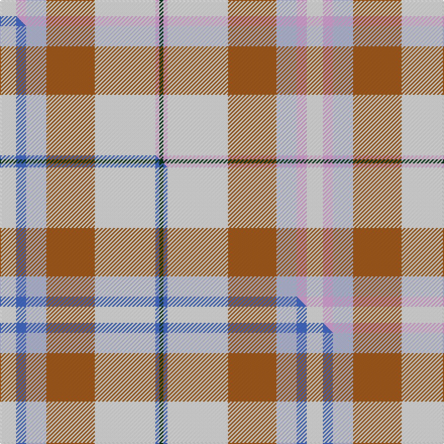

This page is one **sett** — a single exact thread-count. It belongs to the [tartan](/setts/w8lp5lb10o24w30lp2dg2/)
(the same proportion at any scale), whose colour order is pattern [GWWRWWW](/stripes/gwwrwww/).

Part of the [Shiel Magenta](/tartans/shiel-magenta/) tartan — the named design grouping this sett with its other cloths.

Sourced from tartans-authority.  It is a [7 stripe tartan](/stripes/stripes7/).

Original link https://www.tartanregister.gov.uk/tartanDetails.aspx?ref=7580

Dataset <small>— provenance for this record, inherited from the source manifest</small>

<dl class="dataset-prov">
<dt>source</dt><dd><a href="/sources/tartans-authority/">Scottish Tartans Authority</a></dd>
<dt>data captured from</dt><dd><a href="https://github.com/thetartan/tartan-database/blob/master/data/tartans-authority/data.csv">https://github.com/thetartan/tartan-database/blob/master/data/tartans-authority/data.csv</a></dd>
<dt>data date</dt><dd>March 2008 <small>(this record)</small></dd>
<dt>licence</dt><dd><a href="https://creativecommons.org/licenses/by-nc-nd/4.0/">CC BY-NC-ND 4.0</a></dd>
</dl>

Capture chain <small>— the hands this data passed through, oldest first; each capture carries its own licence</small>

<ol class="capture-chain">
<li><a href="https://www.tartansauthority.com/">Scottish Tartans Authority</a> <small>the heritage body's archive — its tartan-ferret record browser is retired (links repaired to the SRT, above)</small></li>
<li><a href="https://github.com/thetartan/tartan-database">thetartan/tartan-database</a> <small>2016-2017</small> · <a href="https://creativecommons.org/licenses/by-nc-nd/4.0/">CC BY-NC-ND 4.0</a> <small>Levko Kravets's frozen compilation — the capture we vendored, and where its CC licence text came from</small></li>
<li>this dictionary <small>captured 2026-06-10 · commit 5bf86c7566</small> <small>each re-capture is a git commit to data/sources</small></li>
</ol>

## Register references

External register numbers recorded for this tartan.

- Scottish Tartans Authority (ITI): 7580

## Thread count
W/16 LP10 LB20 O48 W60 LP4 DG/4

One full sett is **304 threads**.

## Palette
<table><thead><tr><th>Colour</th><th>Shade</th><th>OKLCh</th></tr></thead><tbody><tr><td>LB</td><td><code style="background-color:#B5BBDE;">#B5BBDE</code> <small style="color:#888">#B5BBDE</small></td><td><small style="color:#888">oklch(79.9% 0.050 277.6)</small></td></tr><tr><td>LP</td><td><code style="background-color:#E4A6DB;">#E4A6DB</code> <small style="color:#888">#E4A6DB</small></td><td><small style="color:#888">oklch(80.0% 0.100 331.6)</small></td></tr><tr><td>DG</td><td><code style="background-color:#053819;">#053819</code> <small style="color:#888">#053819</small></td><td><small style="color:#888">oklch(30.0% 0.075 151.3)</small></td></tr><tr><td>O</td><td><code style="background-color:#A65C11;">#A65C11</code> <small style="color:#888">#A65C11</small></td><td><small style="color:#888">oklch(55.0% 0.125 58.3)</small></td></tr><tr><td>W</td><td><code style="background-color:#F7F7F7;">#F7F7F7</code> <small style="color:#888">#F7F7F7</small></td><td><small style="color:#888">oklch(97.6% 0.000 89.9)</small></td></tr></tbody></table>

# Sample pattern

## Compared to the master

This cloth is one sett of its design; the master sett (the exemplar the design is anchored on) is below for comparison.

Its **ΔTartan distance** from the master is **0.90** — the same measure the nearest-tartans table ranks by (0 is identical; a re-scale of the same cloth is near 0, a recolour or a different proportion further).

<figure class="master-compare" style="margin:0">

this sett
master sett ★

<figcaption style="color:#888;font-size:smaller">One weave of this sett against the <a href="/setts/w8b5lb10o24w30b2dg2/">master sett ★</a>, split on the diagonal: a shared proportion runs seamlessly across it with only the shades shifting; a different proportion breaks on it.</figcaption>
</figure>

## Nearest tartan variants

The nearest existing variants by ΔTartan distance, with this cloth at the top so the swatches line up against it.

ΔTartan

Threads

Variant

Sett

—

304

<a href="/variants/s7/w8lp5lb10o24w30lp2dg2~x2/">Shiel, Magenta (Dance)</a>

<a href="/ttd/edit/#slug=w8b5lb10o24w30b2dg2~x2&amp;base=w8lp5lb10o24w30lp2dg2~x2" title="compare in the TTD">0.90</a>

304

<a href="/variants/s7/w8b5lb10o24w30b2dg2~x2/">Shiel Magenta</a>

<a href="/ttd/edit/#slug=w8g5lb10dp24w30g2lp2~x2&amp;base=w8lp5lb10o24w30lp2dg2~x2" title="compare in the TTD">2.36</a>

304

<a href="/variants/s7/w8g5lb10dp24w30g2lp2~x2/">Shiel, Purple (Dance)</a>

<a href="/ttd/edit/#slug=w8g5dp10lb24w30g2lp2~x2&amp;base=w8lp5lb10o24w30lp2dg2~x2" title="compare in the TTD">2.64</a>

304

<a href="/variants/s7/w8g5dp10lb24w30g2lp2~x2/">Shiel, Purple V2 (Dance)</a>

<a href="/ttd/edit/#slug=w8dr5dp10r24w30dr2db2~x2&amp;base=w8lp5lb10o24w30lp2dg2~x2" title="compare in the TTD">2.91</a>

304

<a href="/variants/s7/w8dr5dp10r24w30dr2db2~x2/">Shiel, Claret (Dance)</a>

<a href="/ttd/edit/#slug=w8ly3w22n22dr3r2w4~x2&amp;base=w8lp5lb10o24w30lp2dg2~x2" title="compare in the TTD">3.05</a>

232

<a href="/variants/s7/w8ly3w22n22dr3r2w4~x2/">Banff, White (Fashion)</a>

<a href="/ttd/edit/#slug=r1w12g6r8lb3y1~x4&amp;base=w8lp5lb10o24w30lp2dg2~x2" title="compare in the TTD">3.11</a>

240

<a href="/variants/s6/r1w12g6r8lb3y1~x4/">MacLean, dress</a>

<a href="/ttd/edit/#slug=y15r9lb30w3db4~x2&amp;base=w8lp5lb10o24w30lp2dg2~x2" title="compare in the TTD">3.19</a>

206

<a href="/variants/s5/y15r9lb30w3db4~x2/">S.I.D.E. (Corporate)</a>

<a href="/ttd/edit/#slug=w40dp5w6ly26n13w9dy3~x2~ly3307090-dy1603076&amp;base=w8lp5lb10o24w30lp2dg2~x2" title="compare in the TTD">3.24</a>

322

<a href="/variants/s7/w40dp5w6ly26n13w9dy3~x2~ly3307090-dy1603076/">de Meuron Dress (Family)</a>

<a href="/ttd/edit/#slug=w8lb30g5w3db8r5&amp;base=w8lp5lb10o24w30lp2dg2~x2" title="compare in the TTD">3.29</a>

105

<a href="/variants/s6/w8lb30g5w3db8r5/">Roseberry</a>

<a href="/ttd/edit/#slug=db4w1db2w18g3w1r9y4~x4&amp;base=w8lp5lb10o24w30lp2dg2~x2" title="compare in the TTD">3.36</a>

304

<a href="/variants/s8/db4w1db2w18g3w1r9y4~x4/">Manitoba Dress (1958) (District)</a>

## Neighbour map

Every grey dot is one of 13620 variants placed by the first two principal components of the ΔTartan feature space (42% of its variance). Red is this tartan; blue dots are its nearest — click one to open its page.

<svg viewBox="0 0 640 380" role="img" style="max-width:100%;height:auto;border:1px solid #e0e0e0;border-radius:4px;display:block" xmlns="http://www.w3.org/2000/svg"><image href="/nn/cloud.v1.png" width="640" height="380"/><a href="/variants/s7/w8b5lb10o24w30b2dg2~x2/"><circle cx="252.5" cy="183.1" r="4" fill="#3465a4"><title>Shiel Magenta</title></circle></a><a href="/variants/s7/w8g5lb10dp24w30g2lp2~x2/"><circle cx="241.3" cy="185.3" r="4" fill="#3465a4"><title>Shiel, Purple (Dance)</title></circle></a><a href="/variants/s7/w8g5dp10lb24w30g2lp2~x2/"><circle cx="263.3" cy="194.0" r="4" fill="#3465a4"><title>Shiel, Purple V2 (Dance)</title></circle></a><a href="/variants/s7/w8dr5dp10r24w30dr2db2~x2/"><circle cx="219.7" cy="161.6" r="4" fill="#3465a4"><title>Shiel, Claret (Dance)</title></circle></a><a href="/variants/s7/w8ly3w22n22dr3r2w4~x2/"><circle cx="266.1" cy="182.0" r="4" fill="#3465a4"><title>Banff, White (Fashion)</title></circle></a><a href="/variants/s6/r1w12g6r8lb3y1~x4/"><circle cx="183.5" cy="198.5" r="4" fill="#3465a4"><title>MacLean, dress</title></circle></a><a href="/variants/s5/y15r9lb30w3db4~x2/"><circle cx="260.4" cy="214.6" r="4" fill="#3465a4"><title>S.I.D.E. (Corporate)</title></circle></a><a href="/variants/s7/w40dp5w6ly26n13w9dy3~x2~ly3307090-dy1603076/"><circle cx="301.6" cy="202.5" r="4" fill="#3465a4"><title>de Meuron Dress (Family)</title></circle></a><a href="/variants/s6/w8lb30g5w3db8r5/"><circle cx="246.8" cy="195.0" r="4" fill="#3465a4"><title>Roseberry</title></circle></a><a href="/variants/s8/db4w1db2w18g3w1r9y4~x4/"><circle cx="220.0" cy="142.6" r="4" fill="#3465a4"><title>Manitoba Dress (1958) (District)</title></circle></a><circle cx="266.1" cy="187.4" r="5" fill="#c00000"/><text x="320" y="376" text-anchor="middle" font-size="11" fill="#999">ground</text><text x="11" y="190" text-anchor="middle" font-size="11" fill="#999" transform="rotate(-90 11 190)">complexity</text></svg>

ID: /variants/s7/w8lp5lb10o24w30lp2dg2~x2/
