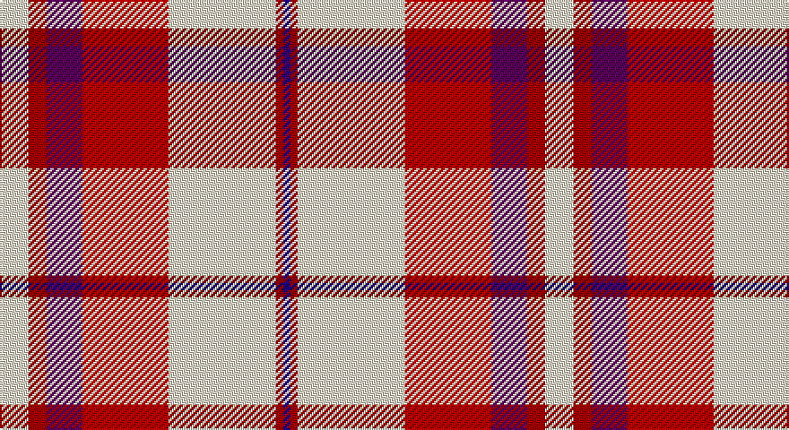

This page is one **sett** — a single exact thread-count. It belongs to the [tartan](/setts/w8ri5dp10r24w30ri2db2/)
(the same proportion at any scale), whose colour order is pattern [BRWRBRW](/stripes/brwrbrw/).

Sourced from tartans-authority.  It is a [7 stripe tartan](/stripes/stripes7/).

Original link http://www.tartansauthority.com/tartan-ferret/display/7574/

## Also known as

This cloth is also recorded under:

- Shiel, Claret

2 attestations — the source records this cloth was collapsed from (oldest owns this page)

<ul>
<li>March 2008 — Shiel, Claret (Dance) (tartans-authority, <a href="http://www.tartansauthority.com/tartan-ferret/display/7574/">record</a>)</li>
<li>undated — Shiel Claret (register-of-tartans, <a href="https://www.tartanregister.gov.uk/tartanDetails.aspx?ref=5598">record</a>)</li>
</ul>

## Register references

External register numbers recorded for this tartan.

- Scottish Register of Tartans: [5598](https://www.tartanregister.gov.uk/tartanDetails.aspx?ref=5598)
- Scottish Tartans Authority (ITI): 7574

## Thread count
W/16 DRa10 DP20 DR48 W60 DRa4 DB/4

One full sett is **304 threads**.

## Palette

Palette: <strong>Tartan Register</strong> <small style="color:#888">(3 of 5 colours)</small>
<table><thead><tr><th>Colour</th><th>Threads</th><th>Shade</th><th>Base</th><th>OKLCh</th></tr></thead><tbody><tr><td>W/</td><td style="text-align:right;font-variant-numeric:tabular-nums">16</td><td><code style="background-color:#F0E0C8;">#F0E0C8</code> <small style="color:#888">#F0E0C8</small></td><td>W <code style="background-color:#F7F7F7;">#F7F7F7</code></td><td><small style="color:#888">oklch(91.3% 0.036 78.1)</small></td></tr><tr><td>DRa</td><td style="text-align:right;font-variant-numeric:tabular-nums">10</td><td><code style="background-color:#880000;">#880000</code> <small style="color:#888">#880000</small></td><td>R <code style="background-color:#CC0000;">#CC0000</code></td><td><small style="color:#888">oklch(39.4% 0.162 29.2)</small></td></tr><tr><td>DP</td><td style="text-align:right;font-variant-numeric:tabular-nums">20</td><td><code style="background-color:#500050;">#500050</code> <small style="color:#888">#500050</small></td><td>B <code style="background-color:#2A418A;">#2A418A</code></td><td><small style="color:#888">oklch(30.3% 0.139 328.4)</small></td></tr><tr><td>DR</td><td style="text-align:right;font-variant-numeric:tabular-nums">48</td><td><code style="background-color:#A40000;">#A40000</code> <small style="color:#888">#A40000</small></td><td>R <code style="background-color:#CC0000;">#CC0000</code></td><td><small style="color:#888">oklch(45.1% 0.185 29.2)</small></td></tr><tr><td>W</td><td style="text-align:right;font-variant-numeric:tabular-nums">60</td><td><code style="background-color:#F0E0C8;">#F0E0C8</code> <small style="color:#888">#F0E0C8</small></td><td>W <code style="background-color:#F7F7F7;">#F7F7F7</code></td><td><small style="color:#888">oklch(91.3% 0.036 78.1)</small></td></tr><tr><td>DRa</td><td style="text-align:right;font-variant-numeric:tabular-nums">4</td><td><code style="background-color:#880000;">#880000</code> <small style="color:#888">#880000</small></td><td>R <code style="background-color:#CC0000;">#CC0000</code></td><td><small style="color:#888">oklch(39.4% 0.162 29.2)</small></td></tr><tr><td>DB/</td><td style="text-align:right;font-variant-numeric:tabular-nums">4</td><td><code style="background-color:#1C0070;">#1C0070</code> <small style="color:#888">#1C0070</small></td><td>B <code style="background-color:#2A418A;">#2A418A</code></td><td><small style="color:#888">oklch(26.3% 0.162 277.1)</small></td></tr></tbody></table>

# Sample pattern

## Nearest tartans

The nearest existing variants by ΔTartan distance, with this tartan at the top so the swatches line up against it.

ΔTartan

Tartan

Sett

—

<a href="/ttd/edit/#slug=w8ri5dp10r24w30ri2db2~x2">Shiel, Claret (Dance)</a> <a class="nn-out" href="/variants/s7/w8ri5dp10r24w30ri2db2~x2/" title="open its dictionary page">↗</a>

0.79

<a href="/ttd/edit/#slug=r8p2r24db5w26o2w8~x2&amp;base=w8ri5dp10r24w30ri2db2~x2">Lennox, dress</a> <a class="nn-out" href="/variants/s7/r8p2r24db5w26o2w8~x2/" title="open its dictionary page">↗</a>

0.82

<a href="/ttd/edit/#slug=ri15r1lg3k1w11ri3lg3r3w1~x4&amp;base=w8ri5dp10r24w30ri2db2~x2">Etive, Burgundy (Dance)</a> <a class="nn-out" href="/variants/s9/ri15r1lg3k1w11ri3lg3r3w1~x4/" title="open its dictionary page">↗</a>

0.91

<a href="/ttd/edit/#slug=r8dp2r24db5w26dy2w8~x2&amp;base=w8ri5dp10r24w30ri2db2~x2">Lennox Dress</a> <a class="nn-out" href="/variants/s7/r8dp2r24db5w26dy2w8~x2/" title="open its dictionary page">↗</a>

1.15

<a href="/ttd/edit/#slug=db3w12k11r4w2r2w2r24ly3~x2&amp;base=w8ri5dp10r24w30ri2db2~x2">Hearts Football Club (Corporate)</a> <a class="nn-out" href="/variants/s9/db3w12k11r4w2r2w2r24ly3~x2/" title="open its dictionary page">↗</a>

1.16

<a href="/ttd/edit/#slug=r32db6k6g6w18k3&amp;base=w8ri5dp10r24w30ri2db2~x2">Rose, White dress</a> <a class="nn-out" href="/variants/s6/r32db6k6g6w18k3/" title="open its dictionary page">↗</a>

1.18

<a href="/ttd/edit/#slug=r41ly3y7db3w24r10y7db7w3~x2&amp;base=w8ri5dp10r24w30ri2db2~x2">Drummond of Perth Dress #2</a> <a class="nn-out" href="/variants/s9/r41ly3y7db3w24r10y7db7w3~x2/" title="open its dictionary page">↗</a>

1.26

<a href="/ttd/edit/#slug=r23w2r3p4r3w2r5k11ri2w23k3~x2&amp;base=w8ri5dp10r24w30ri2db2~x2">MacKellar Dress Red Fashion Tartan</a> <a class="nn-out" href="/variants/s11/r23w2r3p4r3w2r5k11ri2w23k3~x2/" title="open its dictionary page">↗</a>

1.26

<a href="/ttd/edit/#slug=r8p2r24p5w25o2w8~x2&amp;base=w8ri5dp10r24w30ri2db2~x2">Lennox, dress</a> <a class="nn-out" href="/variants/s7/r8p2r24p5w25o2w8~x2/" title="open its dictionary page">↗</a>

1.26

<a href="/ttd/edit/#slug=r24n4k4g4w13k2~x4&amp;base=w8ri5dp10r24w30ri2db2~x2">Rose White Dress</a> <a class="nn-out" href="/variants/s6/r24n4k4g4w13k2~x4/" title="open its dictionary page">↗</a>

1.29

<a href="/ttd/edit/#slug=r6lb3r37k16lb16g4~x2&amp;base=w8ri5dp10r24w30ri2db2~x2">Nesbit, Rose</a> <a class="nn-out" href="/variants/s6/r6lb3r37k16lb16g4~x2/" title="open its dictionary page">↗</a>

## Neighbour map

Every grey dot is one of 14360 variants placed by the first two principal components of the ΔTartan feature space (44% of its variance). Red is this tartan; blue dots are its nearest — click one to open its page.

<svg viewBox="0 0 640 380" role="img" style="max-width:100%;height:auto;border:1px solid #e0e0e0;border-radius:4px;display:block" xmlns="http://www.w3.org/2000/svg"><image href="/nn/cloud.v1.png" width="640" height="380"/><a href="/variants/s7/r8p2r24db5w26o2w8~x2/"><circle cx="231.6" cy="142.0" r="4" fill="#3465a4"><title>Lennox, dress</title></circle></a><a href="/variants/s9/ri15r1lg3k1w11ri3lg3r3w1~x4/"><circle cx="203.9" cy="115.5" r="4" fill="#3465a4"><title>Etive, Burgundy (Dance)</title></circle></a><a href="/variants/s7/r8dp2r24db5w26dy2w8~x2/"><circle cx="232.8" cy="140.5" r="4" fill="#3465a4"><title>Lennox Dress</title></circle></a><a href="/variants/s9/db3w12k11r4w2r2w2r24ly3~x2/"><circle cx="211.2" cy="126.1" r="4" fill="#3465a4"><title>Hearts Football Club (Corporate)</title></circle></a><a href="/variants/s6/r32db6k6g6w18k3/"><circle cx="179.3" cy="155.8" r="4" fill="#3465a4"><title>Rose, White dress</title></circle></a><a href="/variants/s9/r41ly3y7db3w24r10y7db7w3~x2/"><circle cx="243.9" cy="122.5" r="4" fill="#3465a4"><title>Drummond of Perth Dress #2</title></circle></a><a href="/variants/s11/r23w2r3p4r3w2r5k11ri2w23k3~x2/"><circle cx="186.5" cy="110.9" r="4" fill="#3465a4"><title>MacKellar Dress Red Fashion Tartan</title></circle></a><a href="/variants/s7/r8p2r24p5w25o2w8~x2/"><circle cx="248.5" cy="159.2" r="4" fill="#3465a4"><title>Lennox, dress</title></circle></a><a href="/variants/s6/r24n4k4g4w13k2~x4/"><circle cx="201.2" cy="152.3" r="4" fill="#3465a4"><title>Rose White Dress</title></circle></a><a href="/variants/s6/r6lb3r37k16lb16g4~x2/"><circle cx="265.6" cy="172.9" r="4" fill="#3465a4"><title>Nesbit, Rose</title></circle></a><circle cx="210.3" cy="131.7" r="5" fill="#c00000"/></svg>

ID: /variants/s7/w8ri5dp10r24w30ri2db2~x2/
