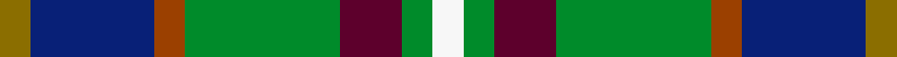

This is one **variant** — a specific cloth: this exact thread count and colourway, with its own
provenance below. It is one weaving of the [sett](/setts/y1db4o1g5dr2g1w1/) (the scale-free proportion — the
same cloth at any scale or shade), whose colour order is pattern [GBRGBGW](/stripes/gbrgbgw/).

Part of the [Deeside District](/tartans/d/de/deeside-district/) tartan — the named design grouping this sett with its other cloths.

Sourced from weddslist.  It is a [7 stripe tartan](/stripes/stripes7/).

Original link [http://www.weddslist.com/cgi-bin/tartans/pg.pl?source=rb](http://www.weddslist.com/cgi-bin/tartans/pg.pl?source=rb)

Dataset <small>— provenance for this record, inherited from the source manifest</small>

<dl class="dataset-prov">
<dt>source</dt><dd><a href="/sources/weddslist/">Weddslist</a></dd>
<dt>data captured from</dt><dd><a href="https://github.com/thetartan/tartan-database/blob/master/data/weddslist/data.csv">https://github.com/thetartan/tartan-database/blob/master/data/weddslist/data.csv</a></dd>
<dt>data date</dt><dd>2016-11-17 <small>(dataset default)</small></dd>
<dt>licence</dt><dd><a href="https://creativecommons.org/licenses/by-nc-nd/4.0/">CC BY-NC-ND 4.0</a></dd>
</dl>

Capture chain <small>— the hands this data passed through, oldest first; each capture carries its own licence</small>

<ol class="capture-chain">
<li><a href="https://www.weddslist.com/tartans/">Weddslist</a> <small>the living privately compiled reference</small></li>
<li><a href="https://github.com/thetartan/tartan-database">thetartan/tartan-database</a> <small>2016-2017</small> · <a href="https://creativecommons.org/licenses/by-nc-nd/4.0/">CC BY-NC-ND 4.0</a> <small>Levko Kravets's frozen compilation — the capture we vendored, and where its CC licence text came from</small></li>
<li>this dictionary <small>captured 2026-06-10 · commit 5bf86c7566</small> <small>each re-capture is a git commit to data/sources</small></li>
</ol>

## Thread count
Y/2 DB8 O2 G10 DR4 G2 W/2

One full sett is **56 threads**.

## Palette
<table><thead><tr><th>Colour</th><th>Shade</th><th>OKLCh</th></tr></thead><tbody><tr><td>DB</td><td><code style="background-color:#082077;">#082077</code> <small style="color:#888">#082077</small></td><td><small style="color:#888">oklch(30.0% 0.149 265.1)</small></td></tr><tr><td>DR</td><td><code style="background-color:#5D002C;">#5D002C</code> <small style="color:#888">#5D002C</small></td><td><small style="color:#888">oklch(30.9% 0.125 1.3)</small></td></tr><tr><td>G</td><td><code style="background-color:#008B2A;">#008B2A</code> <small style="color:#888">#008B2A</small></td><td><small style="color:#888">oklch(55.4% 0.170 145.9)</small></td></tr><tr><td>O</td><td><code style="background-color:#9B4000;">#9B4000</code> <small style="color:#888">#9B4000</small></td><td><small style="color:#888">oklch(48.7% 0.137 46.2)</small></td></tr><tr><td>Y</td><td><code style="background-color:#8B6E00;">#8B6E00</code> <small style="color:#888">#8B6E00</small></td><td><small style="color:#888">oklch(55.1% 0.113 90.4)</small></td></tr><tr><td>W</td><td><code style="background-color:#F7F7F7;">#F7F7F7</code> <small style="color:#888">#F7F7F7</small></td><td><small style="color:#888">oklch(97.6% 0.000 89.9)</small></td></tr></tbody></table>

# Sample pattern

## Nearest tartan variants

The nearest existing variants by ΔTartan distance, with this cloth at the top so the swatches line up against it.

ΔTartan

Threads

Variant

Sett

—

56

<a href="/variants/s7/y1db4o1g5dr2g1w1~x2~o1905046-dr1205000/">Deeside District</a>

<a href="/ttd/edit/#slug=g16lb3g3k10db12dr2k3~x2&amp;base=y1db4o1g5dr2g1w1~x2~o1905046-dr1205000" title="compare in the TTD">1.70</a>

158

<a href="/variants/s7/g16lb3g3k10db12dr2k3~x2/">MacLean, Donald Personal Tartan</a>

<a href="/ttd/edit/#slug=g5db3lb3g5w4dy2lb1dy2db1r1~x6&amp;base=y1db4o1g5dr2g1w1~x2~o1905046-dr1205000" title="compare in the TTD">2.17</a>

288

<a href="/variants/s10/g5db3lb3g5w4dy2lb1dy2db1r1~x6/">Northern College (Corporate)</a>

<a href="/ttd/edit/#slug=g5db3lb3g5w4dy2lb1dy2db1r1~x6~g2203152&amp;base=y1db4o1g5dr2g1w1~x2~o1905046-dr1205000" title="compare in the TTD">2.17</a>

288

<a href="/variants/s10/g5db3lb3g5w4dy2lb1dy2db1r1~x6~g2203152/">Northern College (Ontario)</a>

<a href="/ttd/edit/#slug=g1lr1g6db5dg6r1dg1lo1~x4&amp;base=y1db4o1g5dr2g1w1~x2~o1905046-dr1205000" title="compare in the TTD">2.35</a>

168

<a href="/variants/s8/g1lr1g6db5dg6r1dg1lo1~x4/">Vermont</a>

<a href="/ttd/edit/#slug=db30r3w10g14r3o30~x2&amp;base=y1db4o1g5dr2g1w1~x2~o1905046-dr1205000" title="compare in the TTD">2.36</a>

240

<a href="/variants/s6/db30r3w10g14r3o30~x2/">Cercle de Fermières Varennes</a>

<a href="/ttd/edit/#slug=db34w5db5r5db5do26g33o6~x2&amp;base=y1db4o1g5dr2g1w1~x2~o1905046-dr1205000" title="compare in the TTD">2.39</a>

396

<a href="/variants/s8/db34w5db5r5db5do26g33o6~x2/">Blairmore</a>

<a href="/ttd/edit/#slug=k3ly3db20dg25lb18w3~x2&amp;base=y1db4o1g5dr2g1w1~x2~o1905046-dr1205000" title="compare in the TTD">2.52</a>

276

<a href="/variants/s6/k3ly3db20dg25lb18w3~x2/">Porteous (Clan)</a>

<a href="/ttd/edit/#slug=k3y3db20g25lb18w3~x2&amp;base=y1db4o1g5dr2g1w1~x2~o1905046-dr1205000" title="compare in the TTD">2.53</a>

276

<a href="/variants/s6/k3y3db20g25lb18w3~x2/">Porteous</a>

<a href="/ttd/edit/#slug=r1dy7db3g1n3g1db3g7w1~x4&amp;base=y1db4o1g5dr2g1w1~x2~o1905046-dr1205000" title="compare in the TTD">2.53</a>

208

<a href="/variants/s9/r1dy7db3g1n3g1db3g7w1~x4/">Adamson (Personal)</a>

<a href="/ttd/edit/#slug=dy19g23y3db15r11w5~x2&amp;base=y1db4o1g5dr2g1w1~x2~o1905046-dr1205000" title="compare in the TTD">2.54</a>

256

<a href="/variants/s6/dy19g23y3db15r11w5~x2/">Mekos, The</a>

## Neighbour map

Every grey dot is one of 13621 variants placed by the first two principal components of the ΔTartan feature space (42% of its variance). Red is this tartan; blue dots are its nearest — click one to open its page.

<svg viewBox="0 0 640 380" role="img" style="max-width:100%;height:auto;border:1px solid #e0e0e0;border-radius:4px;display:block" xmlns="http://www.w3.org/2000/svg"><image href="/nn/cloud.v1.png" width="640" height="380"/><a href="/variants/s7/g16lb3g3k10db12dr2k3~x2/"><circle cx="100.7" cy="183.2" r="4" fill="#3465a4"><title>MacLean, Donald Personal Tartan</title></circle></a><a href="/variants/s10/g5db3lb3g5w4dy2lb1dy2db1r1~x6/"><circle cx="70.3" cy="223.8" r="4" fill="#3465a4"><title>Northern College (Corporate)</title></circle></a><a href="/variants/s10/g5db3lb3g5w4dy2lb1dy2db1r1~x6~g2203152/"><circle cx="78.8" cy="224.1" r="4" fill="#3465a4"><title>Northern College (Ontario)</title></circle></a><a href="/variants/s8/g1lr1g6db5dg6r1dg1lo1~x4/"><circle cx="131.0" cy="208.2" r="4" fill="#3465a4"><title>Vermont</title></circle></a><a href="/variants/s6/db30r3w10g14r3o30~x2/"><circle cx="147.6" cy="205.4" r="4" fill="#3465a4"><title>Cercle de Fermières Varennes</title></circle></a><a href="/variants/s8/db34w5db5r5db5do26g33o6~x2/"><circle cx="150.8" cy="196.0" r="4" fill="#3465a4"><title>Blairmore</title></circle></a><a href="/variants/s6/k3ly3db20dg25lb18w3~x2/"><circle cx="105.6" cy="188.6" r="4" fill="#3465a4"><title>Porteous (Clan)</title></circle></a><a href="/variants/s6/k3y3db20g25lb18w3~x2/"><circle cx="102.4" cy="189.1" r="4" fill="#3465a4"><title>Porteous</title></circle></a><a href="/variants/s9/r1dy7db3g1n3g1db3g7w1~x4/"><circle cx="135.9" cy="204.8" r="4" fill="#3465a4"><title>Adamson (Personal)</title></circle></a><a href="/variants/s6/dy19g23y3db15r11w5~x2/"><circle cx="96.6" cy="231.2" r="4" fill="#3465a4"><title>Mekos, The</title></circle></a><circle cx="133.8" cy="222.3" r="5" fill="#c00000"/><text x="320" y="376" text-anchor="middle" font-size="11" fill="#999">ground</text><text x="11" y="190" text-anchor="middle" font-size="11" fill="#999" transform="rotate(-90 11 190)">complexity</text></svg>

ID: /variants/s7/y1db4o1g5dr2g1w1~x2~o1905046-dr1205000/
