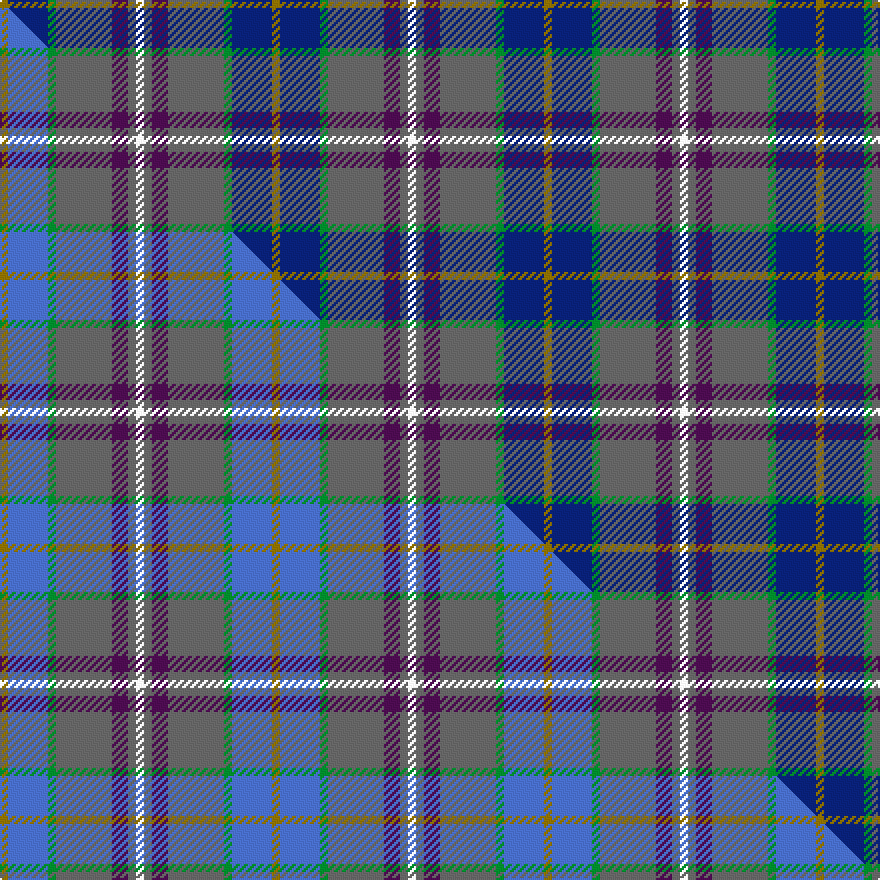

This is one **variant** — a specific cloth: this exact thread count and colourway, with its own
provenance below. It is one weaving of the [sett](/setts/y1db5g1n7dp2n1w1/) (the scale-free proportion — the
same cloth at any scale or shade), whose colour order is pattern [GBGBBBW](/stripes/gbgbbbw/).

Part of the [Deeside](/tartans/d/de/deeside/) tartan — the named design grouping this sett with its other cloths.

Sourced from house-of-tartan.  It is a [7 stripe tartan](/stripes/stripes7/).

Original link [http://www.house-of-tartan.scotland.net/house/TartanViewjs.asp?colr=Def&tnam=1833](http://www.house-of-tartan.scotland.net/house/TartanViewjs.asp?colr=Def&tnam=1833)

## Provenance

Earliest known date: 1963 The name Deas is described as an 'alias' for Davidson in historic records, and is a recognised sept of Clan Dhai (Davidson).

Dataset <small>— provenance for this record, inherited from the source manifest</small>

<dl class="dataset-prov">
<dt>source</dt><dd><a href="/sources/house-of-tartan/">House of Tartan</a></dd>
<dt>data captured from</dt><dd><a href="https://github.com/thetartan/tartan-database/blob/master/data/house-of-tartan/data.csv">https://github.com/thetartan/tartan-database/blob/master/data/house-of-tartan/data.csv</a></dd>
<dt>data date</dt><dd>1963 <small>(this record)</small></dd>
<dt>licence</dt><dd><a href="https://creativecommons.org/licenses/by-nc-nd/4.0/">CC BY-NC-ND 4.0</a></dd>
</dl>

Capture chain <small>— the hands this data passed through, oldest first; each capture carries its own licence</small>

<ol class="capture-chain">
<li><a href="http://www.house-of-tartan.scotland.net/">House of Tartan</a> <small>the weaver/retailer's database — the site is now offline; the URL is kept as the ultimate source's identity</small></li>
<li><a href="https://github.com/thetartan/tartan-database">thetartan/tartan-database</a> <small>2016-2017</small> · <a href="https://creativecommons.org/licenses/by-nc-nd/4.0/">CC BY-NC-ND 4.0</a> <small>Levko Kravets's frozen compilation — the capture we vendored, and where its CC licence text came from</small></li>
<li>this dictionary <small>captured 2026-06-10 · commit 5bf86c7566</small> <small>each re-capture is a git commit to data/sources</small></li>
</ol>

## Thread count
Y/4 DB20 G4 N28 DP8 N4 W/4

One full sett is **136 threads**.

## Palette
<table><thead><tr><th>Colour</th><th>Shade</th><th>OKLCh</th></tr></thead><tbody><tr><td>DB</td><td><code style="background-color:#082077;">#082077</code> <small style="color:#888">#082077</small></td><td><small style="color:#888">oklch(30.0% 0.149 265.1)</small></td></tr><tr><td>G</td><td><code style="background-color:#008B2A;">#008B2A</code> <small style="color:#888">#008B2A</small></td><td><small style="color:#888">oklch(55.4% 0.170 145.9)</small></td></tr><tr><td>W</td><td><code style="background-color:#F7F7F7;">#F7F7F7</code> <small style="color:#888">#F7F7F7</small></td><td><small style="color:#888">oklch(97.6% 0.000 89.9)</small></td></tr><tr><td>N</td><td><code style="background-color:#636363;">#636363</code> <small style="color:#888">#636363</small></td><td><small style="color:#888">oklch(50.0% 0.000 89.9)</small></td></tr><tr><td>DP</td><td><code style="background-color:#4B0B4F;">#4B0B4F</code> <small style="color:#888">#4B0B4F</small></td><td><small style="color:#888">oklch(30.1% 0.125 325.4)</small></td></tr><tr><td>Y</td><td><code style="background-color:#8B6E00;">#8B6E00</code> <small style="color:#888">#8B6E00</small></td><td><small style="color:#888">oklch(55.1% 0.113 90.4)</small></td></tr></tbody></table>

# Sample pattern

## Compared to the master

This cloth is one sett of its design; the master sett (the exemplar the design is anchored on) is below for comparison.

Its **ΔTartan distance** from the master is **0.13** — the same measure the nearest-tartans table ranks by (0 is identical; a re-scale of the same cloth is near 0, a recolour or a different proportion further).

<figure class="master-compare" style="margin:0">

this sett
master sett ★

<figcaption style="color:#888;font-size:smaller">One weave of this sett against the <a href="/setts/y1b5g1n7dp2n1w1/">master sett ★</a>, split on the diagonal: a shared proportion runs seamlessly across it with only the shades shifting; a different proportion breaks on it.</figcaption>
</figure>

## Nearest tartan variants

The nearest existing variants by ΔTartan distance, with this cloth at the top so the swatches line up against it.

ΔTartan

Threads

Variant

Sett

—

136

<a href="/variants/s7/y1db5g1n7dp2n1w1~x4/">Deeside District Tartan</a>

<a href="/ttd/edit/#slug=y1b5g1n7dp2n1w1~x4&amp;base=y1db5g1n7dp2n1w1~x4" title="compare in the TTD">0.13</a>

136

<a href="/variants/s7/y1b5g1n7dp2n1w1~x4/">Deeside</a>

<a href="/ttd/edit/#slug=y4b22g4n24dp6n4w3~x2&amp;base=y1db5g1n7dp2n1w1~x4" title="compare in the TTD">0.45</a>

254

<a href="/variants/s7/y4b22g4n24dp6n4w3~x2/">Deeside Plaid (Taobh Dhi) (District)</a>

<a href="/ttd/edit/#slug=n12g4dp4g4n31dt3db12w4~x2&amp;base=y1db5g1n7dp2n1w1~x4" title="compare in the TTD">1.70</a>

264

<a href="/variants/s8/n12g4dp4g4n31dt3db12w4~x2/">Yes Scotland (Fashion)</a>

<a href="/ttd/edit/#slug=r15dt8g25dt72n98lb15~dt0900000&amp;base=y1db5g1n7dp2n1w1~x4" title="compare in the TTD">1.89</a>

436

<a href="/variants/s6/r15dt8g25dt72n98lb15~dt0900000/">Afternoon Tea / Black Tea</a>

<a href="/ttd/edit/#slug=b1dr5dg4db1g1db1g1db6w1~x4&amp;base=y1db5g1n7dp2n1w1~x4" title="compare in the TTD">2.42</a>

160

<a href="/variants/s9/b1dr5dg4db1g1db1g1db6w1~x4/">McLion</a>

<a href="/ttd/edit/#slug=db5t43db18w4t6dr5dy25ly5~x2&amp;base=y1db5g1n7dp2n1w1~x4" title="compare in the TTD">2.52</a>

424

<a href="/variants/s8/db5t43db18w4t6dr5dy25ly5~x2/">State Seal of Iowa (Fashion)</a>

<a href="/ttd/edit/#slug=g3dg12dpi6gi3dp15ly2dp2~x2~g2203152-dpi1607327-gi2405139-dp1105325&amp;base=y1db5g1n7dp2n1w1~x4" title="compare in the TTD">2.56</a>

162

<a href="/variants/s7/g3dg12dpi6gi3dp15ly2dp2~x2~g2203152-dpi1607327-gi2405139-dp1105325/">Myres Castle (Corporate)</a>

<a href="/ttd/edit/#slug=w5t32n5g6n5dr16n39ly5~x2&amp;base=y1db5g1n7dp2n1w1~x4" title="compare in the TTD">2.58</a>

432

<a href="/variants/s8/w5t32n5g6n5dr16n39ly5~x2/">Washington DC (Fashion)</a>

<a href="/ttd/edit/#slug=w1dbi6g1dbi1g1dbi1db4dr5lo1~x4~dbi1406275-db1106275&amp;base=y1db5g1n7dp2n1w1~x4" title="compare in the TTD">2.73</a>

160

<a href="/variants/s9/w1dbi6g1dbi1g1dbi1db4dr5lo1~x4~dbi1406275-db1106275/">McLion (Corporate)</a>

<a href="/ttd/edit/#slug=dg5g2b2k15dr2lb2dg5dr2~x4~b2105244-k0705267&amp;base=y1db5g1n7dp2n1w1~x4" title="compare in the TTD">2.77</a>

252

<a href="/variants/s8/dg5g2t2db15dr2lb2dg5dr2~x4~t2105244-db0705267/">Remember the Somme 1916</a>

## Neighbour map

Every grey dot is one of 13656 variants placed by the first two principal components of the ΔTartan feature space (42% of its variance). Red is this tartan; blue dots are its nearest — click one to open its page. The map is a flat projection of a many-dimensional space — [how to read it](/posts/neighbourhood-maps/).

<svg viewBox="0 0 640 380" role="img" style="max-width:100%;height:auto;border:1px solid #e0e0e0;border-radius:4px;display:block" xmlns="http://www.w3.org/2000/svg"><image href="/nn/cloud.v1.png" width="640" height="380"/><a href="/variants/s7/y1b5g1n7dp2n1w1~x4/"><circle cx="274.0" cy="231.8" r="4" fill="#3465a4"><title>Deeside</title></circle></a><a href="/variants/s7/y4b22g4n24dp6n4w3~x2/"><circle cx="284.6" cy="231.3" r="4" fill="#3465a4"><title>Deeside Plaid (Taobh Dhi) (District)</title></circle></a><a href="/variants/s8/n12g4dp4g4n31dt3db12w4~x2/"><circle cx="336.8" cy="194.9" r="4" fill="#3465a4"><title>Yes Scotland (Fashion)</title></circle></a><a href="/variants/s6/r15dt8g25dt72n98lb15~dt0900000/"><circle cx="254.4" cy="203.8" r="4" fill="#3465a4"><title>Afternoon Tea / Black Tea</title></circle></a><a href="/variants/s9/b1dr5dg4db1g1db1g1db6w1~x4/"><circle cx="182.4" cy="217.4" r="4" fill="#3465a4"><title>McLion</title></circle></a><a href="/variants/s8/db5t43db18w4t6dr5dy25ly5~x2/"><circle cx="233.4" cy="190.0" r="4" fill="#3465a4"><title>State Seal of Iowa (Fashion)</title></circle></a><a href="/variants/s7/g3dg12dpi6gi3dp15ly2dp2~x2~g2203152-dpi1607327-gi2405139-dp1105325/"><circle cx="217.2" cy="220.6" r="4" fill="#3465a4"><title>Myres Castle (Corporate)</title></circle></a><a href="/variants/s8/w5t32n5g6n5dr16n39ly5~x2/"><circle cx="269.4" cy="221.1" r="4" fill="#3465a4"><title>Washington DC (Fashion)</title></circle></a><a href="/variants/s9/w1dbi6g1dbi1g1dbi1db4dr5lo1~x4~dbi1406275-db1106275/"><circle cx="174.7" cy="211.3" r="4" fill="#3465a4"><title>McLion (Corporate)</title></circle></a><a href="/variants/s8/dg5g2t2db15dr2lb2dg5dr2~x4~t2105244-db0705267/"><circle cx="229.3" cy="202.9" r="4" fill="#3465a4"><title>Remember the Somme 1916</title></circle></a><circle cx="242.0" cy="219.5" r="5" fill="#c00000"/><text x="320" y="376" text-anchor="middle" font-size="11" fill="#999">ground</text><text x="11" y="190" text-anchor="middle" font-size="11" fill="#999" transform="rotate(-90 11 190)">complexity</text></svg>

ID: /variants/s7/y1db5g1n7dp2n1w1~x4/
