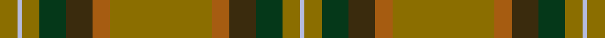

This page is one **sett** — a single exact thread-count. It belongs to the [tartan](/setts/y23o4dy6dg6y4lb1y4/)
(the same proportion at any scale), whose colour order is pattern [GWGGGRGRGGGW](/stripes/gwgggrgrgggw/).

Part of the [Tricor](/tartans/tricor/) tartan — the named design grouping this sett with its other cloths.

Sourced from register-of-tartans.  It is a [12 stripe tartan](/stripes/stripes12/).

Original link https://www.tartanregister.gov.uk/tartanDetails.aspx?ref=4151

## Register references

External register numbers recorded for this tartan.

- Scottish Register of Tartans: [4151](https://www.tartanregister.gov.uk/tartanDetails.aspx?ref=4151)
- Scottish Tartans Authority (ITI): 5823

## Thread count
Y/16 LB4 Y16 DG24 DY24 O16 Y92 O16 DY24 DG24 Y16 LB/4

One full sett is **532 threads**.

## Palette
<table><thead><tr><th>Colour</th><th>Shade</th><th>OKLCh</th></tr></thead><tbody><tr><td>DG</td><td><code style="background-color:#053819;">#053819</code> <small style="color:#888">#053819</small></td><td><small style="color:#888">oklch(30.0% 0.075 151.3)</small></td></tr><tr><td>Y</td><td><code style="background-color:#8B6E00;">#8B6E00</code> <small style="color:#888">#8B6E00</small></td><td><small style="color:#888">oklch(55.1% 0.113 90.4)</small></td></tr><tr><td>LB</td><td><code style="background-color:#B5BBDE;">#B5BBDE</code> <small style="color:#888">#B5BBDE</small></td><td><small style="color:#888">oklch(79.9% 0.050 277.6)</small></td></tr><tr><td>DY</td><td><code style="background-color:#3A2B0D;">#3A2B0D</code> <small style="color:#888">#3A2B0D</small></td><td><small style="color:#888">oklch(30.0% 0.049 82.0)</small></td></tr><tr><td>O</td><td><code style="background-color:#A65C11;">#A65C11</code> <small style="color:#888">#A65C11</small></td><td><small style="color:#888">oklch(55.0% 0.125 58.3)</small></td></tr></tbody></table>

# Sample pattern

## Nearest tartan variants

The nearest existing variants by ΔTartan distance, with this cloth at the top so the swatches line up against it.

ΔTartan

Threads

Variant

Sett

—

532

<a href="/variants/s7/y23o4dy6dg6y4lb1y4~x4/">Tricor</a>

<a href="/ttd/edit/#slug=y23o4dy6dg6y4n1y4~x4&amp;base=y23o4dy6dg6y4lb1y4~x4" title="compare in the TTD">0.30</a>

276

<a href="/variants/s7/y23o4dy6dg6y4n1y4~x4/">Tricor (Corporate)</a>

<a href="/ttd/edit/#slug=r3k1g8ly1dy7ly1g19y25k1~x2~ly3507098-dy1503057-y2104086&amp;base=y23o4dy6dg6y4lb1y4~x4" title="compare in the TTD">3.48</a>

256

<a href="/variants/s9/r3k1g8ly1dy7ly1g19y25k1~x2~ly3507098-dy1503057-y2104086/">Broons, The (DC Thomson)</a>

<a href="/ttd/edit/#slug=dr4y34do20y4do8y6r2y5do2y3dr4&amp;base=y23o4dy6dg6y4lb1y4~x4" title="compare in the TTD">3.63</a>

176

<a href="/variants/s11/dr4y34do20y4do8y6r2y5do2y3dr4/">Morgan of Wales</a>

<a href="/ttd/edit/#slug=b4dg1o21g18o2g3o2g18o21b2dg1g3b2dg1g3~x2&amp;base=y23o4dy6dg6y4lb1y4~x4" title="compare in the TTD">3.65</a>

394

<a href="/variants/s15/b4dg1o21g18o2g3o2g18o21b2dg1g3b2dg1g3~x2/">Prince David</a>

<a href="/ttd/edit/#slug=n8o4w2o4n1o12g9n24dr4~x2~n1900000-o2500000&amp;base=y23o4dy6dg6y4lb1y4~x4" title="compare in the TTD">3.65</a>

248

<a href="/variants/s9/n8o4w2o4n1o12g9n24dr4~x2~n1900000-o2500000/">Willsher Wedding (Personal)</a>

<a href="/ttd/edit/#slug=g8ly2dy4dp4g3dp4dy42g4r3g4dy4dp5r3~ly3307090-dy1603076&amp;base=y23o4dy6dg6y4lb1y4~x4" title="compare in the TTD">3.67</a>

169

<a href="/variants/s13/g8ly2dy4dp4g3dp4dy42g4r3g4dy4dp5r3~ly3307090-dy1603076/">Sarna (District)</a>

<a href="/ttd/edit/#slug=g8y2o4dp4g3dp4o42g4r3g4o4dp5r3&amp;base=y23o4dy6dg6y4lb1y4~x4" title="compare in the TTD">3.71</a>

169

<a href="/variants/s13/g8y2o4dp4g3dp4o42g4r3g4o4dp5r3/">Sarna</a>

<a href="/ttd/edit/#slug=g16o1g2o1g2o12r12o1y2o1r12o12g12o1w2~x2&amp;base=y23o4dy6dg6y4lb1y4~x4" title="compare in the TTD">3.71</a>

320

<a href="/variants/s15/g16o1g2o1g2o12r12o1y2o1r12o12g12o1w2~x2/">Prince Edward Island</a>

<a href="/ttd/edit/#slug=r4y34do20y4do8y6ri2y5do2y3r4~r1706009-ri2109032&amp;base=y23o4dy6dg6y4lb1y4~x4" title="compare in the TTD">3.73</a>

176

<a href="/variants/s11/r4y34do20y4do8y6ri2y5do2y3r4~r1706009-ri2109032/">Morgan Welsh Name Tartan</a>

<a href="/ttd/edit/#slug=r8g1r1g1r1g25dt1g1dt1g1dt25yi7y6~x2~dt1500000-yi2301120&amp;base=y23o4dy6dg6y4lb1y4~x4" title="compare in the TTD">3.83</a>

288

<a href="/variants/s13/r8g1r1g1r1g25dt1g1dt1g1dt25yi7y6~x2~dt1500000-yi2301120/">Johansson (Aneby, Sweden), Christian (Personal)</a>

## Neighbour map

Every grey dot is one of 13620 variants placed by the first two principal components of the ΔTartan feature space (42% of its variance). Red is this tartan; blue dots are its nearest — click one to open its page.

<svg viewBox="0 0 640 380" role="img" style="max-width:100%;height:auto;border:1px solid #e0e0e0;border-radius:4px;display:block" xmlns="http://www.w3.org/2000/svg"><image href="/nn/cloud.v1.png" width="640" height="380"/><a href="/variants/s7/y23o4dy6dg6y4n1y4~x4/"><circle cx="490.6" cy="194.1" r="4" fill="#3465a4"><title>Tricor (Corporate)</title></circle></a><a href="/variants/s9/r3k1g8ly1dy7ly1g19y25k1~x2~ly3507098-dy1503057-y2104086/"><circle cx="276.2" cy="130.4" r="4" fill="#3465a4"><title>Broons, The (DC Thomson)</title></circle></a><a href="/variants/s11/dr4y34do20y4do8y6r2y5do2y3dr4/"><circle cx="428.2" cy="177.4" r="4" fill="#3465a4"><title>Morgan of Wales</title></circle></a><a href="/variants/s15/b4dg1o21g18o2g3o2g18o21b2dg1g3b2dg1g3~x2/"><circle cx="391.8" cy="170.2" r="4" fill="#3465a4"><title>Prince David</title></circle></a><a href="/variants/s9/n8o4w2o4n1o12g9n24dr4~x2~n1900000-o2500000/"><circle cx="375.4" cy="191.5" r="4" fill="#3465a4"><title>Willsher Wedding (Personal)</title></circle></a><a href="/variants/s13/g8ly2dy4dp4g3dp4dy42g4r3g4dy4dp5r3~ly3307090-dy1603076/"><circle cx="383.1" cy="123.7" r="4" fill="#3465a4"><title>Sarna (District)</title></circle></a><a href="/variants/s13/g8y2o4dp4g3dp4o42g4r3g4o4dp5r3/"><circle cx="393.0" cy="124.8" r="4" fill="#3465a4"><title>Sarna</title></circle></a><a href="/variants/s15/g16o1g2o1g2o12r12o1y2o1r12o12g12o1w2~x2/"><circle cx="266.6" cy="165.1" r="4" fill="#3465a4"><title>Prince Edward Island</title></circle></a><a href="/variants/s11/r4y34do20y4do8y6ri2y5do2y3r4~r1706009-ri2109032/"><circle cx="430.6" cy="176.4" r="4" fill="#3465a4"><title>Morgan Welsh Name Tartan</title></circle></a><a href="/variants/s13/r8g1r1g1r1g25dt1g1dt1g1dt25yi7y6~x2~dt1500000-yi2301120/"><circle cx="308.6" cy="136.7" r="4" fill="#3465a4"><title>Johansson (Aneby, Sweden), Christian (Personal)</title></circle></a><circle cx="353.1" cy="166.2" r="5" fill="#c00000"/><text x="320" y="376" text-anchor="middle" font-size="11" fill="#999">ground</text><text x="11" y="190" text-anchor="middle" font-size="11" fill="#999" transform="rotate(-90 11 190)">complexity</text></svg>

ID: /variants/s7/y23o4dy6dg6y4lb1y4~x4/
