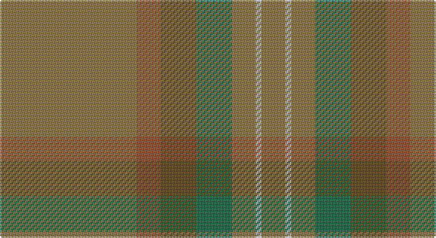

This page is one **sett** — a single exact thread-count. It belongs to the [tartan](/setts/y23o4dy6g6y4lb1y4/)
(the same proportion at any scale), whose colour order is pattern [GRGGGWG](/stripes/grgggwg/).

Sourced from tartans-authority.  It is a [7 stripe tartan](/stripes/stripes7/).

Original link http://www.tartansauthority.com/tartan-ferret/display/5823/

## Register references

External register numbers recorded for this tartan.

- Scottish Tartans Authority (ITI): 5823

## Thread count
LT/92 Ta16 T24 G24 LT16 N4 LT/16

One full sett is **276 threads**.

## Palette

Palette: <strong>Tartan Register</strong>
<table><thead><tr><th>Colour</th><th>Threads</th><th>Shade</th><th>Base</th><th>OKLCh</th></tr></thead><tbody><tr><td>LT/</td><td style="text-align:right;font-variant-numeric:tabular-nums">92</td><td><code style="background-color:#8C7038;">#8C7038</code> <small style="color:#888">#8C7038</small></td><td>G <code style="background-color:#006100;">#006100</code></td><td><small style="color:#888">oklch(56.0% 0.082 83.0)</small></td></tr><tr><td>Ta</td><td style="text-align:right;font-variant-numeric:tabular-nums">16</td><td><code style="background-color:#98481C;">#98481C</code> <small style="color:#888">#98481C</small></td><td>R <code style="background-color:#CC0000;">#CC0000</code></td><td><small style="color:#888">oklch(49.6% 0.121 46.1)</small></td></tr><tr><td>T</td><td style="text-align:right;font-variant-numeric:tabular-nums">24</td><td><code style="background-color:#604000;">#604000</code> <small style="color:#888">#604000</small></td><td>G <code style="background-color:#006100;">#006100</code></td><td><small style="color:#888">oklch(39.8% 0.083 76.8)</small></td></tr><tr><td>G</td><td style="text-align:right;font-variant-numeric:tabular-nums">24</td><td><code style="background-color:#00643C;">#00643C</code> <small style="color:#888">#00643C</small></td><td>G <code style="background-color:#006100;">#006100</code></td><td><small style="color:#888">oklch(44.3% 0.104 157.7)</small></td></tr><tr><td>LT</td><td style="text-align:right;font-variant-numeric:tabular-nums">16</td><td><code style="background-color:#8C7038;">#8C7038</code> <small style="color:#888">#8C7038</small></td><td>G <code style="background-color:#006100;">#006100</code></td><td><small style="color:#888">oklch(56.0% 0.082 83.0)</small></td></tr><tr><td>N</td><td style="text-align:right;font-variant-numeric:tabular-nums">4</td><td><code style="background-color:#C0C0C0;">#C0C0C0</code> <small style="color:#888">#C0C0C0</small></td><td>W <code style="background-color:#F7F7F7;">#F7F7F7</code></td><td><small style="color:#888">oklch(80.8% 0.000 89.9)</small></td></tr><tr><td>LT/</td><td style="text-align:right;font-variant-numeric:tabular-nums">16</td><td><code style="background-color:#8C7038;">#8C7038</code> <small style="color:#888">#8C7038</small></td><td>G <code style="background-color:#006100;">#006100</code></td><td><small style="color:#888">oklch(56.0% 0.082 83.0)</small></td></tr></tbody></table>

# Sample pattern

## Nearest tartans

The nearest existing variants by ΔTartan distance, with this tartan at the top so the swatches line up against it.

ΔTartan

Tartan

Sett

—

<a href="/ttd/edit/#slug=y23o4dy6g6y4lb1y4~x4">Tricor (Corporate)</a> <a class="nn-out" href="/variants/s7/y23o4dy6g6y4lb1y4~x4/" title="open its dictionary page">↗</a>

1.67

<a href="/variants/s8/y3dyi3y4k4dy14k3y41g2~x2/">Huntsman</a>

1.68

<a href="/ttd/edit/#slug=y32w2y9ly2y12o21r1~x2&amp;base=y23o4dy6g6y4lb1y4~x4">Weathered Cyclist</a> <a class="nn-out" href="/variants/s7/y32w2y9ly2y12o21r1~x2/" title="open its dictionary page">↗</a>

1.73

<a href="/ttd/edit/#slug=y50dy25ly2dp6~x2&amp;base=y23o4dy6g6y4lb1y4~x4">Highland Greenford (Personal)</a> <a class="nn-out" href="/variants/s4/y50dy25ly2dp6~x2/" title="open its dictionary page">↗</a>

1.89

<a href="/ttd/edit/#slug=k2y7k1y9dy21o2dy1o1dy2~x2&amp;base=y23o4dy6g6y4lb1y4~x4">Historic Scotland Corporate Tartan</a> <a class="nn-out" href="/variants/s9/k2y7k1y9dy21o2dy1o1dy2~x2/" title="open its dictionary page">↗</a>

1.91

<a href="/ttd/edit/#slug=y28k2y28k2y2k2dy29k2r2k2~x2&amp;base=y23o4dy6g6y4lb1y4~x4">Ulster (Peat) (District</a> <a class="nn-out" href="/variants/s10/y28k2y28k2y2k2dy29k2r2k2~x2/" title="open its dictionary page">↗</a>

2.02

<a href="/variants/s12/y23o4dy6g6y4lb1y4~x4/">Tricor</a>

2.04

<a href="/ttd/edit/#slug=dy50do6o3do3y3do3dt10dy8do3dy6y3~x2&amp;base=y23o4dy6g6y4lb1y4~x4">Williams (Fashion)</a> <a class="nn-out" href="/variants/s11/dy50do6o3do3y3do3dt10dy8do3dy6y3~x2/" title="open its dictionary page">↗</a>

2.04

<a href="/ttd/edit/#slug=oi80o8oi4dy4lr4dy45n8&amp;base=y23o4dy6g6y4lb1y4~x4">Isaia (Fashion)</a> <a class="nn-out" href="/variants/s7/oi80o8oi4dy4lr4dy45n8/" title="open its dictionary page">↗</a>

2.11

<a href="/ttd/edit/#slug=y9yi52dy15ly4~x2&amp;base=y23o4dy6g6y4lb1y4~x4">McGuigan, Julia (St Monans, Fife) (Personal)</a> <a class="nn-out" href="/variants/s4/y9yi52dy15ly4~x2/" title="open its dictionary page">↗</a>

2.21

<a href="/ttd/edit/#slug=n8o74lb8n42o11dp2o16n4&amp;base=y23o4dy6g6y4lb1y4~x4">Orkney Slate (Fashion)</a> <a class="nn-out" href="/variants/s8/n8o74lb8n42o11dp2o16n4/" title="open its dictionary page">↗</a>

## Neighbour map

Every grey dot is one of 14360 variants placed by the first two principal components of the ΔTartan feature space (44% of its variance). Red is this tartan; blue dots are its nearest — click one to open its page.

<svg viewBox="0 0 640 380" role="img" style="max-width:100%;height:auto;border:1px solid #e0e0e0;border-radius:4px;display:block" xmlns="http://www.w3.org/2000/svg"><image href="/nn/cloud.v1.png" width="640" height="380"/><a href="/variants/s8/y3dyi3y4k4dy14k3y41g2~x2/"><circle cx="499.5" cy="192.3" r="4" fill="#3465a4"><title>Huntsman</title></circle></a><a href="/variants/s7/y32w2y9ly2y12o21r1~x2/"><circle cx="560.6" cy="225.1" r="4" fill="#3465a4"><title>Weathered Cyclist</title></circle></a><a href="/variants/s4/y50dy25ly2dp6~x2/"><circle cx="505.5" cy="261.9" r="4" fill="#3465a4"><title>Highland Greenford (Personal)</title></circle></a><a href="/variants/s9/k2y7k1y9dy21o2dy1o1dy2~x2/"><circle cx="457.2" cy="212.8" r="4" fill="#3465a4"><title>Historic Scotland Corporate Tartan</title></circle></a><a href="/variants/s10/y28k2y28k2y2k2dy29k2r2k2~x2/"><circle cx="480.7" cy="219.8" r="4" fill="#3465a4"><title>Ulster (Peat) (District</title></circle></a><a href="/variants/s12/y23o4dy6g6y4lb1y4~x4/"><circle cx="384.8" cy="190.3" r="4" fill="#3465a4"><title>Tricor</title></circle></a><a href="/variants/s11/dy50do6o3do3y3do3dt10dy8do3dy6y3~x2/"><circle cx="527.5" cy="193.1" r="4" fill="#3465a4"><title>Williams (Fashion)</title></circle></a><a href="/variants/s7/oi80o8oi4dy4lr4dy45n8/"><circle cx="441.7" cy="184.3" r="4" fill="#3465a4"><title>Isaia (Fashion)</title></circle></a><a href="/variants/s4/y9yi52dy15ly4~x2/"><circle cx="537.9" cy="304.1" r="4" fill="#3465a4"><title>McGuigan, Julia (St Monans, Fife) (Personal)</title></circle></a><a href="/variants/s8/n8o74lb8n42o11dp2o16n4/"><circle cx="524.1" cy="194.2" r="4" fill="#3465a4"><title>Orkney Slate (Fashion)</title></circle></a><circle cx="506.1" cy="221.2" r="5" fill="#c00000"/></svg>

ID: /variants/s7/y23o4dy6g6y4lb1y4~x4/
