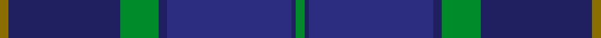

This is one **variant** — a specific cloth: this exact thread count and colourway, with its own
provenance below. It is one weaving of the [sett](/tartans/s/sc/scottish-canals/) (the scale-free proportion — the
same cloth at any scale or shade), whose colour order is pattern [GBBBGBG](/stripes/gbbbgbg/).

Part of the [Scottish Canals](/tartans/s/sc/scottish-canals/) tartan — the named design grouping this sett with its other cloths.

Sourced from tartans-authority.  It is a [7 stripe tartan](/stripes/stripes7/).

Original link <code>http://www.tartansauthority.com/tartan-ferret/display/3916/</code> — retired · [Internet Archive copy](https://web.archive.org/web/*/http://www.tartansauthority.com/tartan-ferret/display/3916/*)

## Provenance

Earliest known date: 2001 Designed by Claire Donaldson of House of Edgar for BWB. Initially called Highland Canals, later changed (April 2002) to Caledonian Canal and then in January 2003 to Scottish Canals.

3 attestations — the source records this cloth was collapsed from (oldest owns this page)

<ul>
<li>Dec. 2001 — Scottish Canals (Corporate) (tartans-authority, <a href="https://web.archive.org/web/*/http://www.tartansauthority.com/tartan-ferret/display/3916/*">record</a>)  <em>Designed by Claire Donaldson of House of Edgar for British Waterways Board. Initially called Highland Canals, later changed (April 2002) to Caledonian Canal and then in January 2003 to Scottish Canals.</em></li>
<li>2001 — Scottish Canals Corporate Tartan (house-of-tartan, <a href="http://www.house-of-tartan.scotland.net/house/TartanViewjs.asp?colr=Def&tnam=3916">record</a>) </li>
<li>undated — Scottish Canals (register-of-tartans, <a href="https://www.tartanregister.gov.uk/tartanDetails.aspx?ref=5424">record</a>)  <em>Designed by Claire Donaldson of House of Edgar for BWB. Initially called Highland Canals, later changed (April 2002) to Caledonian Canal and then in January 2003 to Scottish Canals.</em></li>
</ul>

Dataset <small>— provenance for this record, inherited from the source manifest</small>

<dl class="dataset-prov">
<dt>source</dt><dd><a href="/sources/tartans-authority/">Scottish Tartans Authority</a></dd>
<dt>data captured from</dt><dd><a href="https://github.com/thetartan/tartan-database/blob/master/data/tartans-authority/data.csv">https://github.com/thetartan/tartan-database/blob/master/data/tartans-authority/data.csv</a></dd>
<dt>data date</dt><dd>Dec. 2001 <small>(this record)</small></dd>
<dt>licence</dt><dd><a href="https://creativecommons.org/licenses/by-nc-nd/4.0/">CC BY-NC-ND 4.0</a></dd>
</dl>

Capture chain <small>— the hands this data passed through, oldest first; each capture carries its own licence</small>

<ol class="capture-chain">
<li><a href="https://www.tartansauthority.com/">Scottish Tartans Authority</a> <small>the heritage body’s archive — its tartan-ferret record browser is retired; dead record links are shown unlinked, with an Internet Archive copy (ITI numbers are not SRT references)</small></li>
<li><a href="https://github.com/thetartan/tartan-database">thetartan/tartan-database</a> <small>2016-2017</small> · <a href="https://creativecommons.org/licenses/by-nc-nd/4.0/">CC BY-NC-ND 4.0</a> <small>Levko Kravets's frozen compilation — the capture we vendored, and where its CC licence text came from</small></li>
<li>this dictionary <small>captured 2026-06-10 · commit 5bf86c7566</small> <small>each re-capture is a git commit to data/sources</small></li>
</ol>

## Register references

External register numbers recorded for this tartan.

- Scottish Register of Tartans: [5424](https://www.tartanregister.gov.uk/tartanDetails.aspx?ref=5424)
- Scottish Tartans Authority (ITI): 3916

## Thread count
Y/4 DB52 G18 DB4 DBi58 DB2 G/4

One full sett is **276 threads**.

## Palette
<table><thead><tr><th>Colour</th><th>Shade</th><th>OKLCh</th></tr></thead><tbody><tr><td>DB</td><td><code style="background-color:#2C2C80;">#2C2C80</code> <small style="color:#888">#2C2C80</small></td><td><small style="color:#888">oklch(35.0% 0.138 276.6)</small></td></tr><tr><td>DB</td><td><code style="background-color:#202060;">#202060</code> <small style="color:#888">#202060</small></td><td><small style="color:#888">oklch(28.9% 0.111 276.9)</small></td></tr><tr><td>G</td><td><code style="background-color:#008B2A;">#008B2A</code> <small style="color:#888">#008B2A</small></td><td><small style="color:#888">oklch(55.4% 0.170 145.9)</small></td></tr><tr><td>Y</td><td><code style="background-color:#8B6E00;">#8B6E00</code> <small style="color:#888">#8B6E00</small></td><td><small style="color:#888">oklch(55.1% 0.113 90.4)</small></td></tr></tbody></table>

# Sample pattern

## Nearest tartan variants

The nearest existing variants by ΔTartan distance, with this cloth at the top so the swatches line up against it.

ΔTartan

Threads

Variant

Sett

—

276

<a href="/variants/s7/y2db26g9db2dbi29db1g2~x2~db2911276-dbi3514276/">Scottish Canals (Corporate)</a>

<a href="/ttd/edit/#slug=dbi7db2dbi25db10g21db2~x2~dbi3514276-db2911276&amp;base=y2db26g9db2dbi29db1g2~x2~db2911276-dbi3514276" title="compare in the TTD">2.34</a>

250

<a href="/variants/s6/dbi7db2dbi25db10g21db2~x2~dbi3514276-db2911276/">Sugiyama Jogakuen University (Corp)</a>

<a href="/ttd/edit/#slug=db26dg6db2dg17dy4w1dy4~x4&amp;base=y2db26g9db2dbi29db1g2~x2~db2911276-dbi3514276" title="compare in the TTD">2.53</a>

360

<a href="/variants/s7/db26dg6db2dg17dy4w1dy4~x4/">Doral</a>

<a href="/ttd/edit/#slug=lb2dg2db1dg30n10db20dg1db2lo1~x2&amp;base=y2db26g9db2dbi29db1g2~x2~db2911276-dbi3514276" title="compare in the TTD">3.00</a>

270

<a href="/variants/s9/lb2dg2db1dg30n10db20dg1db2lo1~x2/">Scottish Borderland (Fashion)</a>

<a href="/ttd/edit/#slug=ly3dbi24db4dbi4db20g4dp4ly2~x2~dbi4215273-db3409246&amp;base=y2db26g9db2dbi29db1g2~x2~db2911276-dbi3514276" title="compare in the TTD">3.62</a>

250

<a href="/variants/s8/ly3dbi24db4dbi4db20g4dp4ly2~x2~dbi4215273-db3409246/">Blue Peter</a>

<a href="/ttd/edit/#slug=dt45db7w3db27r1db7~x2&amp;base=y2db26g9db2dbi29db1g2~x2~db2911276-dbi3514276" title="compare in the TTD">3.73</a>

256

<a href="/variants/s6/dt45db7w3db27r1db7~x2/">U.S. Navy/Edzell (Military)</a>

<a href="/ttd/edit/#slug=dy12dbi2dy2dbi30db3dbi2db13w4~x2~dbi3514276-db2911276&amp;base=y2db26g9db2dbi29db1g2~x2~db2911276-dbi3514276" title="compare in the TTD">3.80</a>

240

<a href="/variants/s8/dy12dbi2dy2dbi30db3dbi2db13w4~x2~dbi3514276-db2911276/">Highlands School (N. Carolina) Corporate Tartan</a>

<a href="/ttd/edit/#slug=db38w3db8dbi36dg9r3~x2~db2616276-dbi3514276&amp;base=y2db26g9db2dbi29db1g2~x2~db2911276-dbi3514276" title="compare in the TTD">3.83</a>

306

<a href="/variants/s6/db38w3db8dbi36dg9r3~x2~db2616276-dbi3514276/">Waters of Georgian Bay (District)</a>

## Neighbour map

Every grey dot is one of 13662 variants placed by the first two principal components of the ΔTartan feature space (42% of its variance). Red is this tartan; blue dots are its nearest — click one to open its page. The map is a flat projection of a many-dimensional space — [how to read it](/posts/neighbourhood-maps/).

<svg viewBox="0 0 640 380" role="img" style="max-width:100%;height:auto;border:1px solid #e0e0e0;border-radius:4px;display:block" xmlns="http://www.w3.org/2000/svg"><image href="/nn/cloud.v1.png" width="640" height="380"/><a href="/variants/s6/dbi7db2dbi25db10g21db2~x2~dbi3514276-db2911276/"><circle cx="363.2" cy="261.9" r="4" fill="#3465a4"><title>Sugiyama Jogakuen University (Corp)</title></circle></a><a href="/variants/s7/db26dg6db2dg17dy4w1dy4~x4/"><circle cx="441.4" cy="219.5" r="4" fill="#3465a4"><title>Doral</title></circle></a><a href="/variants/s9/lb2dg2db1dg30n10db20dg1db2lo1~x2/"><circle cx="393.3" cy="158.9" r="4" fill="#3465a4"><title>Scottish Borderland (Fashion)</title></circle></a><a href="/variants/s8/ly3dbi24db4dbi4db20g4dp4ly2~x2~dbi4215273-db3409246/"><circle cx="330.2" cy="216.8" r="4" fill="#3465a4"><title>Blue Peter</title></circle></a><a href="/variants/s6/dt45db7w3db27r1db7~x2/"><circle cx="460.6" cy="181.9" r="4" fill="#3465a4"><title>U.S. Navy/Edzell (Military)</title></circle></a><a href="/variants/s8/dy12dbi2dy2dbi30db3dbi2db13w4~x2~dbi3514276-db2911276/"><circle cx="379.0" cy="210.3" r="4" fill="#3465a4"><title>Highlands School (N. Carolina) Corporate Tartan</title></circle></a><a href="/variants/s6/db38w3db8dbi36dg9r3~x2~db2616276-dbi3514276/"><circle cx="358.8" cy="219.9" r="4" fill="#3465a4"><title>Waters of Georgian Bay (District)</title></circle></a><circle cx="416.0" cy="205.6" r="5" fill="#c00000"/><text x="320" y="376" text-anchor="middle" font-size="11" fill="#999">ground</text><text x="11" y="190" text-anchor="middle" font-size="11" fill="#999" transform="rotate(-90 11 190)">complexity</text></svg>

ID: /variants/s7/y2db26g9db2dbi29db1g2~x2~db2911276-dbi3514276/
