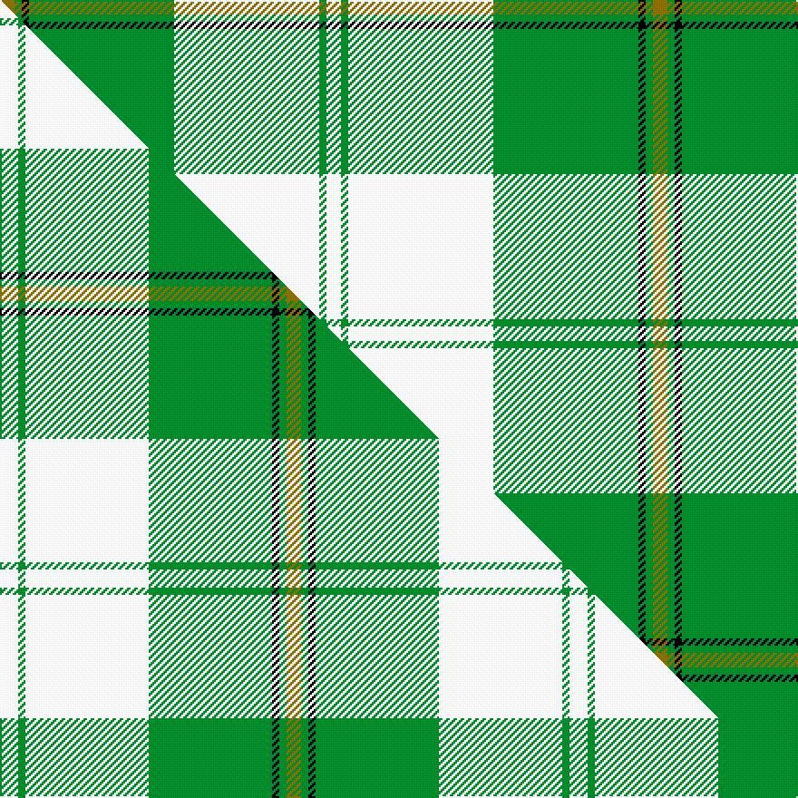

This is one **variant** — a specific cloth: this exact thread count and colourway, with its own
provenance below. It is one weaving of the [sett](/setts/y2g1k1g20w20g1w2/) (the scale-free proportion — the
same cloth at any scale or shade), whose colour order is pattern [GGKGWGW](/stripes/ggkgwgw/).

Part of the [Cunningham Dress](/tartans/c/cu/cunningham-dress/) tartan — the named design grouping this sett with its other cloths.

Sourced from house-of-tartan.  It is a [7 stripe tartan](/stripes/stripes7/).

Original link [http://www.house-of-tartan.scotland.net/house/TartanViewjs.asp?colr=Def&tnam=6532](http://www.house-of-tartan.scotland.net/house/TartanViewjs.asp?colr=Def&tnam=6532)

## Provenance

Earliest known date: 01/01/1988 A dancers' tartan now woven by D C Dalgliesh of Selkirk /Threadcount and colours aren't 100% original. Generated manually./

Dataset <small>— provenance for this record, inherited from the source manifest</small>

<dl class="dataset-prov">
<dt>source</dt><dd><a href="/sources/house-of-tartan/">House of Tartan</a></dd>
<dt>data captured from</dt><dd><a href="https://github.com/thetartan/tartan-database/blob/master/data/house-of-tartan/data.csv">https://github.com/thetartan/tartan-database/blob/master/data/house-of-tartan/data.csv</a></dd>
<dt>data date</dt><dd>01/01/1988 <small>(this record)</small></dd>
<dt>licence</dt><dd><a href="https://creativecommons.org/licenses/by-nc-nd/4.0/">CC BY-NC-ND 4.0</a></dd>
</dl>

Capture chain <small>— the hands this data passed through, oldest first; each capture carries its own licence</small>

<ol class="capture-chain">
<li><a href="http://www.house-of-tartan.scotland.net/">House of Tartan</a> <small>the weaver/retailer's database — the site is now offline; the URL is kept as the ultimate source's identity</small></li>
<li><a href="https://github.com/thetartan/tartan-database">thetartan/tartan-database</a> <small>2016-2017</small> · <a href="https://creativecommons.org/licenses/by-nc-nd/4.0/">CC BY-NC-ND 4.0</a> <small>Levko Kravets's frozen compilation — the capture we vendored, and where its CC licence text came from</small></li>
<li>this dictionary <small>captured 2026-06-10 · commit 5bf86c7566</small> <small>each re-capture is a git commit to data/sources</small></li>
</ol>

## Thread count
Y/8 G4 K4 G80 W80 G4 W/8

One full sett is **360 threads**.

## Palette
<table><thead><tr><th>Colour</th><th>Shade</th><th>OKLCh</th></tr></thead><tbody><tr><td>G</td><td><code style="background-color:#008B2A;">#008B2A</code> <small style="color:#888">#008B2A</small></td><td><small style="color:#888">oklch(55.4% 0.170 145.9)</small></td></tr><tr><td>K</td><td><code style="background-color:#000000;">#000000</code> <small style="color:#888">#000000</small></td><td><small style="color:#888">oklch(0.0% 0.000 0.0)</small></td></tr><tr><td>W</td><td><code style="background-color:#F7F7F7;">#F7F7F7</code> <small style="color:#888">#F7F7F7</small></td><td><small style="color:#888">oklch(97.6% 0.000 89.9)</small></td></tr><tr><td>Y</td><td><code style="background-color:#8B6E00;">#8B6E00</code> <small style="color:#888">#8B6E00</small></td><td><small style="color:#888">oklch(55.1% 0.113 90.4)</small></td></tr></tbody></table>

# Sample pattern

## Compared to the master

This cloth is one sett of its design; the master sett (the exemplar the design is anchored on) is below for comparison.

Its **ΔTartan distance** from the master is **0.20** — the same measure the nearest-tartans table ranks by (0 is identical; a re-scale of the same cloth is near 0, a recolour or a different proportion further).

<figure class="master-compare" style="margin:0">

this sett
master sett ★

<figcaption style="color:#888;font-size:smaller">One weave of this sett against the <a href="/setts/w5g2w34g34k2g2y4/">master sett ★</a>, split on the diagonal: a shared proportion runs seamlessly across it with only the shades shifting; a different proportion breaks on it.</figcaption>
</figure>

## Nearest tartan variants

The nearest existing variants by ΔTartan distance, with this cloth at the top so the swatches line up against it.

ΔTartan

Threads

Variant

Sett

—

360

<a href="/variants/s7/y2g1k1g20w20g1w2~x4/">Cunningham Dress Green (Dance) Fashion Tartan</a>

<a href="/ttd/edit/#slug=w5g2w34g34k2g2y4~x2&amp;base=y2g1k1g20w20g1w2~x4" title="compare in the TTD">0.20</a>

314

<a href="/variants/s7/w5g2w34g34k2g2y4~x2/">Cunningham Dress Green (Dance)</a>

<a href="/ttd/edit/#slug=w1lg11k6lg3w1lg1w1~x4&amp;base=y2g1k1g20w20g1w2~x4" title="compare in the TTD">1.30</a>

184

<a href="/variants/s7/w1lg11k6lg3w1lg1w1~x4/">Angle, Blue (Fashion)</a>

<a href="/ttd/edit/#slug=w47g20w6g8k1r3~x2&amp;base=y2g1k1g20w20g1w2~x4" title="compare in the TTD">2.24</a>

240

<a href="/variants/s6/w47g20w6g8k1r3~x2/">MacGregor Dress Green Clan Tartan</a>

<a href="/ttd/edit/#slug=w52g22w6g8k1r3~x2&amp;base=y2g1k1g20w20g1w2~x4" title="compare in the TTD">2.27</a>

258

<a href="/variants/s6/w52g22w6g8k1r3~x2/">MacGregor Dress Green (Dance)</a>

<a href="/ttd/edit/#slug=r6g2w21g2y2k8y2g32w1k3~x2&amp;base=y2g1k1g20w20g1w2~x4" title="compare in the TTD">2.50</a>

298

<a href="/variants/s10/r6g2w21g2y2k8y2g32w1k3~x2/">Fiander, Julian (Personal)</a>

<a href="/ttd/edit/#slug=g3r2g27dg3w30dg2w3~x2&amp;base=y2g1k1g20w20g1w2~x4" title="compare in the TTD">2.77</a>

268

<a href="/variants/s7/g3r2g27dg3w30dg2w3~x2/">Uist, Green (Dance)</a>

<a href="/ttd/edit/#slug=g7r3k3w54g24r5g5w5g5r5~x2&amp;base=y2g1k1g20w20g1w2~x4" title="compare in the TTD">2.83</a>

440

<a href="/variants/s10/g7r3k3w54g24r5g5w5g5r5~x2/">Scott Dress #2</a>

<a href="/ttd/edit/#slug=w6g5r5g45k4ly24k4g5~x2&amp;base=y2g1k1g20w20g1w2~x4" title="compare in the TTD">3.00</a>

370

<a href="/variants/s8/w6g5r5g45k4ly24k4g5~x2/">O'Neill (Name)</a>

<a href="/ttd/edit/#slug=w38r12w37g32k3w4k3g32r4~x2&amp;base=y2g1k1g20w20g1w2~x4" title="compare in the TTD">3.13</a>

576

<a href="/variants/s9/w38r12w37g32k3w4k3g32r4~x2/">MacDiarmid Dress</a>

<a href="/ttd/edit/#slug=w38r12w37g32k3w4k3g32r4&amp;base=y2g1k1g20w20g1w2~x4" title="compare in the TTD">3.13</a>

288

<a href="/variants/s9/w38r12w37g32k3w4k3g32r4/">MacDiarmid Dress Clan Tartan</a>

## Neighbour map

Every grey dot is one of 13621 variants placed by the first two principal components of the ΔTartan feature space (42% of its variance). Red is this tartan; blue dots are its nearest — click one to open its page.

<svg viewBox="0 0 640 380" role="img" style="max-width:100%;height:auto;border:1px solid #e0e0e0;border-radius:4px;display:block" xmlns="http://www.w3.org/2000/svg"><image href="/nn/cloud.v1.png" width="640" height="380"/><a href="/variants/s7/w5g2w34g34k2g2y4~x2/"><circle cx="269.7" cy="152.1" r="4" fill="#3465a4"><title>Cunningham Dress Green (Dance)</title></circle></a><a href="/variants/s7/w1lg11k6lg3w1lg1w1~x4/"><circle cx="303.7" cy="184.5" r="4" fill="#3465a4"><title>Angle, Blue (Fashion)</title></circle></a><a href="/variants/s6/w47g20w6g8k1r3~x2/"><circle cx="373.9" cy="119.4" r="4" fill="#3465a4"><title>MacGregor Dress Green Clan Tartan</title></circle></a><a href="/variants/s6/w52g22w6g8k1r3~x2/"><circle cx="382.7" cy="115.0" r="4" fill="#3465a4"><title>MacGregor Dress Green (Dance)</title></circle></a><a href="/variants/s10/r6g2w21g2y2k8y2g32w1k3~x2/"><circle cx="200.2" cy="86.9" r="4" fill="#3465a4"><title>Fiander, Julian (Personal)</title></circle></a><a href="/variants/s7/g3r2g27dg3w30dg2w3~x2/"><circle cx="278.6" cy="170.0" r="4" fill="#3465a4"><title>Uist, Green (Dance)</title></circle></a><a href="/variants/s10/g7r3k3w54g24r5g5w5g5r5~x2/"><circle cx="261.8" cy="119.9" r="4" fill="#3465a4"><title>Scott Dress #2</title></circle></a><a href="/variants/s8/w6g5r5g45k4ly24k4g5~x2/"><circle cx="251.1" cy="149.9" r="4" fill="#3465a4"><title>O'Neill (Name)</title></circle></a><a href="/variants/s9/w38r12w37g32k3w4k3g32r4~x2/"><circle cx="215.3" cy="173.9" r="4" fill="#3465a4"><title>MacDiarmid Dress</title></circle></a><a href="/variants/s9/w38r12w37g32k3w4k3g32r4/"><circle cx="215.3" cy="173.9" r="4" fill="#3465a4"><title>MacDiarmid Dress Clan Tartan</title></circle></a><circle cx="280.7" cy="142.6" r="5" fill="#c00000"/><text x="320" y="376" text-anchor="middle" font-size="11" fill="#999">ground</text><text x="11" y="190" text-anchor="middle" font-size="11" fill="#999" transform="rotate(-90 11 190)">complexity</text></svg>

ID: /variants/s7/y2g1k1g20w20g1w2~x4/
