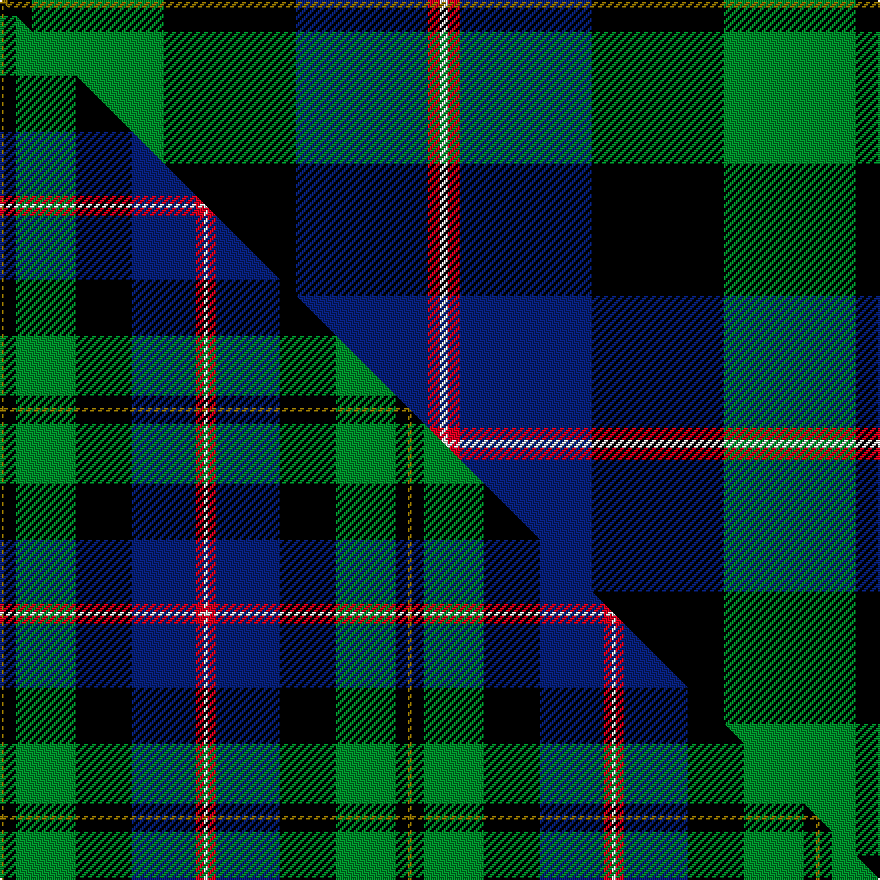

This is one **variant** — a specific cloth: this exact thread count and colourway, with its own
provenance below. It is one weaving of the [sett](/setts/y2k6g33k33db33r3w2/) (the scale-free proportion — the
same cloth at any scale or shade), whose colour order is pattern [GKGKBRW](/stripes/gkgkbrw/).

Part of the [MacNeil](/tartans/macneil/) tartan — the named design grouping this sett with its other cloths.

Sourced from tartans-authority.  It is a [7 stripe tartan](/stripes/stripes7/).

Original link [https://www.tartanregister.gov.uk/tartanDetails.aspx?ref=1839](https://www.tartanregister.gov.uk/tartanDetails.aspx?ref=1839)

Dataset <small>— provenance for this record, inherited from the source manifest</small>

<dl class="dataset-prov">
<dt>source</dt><dd><a href="/sources/tartans-authority/">Scottish Tartans Authority</a></dd>
<dt>data captured from</dt><dd><a href="https://github.com/thetartan/tartan-database/blob/master/data/tartans-authority/data.csv">https://github.com/thetartan/tartan-database/blob/master/data/tartans-authority/data.csv</a></dd>
<dt>data date</dt><dd>1847 <small>(this record)</small></dd>
<dt>licence</dt><dd><a href="https://creativecommons.org/licenses/by-nc-nd/4.0/">CC BY-NC-ND 4.0</a></dd>
</dl>

Capture chain <small>— the hands this data passed through, oldest first; each capture carries its own licence</small>

<ol class="capture-chain">
<li><a href="https://www.tartansauthority.com/">Scottish Tartans Authority</a> <small>the heritage body's archive — its tartan-ferret record browser is retired (links repaired to the SRT, above)</small></li>
<li><a href="https://github.com/thetartan/tartan-database">thetartan/tartan-database</a> <small>2016-2017</small> · <a href="https://creativecommons.org/licenses/by-nc-nd/4.0/">CC BY-NC-ND 4.0</a> <small>Levko Kravets's frozen compilation — the capture we vendored, and where its CC licence text came from</small></li>
<li>this dictionary <small>captured 2026-06-10 · commit 5bf86c7566</small> <small>each re-capture is a git commit to data/sources</small></li>
</ol>

## Register references

External register numbers recorded for this tartan.

- Scottish Tartans Authority (ITI): 1839

## Thread count
Y/4 K12 G66 K66 DB66 R6 W/4

One full sett is **440 threads**.

## Palette
<table><thead><tr><th>Colour</th><th>Shade</th><th>OKLCh</th></tr></thead><tbody><tr><td>DB</td><td><code style="background-color:#082077;">#082077</code> <small style="color:#888">#082077</small></td><td><small style="color:#888">oklch(30.0% 0.149 265.1)</small></td></tr><tr><td>G</td><td><code style="background-color:#008B2A;">#008B2A</code> <small style="color:#888">#008B2A</small></td><td><small style="color:#888">oklch(55.4% 0.170 145.9)</small></td></tr><tr><td>K</td><td><code style="background-color:#000000;">#000000</code> <small style="color:#888">#000000</small></td><td><small style="color:#888">oklch(0.0% 0.000 0.0)</small></td></tr><tr><td>R</td><td><code style="background-color:#D60020;">#D60020</code> <small style="color:#888">#D60020</small></td><td><small style="color:#888">oklch(55.2% 0.224 25.5)</small></td></tr><tr><td>W</td><td><code style="background-color:#F7F7F7;">#F7F7F7</code> <small style="color:#888">#F7F7F7</small></td><td><small style="color:#888">oklch(97.6% 0.000 89.9)</small></td></tr><tr><td>Y</td><td><code style="background-color:#8B6E00;">#8B6E00</code> <small style="color:#888">#8B6E00</small></td><td><small style="color:#888">oklch(55.1% 0.113 90.4)</small></td></tr></tbody></table>

# Sample pattern

## Compared to the master

This cloth is one sett of its design; the master sett (the exemplar the design is anchored on) is below for comparison.

Its **ΔTartan distance** from the master is **0.16** — the same measure the nearest-tartans table ranks by (0 is identical; a re-scale of the same cloth is near 0, a recolour or a different proportion further).

<figure class="master-compare" style="margin:0">

this sett
master sett ★

<figcaption style="color:#888;font-size:smaller">One weave of this sett against the <a href="/setts/y1k3g15k14db16r2w1/">master sett ★</a>, split on the diagonal: a shared proportion runs seamlessly across it with only the shades shifting; a different proportion breaks on it.</figcaption>
</figure>

## Nearest tartan variants

The nearest existing variants by ΔTartan distance, with this cloth at the top so the swatches line up against it.

ΔTartan

Threads

Variant

Sett

—

440

<a href="/variants/s7/y2k6g33k33db33r3w2~x2/">MacNeil - 1840 (Chief's sett)</a>

<a href="/ttd/edit/#slug=y1k3g15k14db16r2w1~x2&amp;base=y2k6g33k33db33r3w2~x2" title="compare in the TTD">0.16</a>

204

<a href="/variants/s7/y1k3g15k14db16r2w1~x2/">Macneil of Barra - Chief (Personal)</a>

<a href="/ttd/edit/#slug=y3k1g20k20db18lb3~x2&amp;base=y2k6g33k33db33r3w2~x2" title="compare in the TTD">0.92</a>

248

<a href="/variants/s6/y3k1g20k20db18lb3~x2/">Smith</a>

<a href="/ttd/edit/#slug=ly3k1g20k20db18lb3~x2&amp;base=y2k6g33k33db33r3w2~x2" title="compare in the TTD">0.92</a>

248

<a href="/variants/s6/ly3k1g20k20db18lb3~x2/">Smith, Sir William (?)</a>

<a href="/ttd/edit/#slug=r2db23k14g16k2w2~x2&amp;base=y2k6g33k33db33r3w2~x2" title="compare in the TTD">0.95</a>

228

<a href="/variants/s6/r2db23k14g16k2w2~x2/">MacPhail Hunting Clan Tartan</a>

<a href="/ttd/edit/#slug=k2g12k12r1db12w2~x2&amp;base=y2k6g33k33db33r3w2~x2" title="compare in the TTD">1.25</a>

156

<a href="/variants/s6/k2g12k12r1db12w2~x2/">Russell Clan Tartan</a>

<a href="/ttd/edit/#slug=k2g12k12r1db12w2&amp;base=y2k6g33k33db33r3w2~x2" title="compare in the TTD">1.25</a>

78

<a href="/variants/s6/k2g12k12r1db12w2/">Mitchell</a>

<a href="/ttd/edit/#slug=y2k6g33k33dp33w2~x2&amp;base=y2k6g33k33db33r3w2~x2" title="compare in the TTD">1.30</a>

428

<a href="/variants/s6/y2k6g33k33dp33w2~x2/">MacNeil 8</a>

<a href="/ttd/edit/#slug=db4k2db16k12w1g13r2g2y4~x2&amp;base=y2k6g33k33db33r3w2~x2" title="compare in the TTD">1.53</a>

208

<a href="/variants/s9/db4k2db16k12w1g13r2g2y4~x2/">Cusack</a>

<a href="/ttd/edit/#slug=y6g28r4k20r3db45k5~x2&amp;base=y2k6g33k33db33r3w2~x2" title="compare in the TTD">1.87</a>

422

<a href="/variants/s7/y6g28r4k20r3db45k5~x2/">Nery</a>

<a href="/ttd/edit/#slug=w4k1g18k17db13r1db3r1~x2&amp;base=y2k6g33k33db33r3w2~x2" title="compare in the TTD">1.88</a>

222

<a href="/variants/s8/w4k1g18k17db13r1db3r1~x2/">Whitson #2</a>

## Neighbour map

Every grey dot is one of 13621 variants placed by the first two principal components of the ΔTartan feature space (42% of its variance). Red is this tartan; blue dots are its nearest — click one to open its page.

<svg viewBox="0 0 640 380" role="img" style="max-width:100%;height:auto;border:1px solid #e0e0e0;border-radius:4px;display:block" xmlns="http://www.w3.org/2000/svg"><image href="/nn/cloud.v1.png" width="640" height="380"/><a href="/variants/s7/y1k3g15k14db16r2w1~x2/"><circle cx="121.7" cy="142.1" r="4" fill="#3465a4"><title>Macneil of Barra - Chief (Personal)</title></circle></a><a href="/variants/s6/y3k1g20k20db18lb3~x2/"><circle cx="137.3" cy="163.1" r="4" fill="#3465a4"><title>Smith</title></circle></a><a href="/variants/s6/ly3k1g20k20db18lb3~x2/"><circle cx="132.4" cy="161.7" r="4" fill="#3465a4"><title>Smith, Sir William (?)</title></circle></a><a href="/variants/s6/r2db23k14g16k2w2~x2/"><circle cx="152.7" cy="176.3" r="4" fill="#3465a4"><title>MacPhail Hunting Clan Tartan</title></circle></a><a href="/variants/s6/k2g12k12r1db12w2~x2/"><circle cx="121.5" cy="180.7" r="4" fill="#3465a4"><title>Russell Clan Tartan</title></circle></a><a href="/variants/s6/k2g12k12r1db12w2/"><circle cx="121.5" cy="180.7" r="4" fill="#3465a4"><title>Mitchell</title></circle></a><a href="/variants/s6/y2k6g33k33dp33w2~x2/"><circle cx="158.9" cy="163.2" r="4" fill="#3465a4"><title>MacNeil 8</title></circle></a><a href="/variants/s9/db4k2db16k12w1g13r2g2y4~x2/"><circle cx="124.9" cy="136.8" r="4" fill="#3465a4"><title>Cusack</title></circle></a><a href="/variants/s7/y6g28r4k20r3db45k5~x2/"><circle cx="170.8" cy="153.8" r="4" fill="#3465a4"><title>Nery</title></circle></a><a href="/variants/s8/w4k1g18k17db13r1db3r1~x2/"><circle cx="124.2" cy="138.4" r="4" fill="#3465a4"><title>Whitson #2</title></circle></a><circle cx="133.9" cy="137.8" r="5" fill="#c00000"/><text x="320" y="376" text-anchor="middle" font-size="11" fill="#999">ground</text><text x="11" y="190" text-anchor="middle" font-size="11" fill="#999" transform="rotate(-90 11 190)">complexity</text></svg>

ID: /variants/s7/y2k6g33k33db33r3w2~x2/
