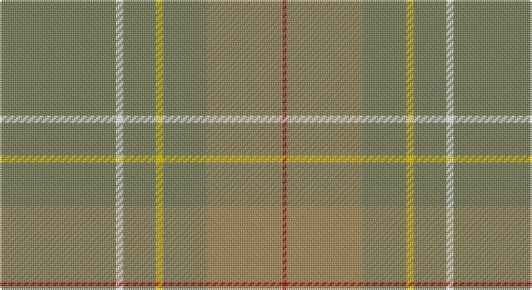

This page is one **sett** — a single exact thread-count. It belongs to the [tartan](/setts/y32w2y9ly2y12o21r1/)
(the same proportion at any scale), whose colour order is pattern [GWGYGRR](/stripes/gwgygrr/).

Part of the [Weathered Cyclist](/tartans/weathered-cyclist/) tartan — the named design grouping this sett with its other cloths.

Sourced from register-of-tartans.  It is a [7 stripe tartan](/stripes/stripes7/).

Original link https://www.tartanregister.gov.uk/tartanDetails.aspx?ref=10732

## Provenance

Earliest known date: 6 November 2012 Designed for The Tartan Ride, a charity cycling event. Once woven, this tartan is for all to wear, however the design as an entity may not be used without the designer's express permission. The design is the intellectual property of Ali Campbell and is a device of The Tartan Ride. Any use of the design must be authorised by the designer.

## Also known as

This cloth is also recorded under:

- Weathered Cyclist Commemorative

2 attestations — the source records this cloth was collapsed from (oldest owns this page)

<ul>
<li>01/09/2012 — Weathered Cyclist (register-of-tartans, <a href="https://www.tartanregister.gov.uk/tartanDetails.aspx?ref=10732">record</a>)</li>
<li>undated — Weathered Cyclist Commemorative Tartan (house-of-tartan, <a href="http://www.house-of-tartan.scotland.net/house/TartanViewjs.asp?colr=Def&tnam=10732">record</a>)</li>
</ul>

## Register references

External register numbers recorded for this tartan.

- Scottish Register of Tartans: [10732](https://www.tartanregister.gov.uk/tartanDetails.aspx?ref=10732)

## Thread count
G/64 W4 G18 Y4 G24 LT42 DR/2

One full sett is **250 threads**.

## Palette

Palette: <strong>Tartan Register</strong> <small style="color:#888">(1 of 5 colours)</small>
<table><thead><tr><th>Colour</th><th>Threads</th><th>Shade</th><th>Base</th><th>OKLCh</th></tr></thead><tbody><tr><td>G/</td><td style="text-align:right;font-variant-numeric:tabular-nums">64</td><td><code style="background-color:#777B57;">#777B57</code> <small style="color:#888">#777B57</small></td><td>G <code style="background-color:#006100;">#006100</code></td><td><small style="color:#888">oklch(57.0% 0.053 113.2)</small></td></tr><tr><td>W</td><td style="text-align:right;font-variant-numeric:tabular-nums">4</td><td><code style="background-color:#FFFFFF;">#FFFFFF</code> <small style="color:#888">#FFFFFF</small></td><td>W <code style="background-color:#F7F7F7;">#F7F7F7</code></td><td><small style="color:#888">oklch(100.0% 0.000 89.9)</small></td></tr><tr><td>G</td><td style="text-align:right;font-variant-numeric:tabular-nums">18</td><td><code style="background-color:#777B57;">#777B57</code> <small style="color:#888">#777B57</small></td><td>G <code style="background-color:#006100;">#006100</code></td><td><small style="color:#888">oklch(57.0% 0.053 113.2)</small></td></tr><tr><td>Y</td><td style="text-align:right;font-variant-numeric:tabular-nums">4</td><td><code style="background-color:#E7BF00;">#E7BF00</code> <small style="color:#888">#E7BF00</small></td><td>Y <code style="background-color:#F2BF00;">#F2BF00</code></td><td><small style="color:#888">oklch(81.6% 0.167 93.6)</small></td></tr><tr><td>G</td><td style="text-align:right;font-variant-numeric:tabular-nums">24</td><td><code style="background-color:#777B57;">#777B57</code> <small style="color:#888">#777B57</small></td><td>G <code style="background-color:#006100;">#006100</code></td><td><small style="color:#888">oklch(57.0% 0.053 113.2)</small></td></tr><tr><td>LT</td><td style="text-align:right;font-variant-numeric:tabular-nums">42</td><td><code style="background-color:#9F8757;">#9F8757</code> <small style="color:#888">#9F8757</small></td><td>R <code style="background-color:#CC0000;">#CC0000</code></td><td><small style="color:#888">oklch(63.4% 0.071 83.9)</small></td></tr><tr><td>DR/</td><td style="text-align:right;font-variant-numeric:tabular-nums">2</td><td><code style="background-color:#A40000;">#A40000</code> <small style="color:#888">#A40000</small></td><td>R <code style="background-color:#CC0000;">#CC0000</code></td><td><small style="color:#888">oklch(45.1% 0.185 29.2)</small></td></tr></tbody></table>

# Sample pattern

## Nearest tartans

The nearest existing variants by ΔTartan distance, with this tartan at the top so the swatches line up against it.

ΔTartan

Tartan

Sett

—

<a href="/ttd/edit/#slug=y32w2y9ly2y12o21r1~x2">Weathered Cyclist</a> <a class="nn-out" href="/variants/s7/y32w2y9ly2y12o21r1~x2/" title="open its dictionary page">↗</a>

1.68

<a href="/ttd/edit/#slug=y23o4dy6g6y4lb1y4~x4&amp;base=y32w2y9ly2y12o21r1~x2">Tricor (Corporate)</a> <a class="nn-out" href="/variants/s7/y23o4dy6g6y4lb1y4~x4/" title="open its dictionary page">↗</a>

2.37

<a href="/ttd/edit/#slug=y9yi52dy15ly4~x2&amp;base=y32w2y9ly2y12o21r1~x2">McGuigan, Julia (St Monans, Fife) (Personal)</a> <a class="nn-out" href="/variants/s4/y9yi52dy15ly4~x2/" title="open its dictionary page">↗</a>

2.51

<a href="/ttd/edit/#slug=y52ly2n24r3lo26n4~x2&amp;base=y32w2y9ly2y12o21r1~x2">Outlander #1</a> <a class="nn-out" href="/variants/s6/y52ly2n24r3lo26n4~x2/" title="open its dictionary page">↗</a>

2.58

<a href="/ttd/edit/#slug=o32w2o9ly2o12lo21r1~x2&amp;base=y32w2y9ly2y12o21r1~x2">Weathered Cyclist (Corporate)</a> <a class="nn-out" href="/variants/s7/o32w2o9ly2o12lo21r1~x2/" title="open its dictionary page">↗</a>

2.59

<a href="/ttd/edit/#slug=o52ly2n24r3lo26n4~x2&amp;base=y32w2y9ly2y12o21r1~x2">Outlander #1</a> <a class="nn-out" href="/variants/s6/o52ly2n24r3lo26n4~x2/" title="open its dictionary page">↗</a>

2.60

<a href="/ttd/edit/#slug=y50dy25ly2dp6~x2&amp;base=y32w2y9ly2y12o21r1~x2">Highland Greenford (Personal)</a> <a class="nn-out" href="/variants/s4/y50dy25ly2dp6~x2/" title="open its dictionary page">↗</a>

2.61

<a href="/ttd/edit/#slug=n8o74lb8n42o11dp2o16n4&amp;base=y32w2y9ly2y12o21r1~x2">Orkney Slate (Fashion)</a> <a class="nn-out" href="/variants/s8/n8o74lb8n42o11dp2o16n4/" title="open its dictionary page">↗</a>

2.63

<a href="/ttd/edit/#slug=o55yi6y3lb3y3lb3y10yii5y5lr2y3~x2&amp;base=y32w2y9ly2y12o21r1~x2">Long Way Down, The (Corporate)</a> <a class="nn-out" href="/variants/s11/o55yi6y3lb3y3lb3y10yii5y5lr2y3~x2/" title="open its dictionary page">↗</a>

2.68

<a href="/ttd/edit/#slug=w4o28t48ly3~x2&amp;base=y32w2y9ly2y12o21r1~x2">McKerrell of Hillhouse Dress (Clan)</a> <a class="nn-out" href="/variants/s4/w4o28t48ly3~x2/" title="open its dictionary page">↗</a>

2.76

<a href="/ttd/edit/#slug=y22dp1yi22r4~x4&amp;base=y32w2y9ly2y12o21r1~x2">McWilliams (2014)</a> <a class="nn-out" href="/variants/s4/y22dp1yi22r4~x4/" title="open its dictionary page">↗</a>

## Neighbour map

Every grey dot is one of 14360 variants placed by the first two principal components of the ΔTartan feature space (44% of its variance). Red is this tartan; blue dots are its nearest — click one to open its page.

<svg viewBox="0 0 640 380" role="img" style="max-width:100%;height:auto;border:1px solid #e0e0e0;border-radius:4px;display:block" xmlns="http://www.w3.org/2000/svg"><image href="/nn/cloud.v1.png" width="640" height="380"/><a href="/variants/s7/y23o4dy6g6y4lb1y4~x4/"><circle cx="506.1" cy="221.2" r="4" fill="#3465a4"><title>Tricor (Corporate)</title></circle></a><a href="/variants/s4/y9yi52dy15ly4~x2/"><circle cx="537.9" cy="304.1" r="4" fill="#3465a4"><title>McGuigan, Julia (St Monans, Fife) (Personal)</title></circle></a><a href="/variants/s6/y52ly2n24r3lo26n4~x2/"><circle cx="424.2" cy="230.2" r="4" fill="#3465a4"><title>Outlander #1</title></circle></a><a href="/variants/s7/o32w2o9ly2o12lo21r1~x2/"><circle cx="609.4" cy="248.6" r="4" fill="#3465a4"><title>Weathered Cyclist (Corporate)</title></circle></a><a href="/variants/s6/o52ly2n24r3lo26n4~x2/"><circle cx="409.1" cy="221.0" r="4" fill="#3465a4"><title>Outlander #1</title></circle></a><a href="/variants/s4/y50dy25ly2dp6~x2/"><circle cx="505.5" cy="261.9" r="4" fill="#3465a4"><title>Highland Greenford (Personal)</title></circle></a><a href="/variants/s8/n8o74lb8n42o11dp2o16n4/"><circle cx="524.1" cy="194.2" r="4" fill="#3465a4"><title>Orkney Slate (Fashion)</title></circle></a><a href="/variants/s11/o55yi6y3lb3y3lb3y10yii5y5lr2y3~x2/"><circle cx="480.3" cy="154.0" r="4" fill="#3465a4"><title>Long Way Down, The (Corporate)</title></circle></a><a href="/variants/s4/w4o28t48ly3~x2/"><circle cx="501.7" cy="294.2" r="4" fill="#3465a4"><title>McKerrell of Hillhouse Dress (Clan)</title></circle></a><a href="/variants/s4/y22dp1yi22r4~x4/"><circle cx="469.0" cy="293.3" r="4" fill="#3465a4"><title>McWilliams (2014)</title></circle></a><circle cx="560.6" cy="225.1" r="5" fill="#c00000"/></svg>

ID: /variants/s7/y32w2y9ly2y12o21r1~x2/
