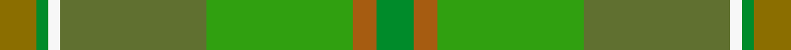

This is one **variant** — a specific cloth: this exact thread count and colourway, with its own
provenance below. It is one weaving of the [sett](/tartans/b/br/braemar-house-3/) (the scale-free proportion — the
same cloth at any scale or shade), whose colour order is pattern [GGWGGRG](/stripes/ggwggrg/).

Part of the [Braemar House](/tartans/b/br/braemar-house-3/) tartan — the named design grouping this sett with its other cloths.

Sourced from weddslist.  It is a [7 stripe tartan](/stripes/stripes7/).

Original link [http://www.weddslist.com/cgi-bin/tartans/pg.pl?source=sts](http://www.weddslist.com/cgi-bin/tartans/pg.pl?source=sts)

Dataset <small>— provenance for this record, inherited from the source manifest</small>

<dl class="dataset-prov">
<dt>source</dt><dd><a href="/sources/weddslist/">Weddslist</a></dd>
<dt>data captured from</dt><dd><a href="https://github.com/thetartan/tartan-database/blob/master/data/weddslist/data.csv">https://github.com/thetartan/tartan-database/blob/master/data/weddslist/data.csv</a></dd>
<dt>data date</dt><dd>2016-11-17 <small>(dataset default)</small></dd>
<dt>licence</dt><dd><a href="https://creativecommons.org/licenses/by-nc-nd/4.0/">CC BY-NC-ND 4.0</a></dd>
</dl>

Capture chain <small>— the hands this data passed through, oldest first; each capture carries its own licence</small>

<ol class="capture-chain">
<li><a href="https://www.weddslist.com/tartans/">Weddslist</a> <small>the living privately compiled reference</small></li>
<li><a href="https://github.com/thetartan/tartan-database">thetartan/tartan-database</a> <small>2016-2017</small> · <a href="https://creativecommons.org/licenses/by-nc-nd/4.0/">CC BY-NC-ND 4.0</a> <small>Levko Kravets's frozen compilation — the capture we vendored, and where its CC licence text came from</small></li>
<li>this dictionary <small>captured 2026-06-10 · commit 5bf86c7566</small> <small>each re-capture is a git commit to data/sources</small></li>
</ol>

## Thread count
Y/6 G2 W2 Gi24 Gii24 O4 G/6

One full sett is **124 threads**.

## Palette
<table><thead><tr><th>Colour</th><th>Shade</th><th>OKLCh</th></tr></thead><tbody><tr><td>G</td><td><code style="background-color:#607030;">#607030</code> <small style="color:#888">#607030</small></td><td><small style="color:#888">oklch(51.7% 0.091 121.3)</small></td></tr><tr><td>G</td><td><code style="background-color:#30A010;">#30A010</code> <small style="color:#888">#30A010</small></td><td><small style="color:#888">oklch(61.9% 0.195 140.5)</small></td></tr><tr><td>G</td><td><code style="background-color:#008B2A;">#008B2A</code> <small style="color:#888">#008B2A</small></td><td><small style="color:#888">oklch(55.4% 0.170 145.9)</small></td></tr><tr><td>W</td><td><code style="background-color:#F7F7F7;">#F7F7F7</code> <small style="color:#888">#F7F7F7</small></td><td><small style="color:#888">oklch(97.6% 0.000 89.9)</small></td></tr><tr><td>O</td><td><code style="background-color:#A65C11;">#A65C11</code> <small style="color:#888">#A65C11</small></td><td><small style="color:#888">oklch(55.0% 0.125 58.3)</small></td></tr><tr><td>Y</td><td><code style="background-color:#8B6E00;">#8B6E00</code> <small style="color:#888">#8B6E00</small></td><td><small style="color:#888">oklch(55.1% 0.113 90.4)</small></td></tr></tbody></table>

# Sample pattern

## Nearest tartan variants

The nearest existing variants by ΔTartan distance, with this cloth at the top so the swatches line up against it.

ΔTartan

Threads

Variant

Sett

—

124

<a href="/variants/s7/y3g1w1gi12gii12o2g3~x2~gi2104115-gii2508144/">Braemar House</a>

<a href="/ttd/edit/#slug=dg3dy2gi12g12w1dg1y3~x2~dg1806142-gi2408144-g1903114&amp;base=y3g1w1gi12gii12o2g3~x2~gi2104115-gii2508144" title="compare in the TTD">2.68</a>

124

<a href="/variants/s7/dg3dy2gi12g12w1dg1y3~x2~dg1806142-gi2408144-g1903114/">Braemar House Corporate Tartan</a>

<a href="/ttd/edit/#slug=g4dg18dgi6dg6dgi24k3~x2~dgi1605139&amp;base=y3g1w1gi12gii12o2g3~x2~gi2104115-gii2508144" title="compare in the TTD">3.54</a>

230

<a href="/variants/s6/g4dg18dgi6dg6dgi24k3~x2~dgi1605139/">Park Estate</a>

<a href="/ttd/edit/#slug=g4dg18dgi6dg6dgi24ly3~x2~dgi1605139&amp;base=y3g1w1gi12gii12o2g3~x2~gi2104115-gii2508144" title="compare in the TTD">3.56</a>

230

<a href="/variants/s6/g4dg18dgi6dg6dgi24ly3~x2~dgi1605139/">Park (Estate Check)</a>

<a href="/ttd/edit/#slug=dg27g14db2g2y2~x4~dg1806142-g2304202&amp;base=y3g1w1gi12gii12o2g3~x2~gi2104115-gii2508144" title="compare in the TTD">3.95</a>

260

<a href="/variants/s5/dg27g14db2g2y2~x4~dg1806142-g2304202/">Irving of Bonshaw</a>

## Neighbour map

Every grey dot is one of 13656 variants placed by the first two principal components of the ΔTartan feature space (42% of its variance). Red is this tartan; blue dots are its nearest — click one to open its page. The map is a flat projection of a many-dimensional space — [how to read it](/posts/neighbourhood-maps/).

<svg viewBox="0 0 640 380" role="img" style="max-width:100%;height:auto;border:1px solid #e0e0e0;border-radius:4px;display:block" xmlns="http://www.w3.org/2000/svg"><image href="/nn/cloud.v1.png" width="640" height="380"/><a href="/variants/s7/dg3dy2gi12g12w1dg1y3~x2~dg1806142-gi2408144-g1903114/"><circle cx="310.8" cy="236.6" r="4" fill="#3465a4"><title>Braemar House Corporate Tartan</title></circle></a><a href="/variants/s6/g4dg18dgi6dg6dgi24k3~x2~dgi1605139/"><circle cx="394.5" cy="274.2" r="4" fill="#3465a4"><title>Park Estate</title></circle></a><a href="/variants/s6/g4dg18dgi6dg6dgi24ly3~x2~dgi1605139/"><circle cx="418.0" cy="295.5" r="4" fill="#3465a4"><title>Park (Estate Check)</title></circle></a><a href="/variants/s5/dg27g14db2g2y2~x4~dg1806142-g2304202/"><circle cx="536.2" cy="275.8" r="4" fill="#3465a4"><title>Irving of Bonshaw</title></circle></a><circle cx="347.1" cy="245.7" r="5" fill="#c00000"/><text x="320" y="376" text-anchor="middle" font-size="11" fill="#999">ground</text><text x="11" y="190" text-anchor="middle" font-size="11" fill="#999" transform="rotate(-90 11 190)">complexity</text></svg>

ID: /variants/s7/y3g1w1gi12gii12o2g3~x2~gi2104115-gii2508144/
