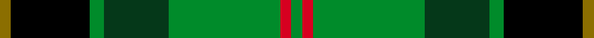

This page is one **sett** — a single exact thread-count. It belongs to the [tartan](/setts/y3k22g4dg18g31r3g3/)
(the same proportion at any scale), whose colour order is pattern [GKGGGRG](/stripes/gkgggrg/).

Sourced from register-of-tartans.  It is a [7 stripe tartan](/stripes/stripes7/).

Original link https://www.tartanregister.gov.uk/tartanDetails.aspx?ref=10888

2 attestations — the source records this cloth was collapsed from (oldest owns this page)

<ul>
<li>18/07/2013 — MacSween Hunting (Lochs, Isle of Lewis) (Personal) (register-of-tartans, <a href="https://www.tartanregister.gov.uk/tartanDetails.aspx?ref=10888">record</a>)  <em>Designed by Kinloch Anderson and Donald, Rory and Stuart MacSween. The colours and design of the MacSween tartan reflect the family's origins in the Isle of Lewis and its service in the UK Armed Forces. Black and green represent the Royal Green Jackets Regiment and the dark sea of the Minch, the sand colour represents 22 Special Air Service Regiment's operations in Oman's Qara mountains and desert during the Dhofar War. The ancient red represents a family link to the Seaforth and Cameron Highlanders and to the City of Liverpool.</em></li>
<li>2013 — MacSween Hunting (Lochs, Isle of Lew (tartans-authority, <a href="http://www.tartansauthority.com/tartan-ferret/display/10888/">record</a>)  <em>The colours and design of the MacSween tartan reflect the family's origins in the Isle of Lewis and its service in the UK Armed Forces. Black and green represent the Royal Green Jackets Regiment and the dark sea of the Minch, the sand colour represents 22 Special Air Service Regiment's operations in Oman's Qara mountains and desert during the Dhofar War. The ancient red represents a family link to the Seaforth and Cameron Highlanders and to the City of Liverpool.</em></li>
</ul>

## Register references

External register numbers recorded for this tartan.

- Scottish Register of Tartans: [10888](https://www.tartanregister.gov.uk/tartanDetails?ref=10888)
- Scottish Tartans Authority (ITI): 10888

## Thread count
Y/3 K22 G4 DG18 G31 R3 G/3

One full sett is **162 threads**.

## Palette
<table><thead><tr><th>Colour</th><th>Shade</th><th>OKLCh</th></tr></thead><tbody><tr><td>DG</td><td><code style="background-color:#053819;">#053819</code> <small style="color:#888">#053819</small></td><td><small style="color:#888">oklch(30.0% 0.075 151.3)</small></td></tr><tr><td>G</td><td><code style="background-color:#008B2A;">#008B2A</code> <small style="color:#888">#008B2A</small></td><td><small style="color:#888">oklch(55.4% 0.170 145.9)</small></td></tr><tr><td>K</td><td><code style="background-color:#000000;">#000000</code> <small style="color:#888">#000000</small></td><td><small style="color:#888">oklch(0.0% 0.000 0.0)</small></td></tr><tr><td>R</td><td><code style="background-color:#D60020;">#D60020</code> <small style="color:#888">#D60020</small></td><td><small style="color:#888">oklch(55.2% 0.224 25.5)</small></td></tr><tr><td>Y</td><td><code style="background-color:#8B6E00;">#8B6E00</code> <small style="color:#888">#8B6E00</small></td><td><small style="color:#888">oklch(55.1% 0.113 90.4)</small></td></tr></tbody></table>

# Sample pattern

## Nearest variants

The nearest existing variants by ΔTartan distance, with this cloth at the top so the swatches line up against it.

ΔTartan

Threads

Variant

Sett

—

162

<a href="/variants/s7/y3k22g4dg18g31r3g3/">MacSween Hunting (Lochs, Isle of Lewis) (Personal)</a>

<a href="/ttd/edit/#slug=ly3g24dt11g3k10g3w2~x2&amp;base=y3k22g4dg18g31r3g3" title="compare in the TTD">1.42</a>

214

<a href="/variants/s7/ly3g24dt11g3k10g3w2~x2/">Cornish Brewery, Green</a>

<a href="/ttd/edit/#slug=db3g19dg29k11r4y2~x2&amp;base=y3k22g4dg18g31r3g3" title="compare in the TTD">2.94</a>

262

<a href="/variants/s6/db3g19dg29k11r4y2~x2/">Zimmermann, Martin (Personal)</a>

## Neighbour map

Every grey dot is one of 13620 variants placed by the first two principal components of the ΔTartan feature space (42% of its variance). Red is this tartan; blue dots are its nearest — click one to open its page.

<svg viewBox="0 0 640 380" role="img" style="max-width:100%;height:auto;border:1px solid #e0e0e0;border-radius:4px;display:block" xmlns="http://www.w3.org/2000/svg"><image href="/nn/cloud.v1.png" width="640" height="380"/><a href="/variants/s7/ly3g24dt11g3k10g3w2~x2/"><circle cx="219.4" cy="165.8" r="4" fill="#3465a4"><title>Cornish Brewery, Green</title></circle></a><a href="/variants/s6/db3g19dg29k11r4y2~x2/"><circle cx="180.5" cy="162.1" r="4" fill="#3465a4"><title>Zimmermann, Martin (Personal)</title></circle></a><circle cx="182.0" cy="175.2" r="5" fill="#c00000"/><text x="320" y="376" text-anchor="middle" font-size="11" fill="#999">ground</text><text x="11" y="190" text-anchor="middle" font-size="11" fill="#999" transform="rotate(-90 11 190)">complexity</text></svg>

ID: /variants/s7/y3k22g4dg18g31r3g3/
