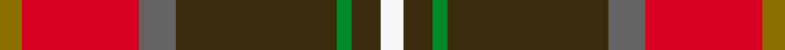

This page is one **sett** — a single exact thread-count. It belongs to the [tartan](/setts/y3r16n5dy22g2dy4w3/)
(the same proportion at any scale), whose colour order is pattern [GRBGGGW](/stripes/grbgggw/).

Sourced from register-of-tartans.  It is a [7 stripe tartan](/stripes/stripes7/).

Original link https://www.tartanregister.gov.uk/tartanDetails.aspx?ref=10668

## Provenance

Earliest known date: 06/08/2012 With over a decade of performing, the Pubcrawlers have firmly established themselves as a brand as well as a musical group, and the muted earthen tones of the Pubcrawler tartan reflect the colour palette that has come to be associated with both. Working together with members of the band, USA Kilts have crafted a tartan that represents not only the colours that have been the Pubcrawlers' trademark since 2002 (originally chosen as an amalgamation of the colours of several members' family tartans), but their physical location as well, having woven into the pattern the coordinates of Portland, Maine, the city that the band calls home. The Pubcrawlers take great pride in their tartan and will happily permit it to be worn by any members, friends, family and supporters of the band.

2 attestations — the source records this cloth was collapsed from (oldest owns this page)

<ul>
<li>06/08/2012 — Pubcrawlers, The (register-of-tartans, <a href="https://www.tartanregister.gov.uk/tartanDetails.aspx?ref=10668">record</a>)  <em>With over a decade of performing, the Pubcrawlers have firmly established themselves as a brand as well as a musical group, and the muted earthen tones of the Pubcrawler tartan reflect the colour palette that has come to be associated with both. Working together with members of the band, USA Kilts have crafted a tartan that represents not only the colours that have been the Pubcrawlers' trademark since 2002 (originally chosen as an amalgamation of the colours of several members' family tartans), but their physical location as well, having woven into the pattern the coordinates of Portland, Maine, the city that the band calls home. The Pubcrawlers take great pride in their tartan and will happily permit it to be worn by any members, friends, family and supporters of the band.</em></li>
<li>undated — Pubcrawlers, The Corporate Tartan (house-of-tartan, <a href="http://www.house-of-tartan.scotland.net/house/TartanViewjs.asp?colr=Def&tnam=10668">record</a>) </li>
</ul>

## Register references

External register numbers recorded for this tartan.

- Scottish Register of Tartans: [10668](https://www.tartanregister.gov.uk/tartanDetails.aspx?ref=10668)

## Thread count
Y/6 R32 N10 DY44 G4 DY8 W/6

One full sett is **208 threads**.

## Palette
<table><thead><tr><th>Colour</th><th>Shade</th><th>OKLCh</th></tr></thead><tbody><tr><td>G</td><td><code style="background-color:#008B2A;">#008B2A</code> <small style="color:#888">#008B2A</small></td><td><small style="color:#888">oklch(55.4% 0.170 145.9)</small></td></tr><tr><td>R</td><td><code style="background-color:#D60020;">#D60020</code> <small style="color:#888">#D60020</small></td><td><small style="color:#888">oklch(55.2% 0.224 25.5)</small></td></tr><tr><td>N</td><td><code style="background-color:#636363;">#636363</code> <small style="color:#888">#636363</small></td><td><small style="color:#888">oklch(50.0% 0.000 89.9)</small></td></tr><tr><td>W</td><td><code style="background-color:#F7F7F7;">#F7F7F7</code> <small style="color:#888">#F7F7F7</small></td><td><small style="color:#888">oklch(97.6% 0.000 89.9)</small></td></tr><tr><td>DY</td><td><code style="background-color:#3A2B0D;">#3A2B0D</code> <small style="color:#888">#3A2B0D</small></td><td><small style="color:#888">oklch(30.0% 0.049 82.0)</small></td></tr><tr><td>Y</td><td><code style="background-color:#8B6E00;">#8B6E00</code> <small style="color:#888">#8B6E00</small></td><td><small style="color:#888">oklch(55.1% 0.113 90.4)</small></td></tr></tbody></table>

# Sample pattern

## Nearest tartan variants

The nearest existing variants by ΔTartan distance, with this cloth at the top so the swatches line up against it.

ΔTartan

Threads

Variant

Sett

—

208

<a href="/variants/s7/y3r16n5dy22g2dy4w3~x2/">Pubcrawlers, The</a>

<a href="/ttd/edit/#slug=dy3dg8db12r24w3~x2&amp;base=y3r16n5dy22g2dy4w3~x2" title="compare in the TTD">2.58</a>

188

<a href="/variants/s5/dy3dg8db12r24w3~x2/">McGill University</a>

<a href="/ttd/edit/#slug=r15w1db4y1g15~x4&amp;base=y3r16n5dy22g2dy4w3~x2" title="compare in the TTD">2.89</a>

168

<a href="/variants/s5/r15w1db4y1g15~x4/">Eglinton, Duke of (Artefact)</a>

## Neighbour map

Every grey dot is one of 13620 variants placed by the first two principal components of the ΔTartan feature space (42% of its variance). Red is this tartan; blue dots are its nearest — click one to open its page.

<svg viewBox="0 0 640 380" role="img" style="max-width:100%;height:auto;border:1px solid #e0e0e0;border-radius:4px;display:block" xmlns="http://www.w3.org/2000/svg"><image href="/nn/cloud.v1.png" width="640" height="380"/><a href="/variants/s5/dy3dg8db12r24w3~x2/"><circle cx="227.7" cy="212.4" r="4" fill="#3465a4"><title>McGill University</title></circle></a><a href="/variants/s5/r15w1db4y1g15~x4/"><circle cx="257.2" cy="189.5" r="4" fill="#3465a4"><title>Eglinton, Duke of (Artefact)</title></circle></a><circle cx="241.6" cy="171.2" r="5" fill="#c00000"/><text x="320" y="376" text-anchor="middle" font-size="11" fill="#999">ground</text><text x="11" y="190" text-anchor="middle" font-size="11" fill="#999" transform="rotate(-90 11 190)">complexity</text></svg>

ID: /variants/s7/y3r16n5dy22g2dy4w3~x2/
