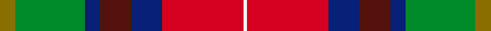

This page is one **sett** — a single exact thread-count. It belongs to the [tartan](/setts/y4g18db4dr8db8r21w1/)
(the same proportion at any scale), whose colour order is pattern [GGBBBRW](/stripes/ggbbbrw/).

Sourced from register-of-tartans.  It is a [7 stripe tartan](/stripes/stripes7/).

Original link https://www.tartanregister.gov.uk/tartanDetails.aspx?ref=10690

## Provenance

Earliest known date: 6 September 2012 This tartan was designed in Toronto, Canada by Hans Girdhari Bathija, Esq., born Feb 18, 1969, at Queen Mary's Maternity Home in Hampstead, London, England, United Kingdom. It is designed in honour of Mr. Girdhari Pribhdas Bathija, born to Mr. Pribhdas Jiwandas Bathija and Mrs. Laxmibai Bathija (née Chugh) on Feb. 6, 1940 in Shikarpur, Sindh, India (British) and Mrs. Susan Bathija, née Tan Saw Gaik, born to Mr. Tan Eng Hock and Ooi Cheng Kee on June 7, 1943 in Kampung Jawa, Butterworth, Province Wellesley, Penang, Straits Settlements, UK (Japanese Malai). It is to be worn primarily by their offspring, and their respective families. Other individuals who share the family name Bathija, or who are associated with a Bathija, are also invited to wear this tartan.

2 attestations — the source records this cloth was collapsed from (oldest owns this page)

<ul>
<li>31/08/2012 — G P Bathija (Shikarpur, Sindh) (register-of-tartans, <a href="https://www.tartanregister.gov.uk/tartanDetails.aspx?ref=10690">record</a>)  <em>This tartan was designed in Toronto, Canada by Hans Girdhari Bathija, Esq., born Feb 18, 1969, at Queen Mary's Maternity Home in Hampstead, London, England, United Kingdom. It is designed in honour of Mr. Girdhari Pribhdas Bathija, born to Mr. Pribhdas Jiwandas Bathija and Mrs. Laxmibai Bathija (née Chugh) on Feb. 6, 1940 in Shikarpur, Sindh, India (British) and Mrs. Susan Bathija, née Tan Saw Gaik, born to Mr. Tan Eng Hock and Ooi Cheng Kee on June 7, 1943 in Kampung Jawa, Butterworth, Province Wellesley, Penang, Straits Settlements, UK (Japanese Malai). It is to be worn primarily by their offspring, and their respective families. Other individuals who share the family name Bathija, or who are associated with a Bathija, are also invited to wear this tartan.</em></li>
<li>undated — G P Bathija (Shikarpur, Sindh) Name Tartan (house-of-tartan, <a href="http://www.house-of-tartan.scotland.net/house/TartanViewjs.asp?colr=Def&tnam=10690">record</a>) </li>
</ul>

## Register references

External register numbers recorded for this tartan.

- Scottish Register of Tartans: [10690](https://www.tartanregister.gov.uk/tartanDetails.aspx?ref=10690)

## Thread count
Y/8 G36 DB8 DR16 DB16 R42 W/2

One full sett is **246 threads**.

## Palette
<table><thead><tr><th>Colour</th><th>Shade</th><th>OKLCh</th></tr></thead><tbody><tr><td>DB</td><td><code style="background-color:#082077;">#082077</code> <small style="color:#888">#082077</small></td><td><small style="color:#888">oklch(30.0% 0.149 265.1)</small></td></tr><tr><td>G</td><td><code style="background-color:#008B2A;">#008B2A</code> <small style="color:#888">#008B2A</small></td><td><small style="color:#888">oklch(55.4% 0.170 145.9)</small></td></tr><tr><td>R</td><td><code style="background-color:#D60020;">#D60020</code> <small style="color:#888">#D60020</small></td><td><small style="color:#888">oklch(55.2% 0.224 25.5)</small></td></tr><tr><td>DR</td><td><code style="background-color:#55120C;">#55120C</code> <small style="color:#888">#55120C</small></td><td><small style="color:#888">oklch(30.0% 0.099 29.3)</small></td></tr><tr><td>W</td><td><code style="background-color:#F7F7F7;">#F7F7F7</code> <small style="color:#888">#F7F7F7</small></td><td><small style="color:#888">oklch(97.6% 0.000 89.9)</small></td></tr><tr><td>Y</td><td><code style="background-color:#8B6E00;">#8B6E00</code> <small style="color:#888">#8B6E00</small></td><td><small style="color:#888">oklch(55.1% 0.113 90.4)</small></td></tr></tbody></table>

# Sample pattern

## Nearest tartan variants

The nearest existing variants by ΔTartan distance, with this cloth at the top so the swatches line up against it.

ΔTartan

Threads

Variant

Sett

—

246

<a href="/variants/s7/y4g18db4dr8db8r21w1~x2/">G P Bathija (Shikarpur, Sindh)</a>

<a href="/ttd/edit/#slug=ly4g18t4r8t8ri21w1~x2~r1807033-ri2109032&amp;base=y4g18db4dr8db8r21w1~x2" title="compare in the TTD">0.00</a>

246

<a href="/variants/s7/ly4g18t4r8t8ri21w1~x2~r1807033-ri2109032/">Bathija (Name)</a>

<a href="/ttd/edit/#slug=g9y2g6r35db6lb1dr20db5lb2~x2&amp;base=y4g18db4dr8db8r21w1~x2" title="compare in the TTD">2.41</a>

322

<a href="/variants/s9/g9y2g6r35db6lb1dr20db5lb2~x2/">Telfer (Name)</a>

<a href="/ttd/edit/#slug=g9dy2g6r35db6lb1dr20db5lb2~x2&amp;base=y4g18db4dr8db8r21w1~x2" title="compare in the TTD">2.41</a>

322

<a href="/variants/s9/g9dy2g6r35db6lb1dr20db5lb2~x2/">Telfer</a>

<a href="/ttd/edit/#slug=g9y2g6r35db6lb1dr20db5lb2~x2~r2109032-db1004274&amp;base=y4g18db4dr8db8r21w1~x2" title="compare in the TTD">2.41</a>

322

<a href="/variants/s9/g9y2g6r35db6lb1dr20db5lb2~x2~r2109032-db1004274/">Telfer Name Tartan</a>

<a href="/ttd/edit/#slug=db4g2r18dr10g10db29b4~x2~db1003265-b1813263&amp;base=y4g18db4dr8db8r21w1~x2" title="compare in the TTD">2.59</a>

292

<a href="/variants/s7/db4g2r18dr10g10db29b4~x2~db1003265-b1813263/">Ross Dempster (Personal)</a>

<a href="/ttd/edit/#slug=r22w1y7w1g21w1db12w1dr1w1r8~x2&amp;base=y4g18db4dr8db8r21w1~x2" title="compare in the TTD">2.72</a>

244

<a href="/variants/s11/r22w1y7w1g21w1db12w1dr1w1r8~x2/">Bendigo</a>

## Neighbour map

Every grey dot is one of 13620 variants placed by the first two principal components of the ΔTartan feature space (42% of its variance). Red is this tartan; blue dots are its nearest — click one to open its page.

<svg viewBox="0 0 640 380" role="img" style="max-width:100%;height:auto;border:1px solid #e0e0e0;border-radius:4px;display:block" xmlns="http://www.w3.org/2000/svg"><image href="/nn/cloud.v1.png" width="640" height="380"/><a href="/variants/s7/ly4g18t4r8t8ri21w1~x2~r1807033-ri2109032/"><circle cx="197.7" cy="177.0" r="4" fill="#3465a4"><title>Bathija (Name)</title></circle></a><a href="/variants/s9/g9y2g6r35db6lb1dr20db5lb2~x2/"><circle cx="240.5" cy="104.9" r="4" fill="#3465a4"><title>Telfer (Name)</title></circle></a><a href="/variants/s9/g9dy2g6r35db6lb1dr20db5lb2~x2/"><circle cx="239.8" cy="104.6" r="4" fill="#3465a4"><title>Telfer</title></circle></a><a href="/variants/s9/g9y2g6r35db6lb1dr20db5lb2~x2~r2109032-db1004274/"><circle cx="250.5" cy="108.6" r="4" fill="#3465a4"><title>Telfer Name Tartan</title></circle></a><a href="/variants/s7/db4g2r18dr10g10db29b4~x2~db1003265-b1813263/"><circle cx="222.0" cy="184.0" r="4" fill="#3465a4"><title>Ross Dempster (Personal)</title></circle></a><a href="/variants/s11/r22w1y7w1g21w1db12w1dr1w1r8~x2/"><circle cx="198.8" cy="110.3" r="4" fill="#3465a4"><title>Bendigo</title></circle></a><circle cx="171.4" cy="166.0" r="5" fill="#c00000"/><text x="320" y="376" text-anchor="middle" font-size="11" fill="#999">ground</text><text x="11" y="190" text-anchor="middle" font-size="11" fill="#999" transform="rotate(-90 11 190)">complexity</text></svg>

ID: /variants/s7/y4g18db4dr8db8r21w1~x2/
