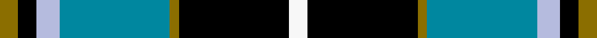

This page is one **sett** — a single exact thread-count. It belongs to the [tartan](/setts/y4k4lb5t24y2k24w4/)
(the same proportion at any scale), whose colour order is pattern [GKWBGKW](/stripes/gkwbgkw/).

Sourced from register-of-tartans.  It is a [7 stripe tartan](/stripes/stripes7/).

Original link https://www.tartanregister.gov.uk/tartanDetails.aspx?ref=2960

2 attestations — the source records this cloth was collapsed from (oldest owns this page)

<ul>
<li>01/01/2003 — Mina Perhonen (register-of-tartans, <a href="https://www.tartanregister.gov.uk/tartanDetails.aspx?ref=2960">record</a>)  <em>Designed by Fiona Hall of Lochcarron as a corporate tartan for the Mina Company of Tokyo whose logo is a butterfly. The blues are from the company's colours and represent the sky, the yellow represents the butterfly and the white is for the clouds. 'Perhonen' is Finnish for butterfly and chosen because the Japanese design world has a great affinity with some Scandinavian countries.</em></li>
<li>pre 2003 — Mina Perhonen (Corporate) (tartans-authority, <a href="https://www.tartanregister.gov.uk/tartanDetails.aspx?ref=5797">record</a>)  <em>Designed by Fiona Hall of Lochcarron as a corporate tartan for the Mina Company of Tokyo whose logo is a butterfly. The blues are from the compa y's colours and represent the sky, the yellow represents the butterfly and the white is for the clouds.'Perhonen' is Finnish for butterfly and chosen because the Japanese design world has a great affinity with some Scandinavian countries.</em></li>
</ul>

Dataset <small>— provenance for this record, inherited from the source manifest</small>

<dl class="dataset-prov">
<dt>source</dt><dd><a href="/sources/register-of-tartans/">Scottish Register of Tartans</a></dd>
<dt>data captured from</dt><dd><a href="https://github.com/thetartan/tartan-database/blob/master/data/register-of-tartans/data.csv">https://github.com/thetartan/tartan-database/blob/master/data/register-of-tartans/data.csv</a></dd>
<dt>data date</dt><dd>2003 <small>(this record)</small></dd>
<dt>licence</dt><dd><a href="https://www.tartanregister.gov.uk/copyright">Crown copyright</a></dd>
</dl>

Capture chain <small>— the hands this data passed through, oldest first; each capture carries its own licence</small>

<ol class="capture-chain">
<li><a href="https://www.tartanregister.gov.uk/">Scottish Register of Tartans</a> · <a href="https://www.tartanregister.gov.uk/copyright">Crown copyright</a> <small>the living register — still published by National Records of Scotland</small></li>
<li><a href="https://github.com/thetartan/tartan-database">thetartan/tartan-database</a> <small>2016-2017</small> · <a href="https://creativecommons.org/licenses/by-nc-nd/4.0/">CC BY-NC-ND 4.0</a> <small>Levko Kravets's frozen compilation — the capture we vendored, and where its CC licence text came from</small></li>
<li>this dictionary <small>captured 2026-06-10 · commit 5bf86c7566</small> <small>each re-capture is a git commit to data/sources</small></li>
</ol>

## Register references

External register numbers recorded for this tartan.

- Scottish Register of Tartans: [2960](https://www.tartanregister.gov.uk/tartanDetails.aspx?ref=2960)
- Scottish Tartans Authority (ITI): 5797

## Thread count
Y/8 K8 LB10 T48 Y4 K48 W/8

One full sett is **252 threads**.

## Palette
<table><thead><tr><th>Colour</th><th>Shade</th><th>OKLCh</th></tr></thead><tbody><tr><td>LB</td><td><code style="background-color:#B5BBDE;">#B5BBDE</code> <small style="color:#888">#B5BBDE</small></td><td><small style="color:#888">oklch(79.9% 0.050 277.6)</small></td></tr><tr><td>T</td><td><code style="background-color:#00879F;">#00879F</code> <small style="color:#888">#00879F</small></td><td><small style="color:#888">oklch(57.4% 0.102 216.1)</small></td></tr><tr><td>K</td><td><code style="background-color:#000000;">#000000</code> <small style="color:#888">#000000</small></td><td><small style="color:#888">oklch(0.0% 0.000 0.0)</small></td></tr><tr><td>W</td><td><code style="background-color:#F7F7F7;">#F7F7F7</code> <small style="color:#888">#F7F7F7</small></td><td><small style="color:#888">oklch(97.6% 0.000 89.9)</small></td></tr><tr><td>Y</td><td><code style="background-color:#8B6E00;">#8B6E00</code> <small style="color:#888">#8B6E00</small></td><td><small style="color:#888">oklch(55.1% 0.113 90.4)</small></td></tr></tbody></table>

# Sample pattern

## Nearest tartan variants

The nearest existing variants by ΔTartan distance, with this cloth at the top so the swatches line up against it.

ΔTartan

Threads

Variant

Sett

—

252

<a href="/variants/s7/y4k4lb5t24y2k24w4~x2/">Mina Perhonen</a>

<a href="/ttd/edit/#slug=w2k11y11db3k1r1~x2&amp;base=y4k4lb5t24y2k24w4~x2" title="compare in the TTD">1.54</a>

110

<a href="/variants/s6/w2k11y11db3k1r1~x2/">Cornish National #2</a>

<a href="/ttd/edit/#slug=r1t10k2w4k4y1~x6&amp;base=y4k4lb5t24y2k24w4~x2" title="compare in the TTD">1.66</a>

252

<a href="/variants/s6/r1t10k2w4k4y1~x6/">Thomson Dress (Blue)</a>

<a href="/ttd/edit/#slug=r12db68w7k39g75r6g6&amp;base=y4k4lb5t24y2k24w4~x2" title="compare in the TTD">1.82</a>

408

<a href="/variants/s7/r12db68w7k39g75r6g6/">Rhun (Fashion)</a>

<a href="/ttd/edit/#slug=db12k4g4r1g4k1lo1~x4&amp;base=y4k4lb5t24y2k24w4~x2" title="compare in the TTD">1.90</a>

164

<a href="/variants/s7/db12k4g4r1g4k1lo1~x4/">MacLaren (Clan)</a>

<a href="/ttd/edit/#slug=db22r3db2r3db2k17g18ly4~x2&amp;base=y4k4lb5t24y2k24w4~x2" title="compare in the TTD">1.93</a>

232

<a href="/variants/s8/db22r3db2r3db2k17g18ly4~x2/">Scotch House 2000 Original</a>

<a href="/ttd/edit/#slug=g3db12w1k12g13r2g2~x4&amp;base=y4k4lb5t24y2k24w4~x2" title="compare in the TTD">1.99</a>

340

<a href="/variants/s7/g3db12w1k12g13r2g2~x4/">MacFadzean/MacPhedran</a>

<a href="/ttd/edit/#slug=g3db12w1k12g13r2g2~x2&amp;base=y4k4lb5t24y2k24w4~x2" title="compare in the TTD">1.99</a>

170

<a href="/variants/s7/g3db12w1k12g13r2g2~x2/">Paterson (Personal)</a>

<a href="/ttd/edit/#slug=dr4t28k6lr12k12lo3~x2~t2503227-lr3200000&amp;base=y4k4lb5t24y2k24w4~x2" title="compare in the TTD">2.00</a>

246

<a href="/variants/s6/dr4t28k6lb12k12lo3~x2~t2503227-lb3200000/">MacTavish Dress</a>

<a href="/ttd/edit/#slug=db44ly3k20dr3db8lg34db5lg15~x2&amp;base=y4k4lb5t24y2k24w4~x2" title="compare in the TTD">2.01</a>

410

<a href="/variants/s8/db44ly3k20dr3db8lg34db5lg15~x2/">US Air Force Reserve Pipe Band</a>

<a href="/ttd/edit/#slug=db44k23dr3db8lg34db5lg15~x2&amp;base=y4k4lb5t24y2k24w4~x2" title="compare in the TTD">2.02</a>

410

<a href="/variants/s7/db44k23dr3db8lg34db5lg15~x2/">US Air Force Reserve Pipe Band Military Tartan</a>

## Neighbour map

Every grey dot is one of 13620 variants placed by the first two principal components of the ΔTartan feature space (42% of its variance). Red is this tartan; blue dots are its nearest — click one to open its page.

<svg viewBox="0 0 640 380" role="img" style="max-width:100%;height:auto;border:1px solid #e0e0e0;border-radius:4px;display:block" xmlns="http://www.w3.org/2000/svg"><image href="/nn/cloud.v1.png" width="640" height="380"/><a href="/variants/s6/w2k11y11db3k1r1~x2/"><circle cx="163.4" cy="162.6" r="4" fill="#3465a4"><title>Cornish National #2</title></circle></a><a href="/variants/s6/r1t10k2w4k4y1~x6/"><circle cx="156.7" cy="175.2" r="4" fill="#3465a4"><title>Thomson Dress (Blue)</title></circle></a><a href="/variants/s7/r12db68w7k39g75r6g6/"><circle cx="149.5" cy="161.7" r="4" fill="#3465a4"><title>Rhun (Fashion)</title></circle></a><a href="/variants/s7/db12k4g4r1g4k1lo1~x4/"><circle cx="188.1" cy="163.0" r="4" fill="#3465a4"><title>MacLaren (Clan)</title></circle></a><a href="/variants/s8/db22r3db2r3db2k17g18ly4~x2/"><circle cx="131.9" cy="162.9" r="4" fill="#3465a4"><title>Scotch House 2000 Original</title></circle></a><a href="/variants/s7/g3db12w1k12g13r2g2~x4/"><circle cx="151.1" cy="170.1" r="4" fill="#3465a4"><title>MacFadzean/MacPhedran</title></circle></a><a href="/variants/s7/g3db12w1k12g13r2g2~x2/"><circle cx="151.1" cy="170.1" r="4" fill="#3465a4"><title>Paterson (Personal)</title></circle></a><a href="/variants/s6/dr4t28k6lb12k12lo3~x2~t2503227-lb3200000/"><circle cx="149.8" cy="186.7" r="4" fill="#3465a4"><title>MacTavish Dress</title></circle></a><a href="/variants/s8/db44ly3k20dr3db8lg34db5lg15~x2/"><circle cx="173.7" cy="154.2" r="4" fill="#3465a4"><title>US Air Force Reserve Pipe Band</title></circle></a><a href="/variants/s7/db44k23dr3db8lg34db5lg15~x2/"><circle cx="163.4" cy="147.2" r="4" fill="#3465a4"><title>US Air Force Reserve Pipe Band Military Tartan</title></circle></a><circle cx="158.5" cy="154.5" r="5" fill="#c00000"/><text x="320" y="376" text-anchor="middle" font-size="11" fill="#999">ground</text><text x="11" y="190" text-anchor="middle" font-size="11" fill="#999" transform="rotate(-90 11 190)">complexity</text></svg>

ID: /variants/s7/y4k4lb5t24y2k24w4~x2/
