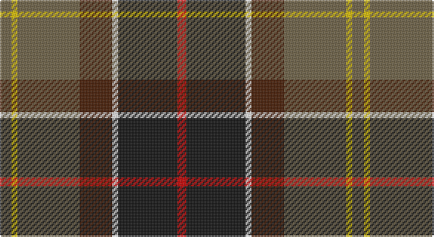

This page is one **sett** — a single exact thread-count. It belongs to the [tartan](/setts/y4ly2y21do11w2k20r3/)
(the same proportion at any scale), whose colour order is pattern [GYGBWKR](/stripes/gygbwkr/).

Sourced from house-of-tartan.  It is a [7 stripe tartan](/stripes/stripes7/).

Original link http://www.house-of-tartan.scotland.net/house/TartanViewjs.asp?colr=Def&tnam=2489

## Provenance

Earliest known date: 1998 For the linings of Barbour's famous wax jackets. Tartan designed by Kinloch Anderson of Edinburgh.

## Thread count
N/8 Y4 N42 DR22 W4 K40 R/6

One full sett is **238 threads**.

## Palette

Palette: <strong>Tartan Register</strong> <small style="color:#888">(5 of 6 colours)</small>
<table><thead><tr><th>Colour</th><th>Threads</th><th>Shade</th><th>Base</th><th>OKLCh</th></tr></thead><tbody><tr><td>N/</td><td style="text-align:right;font-variant-numeric:tabular-nums">8</td><td><code style="background-color:#6C6044;">#6C6044</code> <small style="color:#888">#6C6044</small></td><td>G <code style="background-color:#006100;">#006100</code></td><td><small style="color:#888">oklch(49.3% 0.044 87.4)</small></td></tr><tr><td>Y</td><td style="text-align:right;font-variant-numeric:tabular-nums">4</td><td><code style="background-color:#E8C000;">#E8C000</code> <small style="color:#888">#E8C000</small></td><td>Y <code style="background-color:#F2BF00;">#F2BF00</code></td><td><small style="color:#888">oklch(81.9% 0.168 93.7)</small></td></tr><tr><td>N</td><td style="text-align:right;font-variant-numeric:tabular-nums">42</td><td><code style="background-color:#6C6044;">#6C6044</code> <small style="color:#888">#6C6044</small></td><td>G <code style="background-color:#006100;">#006100</code></td><td><small style="color:#888">oklch(49.3% 0.044 87.4)</small></td></tr><tr><td>DR</td><td style="text-align:right;font-variant-numeric:tabular-nums">22</td><td><code style="background-color:#441800;">#441800</code> <small style="color:#888">#441800</small></td><td>B <code style="background-color:#2A418A;">#2A418A</code></td><td><small style="color:#888">oklch(27.3% 0.076 46.3)</small></td></tr><tr><td>W</td><td style="text-align:right;font-variant-numeric:tabular-nums">4</td><td><code style="background-color:#FCFCFC;">#FCFCFC</code> <small style="color:#888">#FCFCFC</small></td><td>W <code style="background-color:#F7F7F7;">#F7F7F7</code></td><td><small style="color:#888">oklch(99.1% 0.000 89.9)</small></td></tr><tr><td>K</td><td style="text-align:right;font-variant-numeric:tabular-nums">40</td><td><code style="background-color:#101010;">#101010</code> <small style="color:#888">#101010</small></td><td>K <code style="background-color:#000000;">#000000</code></td><td><small style="color:#888">oklch(17.3% 0.000 89.9)</small></td></tr><tr><td>R/</td><td style="text-align:right;font-variant-numeric:tabular-nums">6</td><td><code style="background-color:#C80000;">#C80000</code> <small style="color:#888">#C80000</small></td><td>R <code style="background-color:#CC0000;">#CC0000</code></td><td><small style="color:#888">oklch(52.3% 0.215 29.2)</small></td></tr></tbody></table>

# Sample pattern

## Nearest tartans

The nearest existing variants by ΔTartan distance, with this tartan at the top so the swatches line up against it.

ΔTartan

Tartan

Sett

—

<a href="/ttd/edit/#slug=y4ly2y21do11w2k20r3~x2">Barbour Corporate Tartan</a> <a class="nn-out" href="/variants/s7/y4ly2y21do11w2k20r3~x2/" title="open its dictionary page">↗</a>

0.63

<a href="/ttd/edit/#slug=o4ly2o21dy11w2k20r3~x2&amp;base=y4ly2y21do11w2k20r3~x2">Barbour - Classic</a> <a class="nn-out" href="/variants/s7/o4ly2o21dy11w2k20r3~x2/" title="open its dictionary page">↗</a>

0.66

<a href="/ttd/edit/#slug=r3k20w2dy11o21ly2o2~x2&amp;base=y4ly2y21do11w2k20r3~x2">Barbour</a> <a class="nn-out" href="/variants/s7/r3k20w2dy11o21ly2o2~x2/" title="open its dictionary page">↗</a>

0.75

<a href="/ttd/edit/#slug=r2lb1r8k4db1g10lr1g2~x4&amp;base=y4ly2y21do11w2k20r3~x2">Sawyer</a> <a class="nn-out" href="/variants/s8/r2lb1r8k4db1g10lr1g2~x4/" title="open its dictionary page">↗</a>

0.79

<a href="/ttd/edit/#slug=w2dp20r3k10g20lo2~x2&amp;base=y4ly2y21do11w2k20r3~x2">Morris of Balgonie (Personal)</a> <a class="nn-out" href="/variants/s6/w2dp20r3k10g20lo2~x2/" title="open its dictionary page">↗</a>

1.02

<a href="/ttd/edit/#slug=dr6k1lo1k2db2dr4g8k1r2~x4&amp;base=y4ly2y21do11w2k20r3~x2">Bicentenary (Commemorative)</a> <a class="nn-out" href="/variants/s9/dr6k1lo1k2db2dr4g8k1r2~x4/" title="open its dictionary page">↗</a>

1.06

<a href="/ttd/edit/#slug=ly2dy20k10db3dg20lb2~x2&amp;base=y4ly2y21do11w2k20r3~x2">Morris of Balgonie Htg (Personal)</a> <a class="nn-out" href="/variants/s6/ly2dy20k10db3dg20lb2~x2/" title="open its dictionary page">↗</a>

1.08

<a href="/ttd/edit/#slug=g22w3k2ly3k19r18db4~x2&amp;base=y4ly2y21do11w2k20r3~x2">Scotch House 2000 Dress</a> <a class="nn-out" href="/variants/s7/g22w3k2ly3k19r18db4~x2/" title="open its dictionary page">↗</a>

1.08

<a href="/ttd/edit/#slug=lb4k13g6r16lbi2r2g2~x2&amp;base=y4ly2y21do11w2k20r3~x2">Caledonian Brewery Corporate Tartan</a> <a class="nn-out" href="/variants/s7/lb4k13g6r16lbi2r2g2~x2/" title="open its dictionary page">↗</a>

1.10

<a href="/ttd/edit/#slug=db4r11db1g8r2g4k1lo2~x4&amp;base=y4ly2y21do11w2k20r3~x2">Craik of Assington (Personal)</a> <a class="nn-out" href="/variants/s8/db4r11db1g8r2g4k1lo2~x4/" title="open its dictionary page">↗</a>

1.11

<a href="/ttd/edit/#slug=o4ly2o21dr11w2k20r3~x2&amp;base=y4ly2y21do11w2k20r3~x2">Barbour</a> <a class="nn-out" href="/variants/s7/o4ly2o21dr11w2k20r3~x2/" title="open its dictionary page">↗</a>

## Neighbour map

Every grey dot is one of 14360 variants placed by the first two principal components of the ΔTartan feature space (44% of its variance). Red is this tartan; blue dots are its nearest — click one to open its page.

<svg viewBox="0 0 640 380" role="img" style="max-width:100%;height:auto;border:1px solid #e0e0e0;border-radius:4px;display:block" xmlns="http://www.w3.org/2000/svg"><image href="/nn/cloud.v1.png" width="640" height="380"/><a href="/variants/s7/o4ly2o21dy11w2k20r3~x2/"><circle cx="172.0" cy="161.4" r="4" fill="#3465a4"><title>Barbour - Classic</title></circle></a><a href="/variants/s7/r3k20w2dy11o21ly2o2~x2/"><circle cx="166.7" cy="156.9" r="4" fill="#3465a4"><title>Barbour</title></circle></a><a href="/variants/s8/r2lb1r8k4db1g10lr1g2~x4/"><circle cx="190.6" cy="163.7" r="4" fill="#3465a4"><title>Sawyer</title></circle></a><a href="/variants/s6/w2dp20r3k10g20lo2~x2/"><circle cx="151.3" cy="179.8" r="4" fill="#3465a4"><title>Morris of Balgonie (Personal)</title></circle></a><a href="/variants/s9/dr6k1lo1k2db2dr4g8k1r2~x4/"><circle cx="139.2" cy="182.2" r="4" fill="#3465a4"><title>Bicentenary (Commemorative)</title></circle></a><a href="/variants/s6/ly2dy20k10db3dg20lb2~x2/"><circle cx="157.8" cy="190.6" r="4" fill="#3465a4"><title>Morris of Balgonie Htg (Personal)</title></circle></a><a href="/variants/s7/g22w3k2ly3k19r18db4~x2/"><circle cx="112.3" cy="159.2" r="4" fill="#3465a4"><title>Scotch House 2000 Dress</title></circle></a><a href="/variants/s7/lb4k13g6r16lbi2r2g2~x2/"><circle cx="171.7" cy="189.2" r="4" fill="#3465a4"><title>Caledonian Brewery Corporate Tartan</title></circle></a><a href="/variants/s8/db4r11db1g8r2g4k1lo2~x4/"><circle cx="208.9" cy="187.6" r="4" fill="#3465a4"><title>Craik of Assington (Personal)</title></circle></a><a href="/variants/s7/o4ly2o21dr11w2k20r3~x2/"><circle cx="152.3" cy="156.8" r="4" fill="#3465a4"><title>Barbour</title></circle></a><circle cx="175.8" cy="169.4" r="5" fill="#c00000"/></svg>

ID: /variants/s7/y4ly2y21do11w2k20r3~x2/
