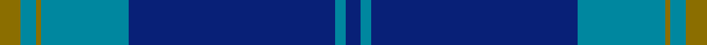

This is one **variant** — a specific cloth: this exact thread count and colourway, with its own
provenance below. It is one weaving of the [sett](/tartans/d/da/danzas/) (the scale-free proportion — the
same cloth at any scale or shade), whose colour order is pattern [BBBBGBG](/stripes/bbbbgbg/).

Part of the [Danzas](/tartans/d/da/danzas/) tartan — the named design grouping this sett with its other cloths.

Sourced from register-of-tartans.  It is a [7 stripe tartan](/stripes/stripes7/).

Original link [https://www.tartanregister.gov.uk/tartanDetails.aspx?ref=888](https://www.tartanregister.gov.uk/tartanDetails.aspx?ref=888)

2 attestations — the source records this cloth was collapsed from (oldest owns this page)

<ul>
<li>01/02/2000 — Danzas (register-of-tartans, <a href="https://www.tartanregister.gov.uk/tartanDetails.aspx?ref=888">record</a>)  <em>A corporate tartan for Danzas (UK) - a cargo handling company based in Scotland. Scottish Tartans Society data calls for colour MB - assume this is muted blue and have used ancient in its place.</em></li>
<li>Feb. 2000 — Danzas (Corporate) (tartans-authority, <a href="https://web.archive.org/web/*/http://www.tartansauthority.com/tartan-ferret/display/2666/*">record</a>)  <em>A corporate tartan for Danzas (UK) - a cargo handling company based in Scotland - uisng their corporate colours.</em></li>
</ul>

Dataset <small>— provenance for this record, inherited from the source manifest</small>

<dl class="dataset-prov">
<dt>source</dt><dd><a href="/sources/register-of-tartans/">Scottish Register of Tartans</a></dd>
<dt>data captured from</dt><dd><a href="https://github.com/thetartan/tartan-database/blob/master/data/register-of-tartans/data.csv">https://github.com/thetartan/tartan-database/blob/master/data/register-of-tartans/data.csv</a></dd>
<dt>data date</dt><dd>01/02/2000 <small>(this record)</small></dd>
<dt>licence</dt><dd><a href="https://www.tartanregister.gov.uk/copyright">Crown copyright</a></dd>
</dl>

Capture chain <small>— the hands this data passed through, oldest first; each capture carries its own licence</small>

<ol class="capture-chain">
<li><a href="https://www.tartanregister.gov.uk/">Scottish Register of Tartans</a> · <a href="https://www.tartanregister.gov.uk/copyright">Crown copyright</a> <small>the living register — still published by National Records of Scotland</small></li>
<li><a href="https://github.com/thetartan/tartan-database">thetartan/tartan-database</a> <small>2016-2017</small> · <a href="https://creativecommons.org/licenses/by-nc-nd/4.0/">CC BY-NC-ND 4.0</a> <small>Levko Kravets's frozen compilation — the capture we vendored, and where its CC licence text came from</small></li>
<li>this dictionary <small>captured 2026-06-10 · commit 5bf86c7566</small> <small>each re-capture is a git commit to data/sources</small></li>
</ol>

## Register references

External register numbers recorded for this tartan.

- Scottish Register of Tartans: [888](https://www.tartanregister.gov.uk/tartanDetails.aspx?ref=888)
- Scottish Tartans Authority (ITI): 2666
- Scottish Tartans World Register: 2666

## Thread count
Y/8 T6 Y2 T34 DB80 T4 DB/6

One full sett is **266 threads**.

## Palette
<table><thead><tr><th>Colour</th><th>Shade</th><th>OKLCh</th></tr></thead><tbody><tr><td>T</td><td><code style="background-color:#00879F;">#00879F</code> <small style="color:#888">#00879F</small></td><td><small style="color:#888">oklch(57.4% 0.102 216.1)</small></td></tr><tr><td>DB</td><td><code style="background-color:#082077;">#082077</code> <small style="color:#888">#082077</small></td><td><small style="color:#888">oklch(30.0% 0.149 265.1)</small></td></tr><tr><td>Y</td><td><code style="background-color:#8B6E00;">#8B6E00</code> <small style="color:#888">#8B6E00</small></td><td><small style="color:#888">oklch(55.1% 0.113 90.4)</small></td></tr></tbody></table>

# Sample pattern

## Nearest tartan variants

The nearest existing variants by ΔTartan distance, with this cloth at the top so the swatches line up against it.

ΔTartan

Threads

Variant

Sett

—

266

<a href="/variants/s7/y4t3y1t17db40t2db3~x2/">Danzas</a>

<a href="/ttd/edit/#slug=y4b3y1b17db40b2db3~x2&amp;base=y4t3y1t17db40t2db3~x2" title="compare in the TTD">0.08</a>

266

<a href="/variants/s7/y4b3y1b17db40b2db3~x2/">Danzas</a>

<a href="/ttd/edit/#slug=db13b1db3b6y1b1~x4&amp;base=y4t3y1t17db40t2db3~x2" title="compare in the TTD">0.88</a>

144

<a href="/variants/s6/db13b1db3b6y1b1~x4/">Hepburn</a>

<a href="/ttd/edit/#slug=y3b40db27b3db3b3&amp;base=y4t3y1t17db40t2db3~x2" title="compare in the TTD">1.29</a>

152

<a href="/variants/s6/y3b40db27b3db3b3/">Keeper of the Quaich</a>

<a href="/ttd/edit/#slug=t15db65y7t4y3db30t15w3~x2&amp;base=y4t3y1t17db40t2db3~x2" title="compare in the TTD">1.90</a>

532

<a href="/variants/s8/t15db65y7t4y3db30t15w3~x2/">Hoosier (Fashion)</a>

<a href="/ttd/edit/#slug=db28o3lb1o3db4lb2dp1lb5~x4&amp;base=y4t3y1t17db40t2db3~x2" title="compare in the TTD">2.00</a>

244

<a href="/variants/s8/db28o3lb1o3db4lb2dp1lb5~x4/">Baker</a>

<a href="/ttd/edit/#slug=db104dbi16w8dbi66r3dbi16~db1913264-dbi3911270&amp;base=y4t3y1t17db40t2db3~x2" title="compare in the TTD">2.65</a>

306

<a href="/variants/s6/db104dbi16w8dbi66r3dbi16~db1913264-dbi3911270/">Edzell, U.S. Navy</a>

<a href="/ttd/edit/#slug=db45dbi7w3dbi27r1dbi7~x2~db1913264-dbi3911270&amp;base=y4t3y1t17db40t2db3~x2" title="compare in the TTD">2.67</a>

256

<a href="/variants/s6/db45dbi7w3dbi27r1dbi7~x2~db1913264-dbi3911270/">Edzell, U.S. Navy</a>

<a href="/ttd/edit/#slug=db51t8w4t30r1t9~x2&amp;base=y4t3y1t17db40t2db3~x2" title="compare in the TTD">2.70</a>

292

<a href="/variants/s6/db51t8w4t30r1t9~x2/">Navy-Radar</a>

<a href="/ttd/edit/#slug=db144dr9lb44db4lb4db4&amp;base=y4t3y1t17db40t2db3~x2" title="compare in the TTD">2.72</a>

270

<a href="/variants/s6/db144dr9lb44db4lb4db4/">United French Freemasons (Corporate</a>

<a href="/ttd/edit/#slug=db2b2r1b16w1db20r2~x2&amp;base=y4t3y1t17db40t2db3~x2" title="compare in the TTD">2.73</a>

168

<a href="/variants/s7/db2b2r1b16w1db20r2~x2/">British American School (Corporate)</a>

## Neighbour map

Every grey dot is one of 13662 variants placed by the first two principal components of the ΔTartan feature space (42% of its variance). Red is this tartan; blue dots are its nearest — click one to open its page. The map is a flat projection of a many-dimensional space — [how to read it](/posts/neighbourhood-maps/).

<svg viewBox="0 0 640 380" role="img" style="max-width:100%;height:auto;border:1px solid #e0e0e0;border-radius:4px;display:block" xmlns="http://www.w3.org/2000/svg"><image href="/nn/cloud.v1.png" width="640" height="380"/><a href="/variants/s7/y4b3y1b17db40b2db3~x2/"><circle cx="526.2" cy="177.4" r="4" fill="#3465a4"><title>Danzas</title></circle></a><a href="/variants/s6/db13b1db3b6y1b1~x4/"><circle cx="513.1" cy="245.5" r="4" fill="#3465a4"><title>Hepburn</title></circle></a><a href="/variants/s6/y3b40db27b3db3b3/"><circle cx="492.3" cy="241.4" r="4" fill="#3465a4"><title>Keeper of the Quaich</title></circle></a><a href="/variants/s8/t15db65y7t4y3db30t15w3~x2/"><circle cx="461.3" cy="179.2" r="4" fill="#3465a4"><title>Hoosier (Fashion)</title></circle></a><a href="/variants/s8/db28o3lb1o3db4lb2dp1lb5~x4/"><circle cx="433.9" cy="123.6" r="4" fill="#3465a4"><title>Baker</title></circle></a><a href="/variants/s6/db104dbi16w8dbi66r3dbi16~db1913264-dbi3911270/"><circle cx="400.2" cy="172.6" r="4" fill="#3465a4"><title>Edzell, U.S. Navy</title></circle></a><a href="/variants/s6/db45dbi7w3dbi27r1dbi7~x2~db1913264-dbi3911270/"><circle cx="422.7" cy="164.2" r="4" fill="#3465a4"><title>Edzell, U.S. Navy</title></circle></a><a href="/variants/s6/db51t8w4t30r1t9~x2/"><circle cx="387.2" cy="155.0" r="4" fill="#3465a4"><title>Navy-Radar</title></circle></a><a href="/variants/s6/db144dr9lb44db4lb4db4/"><circle cx="539.1" cy="162.2" r="4" fill="#3465a4"><title>United French Freemasons (Corporate</title></circle></a><a href="/variants/s7/db2b2r1b16w1db20r2~x2/"><circle cx="372.7" cy="173.3" r="4" fill="#3465a4"><title>British American School (Corporate)</title></circle></a><circle cx="502.2" cy="171.6" r="5" fill="#c00000"/><text x="320" y="376" text-anchor="middle" font-size="11" fill="#999">ground</text><text x="11" y="190" text-anchor="middle" font-size="11" fill="#999" transform="rotate(-90 11 190)">complexity</text></svg>

ID: /variants/s7/y4t3y1t17db40t2db3~x2/
