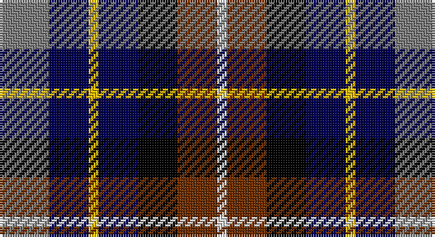

This page is one **sett** — a single exact thread-count. It belongs to the [tartan](/setts/y5db4ly1db4k4o4w1/)
(the same proportion at any scale), whose colour order is pattern [GBYBKRW](/stripes/gbybkrw/).

Part of the [Devon Companion](/tartans/devon-companion/) tartan — the named design grouping this sett with its other cloths.

Sourced from weddslist.  It is a [7 stripe tartan](/stripes/stripes7/).

Original link http://www.weddslist.com/cgi-bin/tartans/pg.pl?source=sts

## Also known as

This cloth is also recorded under:

- Devon, Companion

## Thread count
N/20 DB16 Y4 DB16 K16 T16 LN/4

One full sett is **160 threads**.

## Palette

Palette: <strong>Tartan Register</strong> <small style="color:#888">(3 of 6 colours)</small>
<table><thead><tr><th>Colour</th><th>Threads</th><th>Shade</th><th>Base</th><th>OKLCh</th></tr></thead><tbody><tr><td>N/</td><td style="text-align:right;font-variant-numeric:tabular-nums">20</td><td><code style="background-color:#808080;">#808080</code> <small style="color:#888">#808080</small></td><td>G <code style="background-color:#006100;">#006100</code></td><td><small style="color:#888">oklch(60.0% 0.000 89.9)</small></td></tr><tr><td>DB</td><td style="text-align:right;font-variant-numeric:tabular-nums">16</td><td><code style="background-color:#000050;">#000050</code> <small style="color:#888">#000050</small></td><td>B <code style="background-color:#2A418A;">#2A418A</code></td><td><small style="color:#888">oklch(19.5% 0.135 264.1)</small></td></tr><tr><td>Y</td><td style="text-align:right;font-variant-numeric:tabular-nums">4</td><td><code style="background-color:#F0C000;">#F0C000</code> <small style="color:#888">#F0C000</small></td><td>Y <code style="background-color:#F2BF00;">#F2BF00</code></td><td><small style="color:#888">oklch(82.7% 0.169 90.5)</small></td></tr><tr><td>DB</td><td style="text-align:right;font-variant-numeric:tabular-nums">16</td><td><code style="background-color:#000050;">#000050</code> <small style="color:#888">#000050</small></td><td>B <code style="background-color:#2A418A;">#2A418A</code></td><td><small style="color:#888">oklch(19.5% 0.135 264.1)</small></td></tr><tr><td>K</td><td style="text-align:right;font-variant-numeric:tabular-nums">16</td><td><code style="background-color:#000000;">#000000</code> <small style="color:#888">#000000</small></td><td>K <code style="background-color:#000000;">#000000</code></td><td><small style="color:#888">oklch(0.0% 0.000 0.0)</small></td></tr><tr><td>T</td><td style="text-align:right;font-variant-numeric:tabular-nums">16</td><td><code style="background-color:#703000;">#703000</code> <small style="color:#888">#703000</small></td><td>R <code style="background-color:#CC0000;">#CC0000</code></td><td><small style="color:#888">oklch(39.1% 0.105 49.1)</small></td></tr><tr><td>LN/</td><td style="text-align:right;font-variant-numeric:tabular-nums">4</td><td><code style="background-color:#E0E0E0;">#E0E0E0</code> <small style="color:#888">#E0E0E0</small></td><td>W <code style="background-color:#F7F7F7;">#F7F7F7</code></td><td><small style="color:#888">oklch(90.7% 0.000 89.9)</small></td></tr></tbody></table>

# Sample pattern

## Compared to the master

This cloth is one sett of its design; the master sett (the exemplar the design is anchored on) is below for comparison.

<figure style="margin:0"><figcaption style="color:#888;font-size:smaller">this sett</figcaption></figure>
<figure style="margin:0"><figcaption style="color:#888;font-size:smaller"><a href="/setts/o5db4ly1db4k4dy4w1/">master sett →</a></figcaption></figure>

## Nearest tartans

The nearest existing variants by ΔTartan distance, with this tartan at the top so the swatches line up against it.

ΔTartan

Tartan

Sett

—

<a href="/ttd/edit/#slug=y5db4ly1db4k4o4w1~x4">Devon, Companion</a> <a class="nn-out" href="/variants/s7/y5db4ly1db4k4o4w1~x4/" title="open its dictionary page">↗</a>

0.79

<a href="/ttd/edit/#slug=o5db4ly1db4k4dr4w1~x4&amp;base=y5db4ly1db4k4o4w1~x4">Devon Companion District Tartan</a> <a class="nn-out" href="/variants/s7/o5db4ly1db4k4dr4w1~x4/" title="open its dictionary page">↗</a>

1.02

<a href="/ttd/edit/#slug=o5db4ly1db4k4dy4w1~x4&amp;base=y5db4ly1db4k4o4w1~x4">Devon Companion</a> <a class="nn-out" href="/variants/s7/o5db4ly1db4k4dy4w1~x4/" title="open its dictionary page">↗</a>

1.07

<a href="/ttd/edit/#slug=g7w4k21n16db16r5~x2&amp;base=y5db4ly1db4k4o4w1~x4">Hawkes, Norman (Personal)</a> <a class="nn-out" href="/variants/s6/g7w4k21n16db16r5~x2/" title="open its dictionary page">↗</a>

1.22

<a href="/ttd/edit/#slug=db5dp3w2dg3k1ly1~x10&amp;base=y5db4ly1db4k4o4w1~x4">MacBlain (2016)</a> <a class="nn-out" href="/variants/s6/db5dp3w2dg3k1ly1~x10/" title="open its dictionary page">↗</a>

1.29

<a href="/ttd/edit/#slug=k4n4lo1n4r4db4w1~x8&amp;base=y5db4ly1db4k4o4w1~x4">Blackdown Hills Corporate Tartan</a> <a class="nn-out" href="/variants/s7/k4n4lo1n4r4db4w1~x8/" title="open its dictionary page">↗</a>

1.34

<a href="/ttd/edit/#slug=o8g4db16g4k14o14db4b3~x2&amp;base=y5db4ly1db4k4o4w1~x4">Hinnigan (Personal)</a> <a class="nn-out" href="/variants/s8/o8g4db16g4k14o14db4b3~x2/" title="open its dictionary page">↗</a>

1.39

<a href="/ttd/edit/#slug=r2dt3n12k11dg11ly2~x2&amp;base=y5db4ly1db4k4o4w1~x4">Huntly Gordon</a> <a class="nn-out" href="/variants/s6/r2dt3n12k11dg11ly2~x2/" title="open its dictionary page">↗</a>

1.40

<a href="/ttd/edit/#slug=k10r3lo4dt12dg4r4w2~x4&amp;base=y5db4ly1db4k4o4w1~x4">Eichelberger Family, Jörg (Personal)</a> <a class="nn-out" href="/variants/s7/k10r3lo4dt12dg4r4w2~x4/" title="open its dictionary page">↗</a>

1.43

<a href="/ttd/edit/#slug=k3g10k10r3db8w3~x2&amp;base=y5db4ly1db4k4o4w1~x4">Russell (Clan)</a> <a class="nn-out" href="/variants/s6/k3g10k10r3db8w3~x2/" title="open its dictionary page">↗</a>

1.45

<a href="/variants/s7/db8g11k3g11m12ki10ly2~x2/">Scottish Parliament</a>

## Neighbour map

Every grey dot is one of 14360 variants placed by the first two principal components of the ΔTartan feature space (44% of its variance). Red is this tartan; blue dots are its nearest — click one to open its page.

<svg viewBox="0 0 640 380" role="img" style="max-width:100%;height:auto;border:1px solid #e0e0e0;border-radius:4px;display:block" xmlns="http://www.w3.org/2000/svg"><image href="/nn/cloud.v1.png" width="640" height="380"/><a href="/variants/s7/o5db4ly1db4k4dr4w1~x4/"><circle cx="55.2" cy="233.3" r="4" fill="#3465a4"><title>Devon Companion District Tartan</title></circle></a><a href="/variants/s7/o5db4ly1db4k4dy4w1~x4/"><circle cx="52.9" cy="231.6" r="4" fill="#3465a4"><title>Devon Companion</title></circle></a><a href="/variants/s6/g7w4k21n16db16r5~x2/"><circle cx="35.4" cy="217.7" r="4" fill="#3465a4"><title>Hawkes, Norman (Personal)</title></circle></a><a href="/variants/s6/db5dp3w2dg3k1ly1~x10/"><circle cx="35.1" cy="212.1" r="4" fill="#3465a4"><title>MacBlain (2016)</title></circle></a><a href="/variants/s7/k4n4lo1n4r4db4w1~x8/"><circle cx="59.0" cy="246.4" r="4" fill="#3465a4"><title>Blackdown Hills Corporate Tartan</title></circle></a><a href="/variants/s8/o8g4db16g4k14o14db4b3~x2/"><circle cx="84.4" cy="225.6" r="4" fill="#3465a4"><title>Hinnigan (Personal)</title></circle></a><a href="/variants/s6/r2dt3n12k11dg11ly2~x2/"><circle cx="65.9" cy="211.0" r="4" fill="#3465a4"><title>Huntly Gordon</title></circle></a><a href="/variants/s7/k10r3lo4dt12dg4r4w2~x4/"><circle cx="66.9" cy="205.5" r="4" fill="#3465a4"><title>Eichelberger Family, Jörg (Personal)</title></circle></a><a href="/variants/s6/k3g10k10r3db8w3~x2/"><circle cx="67.3" cy="259.1" r="4" fill="#3465a4"><title>Russell (Clan)</title></circle></a><a href="/variants/s7/db8g11k3g11m12ki10ly2~x2/"><circle cx="74.5" cy="228.7" r="4" fill="#3465a4"><title>Scottish Parliament</title></circle></a><circle cx="37.8" cy="228.3" r="5" fill="#c00000"/></svg>

ID: /variants/s7/y5db4ly1db4k4o4w1~x4/
