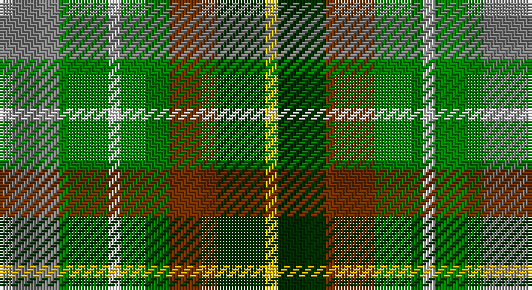

This page is one **sett** — a single exact thread-count. It belongs to the [tartan](/setts/y5g4w1g4o4dg4ly1/)
(the same proportion at any scale), whose colour order is pattern [GGWGRGY](/stripes/ggwgrgy/).

Sourced from weddslist.  It is a [7 stripe tartan](/stripes/stripes7/).

Original link http://www.weddslist.com/cgi-bin/tartans/pg.pl?source=sts

## Thread count
N/20 G16 LN4 G16 T16 DG16 Y/4

One full sett is **160 threads**.

## Palette

Palette: <strong>Tartan Register</strong> <small style="color:#888">(2 of 6 colours)</small>
<table><thead><tr><th>Colour</th><th>Threads</th><th>Shade</th><th>Base</th><th>OKLCh</th></tr></thead><tbody><tr><td>N/</td><td style="text-align:right;font-variant-numeric:tabular-nums">20</td><td><code style="background-color:#808080;">#808080</code> <small style="color:#888">#808080</small></td><td>G <code style="background-color:#006100;">#006100</code></td><td><small style="color:#888">oklch(60.0% 0.000 89.9)</small></td></tr><tr><td>G</td><td style="text-align:right;font-variant-numeric:tabular-nums">16</td><td><code style="background-color:#008000;">#008000</code> <small style="color:#888">#008000</small></td><td>G <code style="background-color:#006100;">#006100</code></td><td><small style="color:#888">oklch(52.0% 0.177 142.5)</small></td></tr><tr><td>LN</td><td style="text-align:right;font-variant-numeric:tabular-nums">4</td><td><code style="background-color:#E0E0E0;">#E0E0E0</code> <small style="color:#888">#E0E0E0</small></td><td>W <code style="background-color:#F7F7F7;">#F7F7F7</code></td><td><small style="color:#888">oklch(90.7% 0.000 89.9)</small></td></tr><tr><td>G</td><td style="text-align:right;font-variant-numeric:tabular-nums">16</td><td><code style="background-color:#008000;">#008000</code> <small style="color:#888">#008000</small></td><td>G <code style="background-color:#006100;">#006100</code></td><td><small style="color:#888">oklch(52.0% 0.177 142.5)</small></td></tr><tr><td>T</td><td style="text-align:right;font-variant-numeric:tabular-nums">16</td><td><code style="background-color:#703000;">#703000</code> <small style="color:#888">#703000</small></td><td>R <code style="background-color:#CC0000;">#CC0000</code></td><td><small style="color:#888">oklch(39.1% 0.105 49.1)</small></td></tr><tr><td>DG</td><td style="text-align:right;font-variant-numeric:tabular-nums">16</td><td><code style="background-color:#003000;">#003000</code> <small style="color:#888">#003000</small></td><td>G <code style="background-color:#006100;">#006100</code></td><td><small style="color:#888">oklch(26.8% 0.091 142.5)</small></td></tr><tr><td>Y/</td><td style="text-align:right;font-variant-numeric:tabular-nums">4</td><td><code style="background-color:#F0C000;">#F0C000</code> <small style="color:#888">#F0C000</small></td><td>Y <code style="background-color:#F2BF00;">#F2BF00</code></td><td><small style="color:#888">oklch(82.7% 0.169 90.5)</small></td></tr></tbody></table>

# Sample pattern

## Nearest tartans

The nearest existing variants by ΔTartan distance, with this tartan at the top so the swatches line up against it.

ΔTartan

Tartan

Sett

—

<a href="/ttd/edit/#slug=y5g4w1g4o4dg4ly1~x4">Devon, Original</a> <a class="nn-out" href="/variants/s7/y5g4w1g4o4dg4ly1~x4/" title="open its dictionary page">↗</a>

0.95

<a href="/ttd/edit/#slug=lr5g4w1g4o4dg4ly1~x4&amp;base=y5g4w1g4o4dg4ly1~x4">Devon Original District Tartan</a> <a class="nn-out" href="/variants/s7/lr5g4w1g4o4dg4ly1~x4/" title="open its dictionary page">↗</a>

1.10

<a href="/ttd/edit/#slug=r1dy3g5lo5dt5t1~x4&amp;base=y5g4w1g4o4dg4ly1~x4">Loch Fyne</a> <a class="nn-out" href="/variants/s6/r1dy3g5lo5dt5t1~x4/" title="open its dictionary page">↗</a>

1.54

<a href="/ttd/edit/#slug=g5dg5gi5dbi5db5dg10w2~x8&amp;base=y5g4w1g4o4dg4ly1~x4">Pollard (2014)</a> <a class="nn-out" href="/variants/s7/g5dg5gi5dbi5db5dg10w2~x8/" title="open its dictionary page">↗</a>

1.55

<a href="/ttd/edit/#slug=k1lr1g5dp1g2dy5lr1y3lr1~x4&amp;base=y5g4w1g4o4dg4ly1~x4">Corcoran of Sherbrooke (Personal)</a> <a class="nn-out" href="/variants/s9/k1lr1g5dp1g2dy5lr1y3lr1~x4/" title="open its dictionary page">↗</a>

1.57

<a href="/ttd/edit/#slug=db8g11k3g11r12dt10ly2~x2&amp;base=y5g4w1g4o4dg4ly1~x4">Parliament Trade Tartan</a> <a class="nn-out" href="/variants/s7/db8g11k3g11r12dt10ly2~x2/" title="open its dictionary page">↗</a>

1.66

<a href="/ttd/edit/#slug=db7o8g15ly6y3~x10&amp;base=y5g4w1g4o4dg4ly1~x4">Unidentified, Silk Plaid</a> <a class="nn-out" href="/variants/s5/db7o8g15ly6y3~x10/" title="open its dictionary page">↗</a>

1.67

<a href="/ttd/edit/#slug=o5y4lr1y4dy4dg4ly1~x4&amp;base=y5g4w1g4o4dg4ly1~x4">Devon, Green (District)</a> <a class="nn-out" href="/variants/s7/o5y4lr1y4dy4dg4ly1~x4/" title="open its dictionary page">↗</a>

1.68

<a href="/ttd/edit/#slug=g5dg5gi5db5dbi5dg10w2~x8&amp;base=y5g4w1g4o4dg4ly1~x4">Pollard (2014)</a> <a class="nn-out" href="/variants/s7/g5dg5gi5db5dbi5dg10w2~x8/" title="open its dictionary page">↗</a>

1.71

<a href="/ttd/edit/#slug=g10db6t6g10w8ly3t2ly3db2r2&amp;base=y5g4w1g4o4dg4ly1~x4">Northern College</a> <a class="nn-out" href="/variants/s10/g10db6t6g10w8ly3t2ly3db2r2/" title="open its dictionary page">↗</a>

1.72

<a href="/ttd/edit/#slug=w5y4b1y4r4b1dg4ly1~x2&amp;base=y5g4w1g4o4dg4ly1~x4">Devon Rural Skills Trust</a> <a class="nn-out" href="/variants/s8/w5y4b1y4r4b1dg4ly1~x2/" title="open its dictionary page">↗</a>

## Neighbour map

Every grey dot is one of 14360 variants placed by the first two principal components of the ΔTartan feature space (44% of its variance). Red is this tartan; blue dots are its nearest — click one to open its page.

<svg viewBox="0 0 640 380" role="img" style="max-width:100%;height:auto;border:1px solid #e0e0e0;border-radius:4px;display:block" xmlns="http://www.w3.org/2000/svg"><image href="/nn/cloud.v1.png" width="640" height="380"/><a href="/variants/s7/lr5g4w1g4o4dg4ly1~x4/"><circle cx="70.8" cy="235.7" r="4" fill="#3465a4"><title>Devon Original District Tartan</title></circle></a><a href="/variants/s6/r1dy3g5lo5dt5t1~x4/"><circle cx="48.1" cy="237.5" r="4" fill="#3465a4"><title>Loch Fyne</title></circle></a><a href="/variants/s7/g5dg5gi5dbi5db5dg10w2~x8/"><circle cx="67.9" cy="251.4" r="4" fill="#3465a4"><title>Pollard (2014)</title></circle></a><a href="/variants/s9/k1lr1g5dp1g2dy5lr1y3lr1~x4/"><circle cx="109.0" cy="205.8" r="4" fill="#3465a4"><title>Corcoran of Sherbrooke (Personal)</title></circle></a><a href="/variants/s7/db8g11k3g11r12dt10ly2~x2/"><circle cx="115.4" cy="248.3" r="4" fill="#3465a4"><title>Parliament Trade Tartan</title></circle></a><a href="/variants/s5/db7o8g15ly6y3~x10/"><circle cx="97.6" cy="247.0" r="4" fill="#3465a4"><title>Unidentified, Silk Plaid</title></circle></a><a href="/variants/s7/o5y4lr1y4dy4dg4ly1~x4/"><circle cx="113.2" cy="263.4" r="4" fill="#3465a4"><title>Devon, Green (District)</title></circle></a><a href="/variants/s7/g5dg5gi5db5dbi5dg10w2~x8/"><circle cx="77.0" cy="254.9" r="4" fill="#3465a4"><title>Pollard (2014)</title></circle></a><a href="/variants/s10/g10db6t6g10w8ly3t2ly3db2r2/"><circle cx="64.5" cy="195.0" r="4" fill="#3465a4"><title>Northern College</title></circle></a><a href="/variants/s8/w5y4b1y4r4b1dg4ly1~x2/"><circle cx="44.4" cy="204.1" r="4" fill="#3465a4"><title>Devon Rural Skills Trust</title></circle></a><circle cx="69.2" cy="243.9" r="5" fill="#c00000"/></svg>

ID: /variants/s7/y5g4w1g4o4dg4ly1~x4/
