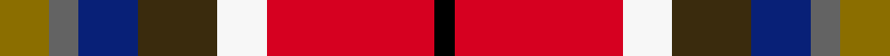

This is one **variant** — a specific cloth: this exact thread count and colourway, with its own
provenance below. It is one weaving of the [sett](/setts/y5n3db6dy8w5r17k2/) (the scale-free proportion — the
same cloth at any scale or shade), whose colour order is pattern [GBBGWRK](/stripes/gbbgwrk/).

Part of the [Barrington Municipality](/tartans/b/ba/barrington-municipality/) tartan — the named design grouping this sett with its other cloths.

Sourced from register-of-tartans.  It is a [7 stripe tartan](/stripes/stripes7/).

Original link [https://www.tartanregister.gov.uk/tartanDetails.aspx?ref=11384](https://www.tartanregister.gov.uk/tartanDetails.aspx?ref=11384)

Dataset <small>— provenance for this record, inherited from the source manifest</small>

<dl class="dataset-prov">
<dt>source</dt><dd><a href="/sources/register-of-tartans/">Scottish Register of Tartans</a></dd>
<dt>data captured from</dt><dd><a href="https://github.com/thetartan/tartan-database/blob/master/data/register-of-tartans/data.csv">https://github.com/thetartan/tartan-database/blob/master/data/register-of-tartans/data.csv</a></dd>
<dt>data date</dt><dd>01/09/2015 <small>(this record)</small></dd>
<dt>licence</dt><dd><a href="https://www.tartanregister.gov.uk/copyright">Crown copyright</a></dd>
</dl>

Capture chain <small>— the hands this data passed through, oldest first; each capture carries its own licence</small>

<ol class="capture-chain">
<li><a href="https://www.tartanregister.gov.uk/">Scottish Register of Tartans</a> · <a href="https://www.tartanregister.gov.uk/copyright">Crown copyright</a> <small>the living register — still published by National Records of Scotland</small></li>
<li><a href="https://github.com/thetartan/tartan-database">thetartan/tartan-database</a> <small>2016-2017</small> · <a href="https://creativecommons.org/licenses/by-nc-nd/4.0/">CC BY-NC-ND 4.0</a> <small>Levko Kravets's frozen compilation — the capture we vendored, and where its CC licence text came from</small></li>
<li>this dictionary <small>captured 2026-06-10 · commit 5bf86c7566</small> <small>each re-capture is a git commit to data/sources</small></li>
</ol>

## Register references

External register numbers recorded for this tartan.

- Scottish Register of Tartans: [11384](https://www.tartanregister.gov.uk/tartanDetails.aspx?ref=11384)

## Thread count
Y/5 N3 DB6 DY8 W5 R17 K/2

One full sett is **85 threads**.

## Palette
<table><thead><tr><th>Colour</th><th>Shade</th><th>OKLCh</th></tr></thead><tbody><tr><td>DB</td><td><code style="background-color:#082077;">#082077</code> <small style="color:#888">#082077</small></td><td><small style="color:#888">oklch(30.0% 0.149 265.1)</small></td></tr><tr><td>K</td><td><code style="background-color:#000000;">#000000</code> <small style="color:#888">#000000</small></td><td><small style="color:#888">oklch(0.0% 0.000 0.0)</small></td></tr><tr><td>N</td><td><code style="background-color:#636363;">#636363</code> <small style="color:#888">#636363</small></td><td><small style="color:#888">oklch(50.0% 0.000 89.9)</small></td></tr><tr><td>R</td><td><code style="background-color:#D60020;">#D60020</code> <small style="color:#888">#D60020</small></td><td><small style="color:#888">oklch(55.2% 0.224 25.5)</small></td></tr><tr><td>DY</td><td><code style="background-color:#3A2B0D;">#3A2B0D</code> <small style="color:#888">#3A2B0D</small></td><td><small style="color:#888">oklch(30.0% 0.049 82.0)</small></td></tr><tr><td>W</td><td><code style="background-color:#F7F7F7;">#F7F7F7</code> <small style="color:#888">#F7F7F7</small></td><td><small style="color:#888">oklch(97.6% 0.000 89.9)</small></td></tr><tr><td>Y</td><td><code style="background-color:#8B6E00;">#8B6E00</code> <small style="color:#888">#8B6E00</small></td><td><small style="color:#888">oklch(55.1% 0.113 90.4)</small></td></tr></tbody></table>

# Sample pattern

## Nearest tartan variants

The nearest existing variants by ΔTartan distance, with this cloth at the top so the swatches line up against it.

ΔTartan

Threads

Variant

Sett

—

85

<a href="/variants/s7/y5n3db6dy8w5r17k2/">Barrington Municipality</a>

<a href="/ttd/edit/#slug=r39db22k11y22g5~x2&amp;base=y5n3db6dy8w5r17k2" title="compare in the TTD">1.86</a>

308

<a href="/variants/s5/r39db22k11y22g5~x2/">Abbink, Ingmar (Personal)</a>

<a href="/ttd/edit/#slug=dg3g3r22k5db22dy2~x2~dg1806142-g2408144&amp;base=y5n3db6dy8w5r17k2" title="compare in the TTD">2.14</a>

218

<a href="/variants/s6/dg3g3r22k5db22dy2~x2~dg1806142-g2408144/">MacLeod Society of Scotland</a>

<a href="/ttd/edit/#slug=r16y2dy7y2lb24k2g2~x2&amp;base=y5n3db6dy8w5r17k2" title="compare in the TTD">2.17</a>

184

<a href="/variants/s7/r16y2dy7y2lb24k2g2~x2/">Traill (Personal)</a>

<a href="/ttd/edit/#slug=dg3g3r22k5db22dy2w2~x2~dg1806142-g2408144&amp;base=y5n3db6dy8w5r17k2" title="compare in the TTD">2.57</a>

226

<a href="/variants/s7/dg3g3r22k5db22dy2w2~x2~dg1806142-g2408144/">MacLeod Soc. of Scotland, (Comm)</a>

<a href="/ttd/edit/#slug=lb4dp3b1g9w1r8k1~x4&amp;base=y5n3db6dy8w5r17k2" title="compare in the TTD">2.57</a>

196

<a href="/variants/s7/lb4dp3b1g9w1r8k1~x4/">Wilson's, No 121</a>

<a href="/ttd/edit/#slug=n2dg2r9k9g2y2~x4~dg1204144-g2408144&amp;base=y5n3db6dy8w5r17k2" title="compare in the TTD">2.65</a>

192

<a href="/variants/s6/n2dg2r9k9g2y2~x4~dg1204144-g2408144/">Wolves Wod Kindred</a>

<a href="/ttd/edit/#slug=r6y15do4db12g12dy4r25w5~x2&amp;base=y5n3db6dy8w5r17k2" title="compare in the TTD">2.79</a>

310

<a href="/variants/s8/r6y15do4db12g12dy4r25w5~x2/">Young Presidents Organisation Dress</a>

<a href="/ttd/edit/#slug=w4r7y5db13dr18g3~x2&amp;base=y5n3db6dy8w5r17k2" title="compare in the TTD">2.79</a>

186

<a href="/variants/s6/w4r7y5db13dr18g3~x2/">Ryan/Fehder (Personal)</a>

<a href="/ttd/edit/#slug=w5n20k8r5dp36ly5~x2&amp;base=y5n3db6dy8w5r17k2" title="compare in the TTD">2.88</a>

296

<a href="/variants/s6/w5n20k8r5dp36ly5~x2/">Lord's Own Highlanders (Corporate)</a>

<a href="/ttd/edit/#slug=k9g2db16r22dg10w6~x2~g2408144-db1406275-dg1806142&amp;base=y5n3db6dy8w5r17k2" title="compare in the TTD">2.98</a>

230

<a href="/variants/s6/k9g2db16r22dg10w6~x2~g2408144-db1406275-dg1806142/">Nicolson of Taransay (Personal)</a>

## Neighbour map

Every grey dot is one of 13621 variants placed by the first two principal components of the ΔTartan feature space (42% of its variance). Red is this tartan; blue dots are its nearest — click one to open its page.

<svg viewBox="0 0 640 380" role="img" style="max-width:100%;height:auto;border:1px solid #e0e0e0;border-radius:4px;display:block" xmlns="http://www.w3.org/2000/svg"><image href="/nn/cloud.v1.png" width="640" height="380"/><a href="/variants/s5/r39db22k11y22g5~x2/"><circle cx="141.9" cy="220.6" r="4" fill="#3465a4"><title>Abbink, Ingmar (Personal)</title></circle></a><a href="/variants/s6/dg3g3r22k5db22dy2~x2~dg1806142-g2408144/"><circle cx="164.6" cy="152.4" r="4" fill="#3465a4"><title>MacLeod Society of Scotland</title></circle></a><a href="/variants/s7/r16y2dy7y2lb24k2g2~x2/"><circle cx="182.9" cy="138.9" r="4" fill="#3465a4"><title>Traill (Personal)</title></circle></a><a href="/variants/s7/dg3g3r22k5db22dy2w2~x2~dg1806142-g2408144/"><circle cx="130.5" cy="124.3" r="4" fill="#3465a4"><title>MacLeod Soc. of Scotland, (Comm)</title></circle></a><a href="/variants/s7/lb4dp3b1g9w1r8k1~x4/"><circle cx="86.0" cy="157.1" r="4" fill="#3465a4"><title>Wilson's, No 121</title></circle></a><a href="/variants/s6/n2dg2r9k9g2y2~x4~dg1204144-g2408144/"><circle cx="77.4" cy="194.7" r="4" fill="#3465a4"><title>Wolves Wod Kindred</title></circle></a><a href="/variants/s8/r6y15do4db12g12dy4r25w5~x2/"><circle cx="108.4" cy="197.1" r="4" fill="#3465a4"><title>Young Presidents Organisation Dress</title></circle></a><a href="/variants/s6/w4r7y5db13dr18g3~x2/"><circle cx="120.2" cy="221.0" r="4" fill="#3465a4"><title>Ryan/Fehder (Personal)</title></circle></a><a href="/variants/s6/w5n20k8r5dp36ly5~x2/"><circle cx="158.5" cy="170.7" r="4" fill="#3465a4"><title>Lord's Own Highlanders (Corporate)</title></circle></a><a href="/variants/s6/k9g2db16r22dg10w6~x2~g2408144-db1406275-dg1806142/"><circle cx="80.3" cy="182.2" r="4" fill="#3465a4"><title>Nicolson of Taransay (Personal)</title></circle></a><circle cx="79.4" cy="162.4" r="5" fill="#c00000"/><text x="320" y="376" text-anchor="middle" font-size="11" fill="#999">ground</text><text x="11" y="190" text-anchor="middle" font-size="11" fill="#999" transform="rotate(-90 11 190)">complexity</text></svg>

ID: /variants/s7/y5n3db6dy8w5r17k2/
