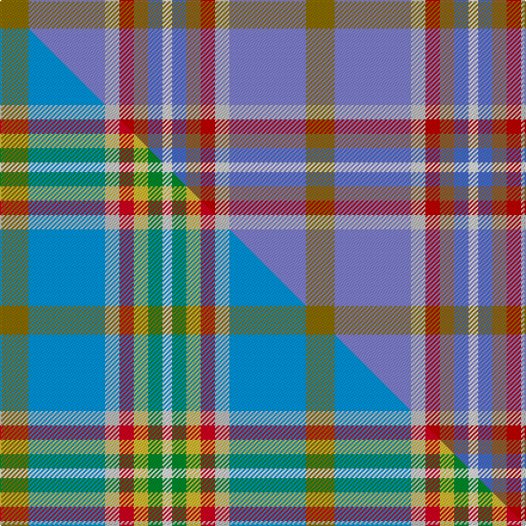

This page is one **sett** — a single exact thread-count. It belongs to the [tartan](/setts/y6bi16lb3r3o3b3w2/)
(the same proportion at any scale), whose colour order is pattern [GBWRRBW](/stripes/gbwrrbw/).

Part of the [Atikokan](/tartans/atikokan/) tartan — the named design grouping this sett with its other cloths.

Sourced from weddslist.  It is a [7 stripe tartan](/stripes/stripes7/).

Original link http://www.weddslist.com/cgi-bin/tartans/pg.pl?source=sts

Dataset <small>— provenance for this record, inherited from the source manifest</small>

<dl class="dataset-prov">
<dt>source</dt><dd><a href="/sources/weddslist/">Weddslist</a></dd>
<dt>data captured from</dt><dd><a href="https://github.com/thetartan/tartan-database/blob/master/data/weddslist/data.csv">https://github.com/thetartan/tartan-database/blob/master/data/weddslist/data.csv</a></dd>
<dt>data date</dt><dd>2016-11-17 <small>(dataset default)</small></dd>
<dt>licence</dt><dd><a href="https://creativecommons.org/licenses/by-nc-nd/4.0/">CC BY-NC-ND 4.0</a></dd>
</dl>

Capture chain <small>— the hands this data passed through, oldest first; each capture carries its own licence</small>

<ol class="capture-chain">
<li><a href="https://www.weddslist.com/tartans/">Weddslist</a> <small>the living privately compiled reference</small></li>
<li><a href="https://github.com/thetartan/tartan-database">thetartan/tartan-database</a> <small>2016-2017</small> · <a href="https://creativecommons.org/licenses/by-nc-nd/4.0/">CC BY-NC-ND 4.0</a> <small>Levko Kravets's frozen compilation — the capture we vendored, and where its CC licence text came from</small></li>
<li>this dictionary <small>captured 2026-06-10 · commit 5bf86c7566</small> <small>each re-capture is a git commit to data/sources</small></li>
</ol>

## Thread count
Y/24 Bi64 LB12 R12 O12 B12 W/8

One full sett is **256 threads**.

## Palette
<table><thead><tr><th>Colour</th><th>Shade</th><th>OKLCh</th></tr></thead><tbody><tr><td>B</td><td><code style="background-color:#8080D0;">#8080D0</code> <small style="color:#888">#8080D0</small></td><td><small style="color:#888">oklch(63.4% 0.119 282.5)</small></td></tr><tr><td>B</td><td><code style="background-color:#466CC8;">#466CC8</code> <small style="color:#888">#466CC8</small></td><td><small style="color:#888">oklch(55.1% 0.149 265.0)</small></td></tr><tr><td>W</td><td><code style="background-color:#F7F7F7;">#F7F7F7</code> <small style="color:#888">#F7F7F7</small></td><td><small style="color:#888">oklch(97.6% 0.000 89.9)</small></td></tr><tr><td>O</td><td><code style="background-color:#906030;">#906030</code> <small style="color:#888">#906030</small></td><td><small style="color:#888">oklch(53.1% 0.089 63.7)</small></td></tr><tr><td>LB</td><td><code style="background-color:#C0C0C0;">#C0C0C0</code> <small style="color:#888">#C0C0C0</small></td><td><small style="color:#888">oklch(80.8% 0.000 89.9)</small></td></tr><tr><td>R</td><td><code style="background-color:#C00000;">#C00000</code> <small style="color:#888">#C00000</small></td><td><small style="color:#888">oklch(50.7% 0.208 29.2)</small></td></tr><tr><td>Y</td><td><code style="background-color:#8B6E00;">#8B6E00</code> <small style="color:#888">#8B6E00</small></td><td><small style="color:#888">oklch(55.1% 0.113 90.4)</small></td></tr></tbody></table>

# Sample pattern

## Compared to the master

This cloth is one sett of its design; the master sett (the exemplar the design is anchored on) is below for comparison.

Its **ΔTartan distance** from the master is **2.00** — the same measure the nearest-tartans table ranks by (0 is identical; a re-scale of the same cloth is near 0, a recolour or a different proportion further).

<figure class="master-compare" style="margin:0">

this sett
master sett ★

<figcaption style="color:#888;font-size:smaller">One weave of this sett against the <a href="/setts/y6t16lb3r3ly3g3w2/">master sett ★</a>, split on the diagonal: a shared proportion runs seamlessly across it with only the shades shifting; a different proportion breaks on it.</figcaption>
</figure>

## Nearest tartan variants

The nearest existing variants by ΔTartan distance, with this cloth at the top so the swatches line up against it.

ΔTartan

Threads

Variant

Sett

—

256

<a href="/variants/s7/y6bi16lb3r3o3b3w2~x4~bi2505279-lb3200000-r2008029-o2104058/">Atikokan</a>

<a href="/ttd/edit/#slug=y6t16lr3r3ly3g3w2~x4~t2607245-lr3200000&amp;base=y6bi16lb3r3o3b3w2~x4~bi2505279-lb3200000-r2008029-o2104058" title="compare in the TTD">2.00</a>

256

<a href="/variants/s7/y6t16lb3r3ly3g3w2~x4~t2607245-lb3200000/">Atikokan</a>

<a href="/ttd/edit/#slug=dy6t16lr3y3lo3g3w2~x4~t2405244-lr3200000-y2104086-lo2605070&amp;base=y6bi16lb3r3o3b3w2~x4~bi2505279-lb3200000-r2008029-o2104058" title="compare in the TTD">2.00</a>

256

<a href="/variants/s7/dy6t16lb3y3o3g3w2~x4~t2405244-lb3200000-y2104086-o2605070/">Atikokan (District)</a>

<a href="/ttd/edit/#slug=db30y3dy11y3n33r6~x2&amp;base=y6bi16lb3r3o3b3w2~x4~bi2505279-lb3200000-r2008029-o2104058" title="compare in the TTD">2.68</a>

272

<a href="/variants/s6/db30y3dy11y3n33r6~x2/">Balfour</a>

<a href="/ttd/edit/#slug=lb25r10lb25w8b6g8y5~x2&amp;base=y6bi16lb3r3o3b3w2~x4~bi2505279-lb3200000-r2008029-o2104058" title="compare in the TTD">3.09</a>

288

<a href="/variants/s7/lb25r10lb25w8b6g8y5~x2/">Barneys (Scunthorpe) (Personal)</a>

<a href="/ttd/edit/#slug=r15t98db72y25db8w15~t2304245-db1404245&amp;base=y6bi16lb3r3o3b3w2~x4~bi2505279-lb3200000-r2008029-o2104058" title="compare in the TTD">3.12</a>

436

<a href="/variants/s6/r15t98db72y25db8w15~t2304245-db1404245/">Afternoon Tea / Earl Grey</a>

<a href="/ttd/edit/#slug=db30y3o11y3n33r6~x2&amp;base=y6bi16lb3r3o3b3w2~x4~bi2505279-lb3200000-r2008029-o2104058" title="compare in the TTD">3.36</a>

272

<a href="/variants/s6/db30y3o11y3n33r6~x2/">Balfour</a>

<a href="/ttd/edit/#slug=dbi8y4w2db25dy25dbii2r5~x2~dbi1404245-db1106275-dbii1406275&amp;base=y6bi16lb3r3o3b3w2~x4~bi2505279-lb3200000-r2008029-o2104058" title="compare in the TTD">3.52</a>

258

<a href="/variants/s7/dbi8y4w2db25dy25dbii2r5~x2~dbi1404245-db1106275-dbii1406275/">Kildrummie (Name)</a>

<a href="/ttd/edit/#slug=b15t20n12r34o3~x2~t2004230-o2301060&amp;base=y6bi16lb3r3o3b3w2~x4~bi2505279-lb3200000-r2008029-o2104058" title="compare in the TTD">3.58</a>

300

<a href="/variants/s5/b15t20n12r34y3~x2~t2004230-y2301060/">McCurdy-Stribbling (Personal)</a>

<a href="/ttd/edit/#slug=dp2g6r1y1db3b10w1~x2&amp;base=y6bi16lb3r3o3b3w2~x4~bi2505279-lb3200000-r2008029-o2104058" title="compare in the TTD">3.67</a>

90

<a href="/variants/s7/dp2g6r1y1db3b10w1~x2/">Manx National</a>

<a href="/ttd/edit/#slug=w3n17o16db2dg17y2~x2~n1604274-db0805267&amp;base=y6bi16lb3r3o3b3w2~x4~bi2505279-lb3200000-r2008029-o2104058" title="compare in the TTD">3.70</a>

218

<a href="/variants/s6/w3dbi17o16db2dg17y2~x2~dbi1604274-db0805267/">Atlantic, Ancient</a>

## Neighbour map

Every grey dot is one of 13620 variants placed by the first two principal components of the ΔTartan feature space (42% of its variance). Red is this tartan; blue dots are its nearest — click one to open its page.

<svg viewBox="0 0 640 380" role="img" style="max-width:100%;height:auto;border:1px solid #e0e0e0;border-radius:4px;display:block" xmlns="http://www.w3.org/2000/svg"><image href="/nn/cloud.v1.png" width="640" height="380"/><a href="/variants/s7/y6t16lb3r3ly3g3w2~x4~t2607245-lb3200000/"><circle cx="188.3" cy="189.7" r="4" fill="#3465a4"><title>Atikokan</title></circle></a><a href="/variants/s7/dy6t16lb3y3o3g3w2~x4~t2405244-lb3200000-y2104086-o2605070/"><circle cx="181.2" cy="185.5" r="4" fill="#3465a4"><title>Atikokan (District)</title></circle></a><a href="/variants/s6/db30y3dy11y3n33r6~x2/"><circle cx="278.1" cy="223.4" r="4" fill="#3465a4"><title>Balfour</title></circle></a><a href="/variants/s7/lb25r10lb25w8b6g8y5~x2/"><circle cx="268.5" cy="242.5" r="4" fill="#3465a4"><title>Barneys (Scunthorpe) (Personal)</title></circle></a><a href="/variants/s6/r15t98db72y25db8w15~t2304245-db1404245/"><circle cx="253.5" cy="207.7" r="4" fill="#3465a4"><title>Afternoon Tea / Earl Grey</title></circle></a><a href="/variants/s6/db30y3o11y3n33r6~x2/"><circle cx="270.3" cy="219.4" r="4" fill="#3465a4"><title>Balfour</title></circle></a><a href="/variants/s7/dbi8y4w2db25dy25dbii2r5~x2~dbi1404245-db1106275-dbii1406275/"><circle cx="201.9" cy="169.0" r="4" fill="#3465a4"><title>Kildrummie (Name)</title></circle></a><a href="/variants/s5/b15t20n12r34y3~x2~t2004230-y2301060/"><circle cx="273.6" cy="251.9" r="4" fill="#3465a4"><title>McCurdy-Stribbling (Personal)</title></circle></a><a href="/variants/s7/dp2g6r1y1db3b10w1~x2/"><circle cx="180.6" cy="172.7" r="4" fill="#3465a4"><title>Manx National</title></circle></a><a href="/variants/s6/w3dbi17o16db2dg17y2~x2~dbi1604274-db0805267/"><circle cx="159.9" cy="216.3" r="4" fill="#3465a4"><title>Atlantic, Ancient</title></circle></a><circle cx="225.0" cy="193.2" r="5" fill="#c00000"/><text x="320" y="376" text-anchor="middle" font-size="11" fill="#999">ground</text><text x="11" y="190" text-anchor="middle" font-size="11" fill="#999" transform="rotate(-90 11 190)">complexity</text></svg>

ID: /variants/s7/y6bi16lb3r3o3b3w2~x4~bi2505279-lb3200000-r2008029-o2104058/
