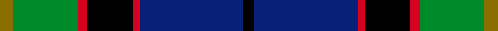

This page is one **sett** — a single exact thread-count. It belongs to the [tartan](/setts/y6g28r4k20r3db45k5/)
(the same proportion at any scale), whose colour order is pattern [GGRKRBK](/stripes/ggrkrbk/).

Sourced from register-of-tartans.  It is a [7 stripe tartan](/stripes/stripes7/).

Original link [https://www.tartanregister.gov.uk/tartanDetails.aspx?ref=3107](https://www.tartanregister.gov.uk/tartanDetails.aspx?ref=3107)

2 attestations — the source records this cloth was collapsed from (oldest owns this page)

<ul>
<li>01/01/2002 — Nery (register-of-tartans, <a href="https://www.tartanregister.gov.uk/tartanDetails.aspx?ref=3107">record</a>)  <em>An alternative threadcount recorded by the Tartan Education and Cultural Association (TECA) replaces the black overcheck with white.</em></li>
<li>pre 2002 — Nery (Name) (tartans-authority, <a href="https://www.tartanregister.gov.uk/tartanDetails.aspx?ref=4109">record</a>)  <em>TECA count replaces black overcheck with white. Assumed to be for all of the name.</em></li>
</ul>

Dataset <small>— provenance for this record, inherited from the source manifest</small>

<dl class="dataset-prov">
<dt>source</dt><dd><a href="/sources/register-of-tartans/">Scottish Register of Tartans</a></dd>
<dt>data captured from</dt><dd><a href="https://github.com/thetartan/tartan-database/blob/master/data/register-of-tartans/data.csv">https://github.com/thetartan/tartan-database/blob/master/data/register-of-tartans/data.csv</a></dd>
<dt>data date</dt><dd>2002 <small>(this record)</small></dd>
<dt>licence</dt><dd><a href="https://www.tartanregister.gov.uk/copyright">Crown copyright</a></dd>
</dl>

Capture chain <small>— the hands this data passed through, oldest first; each capture carries its own licence</small>

<ol class="capture-chain">
<li><a href="https://www.tartanregister.gov.uk/">Scottish Register of Tartans</a> · <a href="https://www.tartanregister.gov.uk/copyright">Crown copyright</a> <small>the living register — still published by National Records of Scotland</small></li>
<li><a href="https://github.com/thetartan/tartan-database">thetartan/tartan-database</a> <small>2016-2017</small> · <a href="https://creativecommons.org/licenses/by-nc-nd/4.0/">CC BY-NC-ND 4.0</a> <small>Levko Kravets's frozen compilation — the capture we vendored, and where its CC licence text came from</small></li>
<li>this dictionary <small>captured 2026-06-10 · commit 5bf86c7566</small> <small>each re-capture is a git commit to data/sources</small></li>
</ol>

## Register references

External register numbers recorded for this tartan.

- Scottish Register of Tartans: [3107](https://www.tartanregister.gov.uk/tartanDetails.aspx?ref=3107)
- Scottish Tartans Authority (ITI): 4109

## Thread count
Y/12 G56 R8 K40 R6 DB90 K/10

One full sett is **422 threads**.

## Palette
<table><thead><tr><th>Colour</th><th>Shade</th><th>OKLCh</th></tr></thead><tbody><tr><td>DB</td><td><code style="background-color:#082077;">#082077</code> <small style="color:#888">#082077</small></td><td><small style="color:#888">oklch(30.0% 0.149 265.1)</small></td></tr><tr><td>R</td><td><code style="background-color:#D60020;">#D60020</code> <small style="color:#888">#D60020</small></td><td><small style="color:#888">oklch(55.2% 0.224 25.5)</small></td></tr><tr><td>Y</td><td><code style="background-color:#8B6E00;">#8B6E00</code> <small style="color:#888">#8B6E00</small></td><td><small style="color:#888">oklch(55.1% 0.113 90.4)</small></td></tr><tr><td>G</td><td><code style="background-color:#008B2A;">#008B2A</code> <small style="color:#888">#008B2A</small></td><td><small style="color:#888">oklch(55.4% 0.170 145.9)</small></td></tr><tr><td>K</td><td><code style="background-color:#000000;">#000000</code> <small style="color:#888">#000000</small></td><td><small style="color:#888">oklch(0.0% 0.000 0.0)</small></td></tr></tbody></table>

# Sample pattern

## Nearest tartan variants

The nearest existing variants by ΔTartan distance, with this cloth at the top so the swatches line up against it.

ΔTartan

Threads

Variant

Sett

—

422

<a href="/variants/s7/y6g28r4k20r3db45k5~x2/">Nery</a>

<a href="/ttd/edit/#slug=y4g22r3k17r3db37w3~x2&amp;base=y6g28r4k20r3db45k5~x2" title="compare in the TTD">1.27</a>

342

<a href="/variants/s7/y4g22r3k17r3db37w3~x2/">Souza Nery</a>

<a href="/ttd/edit/#slug=ly4g22r3k17r3db37w3~x2&amp;base=y6g28r4k20r3db45k5~x2" title="compare in the TTD">1.27</a>

342

<a href="/variants/s7/ly4g22r3k17r3db37w3~x2/">Souza Nery (Personal)</a>

<a href="/ttd/edit/#slug=k2g12k12r1db12w2~x2&amp;base=y6g28r4k20r3db45k5~x2" title="compare in the TTD">1.41</a>

156

<a href="/variants/s6/k2g12k12r1db12w2~x2/">Russell or Mitchell or Hunter or Galbraith</a>

<a href="/ttd/edit/#slug=k2g12k12r1db12w2&amp;base=y6g28r4k20r3db45k5~x2" title="compare in the TTD">1.41</a>

78

<a href="/variants/s6/k2g12k12r1db12w2/">Mitchell</a>

<a href="/ttd/edit/#slug=r2db23k14g16k2w2~x2&amp;base=y6g28r4k20r3db45k5~x2" title="compare in the TTD">1.45</a>

228

<a href="/variants/s6/r2db23k14g16k2w2~x2/">MacPhail Hunting</a>

<a href="/ttd/edit/#slug=r3k2g15k10db20y2~x2&amp;base=y6g28r4k20r3db45k5~x2" title="compare in the TTD">1.46</a>

198

<a href="/variants/s6/r3k2g15k10db20y2~x2/">MacLeod of Assynt</a>

<a href="/ttd/edit/#slug=dr4k2db24k20g20lo3~x2&amp;base=y6g28r4k20r3db45k5~x2" title="compare in the TTD">1.58</a>

278

<a href="/variants/s6/dr4k2db24k20g20lo3~x2/">Loudoun's Highlanders</a>

<a href="/ttd/edit/#slug=dy2g12k10r1db16r2~x2&amp;base=y6g28r4k20r3db45k5~x2" title="compare in the TTD">1.62</a>

164

<a href="/variants/s6/dy2g12k10r1db16r2~x2/">MacWilliam Clan Tartan</a>

<a href="/ttd/edit/#slug=r2g10k12db1k2db14k1db1g2~x2&amp;base=y6g28r4k20r3db45k5~x2" title="compare in the TTD">1.73</a>

172

<a href="/variants/s9/r2g10k12db1k2db14k1db1g2~x2/">McWilliams Wedding (Personal)</a>

<a href="/ttd/edit/#slug=r7db2g5k24db2g10db28g10w3~x2&amp;base=y6g28r4k20r3db45k5~x2" title="compare in the TTD">1.74</a>

344

<a href="/variants/s9/r7db2g5k24db2g10db28g10w3~x2/">Colgan (Personal)</a>

## Neighbour map

Every grey dot is one of 13621 variants placed by the first two principal components of the ΔTartan feature space (42% of its variance). Red is this tartan; blue dots are its nearest — click one to open its page.

<svg viewBox="0 0 640 380" role="img" style="max-width:100%;height:auto;border:1px solid #e0e0e0;border-radius:4px;display:block" xmlns="http://www.w3.org/2000/svg"><image href="/nn/cloud.v1.png" width="640" height="380"/><a href="/variants/s7/y4g22r3k17r3db37w3~x2/"><circle cx="143.4" cy="142.9" r="4" fill="#3465a4"><title>Souza Nery</title></circle></a><a href="/variants/s7/ly4g22r3k17r3db37w3~x2/"><circle cx="138.4" cy="141.5" r="4" fill="#3465a4"><title>Souza Nery (Personal)</title></circle></a><a href="/variants/s6/k2g12k12r1db12w2~x2/"><circle cx="121.4" cy="180.8" r="4" fill="#3465a4"><title>Russell or Mitchell or Hunter or Galbraith</title></circle></a><a href="/variants/s6/k2g12k12r1db12w2/"><circle cx="121.4" cy="180.8" r="4" fill="#3465a4"><title>Mitchell</title></circle></a><a href="/variants/s6/r2db23k14g16k2w2~x2/"><circle cx="152.7" cy="176.4" r="4" fill="#3465a4"><title>MacPhail Hunting</title></circle></a><a href="/variants/s6/r3k2g15k10db20y2~x2/"><circle cx="146.8" cy="186.3" r="4" fill="#3465a4"><title>MacLeod of Assynt</title></circle></a><a href="/variants/s6/dr4k2db24k20g20lo3~x2/"><circle cx="129.1" cy="186.1" r="4" fill="#3465a4"><title>Loudoun's Highlanders</title></circle></a><a href="/variants/s6/dy2g12k10r1db16r2~x2/"><circle cx="156.3" cy="169.5" r="4" fill="#3465a4"><title>MacWilliam Clan Tartan</title></circle></a><a href="/variants/s9/r2g10k12db1k2db14k1db1g2~x2/"><circle cx="152.0" cy="143.2" r="4" fill="#3465a4"><title>McWilliams Wedding (Personal)</title></circle></a><a href="/variants/s9/r7db2g5k24db2g10db28g10w3~x2/"><circle cx="132.3" cy="150.1" r="4" fill="#3465a4"><title>Colgan (Personal)</title></circle></a><circle cx="170.8" cy="154.0" r="5" fill="#c00000"/><text x="320" y="376" text-anchor="middle" font-size="11" fill="#999">ground</text><text x="11" y="190" text-anchor="middle" font-size="11" fill="#999" transform="rotate(-90 11 190)">complexity</text></svg>

ID: /variants/s7/y6g28r4k20r3db45k5~x2/
