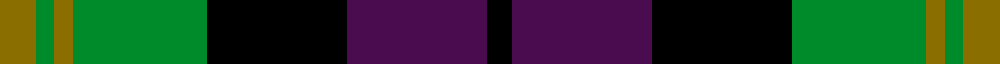

This page is one **sett** — a single exact thread-count. It belongs to the [tartan](/setts/y6g3y3g22k23dp23k4/)
(the same proportion at any scale), whose colour order is pattern [GGGGKBK](/stripes/ggggkbk/).

Sourced from register-of-tartans.  It is a [7 stripe tartan](/stripes/stripes7/).

Original link https://www.tartanregister.gov.uk/tartanDetails.aspx?ref=1464

## Provenance

Earliest known date: c.1830 This sett is called 'Gordon of Esslemont' according to Captain Wolrige-Gordon of Esslemont in recent research. It was previously listed as 'Ancient Gordon' before the story of its origin came to light. Apparently the Duke of Gordon was offered tartans with one, two, and three stripes when he applied to Forsythe of Huntly to provide kilts for his troops. He chose the single stripe and called in the Heads of the families to choose from the others. Esslemont took the three stripe version.

3 attestations — the source records this cloth was collapsed from (oldest owns this page)

<ul>
<li>undated — Gordon of Esslemont (register-of-tartans, <a href="https://www.tartanregister.gov.uk/tartanDetails.aspx?ref=1464">record</a>)  <em>This sett is called 'Gordon of Esslemont' according to Captain Wolrige-Gordon of Esslemont in recent research. It was previously listed as 'Ancient Gordon' before the story of its origin came to light. Apparently the Duke of Gordon was offered tartans with one, two, and three stripes when he applied to Forsythe of Huntly to provide kilts for his troops. He chose the single stripe and called in the Heads of the families to choose from the others. Esslemont took the three stripe version. This collection used to be in the Scottish Tartans Society archive, it has been returned to the Paton firm at Alloa.</em></li>
<li>undated — Gordon of Esslemont (weddslist, <a href="http://www.weddslist.com/cgi-bin/tartans/pg.pl?source=sts">record</a>) </li>
<li>undated — Gordon of Esslemont Family Tartan (house-of-tartan, <a href="http://www.house-of-tartan.scotland.net/house/TartanViewjs.asp?colr=Def&tnam=1064">record</a>) </li>
</ul>

## Register references

External register numbers recorded for this tartan.

- Scottish Register of Tartans: [1464](https://www.tartanregister.gov.uk/tartanDetails.aspx?ref=1464)
- Scottish Tartans World Register: 1064

## Thread count
Y/12 G6 Y6 G44 K46 DP46 K/8

One full sett is **316 threads**.

## Palette
<table><thead><tr><th>Colour</th><th>Shade</th><th>OKLCh</th></tr></thead><tbody><tr><td>G</td><td><code style="background-color:#008B2A;">#008B2A</code> <small style="color:#888">#008B2A</small></td><td><small style="color:#888">oklch(55.4% 0.170 145.9)</small></td></tr><tr><td>K</td><td><code style="background-color:#000000;">#000000</code> <small style="color:#888">#000000</small></td><td><small style="color:#888">oklch(0.0% 0.000 0.0)</small></td></tr><tr><td>P</td><td><code style="background-color:#4B0B4F;">#4B0B4F</code> <small style="color:#888">#4B0B4F</small></td><td><small style="color:#888">oklch(30.1% 0.125 325.4)</small></td></tr><tr><td>Y</td><td><code style="background-color:#8B6E00;">#8B6E00</code> <small style="color:#888">#8B6E00</small></td><td><small style="color:#888">oklch(55.1% 0.113 90.4)</small></td></tr></tbody></table>

# Sample pattern

## Nearest variants

The nearest existing variants by ΔTartan distance, with this cloth at the top so the swatches line up against it.

ΔTartan

Threads

Variant

Sett

—

316

<a href="/variants/s7/y6g3y3g22k23dp23k4~x2/">Gordon of Esslemont</a>

<a href="/ttd/edit/#slug=g21y2g4k16dp14k3~x2&amp;base=y6g3y3g22k23dp23k4~x2" title="compare in the TTD">0.90</a>

192

<a href="/variants/s6/g21y2g4k16dp14k3~x2/">Wilson's, No 160</a>

<a href="/ttd/edit/#slug=g21w2g4k17dp14k3~x2&amp;base=y6g3y3g22k23dp23k4~x2" title="compare in the TTD">1.19</a>

196

<a href="/variants/s6/g21w2g4k17dp14k3~x2/">Wilson's No 158</a>

<a href="/ttd/edit/#slug=g18lb2g4k14dp12k3~x2&amp;base=y6g3y3g22k23dp23k4~x2" title="compare in the TTD">1.23</a>

170

<a href="/variants/s6/g18lb2g4k14dp12k3~x2/">Coburg</a>

<a href="/ttd/edit/#slug=g14db2g2k8dp9k2~x2&amp;base=y6g3y3g22k23dp23k4~x2" title="compare in the TTD">1.43</a>

116

<a href="/variants/s6/g14db2g2k8dp9k2~x2/">MacArthur of Milton, hunting</a>

<a href="/ttd/edit/#slug=g8lb1g1k6dp6k1dp3~x4&amp;base=y6g3y3g22k23dp23k4~x2" title="compare in the TTD">1.99</a>

164

<a href="/variants/s7/g8lb1g1k6dp6k1dp3~x4/">Unnamed 19th Century Plaid</a>

<a href="/ttd/edit/#slug=dp6k3dp21k23w3g24r3~x2&amp;base=y6g3y3g22k23dp23k4~x2" title="compare in the TTD">2.17</a>

314

<a href="/variants/s7/dp6k3dp21k23w3g24r3~x2/">Colquhoun #3</a>

<a href="/ttd/edit/#slug=y5g16k16db16k2db2~x2&amp;base=y6g3y3g22k23dp23k4~x2" title="compare in the TTD">2.49</a>

214

<a href="/variants/s6/y5g16k16db16k2db2~x2/">Hudson Valley Reg. Police P &amp; D (Cor</a>

<a href="/ttd/edit/#slug=k3g17y2k18dp17g3~x2&amp;base=y6g3y3g22k23dp23k4~x2" title="compare in the TTD">2.56</a>

228

<a href="/variants/s6/k3g17y2k18dp17g3~x2/">Wilson's No.100</a>

<a href="/ttd/edit/#slug=dy4dt20dy3k20o24dt3~x2&amp;base=y6g3y3g22k23dp23k4~x2" title="compare in the TTD">2.70</a>

282

<a href="/variants/s6/dy4dt20dy3k20o24dt3~x2/">Edinburgh International Conference Centre, The</a>

<a href="/ttd/edit/#slug=dr3g1dr1g8k8db8k2db3~x2&amp;base=y6g3y3g22k23dp23k4~x2" title="compare in the TTD">2.73</a>

124

<a href="/variants/s8/dr3g1dr1g8k8db8k2db3~x2/">Baird</a>

## Neighbour map

Every grey dot is one of 13620 variants placed by the first two principal components of the ΔTartan feature space (42% of its variance). Red is this tartan; blue dots are its nearest — click one to open its page.

<svg viewBox="0 0 640 380" role="img" style="max-width:100%;height:auto;border:1px solid #e0e0e0;border-radius:4px;display:block" xmlns="http://www.w3.org/2000/svg"><image href="/nn/cloud.v1.png" width="640" height="380"/><a href="/variants/s6/g21y2g4k16dp14k3~x2/"><circle cx="178.9" cy="202.9" r="4" fill="#3465a4"><title>Wilson's, No 160</title></circle></a><a href="/variants/s6/g21w2g4k17dp14k3~x2/"><circle cx="171.2" cy="201.7" r="4" fill="#3465a4"><title>Wilson's No 158</title></circle></a><a href="/variants/s6/g18lb2g4k14dp12k3~x2/"><circle cx="167.2" cy="212.3" r="4" fill="#3465a4"><title>Coburg</title></circle></a><a href="/variants/s6/g14db2g2k8dp9k2~x2/"><circle cx="172.6" cy="218.4" r="4" fill="#3465a4"><title>MacArthur of Milton, hunting</title></circle></a><a href="/variants/s7/g8lb1g1k6dp6k1dp3~x4/"><circle cx="144.9" cy="208.6" r="4" fill="#3465a4"><title>Unnamed 19th Century Plaid</title></circle></a><a href="/variants/s7/dp6k3dp21k23w3g24r3~x2/"><circle cx="115.3" cy="186.7" r="4" fill="#3465a4"><title>Colquhoun #3</title></circle></a><a href="/variants/s6/y5g16k16db16k2db2~x2/"><circle cx="127.0" cy="222.0" r="4" fill="#3465a4"><title>Hudson Valley Reg. Police P &amp; D (Cor</title></circle></a><a href="/variants/s6/k3g17y2k18dp17g3~x2/"><circle cx="153.3" cy="208.9" r="4" fill="#3465a4"><title>Wilson's No.100</title></circle></a><a href="/variants/s6/dy4dt20dy3k20o24dt3~x2/"><circle cx="154.9" cy="217.7" r="4" fill="#3465a4"><title>Edinburgh International Conference Centre, The</title></circle></a><a href="/variants/s8/dr3g1dr1g8k8db8k2db3~x2/"><circle cx="129.7" cy="211.4" r="4" fill="#3465a4"><title>Baird</title></circle></a><circle cx="128.3" cy="206.2" r="5" fill="#c00000"/><text x="320" y="376" text-anchor="middle" font-size="11" fill="#999">ground</text><text x="11" y="190" text-anchor="middle" font-size="11" fill="#999" transform="rotate(-90 11 190)">complexity</text></svg>

ID: /variants/s7/y6g3y3g22k23dp23k4~x2/
