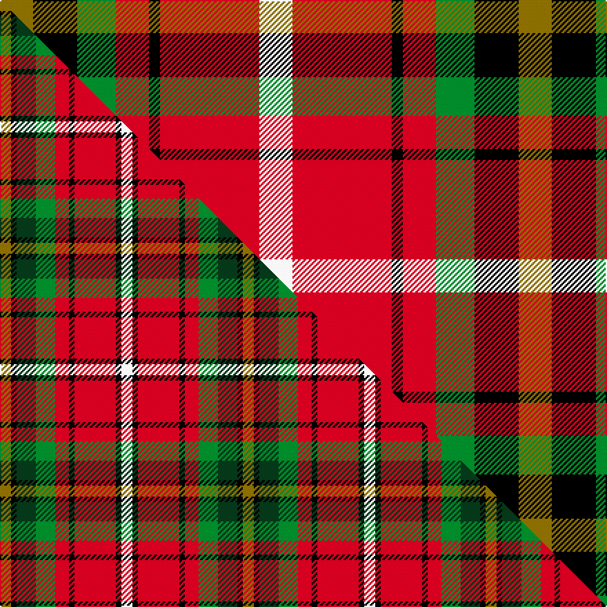

This is one **variant** — a specific cloth: this exact thread count and colourway, with its own
provenance below. It is one weaving of the [sett](/setts/y6k8g7r6k2r18w6/) (the scale-free proportion — the
same cloth at any scale or shade), whose colour order is pattern [GKGRKRW](/stripes/gkgrkrw/).

Part of the [Thirkill](/tartans/thirkill/) tartan — the named design grouping this sett with its other cloths.

Sourced from register-of-tartans.  It is a [7 stripe tartan](/stripes/stripes7/).

Original link [https://www.tartanregister.gov.uk/tartanDetails.aspx?ref=4102](https://www.tartanregister.gov.uk/tartanDetails.aspx?ref=4102)

Dataset <small>— provenance for this record, inherited from the source manifest</small>

<dl class="dataset-prov">
<dt>source</dt><dd><a href="/sources/register-of-tartans/">Scottish Register of Tartans</a></dd>
<dt>data captured from</dt><dd><a href="https://github.com/thetartan/tartan-database/blob/master/data/register-of-tartans/data.csv">https://github.com/thetartan/tartan-database/blob/master/data/register-of-tartans/data.csv</a></dd>
<dt>data date</dt><dd>2004 <small>(this record)</small></dd>
<dt>licence</dt><dd><a href="https://www.tartanregister.gov.uk/copyright">Crown copyright</a></dd>
</dl>

Capture chain <small>— the hands this data passed through, oldest first; each capture carries its own licence</small>

<ol class="capture-chain">
<li><a href="https://www.tartanregister.gov.uk/">Scottish Register of Tartans</a> · <a href="https://www.tartanregister.gov.uk/copyright">Crown copyright</a> <small>the living register — still published by National Records of Scotland</small></li>
<li><a href="https://github.com/thetartan/tartan-database">thetartan/tartan-database</a> <small>2016-2017</small> · <a href="https://creativecommons.org/licenses/by-nc-nd/4.0/">CC BY-NC-ND 4.0</a> <small>Levko Kravets's frozen compilation — the capture we vendored, and where its CC licence text came from</small></li>
<li>this dictionary <small>captured 2026-06-10 · commit 5bf86c7566</small> <small>each re-capture is a git commit to data/sources</small></li>
</ol>

## Register references

External register numbers recorded for this tartan.

- Scottish Register of Tartans: [4102](https://www.tartanregister.gov.uk/tartanDetails.aspx?ref=4102)
- Scottish Tartans Authority (ITI): 6275

## Thread count
Y/24 K32 G28 R24 K8 R72 W/24

One full sett is **376 threads**.

## Palette
<table><thead><tr><th>Colour</th><th>Shade</th><th>OKLCh</th></tr></thead><tbody><tr><td>G</td><td><code style="background-color:#008B2A;">#008B2A</code> <small style="color:#888">#008B2A</small></td><td><small style="color:#888">oklch(55.4% 0.170 145.9)</small></td></tr><tr><td>K</td><td><code style="background-color:#000000;">#000000</code> <small style="color:#888">#000000</small></td><td><small style="color:#888">oklch(0.0% 0.000 0.0)</small></td></tr><tr><td>R</td><td><code style="background-color:#D60020;">#D60020</code> <small style="color:#888">#D60020</small></td><td><small style="color:#888">oklch(55.2% 0.224 25.5)</small></td></tr><tr><td>W</td><td><code style="background-color:#F7F7F7;">#F7F7F7</code> <small style="color:#888">#F7F7F7</small></td><td><small style="color:#888">oklch(97.6% 0.000 89.9)</small></td></tr><tr><td>Y</td><td><code style="background-color:#8B6E00;">#8B6E00</code> <small style="color:#888">#8B6E00</small></td><td><small style="color:#888">oklch(55.1% 0.113 90.4)</small></td></tr></tbody></table>

# Sample pattern

## Compared to the master

This cloth is one sett of its design; the master sett (the exemplar the design is anchored on) is below for comparison.

Its **ΔTartan distance** from the master is **1.01** — the same measure the nearest-tartans table ranks by (0 is identical; a re-scale of the same cloth is near 0, a recolour or a different proportion further).

<figure class="master-compare" style="margin:0">

this sett
master sett ★

<figcaption style="color:#888;font-size:smaller">One weave of this sett against the <a href="/setts/y4k2dg7g7r5k2r15k2w4/">master sett ★</a>, split on the diagonal: a shared proportion runs seamlessly across it with only the shades shifting; a different proportion breaks on it.</figcaption>
</figure>

## Nearest tartan variants

The nearest existing variants by ΔTartan distance, with this cloth at the top so the swatches line up against it.

ΔTartan

Threads

Variant

Sett

—

376

<a href="/variants/s7/y6k8g7r6k2r18w6~x4/">Thirkill (Dalgliesh)</a>

<a href="/ttd/edit/#slug=y4k2dg7g7r5k2r15k2w4~x2&amp;base=y6k8g7r6k2r18w6~x4" title="compare in the TTD">1.01</a>

176

<a href="/variants/s9/y4k2dg7g7r5k2r15k2w4~x2/">Thirkill</a>

<a href="/ttd/edit/#slug=k2r20k8g18r3w2~x2&amp;base=y6k8g7r6k2r18w6~x4" title="compare in the TTD">1.47</a>

204

<a href="/variants/s6/k2r20k8g18r3w2~x2/">Celtic Combat</a>

<a href="/ttd/edit/#slug=y2g7k6r12k1r1y2~x4&amp;base=y6k8g7r6k2r18w6~x4" title="compare in the TTD">1.83</a>

232

<a href="/variants/s7/y2g7k6r12k1r1y2~x4/">Blackstock Dress Family Tartan</a>

<a href="/ttd/edit/#slug=r8lb3k4g6r4k1r4~x2&amp;base=y6k8g7r6k2r18w6~x4" title="compare in the TTD">1.84</a>

96

<a href="/variants/s7/r8lb3k4g6r4k1r4~x2/">MacDuff #5</a>

<a href="/ttd/edit/#slug=r8db3k4g6r4k1r4~x2&amp;base=y6k8g7r6k2r18w6~x4" title="compare in the TTD">1.84</a>

96

<a href="/variants/s7/r8db3k4g6r4k1r4~x2/">MacDuff</a>

<a href="/ttd/edit/#slug=r8db3k4g6r4k1r4~x4&amp;base=y6k8g7r6k2r18w6~x4" title="compare in the TTD">1.84</a>

192

<a href="/variants/s7/r8db3k4g6r4k1r4~x4/">MacDuff Clan Tartan</a>

<a href="/ttd/edit/#slug=lo2dg7k6r11k1r1lo2~x4&amp;base=y6k8g7r6k2r18w6~x4" title="compare in the TTD">1.85</a>

224

<a href="/variants/s7/lo2dg7k6r11k1r1lo2~x4/">Blackstock, Red Dress (Clan)</a>

<a href="/ttd/edit/#slug=lo2dg7k6r11k1r1lo2~x4~r1908029&amp;base=y6k8g7r6k2r18w6~x4" title="compare in the TTD">1.85</a>

224

<a href="/variants/s7/lo2dg7k6r11k1r1lo2~x4~r1908029/">Blackstock Red (Dress)</a>

<a href="/ttd/edit/#slug=r9k9r9w1g9~x8&amp;base=y6k8g7r6k2r18w6~x4" title="compare in the TTD">1.91</a>

448

<a href="/variants/s5/r9k9r9w1g9~x8/">Unidentified item</a>

<a href="/ttd/edit/#slug=r2w12y1k12o12k1~x2&amp;base=y6k8g7r6k2r18w6~x4" title="compare in the TTD">2.22</a>

154

<a href="/variants/s6/r2w12y1k12o12k1~x2/">Dutch Dress</a>

## Neighbour map

Every grey dot is one of 13621 variants placed by the first two principal components of the ΔTartan feature space (42% of its variance). Red is this tartan; blue dots are its nearest — click one to open its page.

<svg viewBox="0 0 640 380" role="img" style="max-width:100%;height:auto;border:1px solid #e0e0e0;border-radius:4px;display:block" xmlns="http://www.w3.org/2000/svg"><image href="/nn/cloud.v1.png" width="640" height="380"/><a href="/variants/s9/y4k2dg7g7r5k2r15k2w4~x2/"><circle cx="97.7" cy="163.1" r="4" fill="#3465a4"><title>Thirkill</title></circle></a><a href="/variants/s6/k2r20k8g18r3w2~x2/"><circle cx="190.1" cy="183.6" r="4" fill="#3465a4"><title>Celtic Combat</title></circle></a><a href="/variants/s7/y2g7k6r12k1r1y2~x4/"><circle cx="179.5" cy="170.5" r="4" fill="#3465a4"><title>Blackstock Dress Family Tartan</title></circle></a><a href="/variants/s7/r8lb3k4g6r4k1r4~x2/"><circle cx="193.5" cy="221.1" r="4" fill="#3465a4"><title>MacDuff #5</title></circle></a><a href="/variants/s7/r8db3k4g6r4k1r4~x2/"><circle cx="196.7" cy="221.7" r="4" fill="#3465a4"><title>MacDuff</title></circle></a><a href="/variants/s7/r8db3k4g6r4k1r4~x4/"><circle cx="196.7" cy="221.7" r="4" fill="#3465a4"><title>MacDuff Clan Tartan</title></circle></a><a href="/variants/s7/lo2dg7k6r11k1r1lo2~x4/"><circle cx="162.4" cy="173.0" r="4" fill="#3465a4"><title>Blackstock, Red Dress (Clan)</title></circle></a><a href="/variants/s7/lo2dg7k6r11k1r1lo2~x4~r1908029/"><circle cx="168.5" cy="176.2" r="4" fill="#3465a4"><title>Blackstock Red (Dress)</title></circle></a><a href="/variants/s5/r9k9r9w1g9~x8/"><circle cx="176.7" cy="236.4" r="4" fill="#3465a4"><title>Unidentified item</title></circle></a><a href="/variants/s6/r2w12y1k12o12k1~x2/"><circle cx="105.9" cy="165.7" r="4" fill="#3465a4"><title>Dutch Dress</title></circle></a><circle cx="133.3" cy="187.8" r="5" fill="#c00000"/><text x="320" y="376" text-anchor="middle" font-size="11" fill="#999">ground</text><text x="11" y="190" text-anchor="middle" font-size="11" fill="#999" transform="rotate(-90 11 190)">complexity</text></svg>

ID: /variants/s7/y6k8g7r6k2r18w6~x4/
