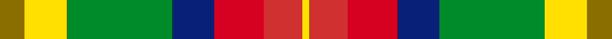

This is one **variant** — a specific cloth: this exact thread count and colourway, with its own
provenance below. It is one weaving of the [sett](/setts/y7ly12g30db12r14ri11ly2/) (the scale-free proportion — the
same cloth at any scale or shade), whose colour order is pattern [GYGBRRY](/stripes/gygbrry/).

Part of the [Unidentified, Silk](/tartans/u/un/unidentified-silk-4/) tartan — the named design grouping this sett with its other cloths.

Sourced from weddslist.  It is a [7 stripe tartan](/stripes/stripes7/).

Original link [http://www.weddslist.com/cgi-bin/tartans/pg.pl?source=sts](http://www.weddslist.com/cgi-bin/tartans/pg.pl?source=sts)

Dataset <small>— provenance for this record, inherited from the source manifest</small>

<dl class="dataset-prov">
<dt>source</dt><dd><a href="/sources/weddslist/">Weddslist</a></dd>
<dt>data captured from</dt><dd><a href="https://github.com/thetartan/tartan-database/blob/master/data/weddslist/data.csv">https://github.com/thetartan/tartan-database/blob/master/data/weddslist/data.csv</a></dd>
<dt>data date</dt><dd>2016-11-17 <small>(dataset default)</small></dd>
<dt>licence</dt><dd><a href="https://creativecommons.org/licenses/by-nc-nd/4.0/">CC BY-NC-ND 4.0</a></dd>
</dl>

Capture chain <small>— the hands this data passed through, oldest first; each capture carries its own licence</small>

<ol class="capture-chain">
<li><a href="https://www.weddslist.com/tartans/">Weddslist</a> <small>the living privately compiled reference</small></li>
<li><a href="https://github.com/thetartan/tartan-database">thetartan/tartan-database</a> <small>2016-2017</small> · <a href="https://creativecommons.org/licenses/by-nc-nd/4.0/">CC BY-NC-ND 4.0</a> <small>Levko Kravets's frozen compilation — the capture we vendored, and where its CC licence text came from</small></li>
<li>this dictionary <small>captured 2026-06-10 · commit 5bf86c7566</small> <small>each re-capture is a git commit to data/sources</small></li>
</ol>

## Thread count
Y/14 LY24 G60 DB24 R28 Ri22 LY/4

One full sett is **334 threads**.

## Palette
<table><thead><tr><th>Colour</th><th>Shade</th><th>OKLCh</th></tr></thead><tbody><tr><td>G</td><td><code style="background-color:#008B2A;">#008B2A</code> <small style="color:#888">#008B2A</small></td><td><small style="color:#888">oklch(55.4% 0.170 145.9)</small></td></tr><tr><td>Y</td><td><code style="background-color:#8B6E00;">#8B6E00</code> <small style="color:#888">#8B6E00</small></td><td><small style="color:#888">oklch(55.1% 0.113 90.4)</small></td></tr><tr><td>DB</td><td><code style="background-color:#082077;">#082077</code> <small style="color:#888">#082077</small></td><td><small style="color:#888">oklch(30.0% 0.149 265.1)</small></td></tr><tr><td>R</td><td><code style="background-color:#D60020;">#D60020</code> <small style="color:#888">#D60020</small></td><td><small style="color:#888">oklch(55.2% 0.224 25.5)</small></td></tr><tr><td>R</td><td><code style="background-color:#D03030;">#D03030</code> <small style="color:#888">#D03030</small></td><td><small style="color:#888">oklch(56.4% 0.196 26.2)</small></td></tr><tr><td>LY</td><td><code style="background-color:#FFE000;">#FFE000</code> <small style="color:#888">#FFE000</small></td><td><small style="color:#888">oklch(90.5% 0.188 99.1)</small></td></tr></tbody></table>

# Sample pattern

## Nearest tartan variants

The nearest existing variants by ΔTartan distance, with this cloth at the top so the swatches line up against it.

ΔTartan

Threads

Variant

Sett

—

334

<a href="/variants/s7/y7ly12g30db12r14ri11ly2~x2~ly3608101-ri2308029/">Unidentified, Silk Plaid</a>

<a href="/ttd/edit/#slug=dy7ly12g30lo12o14r11ly2~x2&amp;base=y7ly12g30db12r14ri11ly2~x2~ly3608101-ri2308029" title="compare in the TTD">1.60</a>

334

<a href="/variants/s7/dy7ly12g30lo12o14r11ly2~x2/">Unidentified Silk Plaid #2</a>

<a href="/ttd/edit/#slug=w3dg24r13g4ly11r8db2~x2~dg1806142-g2304202&amp;base=y7ly12g30db12r14ri11ly2~x2~ly3608101-ri2308029" title="compare in the TTD">2.27</a>

250

<a href="/variants/s7/w3dg24r13g4ly11r8db2~x2~dg1806142-g2304202/">Elystan Glodrydd (Name)</a>

<a href="/ttd/edit/#slug=db2lo10lb1o8g7dr10lb2~x2&amp;base=y7ly12g30db12r14ri11ly2~x2~ly3608101-ri2308029" title="compare in the TTD">2.48</a>

152

<a href="/variants/s7/db2lo10lb1o8g7dr10lb2~x2/">Kipp (Personal)</a>

<a href="/ttd/edit/#slug=w2ri8dy5y6w5g21w6ri8r4w2~ri2209032-r2208029&amp;base=y7ly12g30db12r14ri11ly2~x2~ly3608101-ri2308029" title="compare in the TTD">2.55</a>

130

<a href="/variants/s10/w2ri8dy5y6w5g21w6ri8r4w2~ri2209032-r2208029/">Jacobite Silk sash</a>

<a href="/ttd/edit/#slug=o17n5db2w12db2y4g7~x2&amp;base=y7ly12g30db12r14ri11ly2~x2~ly3608101-ri2308029" title="compare in the TTD">2.58</a>

148

<a href="/variants/s7/o17n5db2w12db2y4g7~x2/">Ontario, Northern</a>

<a href="/ttd/edit/#slug=w2r8o5y6w5g21w6r8b4w2&amp;base=y7ly12g30db12r14ri11ly2~x2~ly3608101-ri2308029" title="compare in the TTD">2.64</a>

130

<a href="/variants/s10/w2r8o5y6w5g21w6r8b4w2/">Jacobite, Silk sash</a>

<a href="/ttd/edit/#slug=w2g27y1dy7db5y5r17y6db1~x2&amp;base=y7ly12g30db12r14ri11ly2~x2~ly3608101-ri2308029" title="compare in the TTD">2.82</a>

278

<a href="/variants/s9/w2g27y1dy7db5y5r17y6db1~x2/">Elystan Glodrydd (Welsh Tribe)</a>

<a href="/ttd/edit/#slug=ly8r3t2db1w6g12db2~x2&amp;base=y7ly12g30db12r14ri11ly2~x2~ly3608101-ri2308029" title="compare in the TTD">2.88</a>

116

<a href="/variants/s7/ly8r3t2db1w6g12db2~x2/">Carmen Lau (Hong Kong) (Personal)</a>

<a href="/ttd/edit/#slug=w6lb36y12g19dg6r6dg6r28dg4&amp;base=y7ly12g30db12r14ri11ly2~x2~ly3608101-ri2308029" title="compare in the TTD">3.21</a>

236

<a href="/variants/s9/w6lb36y12g19dg6r6dg6r28dg4/">Derry Family (Olney, Buckinghamshire) (Personal)</a>

<a href="/ttd/edit/#slug=dy5ly20r3dg13dy13dp3b3~x2&amp;base=y7ly12g30db12r14ri11ly2~x2~ly3608101-ri2308029" title="compare in the TTD">3.21</a>

224

<a href="/variants/s7/dy5ly20r3dg13dy13dp3b3~x2/">Christmas Hill Game Farm</a>

## Neighbour map

Every grey dot is one of 13656 variants placed by the first two principal components of the ΔTartan feature space (42% of its variance). Red is this tartan; blue dots are its nearest — click one to open its page. The map is a flat projection of a many-dimensional space — [how to read it](/posts/neighbourhood-maps/).

<svg viewBox="0 0 640 380" role="img" style="max-width:100%;height:auto;border:1px solid #e0e0e0;border-radius:4px;display:block" xmlns="http://www.w3.org/2000/svg"><image href="/nn/cloud.v1.png" width="640" height="380"/><a href="/variants/s7/dy7ly12g30lo12o14r11ly2~x2/"><circle cx="162.7" cy="201.2" r="4" fill="#3465a4"><title>Unidentified Silk Plaid #2</title></circle></a><a href="/variants/s7/w3dg24r13g4ly11r8db2~x2~dg1806142-g2304202/"><circle cx="169.9" cy="184.1" r="4" fill="#3465a4"><title>Elystan Glodrydd (Name)</title></circle></a><a href="/variants/s7/db2lo10lb1o8g7dr10lb2~x2/"><circle cx="95.1" cy="205.2" r="4" fill="#3465a4"><title>Kipp (Personal)</title></circle></a><a href="/variants/s10/w2ri8dy5y6w5g21w6ri8r4w2~ri2209032-r2208029/"><circle cx="106.3" cy="170.8" r="4" fill="#3465a4"><title>Jacobite Silk sash</title></circle></a><a href="/variants/s7/o17n5db2w12db2y4g7~x2/"><circle cx="125.5" cy="200.0" r="4" fill="#3465a4"><title>Ontario, Northern</title></circle></a><a href="/variants/s10/w2r8o5y6w5g21w6r8b4w2/"><circle cx="112.2" cy="173.5" r="4" fill="#3465a4"><title>Jacobite, Silk sash</title></circle></a><a href="/variants/s9/w2g27y1dy7db5y5r17y6db1~x2/"><circle cx="217.7" cy="131.6" r="4" fill="#3465a4"><title>Elystan Glodrydd (Welsh Tribe)</title></circle></a><a href="/variants/s7/ly8r3t2db1w6g12db2~x2/"><circle cx="135.1" cy="189.1" r="4" fill="#3465a4"><title>Carmen Lau (Hong Kong) (Personal)</title></circle></a><a href="/variants/s9/w6lb36y12g19dg6r6dg6r28dg4/"><circle cx="110.2" cy="182.0" r="4" fill="#3465a4"><title>Derry Family (Olney, Buckinghamshire) (Personal)</title></circle></a><a href="/variants/s7/dy5ly20r3dg13dy13dp3b3~x2/"><circle cx="111.9" cy="204.5" r="4" fill="#3465a4"><title>Christmas Hill Game Farm</title></circle></a><circle cx="121.1" cy="185.9" r="5" fill="#c00000"/><text x="320" y="376" text-anchor="middle" font-size="11" fill="#999">ground</text><text x="11" y="190" text-anchor="middle" font-size="11" fill="#999" transform="rotate(-90 11 190)">complexity</text></svg>

ID: /variants/s7/y7ly12g30db12r14ri11ly2~x2~ly3608101-ri2308029/
