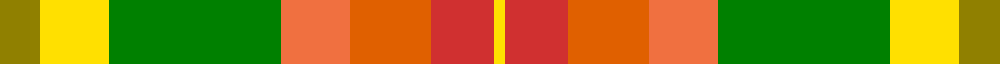
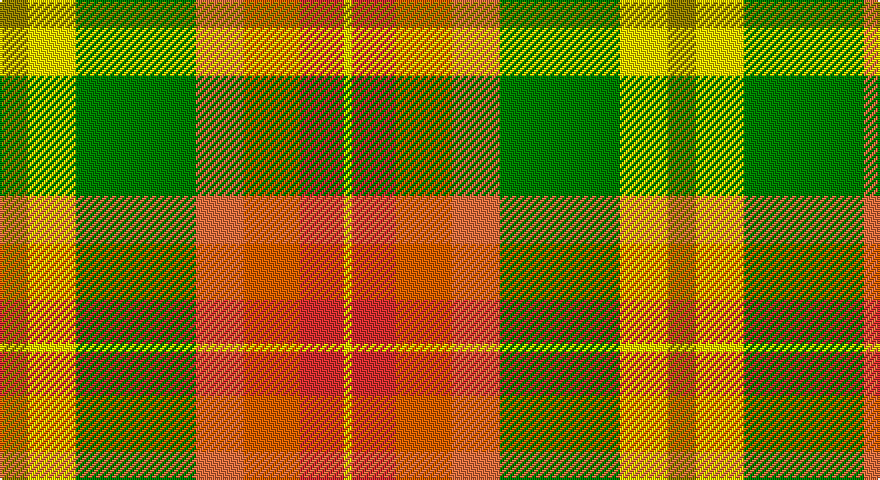

This page is one **sett** — a single exact thread-count. It belongs to the [tartan](/setts/y7ly12g30oi12o14r11ly2/)
(the same proportion at any scale), whose colour order is pattern [GYGRRRY](/stripes/gygrrry/).

Sourced from weddslist.  It is a [7 stripe tartan](/stripes/stripes7/).

Original link http://www.weddslist.com/cgi-bin/tartans/pg.pl?source=sts

## Thread count
LG/14 Y24 G60 O24 Oa28 R22 Y/4

One full sett is **334 threads**.

## Palette

Palette: <strong>custom</strong>
<table><thead><tr><th>Colour</th><th>Threads</th><th>Shade</th><th>Base</th><th>OKLCh</th></tr></thead><tbody><tr><td>LG/</td><td style="text-align:right;font-variant-numeric:tabular-nums">14</td><td><code style="background-color:#908000;">#908000</code> <small style="color:#888">#908000</small></td><td>G <code style="background-color:#006100;">#006100</code></td><td><small style="color:#888">oklch(59.6% 0.124 100.6)</small></td></tr><tr><td>Y</td><td style="text-align:right;font-variant-numeric:tabular-nums">24</td><td><code style="background-color:#FFE000;">#FFE000</code> <small style="color:#888">#FFE000</small></td><td>Y <code style="background-color:#F2BF00;">#F2BF00</code></td><td><small style="color:#888">oklch(90.5% 0.188 99.1)</small></td></tr><tr><td>G</td><td style="text-align:right;font-variant-numeric:tabular-nums">60</td><td><code style="background-color:#008000;">#008000</code> <small style="color:#888">#008000</small></td><td>G <code style="background-color:#006100;">#006100</code></td><td><small style="color:#888">oklch(52.0% 0.177 142.5)</small></td></tr><tr><td>O</td><td style="text-align:right;font-variant-numeric:tabular-nums">24</td><td><code style="background-color:#F07040;">#F07040</code> <small style="color:#888">#F07040</small></td><td>R <code style="background-color:#CC0000;">#CC0000</code></td><td><small style="color:#888">oklch(69.0% 0.170 40.2)</small></td></tr><tr><td>Oa</td><td style="text-align:right;font-variant-numeric:tabular-nums">28</td><td><code style="background-color:#E06000;">#E06000</code> <small style="color:#888">#E06000</small></td><td>R <code style="background-color:#CC0000;">#CC0000</code></td><td><small style="color:#888">oklch(64.1% 0.179 46.2)</small></td></tr><tr><td>R</td><td style="text-align:right;font-variant-numeric:tabular-nums">22</td><td><code style="background-color:#D03030;">#D03030</code> <small style="color:#888">#D03030</small></td><td>R <code style="background-color:#CC0000;">#CC0000</code></td><td><small style="color:#888">oklch(56.4% 0.196 26.2)</small></td></tr><tr><td>Y/</td><td style="text-align:right;font-variant-numeric:tabular-nums">4</td><td><code style="background-color:#FFE000;">#FFE000</code> <small style="color:#888">#FFE000</small></td><td>Y <code style="background-color:#F2BF00;">#F2BF00</code></td><td><small style="color:#888">oklch(90.5% 0.188 99.1)</small></td></tr></tbody></table>

# Sample pattern

## Nearest tartans

The nearest existing variants by ΔTartan distance, with this tartan at the top so the swatches line up against it.

ΔTartan

Tartan

Sett

—

<a href="/ttd/edit/#slug=y7ly12g30oi12o14r11ly2~x2">Unidentified, Silk Plaid</a> <a class="nn-out" href="/variants/s7/y7ly12g30oi12o14r11ly2~x2/" title="open its dictionary page">↗</a>

1.16

<a href="/ttd/edit/#slug=lo7ly12dg30o12ri14r11ly2~x2&amp;base=y7ly12g30oi12o14r11ly2~x2">Unidentified Silk Plaid #2</a> <a class="nn-out" href="/variants/s7/lo7ly12dg30o12ri14r11ly2~x2/" title="open its dictionary page">↗</a>

1.57

<a href="/ttd/edit/#slug=loi22ly22dr2lb6dr2lo2dr16lg5loi8lb2~x2&amp;base=y7ly12g30oi12o14r11ly2~x2">Bruce of Kinnaird (Fashion)</a> <a class="nn-out" href="/variants/s10/loi22ly22dr2lb6dr2lo2dr16lg5loi8lb2~x2/" title="open its dictionary page">↗</a>

1.58

<a href="/ttd/edit/#slug=w3g24r13gi4lo11r8db2~x2&amp;base=y7ly12g30oi12o14r11ly2~x2">Elystan Glodrydd (Name)</a> <a class="nn-out" href="/variants/s7/w3g24r13gi4lo11r8db2~x2/" title="open its dictionary page">↗</a>

1.64

<a href="/ttd/edit/#slug=w2ri8o5ly6w5g21w6ri8r4w2&amp;base=y7ly12g30oi12o14r11ly2~x2">Jacobite, Silk sash</a> <a class="nn-out" href="/variants/s10/w2ri8o5ly6w5g21w6ri8r4w2/" title="open its dictionary page">↗</a>

1.78

<a href="/ttd/edit/#slug=w3ri10o6ly8t8g32r8ri10r6w3~x4&amp;base=y7ly12g30oi12o14r11ly2~x2">Unidentified, Silk scarf</a> <a class="nn-out" href="/variants/s10/w3ri10o6ly8t8g32r8ri10r6w3~x4/" title="open its dictionary page">↗</a>

1.80

<a href="/ttd/edit/#slug=w1lg6ly9lo9r9lg1~x4&amp;base=y7ly12g30oi12o14r11ly2~x2">Max Reger, The</a> <a class="nn-out" href="/variants/s6/w1lg6ly9lo9r9lg1~x4/" title="open its dictionary page">↗</a>

1.83

<a href="/ttd/edit/#slug=db1ly7w1lo7g7m7w1~x2&amp;base=y7ly12g30oi12o14r11ly2~x2">Kipp</a> <a class="nn-out" href="/variants/s7/db1ly7w1lo7g7m7w1~x2/" title="open its dictionary page">↗</a>

1.86

<a href="/ttd/edit/#slug=ly4g18t4o8t8r21w1~x2&amp;base=y7ly12g30oi12o14r11ly2~x2">G P Bathija (Shikarpur, Sindh) Name Tartan</a> <a class="nn-out" href="/variants/s7/ly4g18t4o8t8r21w1~x2/" title="open its dictionary page">↗</a>

1.86

<a href="/ttd/edit/#slug=ly4r2ly21dt11w2o21lyi4~x2&amp;base=y7ly12g30oi12o14r11ly2~x2">Barbour - Muted</a> <a class="nn-out" href="/variants/s7/ly4r2ly21dt11w2o21lyi4~x2/" title="open its dictionary page">↗</a>

1.98

<a href="/ttd/edit/#slug=db2lo10lb1o8g7dr10lb2~x2&amp;base=y7ly12g30oi12o14r11ly2~x2">Kipp (Personal)</a> <a class="nn-out" href="/variants/s7/db2lo10lb1o8g7dr10lb2~x2/" title="open its dictionary page">↗</a>

## Neighbour map

Every grey dot is one of 14360 variants placed by the first two principal components of the ΔTartan feature space (44% of its variance). Red is this tartan; blue dots are its nearest — click one to open its page.

<svg viewBox="0 0 640 380" role="img" style="max-width:100%;height:auto;border:1px solid #e0e0e0;border-radius:4px;display:block" xmlns="http://www.w3.org/2000/svg"><image href="/nn/cloud.v1.png" width="640" height="380"/><a href="/variants/s7/lo7ly12dg30o12ri14r11ly2~x2/"><circle cx="106.7" cy="154.6" r="4" fill="#3465a4"><title>Unidentified Silk Plaid #2</title></circle></a><a href="/variants/s10/loi22ly22dr2lb6dr2lo2dr16lg5loi8lb2~x2/"><circle cx="131.9" cy="134.8" r="4" fill="#3465a4"><title>Bruce of Kinnaird (Fashion)</title></circle></a><a href="/variants/s7/w3g24r13gi4lo11r8db2~x2/"><circle cx="162.0" cy="166.9" r="4" fill="#3465a4"><title>Elystan Glodrydd (Name)</title></circle></a><a href="/variants/s10/w2ri8o5ly6w5g21w6ri8r4w2/"><circle cx="88.7" cy="138.8" r="4" fill="#3465a4"><title>Jacobite, Silk sash</title></circle></a><a href="/variants/s10/w3ri10o6ly8t8g32r8ri10r6w3~x4/"><circle cx="100.8" cy="128.7" r="4" fill="#3465a4"><title>Unidentified, Silk scarf</title></circle></a><a href="/variants/s6/w1lg6ly9lo9r9lg1~x4/"><circle cx="104.0" cy="195.6" r="4" fill="#3465a4"><title>Max Reger, The</title></circle></a><a href="/variants/s7/db1ly7w1lo7g7m7w1~x2/"><circle cx="40.3" cy="178.7" r="4" fill="#3465a4"><title>Kipp</title></circle></a><a href="/variants/s7/ly4g18t4o8t8r21w1~x2/"><circle cx="175.9" cy="150.0" r="4" fill="#3465a4"><title>G P Bathija (Shikarpur, Sindh) Name Tartan</title></circle></a><a href="/variants/s7/ly4r2ly21dt11w2o21lyi4~x2/"><circle cx="147.8" cy="145.2" r="4" fill="#3465a4"><title>Barbour - Muted</title></circle></a><a href="/variants/s7/db2lo10lb1o8g7dr10lb2~x2/"><circle cx="63.7" cy="174.4" r="4" fill="#3465a4"><title>Kipp (Personal)</title></circle></a><circle cx="123.8" cy="165.8" r="5" fill="#c00000"/></svg>

ID: /variants/s7/y7ly12g30oi12o14r11ly2~x2/
