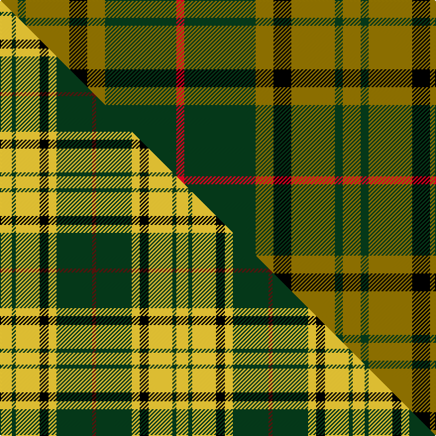

This is one **variant** — a specific cloth: this exact thread count and colourway, with its own
provenance below. It is one weaving of the [sett](/setts/y9dg4y22k9y9dg36r4/) (the scale-free proportion — the
same cloth at any scale or shade), whose colour order is pattern [GGGKGGR](/stripes/gggkggr/).

Part of the [Harmer](/tartans/h/ha/harmer-2/) tartan — the named design grouping this sett with its other cloths.

Sourced from weddslist.  It is a [7 stripe tartan](/stripes/stripes7/).

Original link [http://www.weddslist.com/cgi-bin/tartans/pg.pl?source=sts](http://www.weddslist.com/cgi-bin/tartans/pg.pl?source=sts)

Dataset <small>— provenance for this record, inherited from the source manifest</small>

<dl class="dataset-prov">
<dt>source</dt><dd><a href="/sources/weddslist/">Weddslist</a></dd>
<dt>data captured from</dt><dd><a href="https://github.com/thetartan/tartan-database/blob/master/data/weddslist/data.csv">https://github.com/thetartan/tartan-database/blob/master/data/weddslist/data.csv</a></dd>
<dt>data date</dt><dd>2016-11-17 <small>(dataset default)</small></dd>
<dt>licence</dt><dd><a href="https://creativecommons.org/licenses/by-nc-nd/4.0/">CC BY-NC-ND 4.0</a></dd>
</dl>

Capture chain <small>— the hands this data passed through, oldest first; each capture carries its own licence</small>

<ol class="capture-chain">
<li><a href="https://www.weddslist.com/tartans/">Weddslist</a> <small>the living privately compiled reference</small></li>
<li><a href="https://github.com/thetartan/tartan-database">thetartan/tartan-database</a> <small>2016-2017</small> · <a href="https://creativecommons.org/licenses/by-nc-nd/4.0/">CC BY-NC-ND 4.0</a> <small>Levko Kravets's frozen compilation — the capture we vendored, and where its CC licence text came from</small></li>
<li>this dictionary <small>captured 2026-06-10 · commit 5bf86c7566</small> <small>each re-capture is a git commit to data/sources</small></li>
</ol>

## Thread count
Y/18 DG8 Y44 K18 Y18 DG72 R/8

One full sett is **346 threads**.

## Palette
<table><thead><tr><th>Colour</th><th>Shade</th><th>OKLCh</th></tr></thead><tbody><tr><td>DG</td><td><code style="background-color:#053819;">#053819</code> <small style="color:#888">#053819</small></td><td><small style="color:#888">oklch(30.0% 0.075 151.3)</small></td></tr><tr><td>K</td><td><code style="background-color:#000000;">#000000</code> <small style="color:#888">#000000</small></td><td><small style="color:#888">oklch(0.0% 0.000 0.0)</small></td></tr><tr><td>R</td><td><code style="background-color:#D60020;">#D60020</code> <small style="color:#888">#D60020</small></td><td><small style="color:#888">oklch(55.2% 0.224 25.5)</small></td></tr><tr><td>Y</td><td><code style="background-color:#8B6E00;">#8B6E00</code> <small style="color:#888">#8B6E00</small></td><td><small style="color:#888">oklch(55.1% 0.113 90.4)</small></td></tr></tbody></table>

# Sample pattern

## Compared to the master

This cloth is one sett of its design; the master sett (the exemplar the design is anchored on) is below for comparison.

Its **ΔTartan distance** from the master is **0.29** — the same measure the nearest-tartans table ranks by (0 is identical; a re-scale of the same cloth is near 0, a recolour or a different proportion further).

<figure class="master-compare" style="margin:0">

this sett
master sett ★

<figcaption style="color:#888;font-size:smaller">One weave of this sett against the <a href="/setts/ly12dg4ly24k9ly8dg36dr4/">master sett ★</a>, split on the diagonal: a shared proportion runs seamlessly across it with only the shades shifting; a different proportion breaks on it.</figcaption>
</figure>

## Nearest tartan variants

The nearest existing variants by ΔTartan distance, with this cloth at the top so the swatches line up against it.

ΔTartan

Threads

Variant

Sett

—

346

<a href="/variants/s7/y9dg4y22k9y9dg36r4~x2/">Harmer</a>

<a href="/ttd/edit/#slug=db8y1dg5y12r1dg2~x6&amp;base=y9dg4y22k9y9dg36r4~x2" title="compare in the TTD">2.30</a>

288

<a href="/variants/s6/db8y1dg5y12r1dg2~x6/">McCabe (2016)</a>

<a href="/ttd/edit/#slug=dr8g2dr12k6dr3db3g24k2~x2&amp;base=y9dg4y22k9y9dg36r4~x2" title="compare in the TTD">2.33</a>

220

<a href="/variants/s8/dr8g2dr12k6dr3db3g24k2~x2/">McInery (Personal)</a>

<a href="/ttd/edit/#slug=dy4dt20dy3k20o24dt3~x2&amp;base=y9dg4y22k9y9dg36r4~x2" title="compare in the TTD">2.38</a>

282

<a href="/variants/s6/dy4dt20dy3k20o24dt3~x2/">Edinburgh International Conference Centre, The</a>

<a href="/ttd/edit/#slug=k4g5k2g5dr17db2~x2&amp;base=y9dg4y22k9y9dg36r4~x2" title="compare in the TTD">2.62</a>

128

<a href="/variants/s6/k4g5k2g5dr17db2~x2/">Denny Hunting</a>

<a href="/ttd/edit/#slug=g4r1db2r1g10dy5r3dy10y1~x4&amp;base=y9dg4y22k9y9dg36r4~x2" title="compare in the TTD">2.64</a>

276

<a href="/variants/s9/g4r1db2r1g10dy5r3dy10y1~x4/">Moncton, City of</a>

<a href="/ttd/edit/#slug=db1dy9g5dy1k5dy1g5dy9w1~x2&amp;base=y9dg4y22k9y9dg36r4~x2" title="compare in the TTD">2.64</a>

144

<a href="/variants/s9/db1dy9g5dy1k5dy1g5dy9w1~x2/">Duchess of York</a>

<a href="/ttd/edit/#slug=g4dr28db6g10k10g3~x2&amp;base=y9dg4y22k9y9dg36r4~x2" title="compare in the TTD">2.73</a>

230

<a href="/variants/s6/g4dr28db6g10k10g3~x2/">Canadian Autumn</a>

<a href="/ttd/edit/#slug=g1dy8g8r1g8dy8w1~x2&amp;base=y9dg4y22k9y9dg36r4~x2" title="compare in the TTD">2.73</a>

136

<a href="/variants/s7/g1dy8g8r1g8dy8w1~x2/">MacKinnon Hunting Clan Tartan</a>

<a href="/ttd/edit/#slug=g1dy8g8r1g8dy8w1~x4&amp;base=y9dg4y22k9y9dg36r4~x2" title="compare in the TTD">2.73</a>

272

<a href="/variants/s7/g1dy8g8r1g8dy8w1~x4/">MacKinnon Htg (Clan)</a>

<a href="/ttd/edit/#slug=g5k2g28k10o26db4g4~x2&amp;base=y9dg4y22k9y9dg36r4~x2" title="compare in the TTD">2.91</a>

298

<a href="/variants/s7/g5k2g28k10o26db4g4~x2/">John Telfar, Dunbar hunting</a>

## Neighbour map

Every grey dot is one of 13621 variants placed by the first two principal components of the ΔTartan feature space (42% of its variance). Red is this tartan; blue dots are its nearest — click one to open its page. The map is a flat projection of a many-dimensional space — [how to read it](/posts/neighbourhood-maps/).

<svg viewBox="0 0 640 380" role="img" style="max-width:100%;height:auto;border:1px solid #e0e0e0;border-radius:4px;display:block" xmlns="http://www.w3.org/2000/svg"><image href="/nn/cloud.v1.png" width="640" height="380"/><a href="/variants/s6/db8y1dg5y12r1dg2~x6/"><circle cx="289.7" cy="222.3" r="4" fill="#3465a4"><title>McCabe (2016)</title></circle></a><a href="/variants/s8/dr8g2dr12k6dr3db3g24k2~x2/"><circle cx="227.3" cy="176.6" r="4" fill="#3465a4"><title>McInery (Personal)</title></circle></a><a href="/variants/s6/dy4dt20dy3k20o24dt3~x2/"><circle cx="154.9" cy="218.2" r="4" fill="#3465a4"><title>Edinburgh International Conference Centre, The</title></circle></a><a href="/variants/s6/k4g5k2g5dr17db2~x2/"><circle cx="239.7" cy="200.9" r="4" fill="#3465a4"><title>Denny Hunting</title></circle></a><a href="/variants/s9/g4r1db2r1g10dy5r3dy10y1~x4/"><circle cx="235.3" cy="200.5" r="4" fill="#3465a4"><title>Moncton, City of</title></circle></a><a href="/variants/s9/db1dy9g5dy1k5dy1g5dy9w1~x2/"><circle cx="233.6" cy="183.0" r="4" fill="#3465a4"><title>Duchess of York</title></circle></a><a href="/variants/s6/g4dr28db6g10k10g3~x2/"><circle cx="224.4" cy="204.1" r="4" fill="#3465a4"><title>Canadian Autumn</title></circle></a><a href="/variants/s7/g1dy8g8r1g8dy8w1~x2/"><circle cx="296.9" cy="244.3" r="4" fill="#3465a4"><title>MacKinnon Hunting Clan Tartan</title></circle></a><a href="/variants/s7/g1dy8g8r1g8dy8w1~x4/"><circle cx="296.9" cy="244.3" r="4" fill="#3465a4"><title>MacKinnon Htg (Clan)</title></circle></a><a href="/variants/s7/g5k2g28k10o26db4g4~x2/"><circle cx="234.8" cy="177.3" r="4" fill="#3465a4"><title>John Telfar, Dunbar hunting</title></circle></a><circle cx="247.9" cy="210.5" r="5" fill="#c00000"/><text x="320" y="376" text-anchor="middle" font-size="11" fill="#999">ground</text><text x="11" y="190" text-anchor="middle" font-size="11" fill="#999" transform="rotate(-90 11 190)">complexity</text></svg>

ID: /variants/s7/y9dg4y22k9y9dg36r4~x2/
