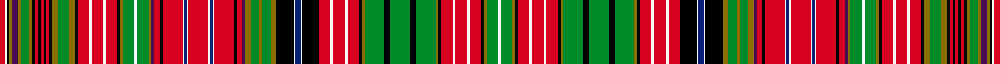

This page is one **sett** — a single exact thread-count. It belongs to the [tartan](/setts/r4w1k2y2dp4y2g6y2k2r2k2r2k2r2k2y4g8y4k2r8w2r8w2r8k2y2g8w2g8y2dp2r4k2r14w1db2w1r14w1db2w1r14k2r4dp2y4g6y2g6y4k12w1db4w1k12r8w2r8w2r8k2y2g14k4g14k4g14y2k2r8w2r8w2r8k2y2g8w2/)
(the same proportion at any scale), whose colour order is pattern [RWKGBGGGKRKRKRKGGGKRWRWRKGGWGGBRKRWBWRWBWRKRBGGGGGKWBWKRWRWRKGGKGKGGKRWRWRKGGW](/stripes/rwkgbgggkrkrkrkgggkrwrwrkggwggbrkrwbwrwbwrkrbgggggkwbwkrwrwrkggkgkggkrwrwrkggw/).

Sourced from house-of-tartan.  It is a [78 stripe tartan](/stripes/stripes78/).

Original link http://www.house-of-tartan.scotland.net/house/TartanViewjs.asp?colr=Def&tnam=2132

## Provenance

Earliest known date: 1831 The most complex of all tartans. The sett given by James Logan has 91 colour changes. The tartan must be woven double width to see the full sett unless woven in silk. Ogilvie became connected with the Drummonds of Strathallan in 1812 by a marriage between the two families. Since then the Drummond sett has also been known as Ogilvie.

## Thread count
R/8 W2 K4 Y4 DP8 Y4 G12 Y4 K4 R4 K4 R4 K4 R4 K4 Y8 G16 Y8 K4 R16 W4 R16 W4 R16 K4 Y4 G16 W4 G16 Y4 DP4 R8 K4 R28 W2 DB4 W2 R28 W2 DB4 W2 R28 K4 R8 DP4 Y8 G12 Y4 G12 Y8 K24 W2 DB8 W2 K24 R16 W4 R16 W4 R16 K4 Y4 G28 K8 G28 K8 G28 Y4 K4 R16 W4 R16 W4 R16 K4 Y4 G16 W/4

One full sett is **1400 threads**.

## Palette
<table><thead><tr><th>Colour</th><th>Shade</th><th>OKLCh</th></tr></thead><tbody><tr><td>DB</td><td><code style="background-color:#082077;">#082077</code> <small style="color:#888">#082077</small></td><td><small style="color:#888">oklch(30.0% 0.149 265.1)</small></td></tr><tr><td>G</td><td><code style="background-color:#008B2A;">#008B2A</code> <small style="color:#888">#008B2A</small></td><td><small style="color:#888">oklch(55.4% 0.170 145.9)</small></td></tr><tr><td>K</td><td><code style="background-color:#000000;">#000000</code> <small style="color:#888">#000000</small></td><td><small style="color:#888">oklch(0.0% 0.000 0.0)</small></td></tr><tr><td>LN</td><td><code style="background-color:#F7F7F7;">#F7F7F7</code> <small style="color:#888">#F7F7F7</small></td><td><small style="color:#888">oklch(97.6% 0.000 89.9)</small></td></tr><tr><td>P</td><td><code style="background-color:#4B0B4F;">#4B0B4F</code> <small style="color:#888">#4B0B4F</small></td><td><small style="color:#888">oklch(30.1% 0.125 325.4)</small></td></tr><tr><td>R</td><td><code style="background-color:#D60020;">#D60020</code> <small style="color:#888">#D60020</small></td><td><small style="color:#888">oklch(55.2% 0.224 25.5)</small></td></tr><tr><td>Y</td><td><code style="background-color:#8B6E00;">#8B6E00</code> <small style="color:#888">#8B6E00</small></td><td><small style="color:#888">oklch(55.1% 0.113 90.4)</small></td></tr></tbody></table>

# Sample pattern

ID: /variants/s78/r4w1k2y2dp4y2g6y2k2r2k2r2k2r2k2y4g8y4k2r8w2r8w2r8k2y2g8w2g8y2dp2r4k2r14w1db2w1r14w1db2w1r14k2r4dp2y4g6y2g6y4k12w1db4w1k12r8w2r8w2r8k2y2g14k4g14k4g14y2k2r8w2r8w2r8k2y2g8w2~x2/
