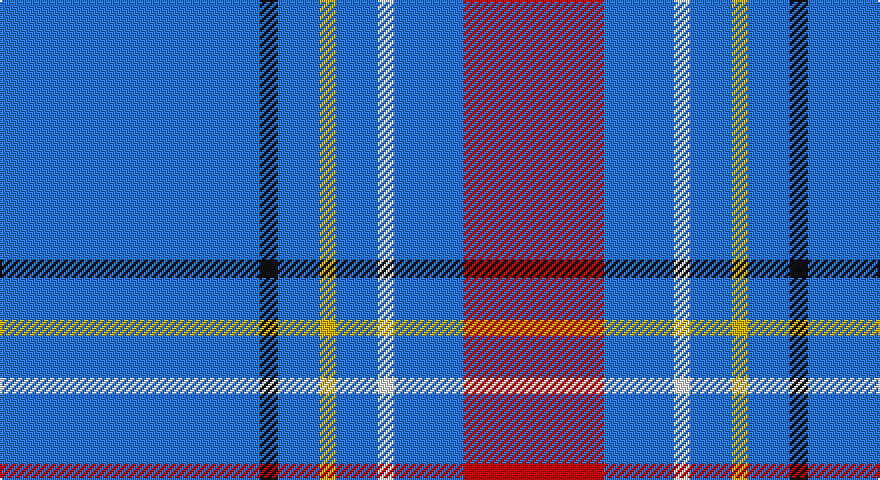

This page is one **sett** — a single exact thread-count. It belongs to the [tartan](/setts/b130k9b21ly8b21w8b35r70/)
(the same proportion at any scale), whose colour order is pattern [BKBYBWBR](/stripes/bkbybwbr/).

Part of the [Maud, Mary](/tartans/maud-mary/) tartan — the named design grouping this sett with its other cloths.

Sourced from register-of-tartans.  It is a [8 stripe tartan](/stripes/stripes8/).

Original link https://www.tartanregister.gov.uk/tartanDetails.aspx?ref=2859

## Also known as

This cloth is also recorded under:

- Maud Mary

2 attestations — the source records this cloth was collapsed from (oldest owns this page)

<ul>
<li>01/01/1892 — Maud, Mary (register-of-tartans, <a href="https://www.tartanregister.gov.uk/tartanDetails.aspx?ref=2859">record</a>)</li>
<li>pre 1892 — Maud, Mary (Fashion) (tartans-authority, <a href="http://www.tartansauthority.com/tartan-ferret/display/268/">record</a>)</li>
</ul>

## Register references

External register numbers recorded for this tartan.

- Scottish Register of Tartans: [2859](https://www.tartanregister.gov.uk/tartanDetails.aspx?ref=2859)
- Scottish Tartans Authority (ITI): 268
- Scottish Tartans World Register: 268

## Thread count
B/130 K9 B21 Y8 B21 W8 B35 R/70

One full sett is **404 threads**.

## Palette

Palette: <strong>Tartan Register</strong>
<table><thead><tr><th>Colour</th><th>Threads</th><th>Shade</th><th>Base</th><th>OKLCh</th></tr></thead><tbody><tr><td>B/</td><td style="text-align:right;font-variant-numeric:tabular-nums">130</td><td><code style="background-color:#2474E8;">#2474E8</code> <small style="color:#888">#2474E8</small></td><td>B <code style="background-color:#2A418A;">#2A418A</code></td><td><small style="color:#888">oklch(57.8% 0.192 258.7)</small></td></tr><tr><td>K</td><td style="text-align:right;font-variant-numeric:tabular-nums">9</td><td><code style="background-color:#101010;">#101010</code> <small style="color:#888">#101010</small></td><td>K <code style="background-color:#000000;">#000000</code></td><td><small style="color:#888">oklch(17.3% 0.000 89.9)</small></td></tr><tr><td>B</td><td style="text-align:right;font-variant-numeric:tabular-nums">21</td><td><code style="background-color:#2474E8;">#2474E8</code> <small style="color:#888">#2474E8</small></td><td>B <code style="background-color:#2A418A;">#2A418A</code></td><td><small style="color:#888">oklch(57.8% 0.192 258.7)</small></td></tr><tr><td>Y</td><td style="text-align:right;font-variant-numeric:tabular-nums">8</td><td><code style="background-color:#D8B000;">#D8B000</code> <small style="color:#888">#D8B000</small></td><td>Y <code style="background-color:#F2BF00;">#F2BF00</code></td><td><small style="color:#888">oklch(77.1% 0.158 92.3)</small></td></tr><tr><td>B</td><td style="text-align:right;font-variant-numeric:tabular-nums">21</td><td><code style="background-color:#2474E8;">#2474E8</code> <small style="color:#888">#2474E8</small></td><td>B <code style="background-color:#2A418A;">#2A418A</code></td><td><small style="color:#888">oklch(57.8% 0.192 258.7)</small></td></tr><tr><td>W</td><td style="text-align:right;font-variant-numeric:tabular-nums">8</td><td><code style="background-color:#FCFCFC;">#FCFCFC</code> <small style="color:#888">#FCFCFC</small></td><td>W <code style="background-color:#F7F7F7;">#F7F7F7</code></td><td><small style="color:#888">oklch(99.1% 0.000 89.9)</small></td></tr><tr><td>B</td><td style="text-align:right;font-variant-numeric:tabular-nums">35</td><td><code style="background-color:#2474E8;">#2474E8</code> <small style="color:#888">#2474E8</small></td><td>B <code style="background-color:#2A418A;">#2A418A</code></td><td><small style="color:#888">oklch(57.8% 0.192 258.7)</small></td></tr><tr><td>R/</td><td style="text-align:right;font-variant-numeric:tabular-nums">70</td><td><code style="background-color:#C80000;">#C80000</code> <small style="color:#888">#C80000</small></td><td>R <code style="background-color:#CC0000;">#CC0000</code></td><td><small style="color:#888">oklch(52.3% 0.215 29.2)</small></td></tr></tbody></table>

# Sample pattern

## Nearest tartans

The nearest existing variants by ΔTartan distance, with this tartan at the top so the swatches line up against it.

ΔTartan

Tartan

Sett

—

<a href="/ttd/edit/#slug=b130k9b21ly8b21w8b35r70">Maud, Mary</a> <a class="nn-out" href="/variants/s8/b130k9b21ly8b21w8b35r70/" title="open its dictionary page">↗</a>

1.19

<a href="/ttd/edit/#slug=b5lb5b5lb5b15lb1o2lb1b21ly2b5k2ly4~x2&amp;base=b130k9b21ly8b21w8b35r70">Jouy (Personal)</a> <a class="nn-out" href="/variants/s13/b5lb5b5lb5b15lb1o2lb1b21ly2b5k2ly4~x2/" title="open its dictionary page">↗</a>

1.33

<a href="/ttd/edit/#slug=b33lo6r3lo6k3lo15b32~x4&amp;base=b130k9b21ly8b21w8b35r70">Carlisle Family (Name)</a> <a class="nn-out" href="/variants/s7/b33lo6r3lo6k3lo15b32~x4/" title="open its dictionary page">↗</a>

1.59

<a href="/ttd/edit/#slug=b46dp3lr3dp3lr4dp12w3k3~x2&amp;base=b130k9b21ly8b21w8b35r70">Edinburgh Festival</a> <a class="nn-out" href="/variants/s8/b46dp3lr3dp3lr4dp12w3k3~x2/" title="open its dictionary page">↗</a>

1.63

<a href="/ttd/edit/#slug=db40g7ly3g7db15r5~x2&amp;base=b130k9b21ly8b21w8b35r70">Wheadon (Name)</a> <a class="nn-out" href="/variants/s6/db40g7ly3g7db15r5~x2/" title="open its dictionary page">↗</a>

1.73

<a href="/ttd/edit/#slug=o1lb6db4lb1db16n1db4n6lb1~x4&amp;base=b130k9b21ly8b21w8b35r70">Fujisankei Serene (Corporate)</a> <a class="nn-out" href="/variants/s9/o1lb6db4lb1db16n1db4n6lb1~x4/" title="open its dictionary page">↗</a>

1.74

<a href="/ttd/edit/#slug=db20b2w5r2db10b5db20b2w5r5~x2&amp;base=b130k9b21ly8b21w8b35r70">Mortell (Personal)</a> <a class="nn-out" href="/variants/s10/db20b2w5r2db10b5db20b2w5r5~x2/" title="open its dictionary page">↗</a>

1.76

<a href="/ttd/edit/#slug=w1lb4b4db3w3b20lb1~x4&amp;base=b130k9b21ly8b21w8b35r70">Starr</a> <a class="nn-out" href="/variants/s7/w1lb4b4db3w3b20lb1~x4/" title="open its dictionary page">↗</a>

1.76

<a href="/ttd/edit/#slug=b18r1b1r1b1k7b13w2~x4&amp;base=b130k9b21ly8b21w8b35r70">Tokyo Bluebells (Corporate)</a> <a class="nn-out" href="/variants/s8/b18r1b1r1b1k7b13w2~x4/" title="open its dictionary page">↗</a>

1.80

<a href="/ttd/edit/#slug=w8b8w4b64db6lb6b4lb6db10b30lo2w5&amp;base=b130k9b21ly8b21w8b35r70">Akashi</a> <a class="nn-out" href="/variants/s12/w8b8w4b64db6lb6b4lb6db10b30lo2w5/" title="open its dictionary page">↗</a>

1.81

<a href="/ttd/edit/#slug=db28o3w1o3db4w2p1w5~x4&amp;base=b130k9b21ly8b21w8b35r70">Baker</a> <a class="nn-out" href="/variants/s8/db28o3w1o3db4w2p1w5~x4/" title="open its dictionary page">↗</a>

## Neighbour map

Every grey dot is one of 14360 variants placed by the first two principal components of the ΔTartan feature space (44% of its variance). Red is this tartan; blue dots are its nearest — click one to open its page.

<svg viewBox="0 0 640 380" role="img" style="max-width:100%;height:auto;border:1px solid #e0e0e0;border-radius:4px;display:block" xmlns="http://www.w3.org/2000/svg"><image href="/nn/cloud.v1.png" width="640" height="380"/><a href="/variants/s13/b5lb5b5lb5b15lb1o2lb1b21ly2b5k2ly4~x2/"><circle cx="371.7" cy="119.3" r="4" fill="#3465a4"><title>Jouy (Personal)</title></circle></a><a href="/variants/s7/b33lo6r3lo6k3lo15b32~x4/"><circle cx="359.9" cy="195.2" r="4" fill="#3465a4"><title>Carlisle Family (Name)</title></circle></a><a href="/variants/s8/b46dp3lr3dp3lr4dp12w3k3~x2/"><circle cx="339.0" cy="129.4" r="4" fill="#3465a4"><title>Edinburgh Festival</title></circle></a><a href="/variants/s6/db40g7ly3g7db15r5~x2/"><circle cx="427.3" cy="202.5" r="4" fill="#3465a4"><title>Wheadon (Name)</title></circle></a><a href="/variants/s9/o1lb6db4lb1db16n1db4n6lb1~x4/"><circle cx="344.2" cy="168.9" r="4" fill="#3465a4"><title>Fujisankei Serene (Corporate)</title></circle></a><a href="/variants/s10/db20b2w5r2db10b5db20b2w5r5~x2/"><circle cx="337.0" cy="187.4" r="4" fill="#3465a4"><title>Mortell (Personal)</title></circle></a><a href="/variants/s7/w1lb4b4db3w3b20lb1~x4/"><circle cx="403.0" cy="162.8" r="4" fill="#3465a4"><title>Starr</title></circle></a><a href="/variants/s8/b18r1b1r1b1k7b13w2~x4/"><circle cx="460.5" cy="171.2" r="4" fill="#3465a4"><title>Tokyo Bluebells (Corporate)</title></circle></a><a href="/variants/s12/w8b8w4b64db6lb6b4lb6db10b30lo2w5/"><circle cx="403.2" cy="92.7" r="4" fill="#3465a4"><title>Akashi</title></circle></a><a href="/variants/s8/db28o3w1o3db4w2p1w5~x4/"><circle cx="434.7" cy="125.4" r="4" fill="#3465a4"><title>Baker</title></circle></a><circle cx="386.2" cy="148.9" r="5" fill="#c00000"/></svg>

ID: /variants/s8/b130k9b21ly8b21w8b35r70/
