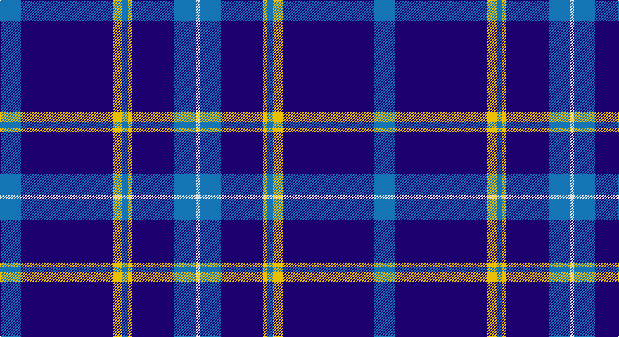

This page is one **sett** — a single exact thread-count. It belongs to the [tartan](/setts/b15db65ly7b4ly3db30b15w3/)
(the same proportion at any scale), whose colour order is pattern [BBYBYBBW](/stripes/bbybybbw/).

Sourced from tartans-authority.  It is a [8 stripe tartan](/stripes/stripes8/).

Original link http://www.tartansauthority.com/tartan-ferret/display/8031/

## Register references

External register numbers recorded for this tartan.

- Scottish Register of Tartans: [8031](https://www.tartanregister.gov.uk/tartanDetails?ref=8031)
- Scottish Tartans Authority (ITI): 8031

## Thread count
B/30 DB130 Y14 B8 Y6 DB60 B30 LN/6

One full sett is **532 threads**.

## Palette

Palette: <strong>Tartan Register</strong>
<table><thead><tr><th>Colour</th><th>Threads</th><th>Shade</th><th>Base</th><th>OKLCh</th></tr></thead><tbody><tr><td>B/</td><td style="text-align:right;font-variant-numeric:tabular-nums">30</td><td><code style="background-color:#1474B4;">#1474B4</code> <small style="color:#888">#1474B4</small></td><td>B <code style="background-color:#2A418A;">#2A418A</code></td><td><small style="color:#888">oklch(54.0% 0.129 245.1)</small></td></tr><tr><td>DB</td><td style="text-align:right;font-variant-numeric:tabular-nums">130</td><td><code style="background-color:#1C0070;">#1C0070</code> <small style="color:#888">#1C0070</small></td><td>B <code style="background-color:#2A418A;">#2A418A</code></td><td><small style="color:#888">oklch(26.3% 0.162 277.1)</small></td></tr><tr><td>Y</td><td style="text-align:right;font-variant-numeric:tabular-nums">14</td><td><code style="background-color:#E8C000;">#E8C000</code> <small style="color:#888">#E8C000</small></td><td>Y <code style="background-color:#F2BF00;">#F2BF00</code></td><td><small style="color:#888">oklch(81.9% 0.168 93.7)</small></td></tr><tr><td>B</td><td style="text-align:right;font-variant-numeric:tabular-nums">8</td><td><code style="background-color:#1474B4;">#1474B4</code> <small style="color:#888">#1474B4</small></td><td>B <code style="background-color:#2A418A;">#2A418A</code></td><td><small style="color:#888">oklch(54.0% 0.129 245.1)</small></td></tr><tr><td>Y</td><td style="text-align:right;font-variant-numeric:tabular-nums">6</td><td><code style="background-color:#E8C000;">#E8C000</code> <small style="color:#888">#E8C000</small></td><td>Y <code style="background-color:#F2BF00;">#F2BF00</code></td><td><small style="color:#888">oklch(81.9% 0.168 93.7)</small></td></tr><tr><td>DB</td><td style="text-align:right;font-variant-numeric:tabular-nums">60</td><td><code style="background-color:#1C0070;">#1C0070</code> <small style="color:#888">#1C0070</small></td><td>B <code style="background-color:#2A418A;">#2A418A</code></td><td><small style="color:#888">oklch(26.3% 0.162 277.1)</small></td></tr><tr><td>B</td><td style="text-align:right;font-variant-numeric:tabular-nums">30</td><td><code style="background-color:#1474B4;">#1474B4</code> <small style="color:#888">#1474B4</small></td><td>B <code style="background-color:#2A418A;">#2A418A</code></td><td><small style="color:#888">oklch(54.0% 0.129 245.1)</small></td></tr><tr><td>LN/</td><td style="text-align:right;font-variant-numeric:tabular-nums">6</td><td><code style="background-color:#E0E0E0;">#E0E0E0</code> <small style="color:#888">#E0E0E0</small></td><td>W <code style="background-color:#F7F7F7;">#F7F7F7</code></td><td><small style="color:#888">oklch(90.7% 0.000 89.9)</small></td></tr></tbody></table>

# Sample pattern

## Nearest tartans

The nearest existing variants by ΔTartan distance, with this tartan at the top so the swatches line up against it.

ΔTartan

Tartan

Sett

—

<a href="/ttd/edit/#slug=b15db65ly7b4ly3db30b15w3~x2">Hoosier (Fashion)</a> <a class="nn-out" href="/variants/s8/b15db65ly7b4ly3db30b15w3~x2/" title="open its dictionary page">↗</a>

1.25

<a href="/ttd/edit/#slug=db128r8g41n4g4n4&amp;base=b15db65ly7b4ly3db30b15w3~x2">French Freemasons' Pride</a> <a class="nn-out" href="/variants/s6/db128r8g41n4g4n4/" title="open its dictionary page">↗</a>

1.28

<a href="/ttd/edit/#slug=dbi9k1db4k1dbi18b5k1b1k1b5dbi4~x2&amp;base=b15db65ly7b4ly3db30b15w3~x2">Indigo Blue Works</a> <a class="nn-out" href="/variants/s11/dbi9k1db4k1dbi18b5k1b1k1b5dbi4~x2/" title="open its dictionary page">↗</a>

1.33

<a href="/ttd/edit/#slug=db42r2y16r2db6r2y8lo3~x2&amp;base=b15db65ly7b4ly3db30b15w3~x2">Prince George's Police Pipe Band</a> <a class="nn-out" href="/variants/s8/db42r2y16r2db6r2y8lo3~x2/" title="open its dictionary page">↗</a>

1.35

<a href="/ttd/edit/#slug=db28dr3w1dr3db4w2dp1w5~x4&amp;base=b15db65ly7b4ly3db30b15w3~x2">Baker Family Tartan</a> <a class="nn-out" href="/variants/s8/db28dr3w1dr3db4w2dp1w5~x4/" title="open its dictionary page">↗</a>

1.35

<a href="/ttd/edit/#slug=db21n2w1n2db1r2db1o6~x4&amp;base=b15db65ly7b4ly3db30b15w3~x2">Blue Rust</a> <a class="nn-out" href="/variants/s8/db21n2w1n2db1r2db1o6~x4/" title="open its dictionary page">↗</a>

1.37

<a href="/ttd/edit/#slug=db66w2db10w2db10w2db12r3t24~x2&amp;base=b15db65ly7b4ly3db30b15w3~x2">RAAF</a> <a class="nn-out" href="/variants/s9/db66w2db10w2db10w2db12r3t24~x2/" title="open its dictionary page">↗</a>

1.38

<a href="/ttd/edit/#slug=db32ly4dbi12db2dbi4db2o16db67ly6&amp;base=b15db65ly7b4ly3db30b15w3~x2">Calum's Cabin</a> <a class="nn-out" href="/variants/s9/db32ly4dbi12db2dbi4db2o16db67ly6/" title="open its dictionary page">↗</a>

1.42

<a href="/ttd/edit/#slug=r5db20r3db20k6db3lb2db1~x2&amp;base=b15db65ly7b4ly3db30b15w3~x2">Masai Shuka 29 (Artefact)</a> <a class="nn-out" href="/variants/s8/r5db20r3db20k6db3lb2db1~x2/" title="open its dictionary page">↗</a>

1.44

<a href="/ttd/edit/#slug=db18r1db1r1db1k7db13w2~x4&amp;base=b15db65ly7b4ly3db30b15w3~x2">Tokyo Bluebells</a> <a class="nn-out" href="/variants/s8/db18r1db1r1db1k7db13w2~x4/" title="open its dictionary page">↗</a>

1.45

<a href="/ttd/edit/#slug=db5k1lb2k1w6k1lb2db25lb2~x2&amp;base=b15db65ly7b4ly3db30b15w3~x2">Christopher Newport University</a> <a class="nn-out" href="/variants/s9/db5k1lb2k1w6k1lb2db25lb2~x2/" title="open its dictionary page">↗</a>

## Neighbour map

Every grey dot is one of 14360 variants placed by the first two principal components of the ΔTartan feature space (44% of its variance). Red is this tartan; blue dots are its nearest — click one to open its page.

<svg viewBox="0 0 640 380" role="img" style="max-width:100%;height:auto;border:1px solid #e0e0e0;border-radius:4px;display:block" xmlns="http://www.w3.org/2000/svg"><image href="/nn/cloud.v1.png" width="640" height="380"/><a href="/variants/s6/db128r8g41n4g4n4/"><circle cx="455.1" cy="151.2" r="4" fill="#3465a4"><title>French Freemasons' Pride</title></circle></a><a href="/variants/s11/dbi9k1db4k1dbi18b5k1b1k1b5dbi4~x2/"><circle cx="357.9" cy="163.8" r="4" fill="#3465a4"><title>Indigo Blue Works</title></circle></a><a href="/variants/s8/db42r2y16r2db6r2y8lo3~x2/"><circle cx="365.1" cy="146.9" r="4" fill="#3465a4"><title>Prince George's Police Pipe Band</title></circle></a><a href="/variants/s8/db28dr3w1dr3db4w2dp1w5~x4/"><circle cx="427.3" cy="122.7" r="4" fill="#3465a4"><title>Baker Family Tartan</title></circle></a><a href="/variants/s8/db21n2w1n2db1r2db1o6~x4/"><circle cx="382.8" cy="133.9" r="4" fill="#3465a4"><title>Blue Rust</title></circle></a><a href="/variants/s9/db66w2db10w2db10w2db12r3t24~x2/"><circle cx="494.1" cy="134.1" r="4" fill="#3465a4"><title>RAAF</title></circle></a><a href="/variants/s9/db32ly4dbi12db2dbi4db2o16db67ly6/"><circle cx="467.0" cy="140.8" r="4" fill="#3465a4"><title>Calum's Cabin</title></circle></a><a href="/variants/s8/r5db20r3db20k6db3lb2db1~x2/"><circle cx="452.4" cy="176.5" r="4" fill="#3465a4"><title>Masai Shuka 29 (Artefact)</title></circle></a><a href="/variants/s8/db18r1db1r1db1k7db13w2~x4/"><circle cx="459.7" cy="169.1" r="4" fill="#3465a4"><title>Tokyo Bluebells</title></circle></a><a href="/variants/s9/db5k1lb2k1w6k1lb2db25lb2~x2/"><circle cx="381.3" cy="116.4" r="4" fill="#3465a4"><title>Christopher Newport University</title></circle></a><circle cx="405.6" cy="162.3" r="5" fill="#c00000"/></svg>

ID: /variants/s8/b15db65ly7b4ly3db30b15w3~x2/
