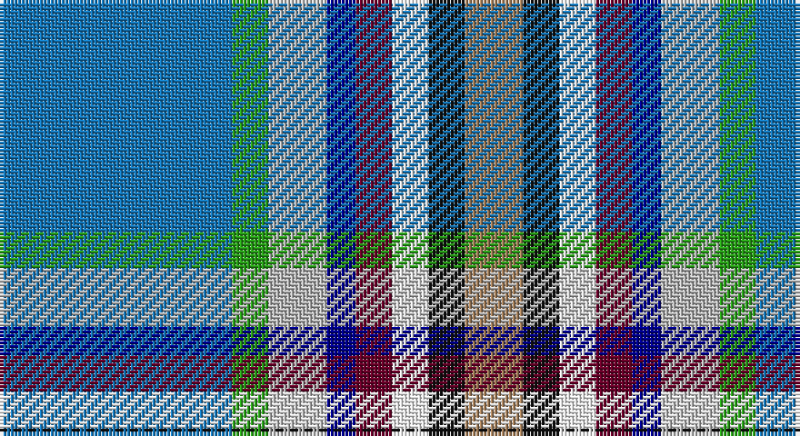

This page is one **sett** — a single exact thread-count. It belongs to the [tartan](/setts/b32g5lr8db4dr5w5k5o8/)
(the same proportion at any scale), whose colour order is pattern [BGYBBWKR](/stripes/bgybbwkr/).

Sourced from register-of-tartans.  It is a [8 stripe tartan](/stripes/stripes8/).

Original link https://www.tartanregister.gov.uk/tartanDetails.aspx?ref=10864

## Register references

External register numbers recorded for this tartan.

- Scottish Register of Tartans: [10864](https://www.tartanregister.gov.uk/tartanDetails.aspx?ref=10864)

## Thread count
B/64 G10 N16 DB8 DR10 W10 K10 LT/16

One full sett is **208 threads**.

## Palette

Palette: <strong>Tartan Register</strong> <small style="color:#888">(7 of 8 colours)</small>
<table><thead><tr><th>Colour</th><th>Threads</th><th>Shade</th><th>Base</th><th>OKLCh</th></tr></thead><tbody><tr><td>B/</td><td style="text-align:right;font-variant-numeric:tabular-nums">64</td><td><code style="background-color:#1474B4;">#1474B4</code> <small style="color:#888">#1474B4</small></td><td>B <code style="background-color:#2A418A;">#2A418A</code></td><td><small style="color:#888">oklch(54.0% 0.129 245.1)</small></td></tr><tr><td>G</td><td style="text-align:right;font-variant-numeric:tabular-nums">10</td><td><code style="background-color:#289C18;">#289C18</code> <small style="color:#888">#289C18</small></td><td>G <code style="background-color:#006100;">#006100</code></td><td><small style="color:#888">oklch(60.6% 0.191 141.6)</small></td></tr><tr><td>N</td><td style="text-align:right;font-variant-numeric:tabular-nums">16</td><td><code style="background-color:#B8B8B8;">#B8B8B8</code> <small style="color:#888">#B8B8B8</small></td><td>Y <code style="background-color:#F2BF00;">#F2BF00</code></td><td><small style="color:#888">oklch(78.3% 0.000 89.9)</small></td></tr><tr><td>DB</td><td style="text-align:right;font-variant-numeric:tabular-nums">8</td><td><code style="background-color:#00008C;">#00008C</code> <small style="color:#888">#00008C</small></td><td>B <code style="background-color:#2A418A;">#2A418A</code></td><td><small style="color:#888">oklch(28.9% 0.200 264.1)</small></td></tr><tr><td>DR</td><td style="text-align:right;font-variant-numeric:tabular-nums">10</td><td><code style="background-color:#680028;">#680028</code> <small style="color:#888">#680028</small></td><td>B <code style="background-color:#2A418A;">#2A418A</code></td><td><small style="color:#888">oklch(33.1% 0.133 8.3)</small></td></tr><tr><td>W</td><td style="text-align:right;font-variant-numeric:tabular-nums">10</td><td><code style="background-color:#FFFFFF;">#FFFFFF</code> <small style="color:#888">#FFFFFF</small></td><td>W <code style="background-color:#F7F7F7;">#F7F7F7</code></td><td><small style="color:#888">oklch(100.0% 0.000 89.9)</small></td></tr><tr><td>K</td><td style="text-align:right;font-variant-numeric:tabular-nums">10</td><td><code style="background-color:#101010;">#101010</code> <small style="color:#888">#101010</small></td><td>K <code style="background-color:#000000;">#000000</code></td><td><small style="color:#888">oklch(17.3% 0.000 89.9)</small></td></tr><tr><td>LT/</td><td style="text-align:right;font-variant-numeric:tabular-nums">16</td><td><code style="background-color:#A07C58;">#A07C58</code> <small style="color:#888">#A07C58</small></td><td>R <code style="background-color:#CC0000;">#CC0000</code></td><td><small style="color:#888">oklch(61.2% 0.067 66.0)</small></td></tr></tbody></table>

# Sample pattern

## Nearest tartans

The nearest existing variants by ΔTartan distance, with this tartan at the top so the swatches line up against it.

ΔTartan

Tartan

Sett

—

<a href="/ttd/edit/#slug=b32g5lr8db4dr5w5k5o8~x2">Fremsaeter, Jenny (Personal)</a> <a class="nn-out" href="/variants/s8/b32g5lr8db4dr5w5k5o8~x2/" title="open its dictionary page">↗</a>

1.11

<a href="/ttd/edit/#slug=p2g6r1y1db3b10w1~x2&amp;base=b32g5lr8db4dr5w5k5o8~x2">Manx National</a> <a class="nn-out" href="/variants/s7/p2g6r1y1db3b10w1~x2/" title="open its dictionary page">↗</a>

1.16

<a href="/ttd/edit/#slug=dp2g6r1ly1db3t10w1~x2&amp;base=b32g5lr8db4dr5w5k5o8~x2">Manx National District Tartan</a> <a class="nn-out" href="/variants/s7/dp2g6r1ly1db3t10w1~x2/" title="open its dictionary page">↗</a>

1.47

<a href="/ttd/edit/#slug=lr2y11r2y11k2db6b13k2b3ly2~x4&amp;base=b32g5lr8db4dr5w5k5o8~x2">RAF Leuchars</a> <a class="nn-out" href="/variants/s10/lr2y11r2y11k2db6b13k2b3ly2~x4/" title="open its dictionary page">↗</a>

1.49

<a href="/ttd/edit/#slug=dp2g8r1ly1db6t15w1~x4&amp;base=b32g5lr8db4dr5w5k5o8~x2">Manx National District Tartan</a> <a class="nn-out" href="/variants/s7/dp2g8r1ly1db6t15w1~x4/" title="open its dictionary page">↗</a>

1.51

<a href="/ttd/edit/#slug=r4b3lr2k2lr12k2db10t25w2~x2&amp;base=b32g5lr8db4dr5w5k5o8~x2">O'Reilly (Estimated threadcount)</a> <a class="nn-out" href="/variants/s9/r4b3lr2k2lr12k2db10t25w2~x2/" title="open its dictionary page">↗</a>

1.59

<a href="/ttd/edit/#slug=db18o4ri4g12lb3r2w2dp10~x2&amp;base=b32g5lr8db4dr5w5k5o8~x2">Serco Caledonian Sleeper</a> <a class="nn-out" href="/variants/s8/db18o4ri4g12lb3r2w2dp10~x2/" title="open its dictionary page">↗</a>

1.63

<a href="/ttd/edit/#slug=p8g31r4y4db17b64w4&amp;base=b32g5lr8db4dr5w5k5o8~x2">Manx National</a> <a class="nn-out" href="/variants/s7/p8g31r4y4db17b64w4/" title="open its dictionary page">↗</a>

1.65

<a href="/ttd/edit/#slug=o3t18r2t18g3dt8k20g2k5lo3~x2&amp;base=b32g5lr8db4dr5w5k5o8~x2">Royal Air Force Lossiemouth</a> <a class="nn-out" href="/variants/s10/o3t18r2t18g3dt8k20g2k5lo3~x2/" title="open its dictionary page">↗</a>

1.68

<a href="/ttd/edit/#slug=db18lr4ri4g12t3r2w2dp10~x2&amp;base=b32g5lr8db4dr5w5k5o8~x2">Serco Caledonian Sleeper</a> <a class="nn-out" href="/variants/s8/db18lr4ri4g12t3r2w2dp10~x2/" title="open its dictionary page">↗</a>

1.69

<a href="/ttd/edit/#slug=dg40t4lb39t4y4ly4y4r4y34dp4y4w4&amp;base=b32g5lr8db4dr5w5k5o8~x2">Glasgow Tattoo</a> <a class="nn-out" href="/variants/s12/dg40t4lb39t4y4ly4y4r4y34dp4y4w4/" title="open its dictionary page">↗</a>

## Neighbour map

Every grey dot is one of 14360 variants placed by the first two principal components of the ΔTartan feature space (44% of its variance). Red is this tartan; blue dots are its nearest — click one to open its page.

<svg viewBox="0 0 640 380" role="img" style="max-width:100%;height:auto;border:1px solid #e0e0e0;border-radius:4px;display:block" xmlns="http://www.w3.org/2000/svg"><image href="/nn/cloud.v1.png" width="640" height="380"/><a href="/variants/s7/p2g6r1y1db3b10w1~x2/"><circle cx="137.8" cy="142.4" r="4" fill="#3465a4"><title>Manx National</title></circle></a><a href="/variants/s7/dp2g6r1ly1db3t10w1~x2/"><circle cx="145.5" cy="151.8" r="4" fill="#3465a4"><title>Manx National District Tartan</title></circle></a><a href="/variants/s10/lr2y11r2y11k2db6b13k2b3ly2~x4/"><circle cx="119.6" cy="161.5" r="4" fill="#3465a4"><title>RAF Leuchars</title></circle></a><a href="/variants/s7/dp2g8r1ly1db6t15w1~x4/"><circle cx="185.6" cy="131.4" r="4" fill="#3465a4"><title>Manx National District Tartan</title></circle></a><a href="/variants/s9/r4b3lr2k2lr12k2db10t25w2~x2/"><circle cx="161.1" cy="123.1" r="4" fill="#3465a4"><title>O'Reilly (Estimated threadcount)</title></circle></a><a href="/variants/s8/db18o4ri4g12lb3r2w2dp10~x2/"><circle cx="55.1" cy="131.7" r="4" fill="#3465a4"><title>Serco Caledonian Sleeper</title></circle></a><a href="/variants/s7/p8g31r4y4db17b64w4/"><circle cx="208.9" cy="116.9" r="4" fill="#3465a4"><title>Manx National</title></circle></a><a href="/variants/s10/o3t18r2t18g3dt8k20g2k5lo3~x2/"><circle cx="151.3" cy="141.9" r="4" fill="#3465a4"><title>Royal Air Force Lossiemouth</title></circle></a><a href="/variants/s8/db18lr4ri4g12t3r2w2dp10~x2/"><circle cx="67.1" cy="136.8" r="4" fill="#3465a4"><title>Serco Caledonian Sleeper</title></circle></a><a href="/variants/s12/dg40t4lb39t4y4ly4y4r4y34dp4y4w4/"><circle cx="80.3" cy="84.1" r="4" fill="#3465a4"><title>Glasgow Tattoo</title></circle></a><circle cx="110.1" cy="124.8" r="5" fill="#c00000"/></svg>

ID: /variants/s8/b32g5lr8db4dr5w5k5o8~x2/
