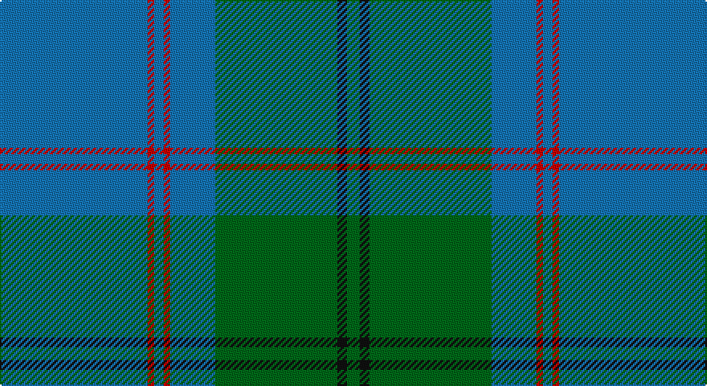

This page is one **sett** — a single exact thread-count. It belongs to the [tartan](/setts/b46r2b3r2b14g38k3g4/)
(the same proportion at any scale), whose colour order is pattern [BRBRBGKG](/stripes/brbrbgkg/).

Sourced from tartans-authority.  It is a [8 stripe tartan](/stripes/stripes8/).

Original link http://www.tartansauthority.com/tartan-ferret/display/5791/

## Register references

External register numbers recorded for this tartan.

- Scottish Tartans Authority (ITI): 5791

## Thread count
B/92 R4 B6 R4 B28 G76 K6 G/8

One full sett is **348 threads**.

## Palette

Palette: <strong>Tartan Register</strong>
<table><thead><tr><th>Colour</th><th>Threads</th><th>Shade</th><th>Base</th><th>OKLCh</th></tr></thead><tbody><tr><td>B/</td><td style="text-align:right;font-variant-numeric:tabular-nums">92</td><td><code style="background-color:#1474B4;">#1474B4</code> <small style="color:#888">#1474B4</small></td><td>B <code style="background-color:#2A418A;">#2A418A</code></td><td><small style="color:#888">oklch(54.0% 0.129 245.1)</small></td></tr><tr><td>R</td><td style="text-align:right;font-variant-numeric:tabular-nums">4</td><td><code style="background-color:#C80000;">#C80000</code> <small style="color:#888">#C80000</small></td><td>R <code style="background-color:#CC0000;">#CC0000</code></td><td><small style="color:#888">oklch(52.3% 0.215 29.2)</small></td></tr><tr><td>B</td><td style="text-align:right;font-variant-numeric:tabular-nums">6</td><td><code style="background-color:#1474B4;">#1474B4</code> <small style="color:#888">#1474B4</small></td><td>B <code style="background-color:#2A418A;">#2A418A</code></td><td><small style="color:#888">oklch(54.0% 0.129 245.1)</small></td></tr><tr><td>R</td><td style="text-align:right;font-variant-numeric:tabular-nums">4</td><td><code style="background-color:#C80000;">#C80000</code> <small style="color:#888">#C80000</small></td><td>R <code style="background-color:#CC0000;">#CC0000</code></td><td><small style="color:#888">oklch(52.3% 0.215 29.2)</small></td></tr><tr><td>B</td><td style="text-align:right;font-variant-numeric:tabular-nums">28</td><td><code style="background-color:#1474B4;">#1474B4</code> <small style="color:#888">#1474B4</small></td><td>B <code style="background-color:#2A418A;">#2A418A</code></td><td><small style="color:#888">oklch(54.0% 0.129 245.1)</small></td></tr><tr><td>G</td><td style="text-align:right;font-variant-numeric:tabular-nums">76</td><td><code style="background-color:#006818;">#006818</code> <small style="color:#888">#006818</small></td><td>G <code style="background-color:#006100;">#006100</code></td><td><small style="color:#888">oklch(45.0% 0.142 145.0)</small></td></tr><tr><td>K</td><td style="text-align:right;font-variant-numeric:tabular-nums">6</td><td><code style="background-color:#101010;">#101010</code> <small style="color:#888">#101010</small></td><td>K <code style="background-color:#000000;">#000000</code></td><td><small style="color:#888">oklch(17.3% 0.000 89.9)</small></td></tr><tr><td>G/</td><td style="text-align:right;font-variant-numeric:tabular-nums">8</td><td><code style="background-color:#006818;">#006818</code> <small style="color:#888">#006818</small></td><td>G <code style="background-color:#006100;">#006100</code></td><td><small style="color:#888">oklch(45.0% 0.142 145.0)</small></td></tr></tbody></table>

# Sample pattern

## Nearest tartans

The nearest existing variants by ΔTartan distance, with this tartan at the top so the swatches line up against it.

ΔTartan

Tartan

Sett

—

<a href="/ttd/edit/#slug=b46r2b3r2b14g38k3g4~x2">Greenlaw, American (Name)</a> <a class="nn-out" href="/variants/s8/b46r2b3r2b14g38k3g4~x2/" title="open its dictionary page">↗</a>

1.01

<a href="/ttd/edit/#slug=g25b10w1b5w1b10g25r1g3r2~x2&amp;base=b46r2b3r2b14g38k3g4~x2">Strathdee (Personal)</a> <a class="nn-out" href="/variants/s10/g25b10w1b5w1b10g25r1g3r2~x2/" title="open its dictionary page">↗</a>

1.10

<a href="/ttd/edit/#slug=t62g5t3g22k3g3ly3g3k6~x2&amp;base=b46r2b3r2b14g38k3g4~x2">Oliver Hunting - 1973 (Clan)</a> <a class="nn-out" href="/variants/s9/t62g5t3g22k3g3ly3g3k6~x2/" title="open its dictionary page">↗</a>

1.16

<a href="/ttd/edit/#slug=dg4w1dg26b26k2b4~x4&amp;base=b46r2b3r2b14g38k3g4~x2">Melville (Two black lines)</a> <a class="nn-out" href="/variants/s6/dg4w1dg26b26k2b4~x4/" title="open its dictionary page">↗</a>

1.27

<a href="/ttd/edit/#slug=g13k2g34k6b16r2b16k2g13~x2&amp;base=b46r2b3r2b14g38k3g4~x2">Lockhart</a> <a class="nn-out" href="/variants/s9/g13k2g34k6b16r2b16k2g13~x2/" title="open its dictionary page">↗</a>

1.33

<a href="/ttd/edit/#slug=db4dg3db2dg19t24dg1t2~x2&amp;base=b46r2b3r2b14g38k3g4~x2">Unidentified #6</a> <a class="nn-out" href="/variants/s7/db4dg3db2dg19t24dg1t2~x2/" title="open its dictionary page">↗</a>

1.36

<a href="/ttd/edit/#slug=g50db20k3db2dy2db5~x2&amp;base=b46r2b3r2b14g38k3g4~x2">St Andrews Old Course Hotel Corporate Tartan</a> <a class="nn-out" href="/variants/s6/g50db20k3db2dy2db5~x2/" title="open its dictionary page">↗</a>

1.36

<a href="/ttd/edit/#slug=db16w1db1w1db8dg16r1db2~x2&amp;base=b46r2b3r2b14g38k3g4~x2">Roxburgh</a> <a class="nn-out" href="/variants/s8/db16w1db1w1db8dg16r1db2~x2/" title="open its dictionary page">↗</a>

1.36

<a href="/ttd/edit/#slug=t9db2t39dt33lo2dt5~x2&amp;base=b46r2b3r2b14g38k3g4~x2">Port Authority of NY &amp; NJ</a> <a class="nn-out" href="/variants/s6/t9db2t39dt33lo2dt5~x2/" title="open its dictionary page">↗</a>

1.37

<a href="/ttd/edit/#slug=dg38w2dg6db24o6db2o3db2~x2&amp;base=b46r2b3r2b14g38k3g4~x2">MacAuliffe/McAucliffe</a> <a class="nn-out" href="/variants/s8/dg38w2dg6db24o6db2o3db2~x2/" title="open its dictionary page">↗</a>

1.43

<a href="/ttd/edit/#slug=db4g3db2g19t24g1t2~x2&amp;base=b46r2b3r2b14g38k3g4~x2">Unidentified 1</a> <a class="nn-out" href="/variants/s7/db4g3db2g19t24g1t2~x2/" title="open its dictionary page">↗</a>

## Neighbour map

Every grey dot is one of 14360 variants placed by the first two principal components of the ΔTartan feature space (44% of its variance). Red is this tartan; blue dots are its nearest — click one to open its page.

<svg viewBox="0 0 640 380" role="img" style="max-width:100%;height:auto;border:1px solid #e0e0e0;border-radius:4px;display:block" xmlns="http://www.w3.org/2000/svg"><image href="/nn/cloud.v1.png" width="640" height="380"/><a href="/variants/s10/g25b10w1b5w1b10g25r1g3r2~x2/"><circle cx="439.4" cy="176.1" r="4" fill="#3465a4"><title>Strathdee (Personal)</title></circle></a><a href="/variants/s9/t62g5t3g22k3g3ly3g3k6~x2/"><circle cx="414.7" cy="158.4" r="4" fill="#3465a4"><title>Oliver Hunting - 1973 (Clan)</title></circle></a><a href="/variants/s6/dg4w1dg26b26k2b4~x4/"><circle cx="370.1" cy="193.7" r="4" fill="#3465a4"><title>Melville (Two black lines)</title></circle></a><a href="/variants/s9/g13k2g34k6b16r2b16k2g13~x2/"><circle cx="373.7" cy="213.7" r="4" fill="#3465a4"><title>Lockhart</title></circle></a><a href="/variants/s7/db4dg3db2dg19t24dg1t2~x2/"><circle cx="392.7" cy="212.5" r="4" fill="#3465a4"><title>Unidentified #6</title></circle></a><a href="/variants/s6/g50db20k3db2dy2db5~x2/"><circle cx="446.9" cy="189.2" r="4" fill="#3465a4"><title>St Andrews Old Course Hotel Corporate Tartan</title></circle></a><a href="/variants/s8/db16w1db1w1db8dg16r1db2~x2/"><circle cx="398.6" cy="197.9" r="4" fill="#3465a4"><title>Roxburgh</title></circle></a><a href="/variants/s6/t9db2t39dt33lo2dt5~x2/"><circle cx="381.2" cy="203.2" r="4" fill="#3465a4"><title>Port Authority of NY &amp; NJ</title></circle></a><a href="/variants/s8/dg38w2dg6db24o6db2o3db2~x2/"><circle cx="364.2" cy="179.5" r="4" fill="#3465a4"><title>MacAuliffe/McAucliffe</title></circle></a><a href="/variants/s7/db4g3db2g19t24g1t2~x2/"><circle cx="386.4" cy="207.2" r="4" fill="#3465a4"><title>Unidentified 1</title></circle></a><circle cx="410.3" cy="183.3" r="5" fill="#c00000"/></svg>

ID: /variants/s8/b46r2b3r2b14g38k3g4~x2/
