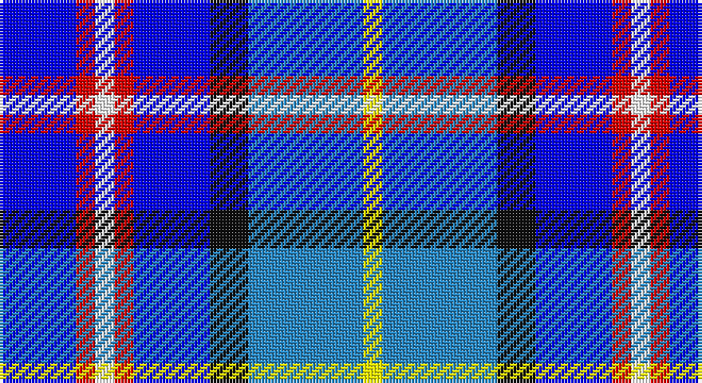

This page is one **sett** — a single exact thread-count. It belongs to the [tartan](/setts/b4r1w1r1b4k2t6ly1/)
(the same proportion at any scale), whose colour order is pattern [BRWRBKBY](/stripes/brwrbkby/).

Part of the [Lopatinsky](/tartans/lopatinsky/) tartan — the named design grouping this sett with its other cloths.

Sourced from register-of-tartans.  It is a [8 stripe tartan](/stripes/stripes8/).

Original link https://www.tartanregister.gov.uk/tartanDetails.aspx?ref=5745

## Register references

External register numbers recorded for this tartan.

- Scottish Register of Tartans: [5745](https://www.tartanregister.gov.uk/tartanDetails.aspx?ref=5745)
- Scottish Tartans Authority (ITI): 7770

## Thread count
B/24 R6 W6 R6 B24 K12 Ba36 Y/6

One full sett is **210 threads**.

## Palette

Palette: <strong>Tartan Register</strong>
<table><thead><tr><th>Colour</th><th>Threads</th><th>Shade</th><th>Base</th><th>OKLCh</th></tr></thead><tbody><tr><td>B/</td><td style="text-align:right;font-variant-numeric:tabular-nums">24</td><td><code style="background-color:#0000FF;">#0000FF</code> <small style="color:#888">#0000FF</small></td><td>B <code style="background-color:#2A418A;">#2A418A</code></td><td><small style="color:#888">oklch(45.2% 0.313 264.1)</small></td></tr><tr><td>R</td><td style="text-align:right;font-variant-numeric:tabular-nums">6</td><td><code style="background-color:#DC0000;">#DC0000</code> <small style="color:#888">#DC0000</small></td><td>R <code style="background-color:#CC0000;">#CC0000</code></td><td><small style="color:#888">oklch(56.2% 0.230 29.2)</small></td></tr><tr><td>W</td><td style="text-align:right;font-variant-numeric:tabular-nums">6</td><td><code style="background-color:#FFFFFF;">#FFFFFF</code> <small style="color:#888">#FFFFFF</small></td><td>W <code style="background-color:#F7F7F7;">#F7F7F7</code></td><td><small style="color:#888">oklch(100.0% 0.000 89.9)</small></td></tr><tr><td>R</td><td style="text-align:right;font-variant-numeric:tabular-nums">6</td><td><code style="background-color:#DC0000;">#DC0000</code> <small style="color:#888">#DC0000</small></td><td>R <code style="background-color:#CC0000;">#CC0000</code></td><td><small style="color:#888">oklch(56.2% 0.230 29.2)</small></td></tr><tr><td>B</td><td style="text-align:right;font-variant-numeric:tabular-nums">24</td><td><code style="background-color:#0000FF;">#0000FF</code> <small style="color:#888">#0000FF</small></td><td>B <code style="background-color:#2A418A;">#2A418A</code></td><td><small style="color:#888">oklch(45.2% 0.313 264.1)</small></td></tr><tr><td>K</td><td style="text-align:right;font-variant-numeric:tabular-nums">12</td><td><code style="background-color:#101010;">#101010</code> <small style="color:#888">#101010</small></td><td>K <code style="background-color:#000000;">#000000</code></td><td><small style="color:#888">oklch(17.3% 0.000 89.9)</small></td></tr><tr><td>Ba</td><td style="text-align:right;font-variant-numeric:tabular-nums">36</td><td><code style="background-color:#2888C4;">#2888C4</code> <small style="color:#888">#2888C4</small></td><td>B <code style="background-color:#2A418A;">#2A418A</code></td><td><small style="color:#888">oklch(60.1% 0.125 241.5)</small></td></tr><tr><td>Y/</td><td style="text-align:right;font-variant-numeric:tabular-nums">6</td><td><code style="background-color:#FFFF00;">#FFFF00</code> <small style="color:#888">#FFFF00</small></td><td>Y <code style="background-color:#F2BF00;">#F2BF00</code></td><td><small style="color:#888">oklch(96.8% 0.211 109.8)</small></td></tr></tbody></table>

# Sample pattern

## Nearest tartans

The nearest existing variants by ΔTartan distance, with this tartan at the top so the swatches line up against it.

ΔTartan

Tartan

Sett

—

<a href="/ttd/edit/#slug=b4r1w1r1b4k2t6ly1~x6">Lopatinsky</a> <a class="nn-out" href="/variants/s8/b4r1w1r1b4k2t6ly1~x6/" title="open its dictionary page">↗</a>

1.53

<a href="/ttd/edit/#slug=db3t1db6r2b6k1r1k1b6r3~x4&amp;base=b4r1w1r1b4k2t6ly1~x6">Ballater</a> <a class="nn-out" href="/variants/s10/db3t1db6r2b6k1r1k1b6r3~x4/" title="open its dictionary page">↗</a>

1.58

<a href="/ttd/edit/#slug=db11dg10y6db7lt2db3dp10lt2~x2&amp;base=b4r1w1r1b4k2t6ly1~x6">Hummelt, Katherine (Personal)</a> <a class="nn-out" href="/variants/s8/db11dg10y6db7lt2db3dp10lt2~x2/" title="open its dictionary page">↗</a>

1.61

<a href="/ttd/edit/#slug=db2b9r1db5g5lb2~x4&amp;base=b4r1w1r1b4k2t6ly1~x6">American Express</a> <a class="nn-out" href="/variants/s6/db2b9r1db5g5lb2~x4/" title="open its dictionary page">↗</a>

1.64

<a href="/ttd/edit/#slug=b9r1db5g5lb2g5db5r1b9db2~x4&amp;base=b4r1w1r1b4k2t6ly1~x6">American Express Corporate Tartan</a> <a class="nn-out" href="/variants/s10/b9r1db5g5lb2g5db5r1b9db2~x4/" title="open its dictionary page">↗</a>

1.77

<a href="/ttd/edit/#slug=b4g1b2g2lr6g2k3r1b8w1~x2&amp;base=b4r1w1r1b4k2t6ly1~x6">EAIE 2015</a> <a class="nn-out" href="/variants/s10/b4g1b2g2lr6g2k3r1b8w1~x2/" title="open its dictionary page">↗</a>

1.80

<a href="/ttd/edit/#slug=t16db3t3o3t3db10r12w4~x2&amp;base=b4r1w1r1b4k2t6ly1~x6">Greer (Name?)</a> <a class="nn-out" href="/variants/s8/t16db3t3o3t3db10r12w4~x2/" title="open its dictionary page">↗</a>

1.81

<a href="/ttd/edit/#slug=y16r8b57db56lb8&amp;base=b4r1w1r1b4k2t6ly1~x6">Bryson (1988)</a> <a class="nn-out" href="/variants/s5/y16r8b57db56lb8/" title="open its dictionary page">↗</a>

1.82

<a href="/ttd/edit/#slug=w4lt13dbi5lt8dbi27lt15db16r3db3r23ly4&amp;base=b4r1w1r1b4k2t6ly1~x6">Shanghai Scottish</a> <a class="nn-out" href="/variants/s11/w4lt13dbi5lt8dbi27lt15db16r3db3r23ly4/" title="open its dictionary page">↗</a>

1.83

<a href="/ttd/edit/#slug=db24r6w6r6w6r6db25k12b36ly6&amp;base=b4r1w1r1b4k2t6ly1~x6">Lopatinsky (Personal)</a> <a class="nn-out" href="/variants/s10/db24r6w6r6w6r6db25k12b36ly6/" title="open its dictionary page">↗</a>

1.86

<a href="/ttd/edit/#slug=db4b13r2db2k2db2w5db2ly2db2b2~x2&amp;base=b4r1w1r1b4k2t6ly1~x6">Manchester City Football Club &quot;Blue</a> <a class="nn-out" href="/variants/s11/db4b13r2db2k2db2w5db2ly2db2b2~x2/" title="open its dictionary page">↗</a>

## Neighbour map

Every grey dot is one of 14360 variants placed by the first two principal components of the ΔTartan feature space (44% of its variance). Red is this tartan; blue dots are its nearest — click one to open its page.

<svg viewBox="0 0 640 380" role="img" style="max-width:100%;height:auto;border:1px solid #e0e0e0;border-radius:4px;display:block" xmlns="http://www.w3.org/2000/svg"><image href="/nn/cloud.v1.png" width="640" height="380"/><a href="/variants/s10/db3t1db6r2b6k1r1k1b6r3~x4/"><circle cx="133.4" cy="202.2" r="4" fill="#3465a4"><title>Ballater</title></circle></a><a href="/variants/s8/db11dg10y6db7lt2db3dp10lt2~x2/"><circle cx="108.5" cy="232.0" r="4" fill="#3465a4"><title>Hummelt, Katherine (Personal)</title></circle></a><a href="/variants/s6/db2b9r1db5g5lb2~x4/"><circle cx="129.1" cy="209.7" r="4" fill="#3465a4"><title>American Express</title></circle></a><a href="/variants/s10/b9r1db5g5lb2g5db5r1b9db2~x4/"><circle cx="136.5" cy="195.7" r="4" fill="#3465a4"><title>American Express Corporate Tartan</title></circle></a><a href="/variants/s10/b4g1b2g2lr6g2k3r1b8w1~x2/"><circle cx="140.2" cy="162.5" r="4" fill="#3465a4"><title>EAIE 2015</title></circle></a><a href="/variants/s8/t16db3t3o3t3db10r12w4~x2/"><circle cx="124.3" cy="204.8" r="4" fill="#3465a4"><title>Greer (Name?)</title></circle></a><a href="/variants/s5/y16r8b57db56lb8/"><circle cx="177.0" cy="221.4" r="4" fill="#3465a4"><title>Bryson (1988)</title></circle></a><a href="/variants/s11/w4lt13dbi5lt8dbi27lt15db16r3db3r23ly4/"><circle cx="48.6" cy="139.1" r="4" fill="#3465a4"><title>Shanghai Scottish</title></circle></a><a href="/variants/s10/db24r6w6r6w6r6db25k12b36ly6/"><circle cx="91.1" cy="168.6" r="4" fill="#3465a4"><title>Lopatinsky (Personal)</title></circle></a><a href="/variants/s11/db4b13r2db2k2db2w5db2ly2db2b2~x2/"><circle cx="111.9" cy="149.3" r="4" fill="#3465a4"><title>Manchester City Football Club &quot;Blue</title></circle></a><circle cx="92.1" cy="182.5" r="5" fill="#c00000"/></svg>

ID: /variants/s8/b4r1w1r1b4k2t6ly1~x6/
