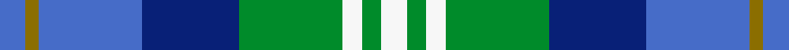

This page is one **sett** — a single exact thread-count. It belongs to the [tartan](/setts/b4y2b16db15g16w3g3w4/)
(the same proportion at any scale), whose colour order is pattern [BGBBGWGW](/stripes/bgbbgwgw/).

Sourced from weddslist.  It is a [8 stripe tartan](/stripes/stripes8/).

Original link http://www.weddslist.com/cgi-bin/tartans/pg.pl?source=sts

## Thread count
B/8 Y4 B32 DB30 G32 W6 G6 W/8

One full sett is **236 threads**.

## Palette
<table><thead><tr><th>Colour</th><th>Shade</th><th>OKLCh</th></tr></thead><tbody><tr><td>B</td><td><code style="background-color:#466CC8;">#466CC8</code> <small style="color:#888">#466CC8</small></td><td><small style="color:#888">oklch(55.1% 0.149 265.0)</small></td></tr><tr><td>DB</td><td><code style="background-color:#082077;">#082077</code> <small style="color:#888">#082077</small></td><td><small style="color:#888">oklch(30.0% 0.149 265.1)</small></td></tr><tr><td>G</td><td><code style="background-color:#008B2A;">#008B2A</code> <small style="color:#888">#008B2A</small></td><td><small style="color:#888">oklch(55.4% 0.170 145.9)</small></td></tr><tr><td>LN</td><td><code style="background-color:#F7F7F7;">#F7F7F7</code> <small style="color:#888">#F7F7F7</small></td><td><small style="color:#888">oklch(97.6% 0.000 89.9)</small></td></tr><tr><td>Y</td><td><code style="background-color:#8B6E00;">#8B6E00</code> <small style="color:#888">#8B6E00</small></td><td><small style="color:#888">oklch(55.1% 0.113 90.4)</small></td></tr></tbody></table>

# Sample pattern

## Nearest variants

The nearest existing variants by ΔTartan distance, with this cloth at the top so the swatches line up against it.

ΔTartan

Threads

Variant

Sett

—

236

<a href="/variants/s8/b4y2b16db15g16w3g3w4~x2/">Business Air</a>

<a href="/ttd/edit/#slug=w3dg22b11db3b11g4b2~x2&amp;base=b4y2b16db15g16w3g3w4~x2" title="compare in the TTD">2.16</a>

214

<a href="/variants/s7/w3dg22b11db3b11g4b2~x2/">Queen of the South</a>

<a href="/ttd/edit/#slug=g5db15lb11w2lb1w1dg4~x4&amp;base=b4y2b16db15g16w3g3w4~x2" title="compare in the TTD">2.46</a>

276

<a href="/variants/s7/g5db15lb11w2lb1w1dg4~x4/">Highlands Country Club</a>

<a href="/ttd/edit/#slug=db25w2db25lb25r2lb25g25dy2g25~x2&amp;base=b4y2b16db15g16w3g3w4~x2" title="compare in the TTD">2.71</a>

524

<a href="/variants/s9/db25w2db25lb25r2lb25g25dy2g25~x2/">Royal Columbian Canadian Tartan</a>

<a href="/ttd/edit/#slug=db25lb25r2lb25g25y2g25db25w4~x2&amp;base=b4y2b16db15g16w3g3w4~x2" title="compare in the TTD">2.71</a>

574

<a href="/variants/s9/db25lb25r2lb25g25y2g25db25w4~x2/">Royal Columbian</a>

<a href="/ttd/edit/#slug=t30db15w4dg12w9t8w3~x2&amp;base=b4y2b16db15g16w3g3w4~x2" title="compare in the TTD">2.75</a>

258

<a href="/variants/s7/t30db15w4dg12w9t8w3~x2/">Newall (Personal)</a>

2.75

—

<a href="/variants/s7/g5db15lbi11lb2lbi1lb1g4~x4~lbi3200000-lb3103284/">Highlands Country Club (Corporate)</a>

<a href="/ttd/edit/#slug=db2b9dr1db9dg9w2~x4&amp;base=b4y2b16db15g16w3g3w4~x2" title="compare in the TTD">2.94</a>

240

<a href="/variants/s6/db2b9dr1db9dg9w2~x4/">American Express</a>

## Neighbour map

Every grey dot is one of 13620 variants placed by the first two principal components of the ΔTartan feature space (42% of its variance). Red is this tartan; blue dots are its nearest — click one to open its page.

<svg viewBox="0 0 640 380" role="img" style="max-width:100%;height:auto;border:1px solid #e0e0e0;border-radius:4px;display:block" xmlns="http://www.w3.org/2000/svg"><image href="/nn/cloud.v1.png" width="640" height="380"/><a href="/variants/s7/w3dg22b11db3b11g4b2~x2/"><circle cx="260.6" cy="217.0" r="4" fill="#3465a4"><title>Queen of the South</title></circle></a><a href="/variants/s7/g5db15lb11w2lb1w1dg4~x4/"><circle cx="195.4" cy="186.3" r="4" fill="#3465a4"><title>Highlands Country Club</title></circle></a><a href="/variants/s9/db25w2db25lb25r2lb25g25dy2g25~x2/"><circle cx="138.8" cy="195.2" r="4" fill="#3465a4"><title>Royal Columbian Canadian Tartan</title></circle></a><a href="/variants/s9/db25lb25r2lb25g25y2g25db25w4~x2/"><circle cx="132.3" cy="198.0" r="4" fill="#3465a4"><title>Royal Columbian</title></circle></a><a href="/variants/s7/t30db15w4dg12w9t8w3~x2/"><circle cx="243.5" cy="239.3" r="4" fill="#3465a4"><title>Newall (Personal)</title></circle></a><a href="/variants/s7/g5db15lbi11lb2lbi1lb1g4~x4~lbi3200000-lb3103284/"><circle cx="229.6" cy="203.6" r="4" fill="#3465a4"><title>Highlands Country Club (Corporate)</title></circle></a><a href="/variants/s6/db2b9dr1db9dg9w2~x4/"><circle cx="203.6" cy="246.0" r="4" fill="#3465a4"><title>American Express</title></circle></a><circle cx="163.2" cy="228.5" r="5" fill="#c00000"/><text x="320" y="376" text-anchor="middle" font-size="11" fill="#999">ground</text><text x="11" y="190" text-anchor="middle" font-size="11" fill="#999" transform="rotate(-90 11 190)">complexity</text></svg>

ID: /variants/s8/b4y2b16db15g16w3g3w4~x2/
