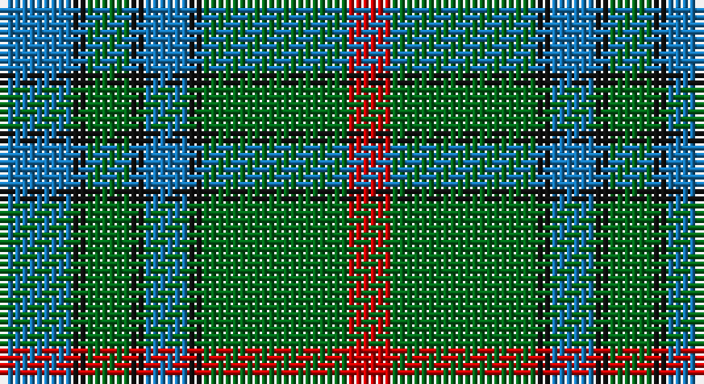

This page is one **sett** — a single exact thread-count. It belongs to the [tartan](/setts/b5k1g3k1b3k1g10r3/)
(the same proportion at any scale), whose colour order is pattern [BKGKBKGR](/stripes/bkgkbkgr/).

Sourced from tartans-authority.  It is a [8 stripe tartan](/stripes/stripes8/).

Original link http://www.tartansauthority.com/tartan-ferret/display/8979/

## Register references

External register numbers recorded for this tartan.

- Scottish Register of Tartans: [8979](https://www.tartanregister.gov.uk/tartanDetails?ref=8979)
- Scottish Tartans Authority (ITI): 8979

## Thread count
B/10 K2 G6 K2 B6 K2 G20 R/6

One full sett is **92 threads**.

## Palette

Palette: <strong>Tartan Register</strong>
<table><thead><tr><th>Colour</th><th>Threads</th><th>Shade</th><th>Base</th><th>OKLCh</th></tr></thead><tbody><tr><td>B/</td><td style="text-align:right;font-variant-numeric:tabular-nums">10</td><td><code style="background-color:#1474B4;">#1474B4</code> <small style="color:#888">#1474B4</small></td><td>B <code style="background-color:#2A418A;">#2A418A</code></td><td><small style="color:#888">oklch(54.0% 0.129 245.1)</small></td></tr><tr><td>K</td><td style="text-align:right;font-variant-numeric:tabular-nums">2</td><td><code style="background-color:#101010;">#101010</code> <small style="color:#888">#101010</small></td><td>K <code style="background-color:#000000;">#000000</code></td><td><small style="color:#888">oklch(17.3% 0.000 89.9)</small></td></tr><tr><td>G</td><td style="text-align:right;font-variant-numeric:tabular-nums">6</td><td><code style="background-color:#006818;">#006818</code> <small style="color:#888">#006818</small></td><td>G <code style="background-color:#006100;">#006100</code></td><td><small style="color:#888">oklch(45.0% 0.142 145.0)</small></td></tr><tr><td>K</td><td style="text-align:right;font-variant-numeric:tabular-nums">2</td><td><code style="background-color:#101010;">#101010</code> <small style="color:#888">#101010</small></td><td>K <code style="background-color:#000000;">#000000</code></td><td><small style="color:#888">oklch(17.3% 0.000 89.9)</small></td></tr><tr><td>B</td><td style="text-align:right;font-variant-numeric:tabular-nums">6</td><td><code style="background-color:#1474B4;">#1474B4</code> <small style="color:#888">#1474B4</small></td><td>B <code style="background-color:#2A418A;">#2A418A</code></td><td><small style="color:#888">oklch(54.0% 0.129 245.1)</small></td></tr><tr><td>K</td><td style="text-align:right;font-variant-numeric:tabular-nums">2</td><td><code style="background-color:#101010;">#101010</code> <small style="color:#888">#101010</small></td><td>K <code style="background-color:#000000;">#000000</code></td><td><small style="color:#888">oklch(17.3% 0.000 89.9)</small></td></tr><tr><td>G</td><td style="text-align:right;font-variant-numeric:tabular-nums">20</td><td><code style="background-color:#006818;">#006818</code> <small style="color:#888">#006818</small></td><td>G <code style="background-color:#006100;">#006100</code></td><td><small style="color:#888">oklch(45.0% 0.142 145.0)</small></td></tr><tr><td>R/</td><td style="text-align:right;font-variant-numeric:tabular-nums">6</td><td><code style="background-color:#C80000;">#C80000</code> <small style="color:#888">#C80000</small></td><td>R <code style="background-color:#CC0000;">#CC0000</code></td><td><small style="color:#888">oklch(52.3% 0.215 29.2)</small></td></tr></tbody></table>

# Sample pattern

## Nearest tartans

The nearest existing variants by ΔTartan distance, with this tartan at the top so the swatches line up against it.

ΔTartan

Tartan

Sett

—

<a href="/ttd/edit/#slug=b5k1g3k1b3k1g10r3~x2">Ayrton 1979 No. 2 (Personal)</a> <a class="nn-out" href="/variants/s8/b5k1g3k1b3k1g10r3~x2/" title="open its dictionary page">↗</a>

0.74

<a href="/ttd/edit/#slug=db6k1g3k1db3k1g10r3~x2&amp;base=b5k1g3k1b3k1g10r3~x2">AIton - 1979 (Clan)</a> <a class="nn-out" href="/variants/s8/db6k1g3k1db3k1g10r3~x2/" title="open its dictionary page">↗</a>

0.91

<a href="/ttd/edit/#slug=b12lo1b2lo1b3k5g10lo1g2~x4&amp;base=b5k1g3k1b3k1g10r3~x2">Marie Curie Fields Of Hope</a> <a class="nn-out" href="/variants/s9/b12lo1b2lo1b3k5g10lo1g2~x4/" title="open its dictionary page">↗</a>

0.98

<a href="/ttd/edit/#slug=g11r4g4r7g41db11t4db41r4db8&amp;base=b5k1g3k1b3k1g10r3~x2">Stewart of Appin 2</a> <a class="nn-out" href="/variants/s10/g11r4g4r7g41db11t4db41r4db8/" title="open its dictionary page">↗</a>

0.99

<a href="/ttd/edit/#slug=g14w1g7k7db2k2db2k2db7~x4&amp;base=b5k1g3k1b3k1g10r3~x2">Abercrombie</a> <a class="nn-out" href="/variants/s9/g14w1g7k7db2k2db2k2db7~x4/" title="open its dictionary page">↗</a>

1.03

<a href="/ttd/edit/#slug=db12w2db7g15k2g4k2g15db2k7~x2&amp;base=b5k1g3k1b3k1g10r3~x2">Smeaton #2 (Name)</a> <a class="nn-out" href="/variants/s10/db12w2db7g15k2g4k2g15db2k7~x2/" title="open its dictionary page">↗</a>

1.04

<a href="/ttd/edit/#slug=g28r12g4db20ly2db3ly2db3g7~x2&amp;base=b5k1g3k1b3k1g10r3~x2">Cork</a> <a class="nn-out" href="/variants/s9/g28r12g4db20ly2db3ly2db3g7~x2/" title="open its dictionary page">↗</a>

1.04

<a href="/ttd/edit/#slug=r5dt12g3db4g20dt3g3r5~x4&amp;base=b5k1g3k1b3k1g10r3~x2">Daks (0600150)</a> <a class="nn-out" href="/variants/s8/r5dt12g3db4g20dt3g3r5~x4/" title="open its dictionary page">↗</a>

1.07

<a href="/ttd/edit/#slug=g3db1g8db7k3ly1~x2&amp;base=b5k1g3k1b3k1g10r3~x2">Trafalgar (Fashion)</a> <a class="nn-out" href="/variants/s6/g3db1g8db7k3ly1~x2/" title="open its dictionary page">↗</a>

1.09

<a href="/ttd/edit/#slug=t4dg26g8t8g8gi3t2~x2&amp;base=b5k1g3k1b3k1g10r3~x2">Valley, of the Green. (The )</a> <a class="nn-out" href="/variants/s7/t4dg26g8t8g8gi3t2~x2/" title="open its dictionary page">↗</a>

1.10

<a href="/ttd/edit/#slug=y24dp3y3dp3y3dp7dg20r3~x2&amp;base=b5k1g3k1b3k1g10r3~x2">Crantock</a> <a class="nn-out" href="/variants/s8/y24dp3y3dp3y3dp7dg20r3~x2/" title="open its dictionary page">↗</a>

## Neighbour map

Every grey dot is one of 14360 variants placed by the first two principal components of the ΔTartan feature space (44% of its variance). Red is this tartan; blue dots are its nearest — click one to open its page.

<svg viewBox="0 0 640 380" role="img" style="max-width:100%;height:auto;border:1px solid #e0e0e0;border-radius:4px;display:block" xmlns="http://www.w3.org/2000/svg"><image href="/nn/cloud.v1.png" width="640" height="380"/><a href="/variants/s8/db6k1g3k1db3k1g10r3~x2/"><circle cx="255.9" cy="216.8" r="4" fill="#3465a4"><title>AIton - 1979 (Clan)</title></circle></a><a href="/variants/s9/b12lo1b2lo1b3k5g10lo1g2~x4/"><circle cx="254.1" cy="193.5" r="4" fill="#3465a4"><title>Marie Curie Fields Of Hope</title></circle></a><a href="/variants/s10/g11r4g4r7g41db11t4db41r4db8/"><circle cx="277.7" cy="192.1" r="4" fill="#3465a4"><title>Stewart of Appin 2</title></circle></a><a href="/variants/s9/g14w1g7k7db2k2db2k2db7~x4/"><circle cx="266.7" cy="203.9" r="4" fill="#3465a4"><title>Abercrombie</title></circle></a><a href="/variants/s10/db12w2db7g15k2g4k2g15db2k7~x2/"><circle cx="248.8" cy="227.1" r="4" fill="#3465a4"><title>Smeaton #2 (Name)</title></circle></a><a href="/variants/s9/g28r12g4db20ly2db3ly2db3g7~x2/"><circle cx="273.9" cy="178.4" r="4" fill="#3465a4"><title>Cork</title></circle></a><a href="/variants/s8/r5dt12g3db4g20dt3g3r5~x4/"><circle cx="248.2" cy="232.3" r="4" fill="#3465a4"><title>Daks (0600150)</title></circle></a><a href="/variants/s6/g3db1g8db7k3ly1~x2/"><circle cx="248.7" cy="248.4" r="4" fill="#3465a4"><title>Trafalgar (Fashion)</title></circle></a><a href="/variants/s7/t4dg26g8t8g8gi3t2~x2/"><circle cx="252.7" cy="211.3" r="4" fill="#3465a4"><title>Valley, of the Green. (The )</title></circle></a><a href="/variants/s8/y24dp3y3dp3y3dp7dg20r3~x2/"><circle cx="268.1" cy="216.0" r="4" fill="#3465a4"><title>Crantock</title></circle></a><circle cx="258.4" cy="215.7" r="5" fill="#c00000"/></svg>

ID: /variants/s8/b5k1g3k1b3k1g10r3~x2/
