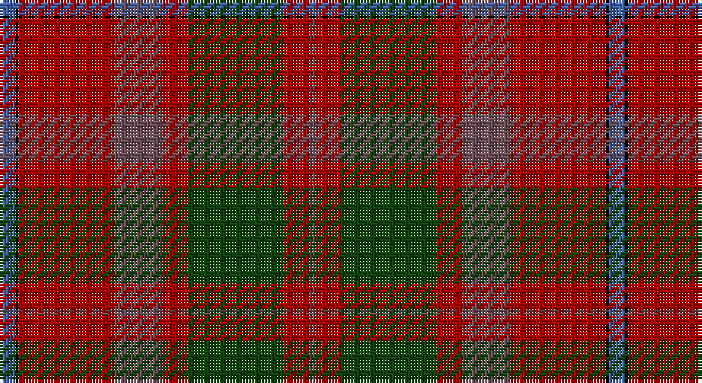

This page is one **sett** — a single exact thread-count. It belongs to the [tartan](/setts/b5k1r30n15r8dg30r8n2/)
(the same proportion at any scale), whose colour order is pattern [BKRBRGRB](/stripes/bkrbrgrb/).

Part of the [Shaw](/tartans/shaw/) tartan — the named design grouping this sett with its other cloths.

Sourced from weddslist.  It is a [8 stripe tartan](/stripes/stripes8/).

Original link http://www.weddslist.com/cgi-bin/tartans/pg.pl?source=x

## Thread count
B/5 K1 DR30 N15 DR8 DG30 DR8 N/2

One full sett is **191 threads**.

## Palette

Palette: <strong>Ingles Buchan</strong> <small style="color:#888">(1 of 5 colours)</small>
<table><thead><tr><th>Colour</th><th>Threads</th><th>Shade</th><th>Base</th><th>OKLCh</th></tr></thead><tbody><tr><td>B/</td><td style="text-align:right;font-variant-numeric:tabular-nums">5</td><td><code style="background-color:#4367AE;">#4367AE</code> <small style="color:#888">#4367AE</small></td><td>B <code style="background-color:#2A418A;">#2A418A</code></td><td><small style="color:#888">oklch(52.2% 0.120 262.7)</small></td></tr><tr><td>K</td><td style="text-align:right;font-variant-numeric:tabular-nums">1</td><td><code style="background-color:#000000;">#000000</code> <small style="color:#888">#000000</small></td><td>K <code style="background-color:#000000;">#000000</code></td><td><small style="color:#888">oklch(0.0% 0.000 0.0)</small></td></tr><tr><td>DR</td><td style="text-align:right;font-variant-numeric:tabular-nums">30</td><td><code style="background-color:#AA0000;">#AA0000</code> <small style="color:#888">#AA0000</small></td><td>R <code style="background-color:#CC0000;">#CC0000</code></td><td><small style="color:#888">oklch(46.3% 0.190 29.2)</small></td></tr><tr><td>N</td><td style="text-align:right;font-variant-numeric:tabular-nums">15</td><td><code style="background-color:#6E5058;">#6E5058</code> <small style="color:#888">#6E5058</small></td><td>B <code style="background-color:#2A418A;">#2A418A</code></td><td><small style="color:#888">oklch(46.6% 0.042 1.2)</small></td></tr><tr><td>DR</td><td style="text-align:right;font-variant-numeric:tabular-nums">8</td><td><code style="background-color:#AA0000;">#AA0000</code> <small style="color:#888">#AA0000</small></td><td>R <code style="background-color:#CC0000;">#CC0000</code></td><td><small style="color:#888">oklch(46.3% 0.190 29.2)</small></td></tr><tr><td>DG</td><td style="text-align:right;font-variant-numeric:tabular-nums">30</td><td><code style="background-color:#11450D;">#11450D</code> <small style="color:#888">#11450D</small></td><td>G <code style="background-color:#006100;">#006100</code></td><td><small style="color:#888">oklch(34.4% 0.101 142.1)</small></td></tr><tr><td>DR</td><td style="text-align:right;font-variant-numeric:tabular-nums">8</td><td><code style="background-color:#AA0000;">#AA0000</code> <small style="color:#888">#AA0000</small></td><td>R <code style="background-color:#CC0000;">#CC0000</code></td><td><small style="color:#888">oklch(46.3% 0.190 29.2)</small></td></tr><tr><td>N/</td><td style="text-align:right;font-variant-numeric:tabular-nums">2</td><td><code style="background-color:#6E5058;">#6E5058</code> <small style="color:#888">#6E5058</small></td><td>B <code style="background-color:#2A418A;">#2A418A</code></td><td><small style="color:#888">oklch(46.6% 0.042 1.2)</small></td></tr></tbody></table>

# Sample pattern

## Compared to the master

This cloth is one sett of its design; the master sett (the exemplar the design is anchored on) is below for comparison.

<figure style="margin:0"><figcaption style="color:#888;font-size:smaller">this sett</figcaption></figure>
<figure style="margin:0"><figcaption style="color:#888;font-size:smaller"><a href="/setts/g24k2db3k2db8r2/">master sett →</a></figcaption></figure>

## Nearest tartans

The nearest existing variants by ΔTartan distance, with this tartan at the top so the swatches line up against it.

ΔTartan

Tartan

Sett

—

<a href="/ttd/edit/#slug=b5k1r30n15r8dg30r8n2">Shaw</a> <a class="nn-out" href="/variants/s8/b5k1r30n15r8dg30r8n2/" title="open its dictionary page">↗</a>

0.00

<a href="/ttd/edit/#slug=b5k1r30n15r8dg30r8n2~x2&amp;base=b5k1r30n15r8dg30r8n2">Shaw</a> <a class="nn-out" href="/variants/s8/b5k1r30n15r8dg30r8n2~x2/" title="open its dictionary page">↗</a>

1.03

<a href="/ttd/edit/#slug=do7r4do4r25dp1y32dp4y2w2y5~x2&amp;base=b5k1r30n15r8dg30r8n2">Bell of Ardbel (Personal)</a> <a class="nn-out" href="/variants/s10/do7r4do4r25dp1y32dp4y2w2y5~x2/" title="open its dictionary page">↗</a>

1.13

<a href="/ttd/edit/#slug=r26n4r1p2dg1n4dg14w2~x2&amp;base=b5k1r30n15r8dg30r8n2">Redpath, Robert A (Personal)</a> <a class="nn-out" href="/variants/s8/r26n4r1p2dg1n4dg14w2~x2/" title="open its dictionary page">↗</a>

1.38

<a href="/ttd/edit/#slug=o7r4o4r25dp1y32dp4y2w2y5~x2&amp;base=b5k1r30n15r8dg30r8n2">Bell of Ardbel (Name)</a> <a class="nn-out" href="/variants/s10/o7r4o4r25dp1y32dp4y2w2y5~x2/" title="open its dictionary page">↗</a>

1.39

<a href="/ttd/edit/#slug=t5k1r30dp15r8g30r8dp2&amp;base=b5k1r30n15r8dg30r8n2">Shaw of Tordarroch Clan Tartan</a> <a class="nn-out" href="/variants/s8/t5k1r30dp15r8g30r8dp2/" title="open its dictionary page">↗</a>

1.40

<a href="/ttd/edit/#slug=dp2g18dp15r24k1ly2~x2&amp;base=b5k1r30n15r8dg30r8n2">Miller, Reverend Ian (Personal</a> <a class="nn-out" href="/variants/s6/dp2g18dp15r24k1ly2~x2/" title="open its dictionary page">↗</a>

1.43

<a href="/ttd/edit/#slug=n4dg8db6n8r6dg2r2dg2r24dg1r3~x2&amp;base=b5k1r30n15r8dg30r8n2">MacDougall VS</a> <a class="nn-out" href="/variants/s11/n4dg8db6n8r6dg2r2dg2r24dg1r3~x2/" title="open its dictionary page">↗</a>

1.43

<a href="/ttd/edit/#slug=n4dg8db6n8r6dg2r2dg2r24dg1r3&amp;base=b5k1r30n15r8dg30r8n2">MacDougall VS</a> <a class="nn-out" href="/variants/s11/n4dg8db6n8r6dg2r2dg2r24dg1r3/" title="open its dictionary page">↗</a>

1.46

<a href="/ttd/edit/#slug=dr7m4dr4m25p1dy32p4dy2w2dy5~x2&amp;base=b5k1r30n15r8dg30r8n2">Bell, John</a> <a class="nn-out" href="/variants/s10/dr7m4dr4m25p1dy32p4dy2w2dy5~x2/" title="open its dictionary page">↗</a>

1.47

<a href="/ttd/edit/#slug=lo4r21lo1r21y8db4y5db4y4lo4&amp;base=b5k1r30n15r8dg30r8n2">Rice Welsh Name Tartan</a> <a class="nn-out" href="/variants/s10/lo4r21lo1r21y8db4y5db4y4lo4/" title="open its dictionary page">↗</a>

## Neighbour map

Every grey dot is one of 14360 variants placed by the first two principal components of the ΔTartan feature space (44% of its variance). Red is this tartan; blue dots are its nearest — click one to open its page.

<svg viewBox="0 0 640 380" role="img" style="max-width:100%;height:auto;border:1px solid #e0e0e0;border-radius:4px;display:block" xmlns="http://www.w3.org/2000/svg"><image href="/nn/cloud.v1.png" width="640" height="380"/><a href="/variants/s8/b5k1r30n15r8dg30r8n2~x2/"><circle cx="327.4" cy="162.3" r="4" fill="#3465a4"><title>Shaw</title></circle></a><a href="/variants/s10/do7r4do4r25dp1y32dp4y2w2y5~x2/"><circle cx="338.3" cy="130.4" r="4" fill="#3465a4"><title>Bell of Ardbel (Personal)</title></circle></a><a href="/variants/s8/r26n4r1p2dg1n4dg14w2~x2/"><circle cx="346.6" cy="140.2" r="4" fill="#3465a4"><title>Redpath, Robert A (Personal)</title></circle></a><a href="/variants/s10/o7r4o4r25dp1y32dp4y2w2y5~x2/"><circle cx="359.9" cy="142.5" r="4" fill="#3465a4"><title>Bell of Ardbel (Name)</title></circle></a><a href="/variants/s8/t5k1r30dp15r8g30r8dp2/"><circle cx="293.5" cy="138.1" r="4" fill="#3465a4"><title>Shaw of Tordarroch Clan Tartan</title></circle></a><a href="/variants/s6/dp2g18dp15r24k1ly2~x2/"><circle cx="264.2" cy="169.2" r="4" fill="#3465a4"><title>Miller, Reverend Ian (Personal</title></circle></a><a href="/variants/s11/n4dg8db6n8r6dg2r2dg2r24dg1r3~x2/"><circle cx="362.5" cy="155.6" r="4" fill="#3465a4"><title>MacDougall VS</title></circle></a><a href="/variants/s11/n4dg8db6n8r6dg2r2dg2r24dg1r3/"><circle cx="362.5" cy="155.6" r="4" fill="#3465a4"><title>MacDougall VS</title></circle></a><a href="/variants/s10/dr7m4dr4m25p1dy32p4dy2w2dy5~x2/"><circle cx="363.7" cy="146.4" r="4" fill="#3465a4"><title>Bell, John</title></circle></a><a href="/variants/s10/lo4r21lo1r21y8db4y5db4y4lo4/"><circle cx="371.6" cy="176.1" r="4" fill="#3465a4"><title>Rice Welsh Name Tartan</title></circle></a><circle cx="327.4" cy="162.3" r="5" fill="#c00000"/></svg>

ID: /variants/s8/b5k1r30n15r8dg30r8n2/
