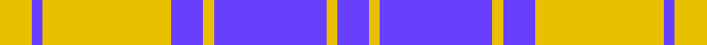
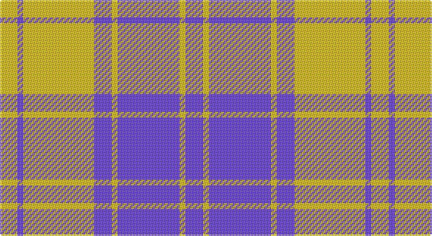

This page is one **sett** — a single exact thread-count. It belongs to the [tartan](/setts/b6ly2b21ly2b6ly24b2ly6/)
(the same proportion at any scale), whose colour order is pattern [BYBYBYBY](/stripes/bybybyby/).

Part of the [MacLachlan](/tartans/maclachlan/) tartan — the named design grouping this sett with its other cloths.

Sourced from register-of-tartans.  It is a [8 stripe tartan](/stripes/stripes8/).

Original link https://www.tartanregister.gov.uk/tartanDetails.aspx?ref=2586

## Also known as

This cloth is also recorded under:

- MacLachlan #2
- MacLachlan #3
- MacLachlan 3
- MacLachlan Blue

## Register references

External register numbers recorded for this tartan.

- Scottish Register of Tartans: [2586](https://www.tartanregister.gov.uk/tartanDetails.aspx?ref=2586)
- Scottish Tartans Authority (ITI): 6272

## Thread count
Y/12 P4 Y48 P12 Y4 P42 Y4 P/12

One full sett is **252 threads**.

## Palette

Palette: <strong>Logan (The Scottish Gael, 1831)</strong> <small style="color:#888">(1 of 2 colours)</small>
<table><thead><tr><th>Colour</th><th>Threads</th><th>Shade</th><th>Base</th><th>OKLCh</th></tr></thead><tbody><tr><td>Y/</td><td style="text-align:right;font-variant-numeric:tabular-nums">12</td><td><code style="background-color:#E8C000;">#E8C000</code> <small style="color:#888">#E8C000</small></td><td>Y <code style="background-color:#F2BF00;">#F2BF00</code></td><td><small style="color:#888">oklch(81.9% 0.168 93.7)</small></td></tr><tr><td>P</td><td style="text-align:right;font-variant-numeric:tabular-nums">4</td><td><code style="background-color:#6840FC;">#6840FC</code> <small style="color:#888">#6840FC</small></td><td>B <code style="background-color:#2A418A;">#2A418A</code></td><td><small style="color:#888">oklch(54.3% 0.258 283.4)</small></td></tr><tr><td>Y</td><td style="text-align:right;font-variant-numeric:tabular-nums">48</td><td><code style="background-color:#E8C000;">#E8C000</code> <small style="color:#888">#E8C000</small></td><td>Y <code style="background-color:#F2BF00;">#F2BF00</code></td><td><small style="color:#888">oklch(81.9% 0.168 93.7)</small></td></tr><tr><td>P</td><td style="text-align:right;font-variant-numeric:tabular-nums">12</td><td><code style="background-color:#6840FC;">#6840FC</code> <small style="color:#888">#6840FC</small></td><td>B <code style="background-color:#2A418A;">#2A418A</code></td><td><small style="color:#888">oklch(54.3% 0.258 283.4)</small></td></tr><tr><td>Y</td><td style="text-align:right;font-variant-numeric:tabular-nums">4</td><td><code style="background-color:#E8C000;">#E8C000</code> <small style="color:#888">#E8C000</small></td><td>Y <code style="background-color:#F2BF00;">#F2BF00</code></td><td><small style="color:#888">oklch(81.9% 0.168 93.7)</small></td></tr><tr><td>P</td><td style="text-align:right;font-variant-numeric:tabular-nums">42</td><td><code style="background-color:#6840FC;">#6840FC</code> <small style="color:#888">#6840FC</small></td><td>B <code style="background-color:#2A418A;">#2A418A</code></td><td><small style="color:#888">oklch(54.3% 0.258 283.4)</small></td></tr><tr><td>Y</td><td style="text-align:right;font-variant-numeric:tabular-nums">4</td><td><code style="background-color:#E8C000;">#E8C000</code> <small style="color:#888">#E8C000</small></td><td>Y <code style="background-color:#F2BF00;">#F2BF00</code></td><td><small style="color:#888">oklch(81.9% 0.168 93.7)</small></td></tr><tr><td>P/</td><td style="text-align:right;font-variant-numeric:tabular-nums">12</td><td><code style="background-color:#6840FC;">#6840FC</code> <small style="color:#888">#6840FC</small></td><td>B <code style="background-color:#2A418A;">#2A418A</code></td><td><small style="color:#888">oklch(54.3% 0.258 283.4)</small></td></tr></tbody></table>

# Sample pattern

## Compared to the master

This cloth is one sett of its design; the master sett (the exemplar the design is anchored on) is below for comparison.

<figure style="margin:0"><figcaption style="color:#888;font-size:smaller">this sett</figcaption></figure>
<figure style="margin:0"><figcaption style="color:#888;font-size:smaller"><a href="/setts/r16k2r2k2r2k16db16dg3db16k16r16k2r2/">master sett →</a></figcaption></figure>

## Nearest tartans

The nearest existing variants by ΔTartan distance, with this tartan at the top so the swatches line up against it.

ΔTartan

Tartan

Sett

—

<a href="/ttd/edit/#slug=b6ly2b21ly2b6ly24b2ly6~x2">MacLachlan (Chief's Dress) Blue</a> <a class="nn-out" href="/variants/s8/b6ly2b21ly2b6ly24b2ly6~x2/" title="open its dictionary page">↗</a>

1.04

<a href="/ttd/edit/#slug=db6w2db29w29db2w6~x2&amp;base=b6ly2b21ly2b6ly24b2ly6~x2">Erskine Blue (Dance)</a> <a class="nn-out" href="/variants/s6/db6w2db29w29db2w6~x2/" title="open its dictionary page">↗</a>

1.29

<a href="/ttd/edit/#slug=db19ly2db3w7db3w7db9w3db2w19~x2&amp;base=b6ly2b21ly2b6ly24b2ly6~x2">Yorkshire, The Spirit of</a> <a class="nn-out" href="/variants/s10/db19ly2db3w7db3w7db9w3db2w19~x2/" title="open its dictionary page">↗</a>

1.36

<a href="/ttd/edit/#slug=dp6w2dp29w29dp2w6~x2&amp;base=b6ly2b21ly2b6ly24b2ly6~x2">Erskine Purple (Dance) Fashion Tartan</a> <a class="nn-out" href="/variants/s6/dp6w2dp29w29dp2w6~x2/" title="open its dictionary page">↗</a>

1.38

<a href="/ttd/edit/#slug=w16db3w2db3w2db3r5db6w2~x4&amp;base=b6ly2b21ly2b6ly24b2ly6~x2">Jeux Canada Games '87 (Corporate)</a> <a class="nn-out" href="/variants/s9/w16db3w2db3w2db3r5db6w2~x4/" title="open its dictionary page">↗</a>

1.44

<a href="/ttd/edit/#slug=dp2w1dp9w9dp1w2~x6&amp;base=b6ly2b21ly2b6ly24b2ly6~x2">Erskine Purple (Dance)</a> <a class="nn-out" href="/variants/s6/dp2w1dp9w9dp1w2~x6/" title="open its dictionary page">↗</a>

1.47

<a href="/ttd/edit/#slug=w5db16w5db16w33r3~x2&amp;base=b6ly2b21ly2b6ly24b2ly6~x2">Buchanan Dress Blue (Dance)</a> <a class="nn-out" href="/variants/s6/w5db16w5db16w33r3~x2/" title="open its dictionary page">↗</a>

1.52

<a href="/ttd/edit/#slug=db8w3db28w32k3w4~x2&amp;base=b6ly2b21ly2b6ly24b2ly6~x2">Ailsa, Navy (Dance)</a> <a class="nn-out" href="/variants/s6/db8w3db28w32k3w4~x2/" title="open its dictionary page">↗</a>

1.61

<a href="/ttd/edit/#slug=dt3w16dt4w3dt12w2~x3&amp;base=b6ly2b21ly2b6ly24b2ly6~x2">MacMugen</a> <a class="nn-out" href="/variants/s6/dt3w16dt4w3dt12w2~x3/" title="open its dictionary page">↗</a>

1.64

<a href="/ttd/edit/#slug=n6lb2n25lb25n2lb6~x2&amp;base=b6ly2b21ly2b6ly24b2ly6~x2">Erskine, Grey</a> <a class="nn-out" href="/variants/s6/n6lb2n25lb25n2lb6~x2/" title="open its dictionary page">↗</a>

1.67

<a href="/ttd/edit/#slug=db1w1db5w5db1w1~x8&amp;base=b6ly2b21ly2b6ly24b2ly6~x2">Erskine Blanket</a> <a class="nn-out" href="/variants/s6/db1w1db5w5db1w1~x8/" title="open its dictionary page">↗</a>

## Neighbour map

Every grey dot is one of 14360 variants placed by the first two principal components of the ΔTartan feature space (44% of its variance). Red is this tartan; blue dots are its nearest — click one to open its page.

<svg viewBox="0 0 640 380" role="img" style="max-width:100%;height:auto;border:1px solid #e0e0e0;border-radius:4px;display:block" xmlns="http://www.w3.org/2000/svg"><image href="/nn/cloud.v1.png" width="640" height="380"/><a href="/variants/s6/db6w2db29w29db2w6~x2/"><circle cx="319.0" cy="191.0" r="4" fill="#3465a4"><title>Erskine Blue (Dance)</title></circle></a><a href="/variants/s10/db19ly2db3w7db3w7db9w3db2w19~x2/"><circle cx="264.3" cy="184.9" r="4" fill="#3465a4"><title>Yorkshire, The Spirit of</title></circle></a><a href="/variants/s6/dp6w2dp29w29dp2w6~x2/"><circle cx="340.2" cy="187.5" r="4" fill="#3465a4"><title>Erskine Purple (Dance) Fashion Tartan</title></circle></a><a href="/variants/s9/w16db3w2db3w2db3r5db6w2~x4/"><circle cx="255.4" cy="181.8" r="4" fill="#3465a4"><title>Jeux Canada Games '87 (Corporate)</title></circle></a><a href="/variants/s6/dp2w1dp9w9dp1w2~x6/"><circle cx="308.5" cy="204.4" r="4" fill="#3465a4"><title>Erskine Purple (Dance)</title></circle></a><a href="/variants/s6/w5db16w5db16w33r3~x2/"><circle cx="282.6" cy="195.7" r="4" fill="#3465a4"><title>Buchanan Dress Blue (Dance)</title></circle></a><a href="/variants/s6/db8w3db28w32k3w4~x2/"><circle cx="278.4" cy="190.9" r="4" fill="#3465a4"><title>Ailsa, Navy (Dance)</title></circle></a><a href="/variants/s6/dt3w16dt4w3dt12w2~x3/"><circle cx="293.2" cy="227.3" r="4" fill="#3465a4"><title>MacMugen</title></circle></a><a href="/variants/s6/n6lb2n25lb25n2lb6~x2/"><circle cx="355.8" cy="222.2" r="4" fill="#3465a4"><title>Erskine, Grey</title></circle></a><a href="/variants/s6/db1w1db5w5db1w1~x8/"><circle cx="279.9" cy="248.5" r="4" fill="#3465a4"><title>Erskine Blanket</title></circle></a><circle cx="325.2" cy="189.6" r="5" fill="#c00000"/></svg>

ID: /variants/s8/b6ly2b21ly2b6ly24b2ly6~x2/
