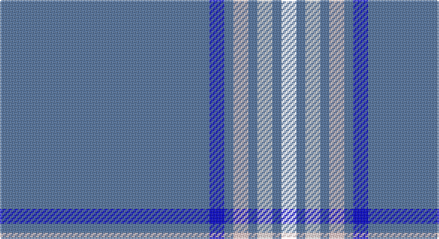

This page is one **sett** — a single exact thread-count. It belongs to the [tartan](/setts/b70db5b3wi5b3w5b3k5/)
(the same proportion at any scale), whose colour order is pattern [BBBWBWBK](/stripes/bbbwbwbk/).

Sourced from house-of-tartan.  It is a [8 stripe tartan](/stripes/stripes8/).

Original link http://www.house-of-tartan.scotland.net/house/TartanViewjs.asp?colr=Def&tnam=10610

## Provenance

Earliest known date: 2 May 2012 Created to commemorate the 85th birthday of the designer's mother, with a field of blue to match her eyes and with one line for each of her four children in the colour of his or her birth stone (sapphire, pearl, diamond, garnet).

## Thread count
B/140 Ba10 B6 W10 B6 Wa10 B6 R/10

One full sett is **246 threads**.

## Palette

Palette: <strong>Tartan Register</strong> <small style="color:#888">(2 of 4 colours)</small>
<table><thead><tr><th>Colour</th><th>Threads</th><th>Shade</th><th>Base</th><th>OKLCh</th></tr></thead><tbody><tr><td>B/</td><td style="text-align:right;font-variant-numeric:tabular-nums">140</td><td><code style="background-color:#50729F;">#50729F</code> <small style="color:#888">#50729F</small></td><td>B <code style="background-color:#2A418A;">#2A418A</code></td><td><small style="color:#888">oklch(54.6% 0.081 255.7)</small></td></tr><tr><td>Ba</td><td style="text-align:right;font-variant-numeric:tabular-nums">10</td><td><code style="background-color:#0000CD;">#0000CD</code> <small style="color:#888">#0000CD</small></td><td>B <code style="background-color:#2A418A;">#2A418A</code></td><td><small style="color:#888">oklch(38.3% 0.266 264.1)</small></td></tr><tr><td>B</td><td style="text-align:right;font-variant-numeric:tabular-nums">6</td><td><code style="background-color:#50729F;">#50729F</code> <small style="color:#888">#50729F</small></td><td>B <code style="background-color:#2A418A;">#2A418A</code></td><td><small style="color:#888">oklch(54.6% 0.081 255.7)</small></td></tr><tr><td>W</td><td style="text-align:right;font-variant-numeric:tabular-nums">10</td><td><code style="background-color:#FFCCCC;">#FFCCCC</code> <small style="color:#888">#FFCCCC</small></td><td>W <code style="background-color:#F7F7F7;">#F7F7F7</code></td><td><small style="color:#888">oklch(89.0% 0.058 18.3)</small></td></tr><tr><td>B</td><td style="text-align:right;font-variant-numeric:tabular-nums">6</td><td><code style="background-color:#50729F;">#50729F</code> <small style="color:#888">#50729F</small></td><td>B <code style="background-color:#2A418A;">#2A418A</code></td><td><small style="color:#888">oklch(54.6% 0.081 255.7)</small></td></tr><tr><td>Wa</td><td style="text-align:right;font-variant-numeric:tabular-nums">10</td><td><code style="background-color:#FFFFFF;">#FFFFFF</code> <small style="color:#888">#FFFFFF</small></td><td>W <code style="background-color:#F7F7F7;">#F7F7F7</code></td><td><small style="color:#888">oklch(100.0% 0.000 89.9)</small></td></tr><tr><td>B</td><td style="text-align:right;font-variant-numeric:tabular-nums">6</td><td><code style="background-color:#50729F;">#50729F</code> <small style="color:#888">#50729F</small></td><td>B <code style="background-color:#2A418A;">#2A418A</code></td><td><small style="color:#888">oklch(54.6% 0.081 255.7)</small></td></tr><tr><td>/</td><td style="text-align:right;font-variant-numeric:tabular-nums">10</td><td><code style="background-color:;"></code> <small style="color:#888"></small></td><td> <code style="background-color:;"></code></td><td><small style="color:#888"></small></td></tr></tbody></table>

# Sample pattern

## Nearest tartans

The nearest existing variants by ΔTartan distance, with this tartan at the top so the swatches line up against it.

ΔTartan

Tartan

Sett

—

<a href="/ttd/edit/#slug=b70db5b3wi5b3w5b3k5~x2">Wyckoff, Ann Grainger Phillips Commemorative Tartan</a> <a class="nn-out" href="/variants/s8/b70db5b3wi5b3w5b3k5~x2/" title="open its dictionary page">↗</a>

1.16

<a href="/ttd/edit/#slug=b70db5b3w5b3w5b3r5b8~x2&amp;base=b70db5b3wi5b3w5b3k5~x2">Wyckoff, Ann Grainger Phillips</a> <a class="nn-out" href="/variants/s9/b70db5b3w5b3w5b3r5b8~x2/" title="open its dictionary page">↗</a>

1.49

<a href="/ttd/edit/#slug=db61w4db2w7p2g3ly2db16~x2&amp;base=b70db5b3wi5b3w5b3k5~x2">Boat of Garten (District)</a> <a class="nn-out" href="/variants/s8/db61w4db2w7p2g3ly2db16~x2/" title="open its dictionary page">↗</a>

1.51

<a href="/ttd/edit/#slug=db60g10db3lb6ly2db9r2w2~x2&amp;base=b70db5b3wi5b3w5b3k5~x2">St. Petersburg City (District)</a> <a class="nn-out" href="/variants/s8/db60g10db3lb6ly2db9r2w2~x2/" title="open its dictionary page">↗</a>

1.52

<a href="/ttd/edit/#slug=t66w2t10w2t10w2t12r3db24~x2&amp;base=b70db5b3wi5b3w5b3k5~x2">RAAF #5</a> <a class="nn-out" href="/variants/s9/t66w2t10w2t10w2t12r3db24~x2/" title="open its dictionary page">↗</a>

1.62

<a href="/ttd/edit/#slug=b6k1lo6k1b28lb1k2lb1b16lb1r5~x2&amp;base=b70db5b3wi5b3w5b3k5~x2">Caledonian Railway (Commemorative)</a> <a class="nn-out" href="/variants/s11/b6k1lo6k1b28lb1k2lb1b16lb1r5~x2/" title="open its dictionary page">↗</a>

1.71

<a href="/ttd/edit/#slug=b35k10b4w2b3r2~x2&amp;base=b70db5b3wi5b3w5b3k5~x2">Laidlaw's Highland Drovers</a> <a class="nn-out" href="/variants/s6/b35k10b4w2b3r2~x2/" title="open its dictionary page">↗</a>

1.79

<a href="/ttd/edit/#slug=b18r1b1r1b1k7b13w2~x4&amp;base=b70db5b3wi5b3w5b3k5~x2">Tokyo Bluebells (Corporate)</a> <a class="nn-out" href="/variants/s8/b18r1b1r1b1k7b13w2~x4/" title="open its dictionary page">↗</a>

1.81

<a href="/ttd/edit/#slug=b32db1w2b1w2db1b32db1w2db1w2db1ly5db1~x2&amp;base=b70db5b3wi5b3w5b3k5~x2">Worsoff (Personal)</a> <a class="nn-out" href="/variants/s14/b32db1w2b1w2db1b32db1w2db1w2db1ly5db1~x2/" title="open its dictionary page">↗</a>

1.82

<a href="/ttd/edit/#slug=db122r11w4r15ly4db6ly4db30&amp;base=b70db5b3wi5b3w5b3k5~x2">Inverness, Duke of York</a> <a class="nn-out" href="/variants/s8/db122r11w4r15ly4db6ly4db30/" title="open its dictionary page">↗</a>

1.89

<a href="/ttd/edit/#slug=db45ly3db10o4k1w2~x2&amp;base=b70db5b3wi5b3w5b3k5~x2">Wylie</a> <a class="nn-out" href="/variants/s6/db45ly3db10o4k1w2~x2/" title="open its dictionary page">↗</a>

## Neighbour map

Every grey dot is one of 14360 variants placed by the first two principal components of the ΔTartan feature space (44% of its variance). Red is this tartan; blue dots are its nearest — click one to open its page.

<svg viewBox="0 0 640 380" role="img" style="max-width:100%;height:auto;border:1px solid #e0e0e0;border-radius:4px;display:block" xmlns="http://www.w3.org/2000/svg"><image href="/nn/cloud.v1.png" width="640" height="380"/><a href="/variants/s9/b70db5b3w5b3w5b3r5b8~x2/"><circle cx="558.6" cy="126.5" r="4" fill="#3465a4"><title>Wyckoff, Ann Grainger Phillips</title></circle></a><a href="/variants/s8/db61w4db2w7p2g3ly2db16~x2/"><circle cx="533.5" cy="111.6" r="4" fill="#3465a4"><title>Boat of Garten (District)</title></circle></a><a href="/variants/s8/db60g10db3lb6ly2db9r2w2~x2/"><circle cx="478.2" cy="97.5" r="4" fill="#3465a4"><title>St. Petersburg City (District)</title></circle></a><a href="/variants/s9/t66w2t10w2t10w2t12r3db24~x2/"><circle cx="499.9" cy="131.3" r="4" fill="#3465a4"><title>RAAF #5</title></circle></a><a href="/variants/s11/b6k1lo6k1b28lb1k2lb1b16lb1r5~x2/"><circle cx="459.9" cy="117.6" r="4" fill="#3465a4"><title>Caledonian Railway (Commemorative)</title></circle></a><a href="/variants/s6/b35k10b4w2b3r2~x2/"><circle cx="471.7" cy="175.5" r="4" fill="#3465a4"><title>Laidlaw's Highland Drovers</title></circle></a><a href="/variants/s8/b18r1b1r1b1k7b13w2~x4/"><circle cx="460.5" cy="171.2" r="4" fill="#3465a4"><title>Tokyo Bluebells (Corporate)</title></circle></a><a href="/variants/s14/b32db1w2b1w2db1b32db1w2db1w2db1ly5db1~x2/"><circle cx="522.2" cy="91.0" r="4" fill="#3465a4"><title>Worsoff (Personal)</title></circle></a><a href="/variants/s8/db122r11w4r15ly4db6ly4db30/"><circle cx="575.0" cy="137.8" r="4" fill="#3465a4"><title>Inverness, Duke of York</title></circle></a><a href="/variants/s6/db45ly3db10o4k1w2~x2/"><circle cx="592.3" cy="123.9" r="4" fill="#3465a4"><title>Wylie</title></circle></a><circle cx="512.9" cy="109.3" r="5" fill="#c00000"/></svg>

ID: /variants/s8/b70db5b3wi5b3w5b3k5~x2/
