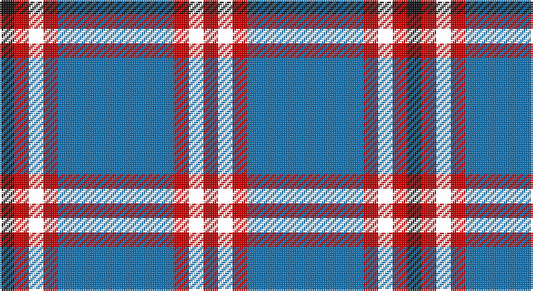

This page is one **sett** — a single exact thread-count. It belongs to the [tartan](/setts/b8r1k1r1ki1/)
(the same proportion at any scale), whose colour order is pattern [KRKRBRKR](/stripes/krkrbrkr/).

Sourced from house-of-tartan.  It is a [8 stripe tartan](/stripes/stripes8/).

Original link http://www.house-of-tartan.scotland.net/house/TartanViewjs.asp?colr=Def&tnam=2544

## Provenance

Earliest known date: 1783 Said to have been woven in 1783 in Knockando Morayshire, by William Donald Laing of Queensland, Australia who donated a sample to the Tartans Society in 1996. The dark line in the centre of the red band is either blue or black. Apparently William Laing acquired the piece of tartan in 1961 from a Mr Jack Garden whose g.g. grandfather was John Laing (dob 1767) who wove the tartan. In the 1810 census he lived in his shop in the Square at Archiestown.

## Thread count
K/8 Ra8 CW8 Ra8 B64 Ra8 CW8 Ra/8

One full sett is **224 threads**.

## Palette

Palette: <strong>Tartan Register</strong> <small style="color:#888">(6 of 7 colours)</small>
<table><thead><tr><th>Colour</th><th>Threads</th><th>Shade</th><th>Base</th><th>OKLCh</th></tr></thead><tbody><tr><td>K/</td><td style="text-align:right;font-variant-numeric:tabular-nums">8</td><td><code style="background-color:#101010;">#101010</code> <small style="color:#888">#101010</small></td><td>K <code style="background-color:#000000;">#000000</code></td><td><small style="color:#888">oklch(17.3% 0.000 89.9)</small></td></tr><tr><td>Ra</td><td style="text-align:right;font-variant-numeric:tabular-nums">8</td><td><code style="background-color:#C80000;">#C80000</code> <small style="color:#888">#C80000</small></td><td>R <code style="background-color:#CC0000;">#CC0000</code></td><td><small style="color:#888">oklch(52.3% 0.215 29.2)</small></td></tr><tr><td></td><td style="text-align:right;font-variant-numeric:tabular-nums">8</td><td><code style="background-color:;"></code> <small style="color:#888"></small></td><td> <code style="background-color:;"></code></td><td><small style="color:#888"></small></td></tr><tr><td>Ra</td><td style="text-align:right;font-variant-numeric:tabular-nums">8</td><td><code style="background-color:#C80000;">#C80000</code> <small style="color:#888">#C80000</small></td><td>R <code style="background-color:#CC0000;">#CC0000</code></td><td><small style="color:#888">oklch(52.3% 0.215 29.2)</small></td></tr><tr><td>B</td><td style="text-align:right;font-variant-numeric:tabular-nums">64</td><td><code style="background-color:#1474B4;">#1474B4</code> <small style="color:#888">#1474B4</small></td><td>B <code style="background-color:#2A418A;">#2A418A</code></td><td><small style="color:#888">oklch(54.0% 0.129 245.1)</small></td></tr><tr><td>Ra</td><td style="text-align:right;font-variant-numeric:tabular-nums">8</td><td><code style="background-color:#C80000;">#C80000</code> <small style="color:#888">#C80000</small></td><td>R <code style="background-color:#CC0000;">#CC0000</code></td><td><small style="color:#888">oklch(52.3% 0.215 29.2)</small></td></tr><tr><td></td><td style="text-align:right;font-variant-numeric:tabular-nums">8</td><td><code style="background-color:;"></code> <small style="color:#888"></small></td><td> <code style="background-color:;"></code></td><td><small style="color:#888"></small></td></tr><tr><td>Ra/</td><td style="text-align:right;font-variant-numeric:tabular-nums">8</td><td><code style="background-color:#C80000;">#C80000</code> <small style="color:#888">#C80000</small></td><td>R <code style="background-color:#CC0000;">#CC0000</code></td><td><small style="color:#888">oklch(52.3% 0.215 29.2)</small></td></tr></tbody></table>

# Sample pattern

## Nearest tartans

The nearest existing variants by ΔTartan distance, with this tartan at the top so the swatches line up against it.

ΔTartan

Tartan

Sett

—

<a href="/ttd/edit/#slug=b8r1k1r1ki1~x8">Laing of Archiestown Clan/Family Tartan</a> <a class="nn-out" href="/variants/s8/b8r1k1r1ki1~x8/" title="open its dictionary page">↗</a>

0.91

<a href="/variants/s8/db8r1w1r1k1~x8/">Laing of Archiestown</a>

1.13

<a href="/ttd/edit/#slug=k2r9w2db2w4db2w2db20w2~x4&amp;base=b8r1k1r1ki1~x8">Yudo (Corporate)</a> <a class="nn-out" href="/variants/s9/k2r9w2db2w4db2w2db20w2~x4/" title="open its dictionary page">↗</a>

1.13

<a href="/ttd/edit/#slug=k3db2ly3k2ly5db18g3k3g2db3~x2&amp;base=b8r1k1r1ki1~x8">St Andrews University Corporate Tartan</a> <a class="nn-out" href="/variants/s10/k3db2ly3k2ly5db18g3k3g2db3~x2/" title="open its dictionary page">↗</a>

1.19

<a href="/ttd/edit/#slug=db18g2k2g5w2g2w2g2k2~x4&amp;base=b8r1k1r1ki1~x8">Tweedside Hunting</a> <a class="nn-out" href="/variants/s9/db18g2k2g5w2g2w2g2k2~x4/" title="open its dictionary page">↗</a>

1.23

<a href="/ttd/edit/#slug=lo8w3db40k12w3lo3~x2&amp;base=b8r1k1r1ki1~x8">Wolverines (Corporate)</a> <a class="nn-out" href="/variants/s6/lo8w3db40k12w3lo3~x2/" title="open its dictionary page">↗</a>

1.26

<a href="/ttd/edit/#slug=k8r1k1r1k4b11ly1b2~x6&amp;base=b8r1k1r1ki1~x8">Rutherford</a> <a class="nn-out" href="/variants/s8/k8r1k1r1k4b11ly1b2~x6/" title="open its dictionary page">↗</a>

1.26

<a href="/ttd/edit/#slug=lb4r2db20k6lb5k4lb3k2r2db2~x2&amp;base=b8r1k1r1ki1~x8">Scottish Knights Templar MTS (Corp)</a> <a class="nn-out" href="/variants/s10/lb4r2db20k6lb5k4lb3k2r2db2~x2/" title="open its dictionary page">↗</a>

1.27

<a href="/ttd/edit/#slug=lo12db2lo2db30dt2db2dt13lb4~x2&amp;base=b8r1k1r1ki1~x8">Highlands School (North Carolina)</a> <a class="nn-out" href="/variants/s8/lo12db2lo2db30dt2db2dt13lb4~x2/" title="open its dictionary page">↗</a>

1.27

<a href="/ttd/edit/#slug=ly12dbi2ly2dbi30db3dbi2db13w4~x2&amp;base=b8r1k1r1ki1~x8">Highlands School (N. Carolina) Corporate Tartan</a> <a class="nn-out" href="/variants/s8/ly12dbi2ly2dbi30db3dbi2db13w4~x2/" title="open its dictionary page">↗</a>

1.32

<a href="/ttd/edit/#slug=k5w5k5t11k3y17k30t3~x2&amp;base=b8r1k1r1ki1~x8">Australian Police</a> <a class="nn-out" href="/variants/s8/k5w5k5t11k3y17k30t3~x2/" title="open its dictionary page">↗</a>

## Neighbour map

Every grey dot is one of 14360 variants placed by the first two principal components of the ΔTartan feature space (44% of its variance). Red is this tartan; blue dots are its nearest — click one to open its page.

<svg viewBox="0 0 640 380" role="img" style="max-width:100%;height:auto;border:1px solid #e0e0e0;border-radius:4px;display:block" xmlns="http://www.w3.org/2000/svg"><image href="/nn/cloud.v1.png" width="640" height="380"/><a href="/variants/s8/db8r1w1r1k1~x8/"><circle cx="269.4" cy="160.3" r="4" fill="#3465a4"><title>Laing of Archiestown</title></circle></a><a href="/variants/s9/k2r9w2db2w4db2w2db20w2~x4/"><circle cx="258.4" cy="147.9" r="4" fill="#3465a4"><title>Yudo (Corporate)</title></circle></a><a href="/variants/s10/k3db2ly3k2ly5db18g3k3g2db3~x2/"><circle cx="246.3" cy="173.5" r="4" fill="#3465a4"><title>St Andrews University Corporate Tartan</title></circle></a><a href="/variants/s9/db18g2k2g5w2g2w2g2k2~x4/"><circle cx="243.5" cy="168.8" r="4" fill="#3465a4"><title>Tweedside Hunting</title></circle></a><a href="/variants/s6/lo8w3db40k12w3lo3~x2/"><circle cx="306.2" cy="167.4" r="4" fill="#3465a4"><title>Wolverines (Corporate)</title></circle></a><a href="/variants/s8/k8r1k1r1k4b11ly1b2~x6/"><circle cx="261.3" cy="181.2" r="4" fill="#3465a4"><title>Rutherford</title></circle></a><a href="/variants/s10/lb4r2db20k6lb5k4lb3k2r2db2~x2/"><circle cx="208.4" cy="162.7" r="4" fill="#3465a4"><title>Scottish Knights Templar MTS (Corp)</title></circle></a><a href="/variants/s8/lo12db2lo2db30dt2db2dt13lb4~x2/"><circle cx="272.7" cy="161.3" r="4" fill="#3465a4"><title>Highlands School (North Carolina)</title></circle></a><a href="/variants/s8/ly12dbi2ly2dbi30db3dbi2db13w4~x2/"><circle cx="259.8" cy="156.5" r="4" fill="#3465a4"><title>Highlands School (N. Carolina) Corporate Tartan</title></circle></a><a href="/variants/s8/k5w5k5t11k3y17k30t3~x2/"><circle cx="257.4" cy="189.8" r="4" fill="#3465a4"><title>Australian Police</title></circle></a><circle cx="272.5" cy="169.5" r="5" fill="#c00000"/></svg>

ID: /variants/s8/b8r1k1r1ki1~x8/
