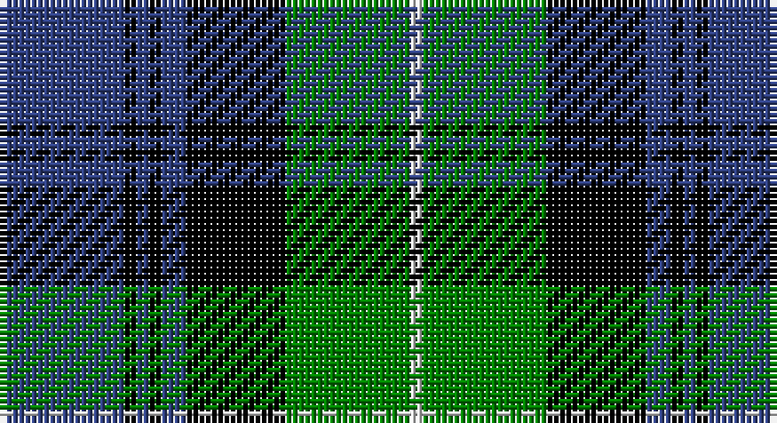

This page is one **sett** — a single exact thread-count. It belongs to the [tartan](/setts/db10k1db1k1db2k8g10w1/)
(the same proportion at any scale), whose colour order is pattern [BKBKBKGW](/stripes/bkbkbkgw/).

Part of the [Lamont](/tartans/lamont/) tartan — the named design grouping this sett with its other cloths.

Sourced from weddslist.  It is a [8 stripe tartan](/stripes/stripes8/).

Original link http://www.weddslist.com/cgi-bin/tartans/pg.pl?source=sts

## Also known as

This cloth is also recorded under:

- Lamont #2
- Lamont #3

## Thread count
B/20 K2 B2 K2 B4 K16 G20 LN/2

One full sett is **114 threads**.

## Palette

Palette: <strong>Tartan Register</strong> <small style="color:#888">(2 of 4 colours)</small>
<table><thead><tr><th>Colour</th><th>Threads</th><th>Shade</th><th>Base</th><th>OKLCh</th></tr></thead><tbody><tr><td>B/</td><td style="text-align:right;font-variant-numeric:tabular-nums">20</td><td><code style="background-color:#304080;">#304080</code> <small style="color:#888">#304080</small></td><td>B <code style="background-color:#2A418A;">#2A418A</code></td><td><small style="color:#888">oklch(39.4% 0.109 270.2)</small></td></tr><tr><td>K</td><td style="text-align:right;font-variant-numeric:tabular-nums">2</td><td><code style="background-color:#000000;">#000000</code> <small style="color:#888">#000000</small></td><td>K <code style="background-color:#000000;">#000000</code></td><td><small style="color:#888">oklch(0.0% 0.000 0.0)</small></td></tr><tr><td>B</td><td style="text-align:right;font-variant-numeric:tabular-nums">2</td><td><code style="background-color:#304080;">#304080</code> <small style="color:#888">#304080</small></td><td>B <code style="background-color:#2A418A;">#2A418A</code></td><td><small style="color:#888">oklch(39.4% 0.109 270.2)</small></td></tr><tr><td>K</td><td style="text-align:right;font-variant-numeric:tabular-nums">2</td><td><code style="background-color:#000000;">#000000</code> <small style="color:#888">#000000</small></td><td>K <code style="background-color:#000000;">#000000</code></td><td><small style="color:#888">oklch(0.0% 0.000 0.0)</small></td></tr><tr><td>B</td><td style="text-align:right;font-variant-numeric:tabular-nums">4</td><td><code style="background-color:#304080;">#304080</code> <small style="color:#888">#304080</small></td><td>B <code style="background-color:#2A418A;">#2A418A</code></td><td><small style="color:#888">oklch(39.4% 0.109 270.2)</small></td></tr><tr><td>K</td><td style="text-align:right;font-variant-numeric:tabular-nums">16</td><td><code style="background-color:#000000;">#000000</code> <small style="color:#888">#000000</small></td><td>K <code style="background-color:#000000;">#000000</code></td><td><small style="color:#888">oklch(0.0% 0.000 0.0)</small></td></tr><tr><td>G</td><td style="text-align:right;font-variant-numeric:tabular-nums">20</td><td><code style="background-color:#008000;">#008000</code> <small style="color:#888">#008000</small></td><td>G <code style="background-color:#006100;">#006100</code></td><td><small style="color:#888">oklch(52.0% 0.177 142.5)</small></td></tr><tr><td>LN/</td><td style="text-align:right;font-variant-numeric:tabular-nums">2</td><td><code style="background-color:#E0E0E0;">#E0E0E0</code> <small style="color:#888">#E0E0E0</small></td><td>W <code style="background-color:#F7F7F7;">#F7F7F7</code></td><td><small style="color:#888">oklch(90.7% 0.000 89.9)</small></td></tr></tbody></table>

# Sample pattern

## Compared to the master

This cloth is one sett of its design; the master sett (the exemplar the design is anchored on) is below for comparison.

<figure style="margin:0"><figcaption style="color:#888;font-size:smaller">this sett</figcaption></figure>
<figure style="margin:0"><figcaption style="color:#888;font-size:smaller"><a href="/setts/b23k3b3k3b3k22g22w3g22k22b18k3b3/">master sett →</a></figcaption></figure>

## Nearest tartans

The nearest existing variants by ΔTartan distance, with this tartan at the top so the swatches line up against it.

ΔTartan

Tartan

Sett

—

<a href="/ttd/edit/#slug=db10k1db1k1db2k8g10w1~x2">Lamont</a> <a class="nn-out" href="/variants/s8/db10k1db1k1db2k8g10w1~x2/" title="open its dictionary page">↗</a>

0.83

<a href="/ttd/edit/#slug=db56k6db6k6db6k44g44ly4g5ly8&amp;base=db10k1db1k1db2k8g10w1~x2">Gordon 3</a> <a class="nn-out" href="/variants/s10/db56k6db6k6db6k44g44ly4g5ly8/" title="open its dictionary page">↗</a>

0.85

<a href="/ttd/edit/#slug=db8k2db2k2db2k8g7k1w1~x2&amp;base=db10k1db1k1db2k8g10w1~x2">Forbes</a> <a class="nn-out" href="/variants/s9/db8k2db2k2db2k8g7k1w1~x2/" title="open its dictionary page">↗</a>

0.88

<a href="/ttd/edit/#slug=t1db11k11g11k2t1~x2&amp;base=db10k1db1k1db2k8g10w1~x2">Unnamed, No 59</a> <a class="nn-out" href="/variants/s6/t1db11k11g11k2t1~x2/" title="open its dictionary page">↗</a>

0.88

<a href="/ttd/edit/#slug=k1r1g6k1g1k1g1k6db9k1db1~x2&amp;base=db10k1db1k1db2k8g10w1~x2">Louise</a> <a class="nn-out" href="/variants/s11/k1r1g6k1g1k1g1k6db9k1db1~x2/" title="open its dictionary page">↗</a>

0.90

<a href="/ttd/edit/#slug=db3g28db3k16db28r3&amp;base=db10k1db1k1db2k8g10w1~x2">Flower of Scotland</a> <a class="nn-out" href="/variants/s6/db3g28db3k16db28r3/" title="open its dictionary page">↗</a>

0.91

<a href="/ttd/edit/#slug=db3r1db10k8g10r1g3~x4&amp;base=db10k1db1k1db2k8g10w1~x2">Blair</a> <a class="nn-out" href="/variants/s7/db3r1db10k8g10r1g3~x4/" title="open its dictionary page">↗</a>

0.93

<a href="/ttd/edit/#slug=k3g3lb2g11k12db18k2lb3~x2&amp;base=db10k1db1k1db2k8g10w1~x2">Louisiana</a> <a class="nn-out" href="/variants/s8/k3g3lb2g11k12db18k2lb3~x2/" title="open its dictionary page">↗</a>

0.94

<a href="/ttd/edit/#slug=r2g12k12g1db12g1~x2&amp;base=db10k1db1k1db2k8g10w1~x2">Gunn</a> <a class="nn-out" href="/variants/s6/r2g12k12g1db12g1~x2/" title="open its dictionary page">↗</a>

0.99

<a href="/ttd/edit/#slug=k2db3g16b1k13b1db18k2db2~x2&amp;base=db10k1db1k1db2k8g10w1~x2">Hebridean Old</a> <a class="nn-out" href="/variants/s9/k2db3g16b1k13b1db18k2db2~x2/" title="open its dictionary page">↗</a>

1.00

<a href="/ttd/edit/#slug=w1db9k9g9k2w1~x4&amp;base=db10k1db1k1db2k8g10w1~x2">MacNeil 1</a> <a class="nn-out" href="/variants/s6/w1db9k9g9k2w1~x4/" title="open its dictionary page">↗</a>

## Neighbour map

Every grey dot is one of 14360 variants placed by the first two principal components of the ΔTartan feature space (44% of its variance). Red is this tartan; blue dots are its nearest — click one to open its page.

<svg viewBox="0 0 640 380" role="img" style="max-width:100%;height:auto;border:1px solid #e0e0e0;border-radius:4px;display:block" xmlns="http://www.w3.org/2000/svg"><image href="/nn/cloud.v1.png" width="640" height="380"/><a href="/variants/s10/db56k6db6k6db6k44g44ly4g5ly8/"><circle cx="185.4" cy="157.3" r="4" fill="#3465a4"><title>Gordon 3</title></circle></a><a href="/variants/s9/db8k2db2k2db2k8g7k1w1~x2/"><circle cx="171.4" cy="207.8" r="4" fill="#3465a4"><title>Forbes</title></circle></a><a href="/variants/s6/t1db11k11g11k2t1~x2/"><circle cx="167.5" cy="213.6" r="4" fill="#3465a4"><title>Unnamed, No 59</title></circle></a><a href="/variants/s11/k1r1g6k1g1k1g1k6db9k1db1~x2/"><circle cx="173.4" cy="174.9" r="4" fill="#3465a4"><title>Louise</title></circle></a><a href="/variants/s6/db3g28db3k16db28r3/"><circle cx="206.9" cy="217.2" r="4" fill="#3465a4"><title>Flower of Scotland</title></circle></a><a href="/variants/s7/db3r1db10k8g10r1g3~x4/"><circle cx="167.2" cy="214.6" r="4" fill="#3465a4"><title>Blair</title></circle></a><a href="/variants/s8/k3g3lb2g11k12db18k2lb3~x2/"><circle cx="137.5" cy="199.9" r="4" fill="#3465a4"><title>Louisiana</title></circle></a><a href="/variants/s6/r2g12k12g1db12g1~x2/"><circle cx="173.0" cy="207.2" r="4" fill="#3465a4"><title>Gunn</title></circle></a><a href="/variants/s9/k2db3g16b1k13b1db18k2db2~x2/"><circle cx="220.3" cy="161.2" r="4" fill="#3465a4"><title>Hebridean Old</title></circle></a><a href="/variants/s6/w1db9k9g9k2w1~x4/"><circle cx="146.4" cy="218.0" r="4" fill="#3465a4"><title>MacNeil 1</title></circle></a><circle cx="184.5" cy="190.6" r="5" fill="#c00000"/></svg>

ID: /variants/s8/db10k1db1k1db2k8g10w1~x2/
